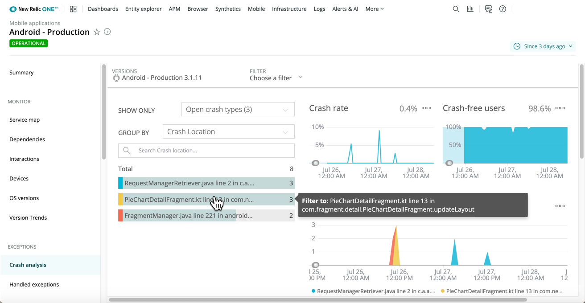

ブランドでのデジタルカスタマーエクスペリエンスには、iOSやAndroidデバイス、ブラウザウェブサイト、キオスク、サポートが含まれます。短気なユーザーは大部分の時間をモバイルアプリに費やし、最高のものを求めます。

* **クラッシュ：** アプリストアのカスタマーレビューで星1つの評価を受ける前に、問題をどのように解決するか？
* **レイテンシ：** 細分化されたモバイルエコシステムをどのように接続し、ネットワークやチーム、デバイスで迅速にトラブルシューティングを行うか？
* **カスタマーエクスペリエンス：** ユーザーのアプリとのインタラクションについて、どのように効率的に理解できるか？
* **ROI：** ユーザーフローやカートの総収益などの重要なパフォーマンスデータを、どのようにして簡単にクエリを行い共有できるか？

当社のMobile Monitoringツールは、デジタルカスタマーエクスペリエンス全体を統合するので、コードやネットワークパフォーマンスについての深い診断とともに、詳細なクラッシュレポートや分析を入手できます。New Relicを使用して、モバイルスタックプラットフォームについて完全なエンドツーエンドのオブザーバビリティを実現します。これには、バックエンドAPM可視化やエンドユーザーフロー（ブラウザ）モニタリング、合成APIチェック、柔軟なアラート、クエリ、可視化ツールが含まれます。

クラッシュ解決の一歩先を行く。New Relicを使用して、発生前にモバイルの問題を防止し、カスタマーエクスペリエンス全般を改善します。

モバイルモニタリングツールを使用して、クラッシュ発生やアプリの起動、扱った例外、ネットワークの問題、アラートの詳細、焦点を絞ったクエリなどを迅速に検証します。

<LandingPageTileGrid>
  <LandingPageTile
    title="始めてみましょう。"
    icon="fe-check-square"
  >

    * [モバイルモニタリング機能](/docs/mobile-monitoring/new-relic-mobile/get-started/introduction-mobile-monitoring)の詳細を見る。
    * <i className="fa fa-android">
        
          [androidアイコン]
        
      </i>
      New Relicを[Androidアプリ](/docs/mobile-monitoring/new-relic-mobile-android/get-started/introduction-new-relic-mobile-android)にインストールするか、ご希望のカスタマイズを行い、[Android SDK API](/docs/mobile-monitoring/new-relic-mobile-android/android-sdk-api)を使用してモニターします。
    * <i className="fa fa-apple">
        
          [appleアイコン]
        
      </i>
      New Relicを[iOSおよびtvOSアプリ](/docs/mobile-monitoring/new-relic-mobile-ios/get-started/introduction-new-relic-mobile-ios)にインストールするか、ご希望のカスタマイズを行い、[iOS SDK API](/docs/mobile-monitoring/new-relic-mobile-ios/api-guides/ios-sdk-api-guide)を使用してモニターします。
  </LandingPageTile>

  <LandingPageTile
    title="問題のトラブルシューティングを行い解決する。"
    icon="fe-alert-triangle"
  >

    * [アラート](/docs/mobile-monitoring/new-relic-mobile/get-started/alert-information-new-relic-mobile)と[インテリジェンスの応用](/docs/new-relic-one/use-new-relic-one/new-relic-ai/introduction-new-relic-ai)を主要なパフォーマンス指標について使用する。
    * [モバイルモニタリングUI](/docs/mobile-monitoring/mobile-monitoring-ui)を使用して、問題を検証します。
    * [New Relic One](/docs/new-relic-one/use-new-relic-one/get-started/introduction-new-relic-one)を使用して、アプリや関連サービス、アラート、ログ、デジタルカスタマーエクスペリエンス全般を関連付けます。
  </LandingPageTile>

  <LandingPageTile
    title="データを可視化。"
    icon="fe-bar-chart-2"
  >

    * UIやAPIを介して、あらゆるデータタイプ（[メトリックス、イベント、ログ、トレース](/docs/using-new-relic/data/understand-data/new-relic-data-types)）の[クエリ](/docs/using-new-relic/data/understand-data/query-new-relic-data)を行います。
    * [カスタムデータ](/docs/mobile-monitoring/new-relic-mobile/maintenance/add-custom-data-new-relic-mobile)をクエリに追加し、顧客のコンテキストにビジネスの優先事項や想定される結果を含めます。
    * さまざまな[チャートやダッシュボード](/docs/dashboards/new-relic-one-dashboards/get-started/introduction-new-relic-one-dashboards)を作成し共有する。
  </LandingPageTile>
</LandingPageTileGrid>

<ButtonLink
  role="button"
  to="/docs/mobile-monitoring/table-of-contents"
  variant="normal"
>
  すべてのMobileドキュメントを表示
</ButtonLink>
