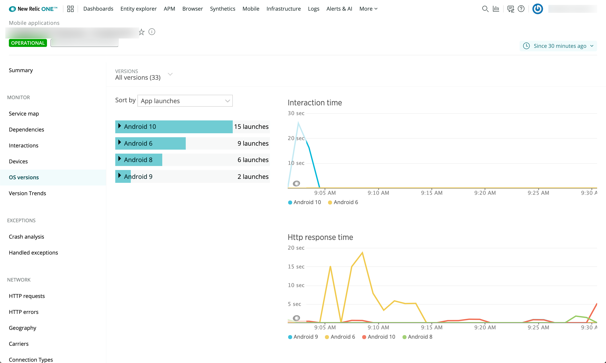

モバイル監視用のOSバージョンページでは、iOSやAndroidなど、モバイルアプリケーションをホストしている上位のOSバージョンに関するパフォーマンスの詳細を提供しています。チャートでは、OSバージョンを以下の項目で比較しています。

* HTTPリクエスト時間
* ネットワーク障害
* 1分あたりのリクエスト数
* アクティブデバイス

ここでは、メジャーまたはマイナーなOSのバージョン（例：iOS 8、iOS 7.1.1、Android 4.2.2）で詳細を調べることができます。

## OSバージョンの表示ページ [#os_versions_procedures]

<figcaption>
  **[one.newrelic.com](https://one.newrelic.com) > モバイル> （アプリを選択）> アプリ> OSバージョン：** このページを使用して、モバイルアプリを使用している上位5種類のオペレーションシステムバージョンの詳細情報を表示、ソート、またはドリルダウンすることができます。
</figcaption>

モバイルアプリのユーザーのOSバージョンに関するパフォーマンスの詳細を表示するには、次のようにします。

1. Go to **[one.newrelic.com](https://one.newrelic.com) > モバイル> （アプリを選択）> アプリ> OSバージョン**.
2. モバイルアプリのバージョンや期間を選択するには、UIメニューバーの下にある **Versions** メニューと [**Time Picker**](/docs/site/timepicker-setting-time-periods-to-view-data) を使用します。
3. オプションです。 **\[Sort by]** と **\[Hide]&lt; \[1% throughput]** オプションを選択します。
4. OSのリストにバージョンを含めて展開または折りたたむには、OSの名前を選択します（例：iOS 7）。

## ドリルダウンの詳細表示 [#details]

詳細な情報にドリルダウンするには、当社の標準的な [ユーザーインターフェース機能](/docs/accounts-partnerships/education/getting-started-new-relic/new-relic-user-interface) 、 [ページ機能](/docs/accounts-partnerships/education/getting-started-new-relic/standard-dashboard-features) のいずれかを使用します。さらに

* メジャーなOSバージョンのマイナーおよびポイントリリースの詳細（インタラクションタイム、HTTPリクエストタイム、ネットワーク障害、アクティブデバイス、最も遅いトレースまたはすべてのサブバージョンを含む）を表示するには、リストからメジャーなOSバージョンを選択します。
* 特定のOSバージョンの詳細を表示するには、拡張されたOSリストからOS名を選択します。
* スロートランザクションのトレース詳細を表示するには（可能な場合）、そのリンクを選択します。詳細は、 [Interactions ページ](/docs/mobile-monitoring-ui#interactions-timeline) を参照してください。
* OSバージョンのメインページに戻るには、 **閉じる** (**X**) ボタンを選択してください。