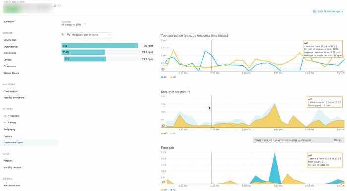

<figcaption>
  **[one.newrelic.com](https://one.newrelic.com) > モバイル> （アプリを選択）> ネットワーク> 接続タイプ**: このページを使用して、ユーザーのモバイルネットワーク接続タイプについて、応答時間の影響、ネットワーク障害、アクティブトラフィックなどの詳細情報を表示、ソート、またはドリルダウンします。
</figcaption>

モバイルモニタリング用の **Connection Types** ページには、ユーザーのワイヤレスネットワーク接続技術と、その応答時間への影響、エラー率、選択した期間のアクティブトラフィックを示すチャートが含まれています。データはテクノロジーの世代別に分類されています（2G、3Gなど）。接続タイプの内訳には、WifiとUnknownも含まれています。ここから、GPRS、HSDPA、LTEなどの特定のワイヤレステクノロジーにドリルダウンすることができます。

ユーザーのモバイルワイヤレス接続タイプを表示するには

1. Go to **[one.newrelic.com](https://one.newrelic.com) > モバイル> （アプリを選択）> ネットワーク> 接続タイプ**.
2. 表示される情報（応答時間、アクティブなデバイス、ネットワークエラーなど）を変更するには、 **「Sort by」** メニューから選択してください。
3. モバイルアプリのバージョンや期間を選択するには、New Relic メニューバーの下にある [**バージョン**](/docs/mobile-apps/versions) メニューと [タイムピッカー](/docs/site/timepicker-setting-time-periods-to-view-data) を使用します。
4. 特定の接続タイプの詳細を表示するには、その名前を選択します。

当社標準の [ユーザーインターフェース機能](/docs/accounts-partnerships/education/getting-started-new-relic/new-relic-user-interface) および [ページ機能](/docs/accounts-partnerships/education/getting-started-new-relic/standard-dashboard-features) を使用して、詳細な情報にドリルダウンすることができます。