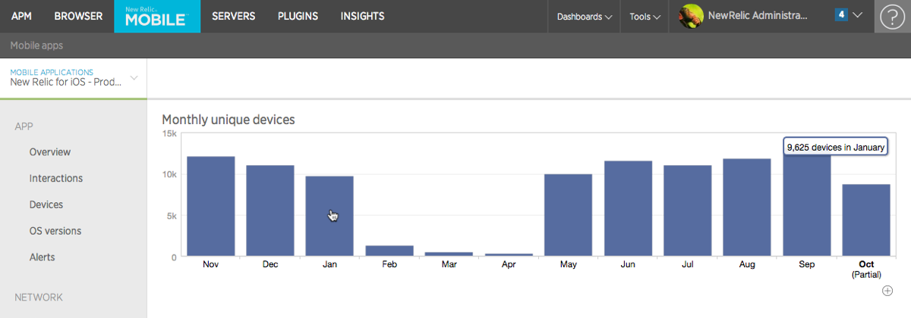

モバイルモニタリングでは、過去1年間の各月のアプリを実行しているデバイス数を棒グラフで追跡した月次レポートが提供されます。レポートを見るには **[one.newrelic.com](https://one.newrelic.com) > モバイル> (select an app)> Usage> Monthly uniques** にアクセスします。

## 月間ユニックレポート詳細 [#details]

任意の月のユニークデバイス数の合計を見るには、グラフのその月のバーにマウスオーバーしてください。当月のデバイス数は月の累計値であり、全月の使用状況を示すものではありません。

<figcaption>
  **[one.newrelic.com](https://one.newrelic.com) > Mobile> (select an app)> Usage> Monthly uniques:** このレポートでは、過去1年間の各月におけるお客様のアプリを実行しているデバイスの数を棒グラフで追跡します。
</figcaption>

New Relic の標準的な [ユーザーインターフェース関数](/docs/accounts-partnerships/education/getting-started-new-relic/new-relic-user-interface) と [ページ関数](/docs/accounts-partnerships/education/getting-started-new-relic/standard-dashboard-features) のいずれかを使用して、詳細な情報にドリルダウンします。

ユニークユーザーは、お客様の [月間使用量](/docs/accounts/new-relic-account-usage/mobile-usage/mobile-subscription-usage-ui) を算出するために使用され、これはお客様のサブスクリプションレベルを算出するために使用されます。

## デバイストラッキング [#tracking]

モバイルモニタリングでは、ユニークなインストール追跡のためのハードウェア識別子を使用しません。

* iOSでは、IdentifierForVendorプロパティを使用しています。(バージョン5.3.4以下ではSecureUDIDライブラリを使用していました)
* Androidでは、アプリケーションのインストール時に固有のGUIDを生成します。