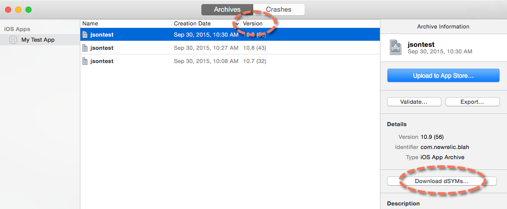

Bitcodeは、AppleがiOSおよびtvOSアプリケーションを特定のユーザーのハードウェア向けに再コンパイルする機能です。これにより、エンドユーザーのダウンロードサイズが小さくなります。このプロセスの詳細については、Appleの [Bitcode and app thinning documentation](https://developer.apple.com/library/watchos/documentation/IDEs/Conceptual/AppDistributionGuide/AppThinning/AppThinning.html) を参照してください。

Apple がアプリをコンパイルする際に、dSYM ファイルもコンパイルされます。New RelicがBitcode対応アプリのクラッシュをシンボライズするためには、これらのdSYMファイルをAppleからダウンロードして、New Relicにアップロードする必要があります。

## 不足しているdSYMを特定する [#IdentifyingMissingdSYMs]

Bitcode対応のアプリがApp Storeのレビューやアドホック配布のためにAppleにアップロードされる際、 [モバイル クラッシュ レポート](/docs/mobile-monitoring/new-relic-mobile/getting-started/ios-agent-crash-reporting) が適切にシンボライズされるように、AppleからdSYMを手動でダウンロードしてNew Relicにアップロードする必要があります。これらのdSYMは、アプリをアップロードしてから数分以内にXcodeのarchives organizerからダウンロードできます。この場合、 [アーカイブを見つけ、dSYMをダウンロードする手順に従ってください](#Archive) 。

アプリにdSYMファイルがない場合、モバイルモニタリングのUIに3つのインジケータが表示されます。

* **バナー通知**: [**クラッシュレポート** ページ](/docs/mobile-monitoring/mobile-monitoring-ui/crashes/mobile-apps-crash-report-dashboard) にバナーによる警告が表示されます。警告の内容は以下の通りです。

  ```
  We were unable to locate your dsym.
  ```

* **Upload prompt**: **Crash type summary** のページから、 [dSYMファイル](/docs/mobile-monitoring/new-relic-mobile-ios/install-configure/upload-dsyms-bitcode-apps#mobile-ui) がない場合、アップロードするように自動的に促されます。

* **マシンコード**: **クラッシュレポート** ページのクラッシュスタックトレースにはマシンコードが表示され、人間が読めるエラーメッセージは表示されません。

## iTunes ConnectによるdSYMファイルのダウンロード [#iTunes]

アプリに必要なdSYMファイルをダウンロードします。

1. Log in to Apple [iTunes Connect](https://itunesconnect.apple.com/login).
2. 選択 **マイアプリ> （選択したアプリ）> アクティビティ**.
3. アプリケーション用のビルドのリストから、dSYMに必要なビルド番号を選択します。
4. Select **Download dSYM**.

そして、出来上がったZIPファイルをNew Relicに直接アップロードします。

1. [手動でdSYM](/docs/mobile-monitoring/new-relic-mobile-ios/install-configure/upload-dsyms-bitcode-apps#manual-dsym) をアップロードする場合は、手順1を飛ばしてください。
2. このZIPファイルに含まれるdSYMを1つ解凍して、アップロード可能なビルドUUIDを取得してください。(手動アップロード手順の最後のステップに従ってください。)

New Relic が zip ファイルを受け取ると、その zip ファイルに含まれる他のすべての dSYM のビルド UUID が特定されます。

## Xcodeのapp archiveを使ってdSYMファイルをダウンロードします。 [#Archive]

[アプリのバージョンとビルド番号](#identifyingAppVersion) を使って、Xcode **Organizer** で該当するアプリのアーカイブを特定し、dSYMをダウンロードします。



<figcaption>
  **Xcodeを使ってdSYMをダウンロードする：** **Archives** タブから、アプリとバージョン/ビルドを選択して、 **Download dSYMs**.
</figcaption>

1. Xcodeを開く **オーガナイザー**: **Xcode** メニューから、 **Window> オーガナイザー> Archives> （モバイルアプリを選択）**.
2. **バージョン** から、アプリのバージョン（最初に表示されている）とビルド番号（アプリのバージョンの後にカッコで表示されている）に一致するアーカイブを選択します。
3. Select **Download dSYMs**.

dSYMは、ファイル名にアルファベットと数字が含まれていれば、Appleからダウンロードされます。dSYMのファイル名がプロジェクトの依存関係を表すものであれば、ダウンロードは成功しません。

## dSYMのアップロード [#Upload-dSYMs]

[dSYMの場所がわかったら、指示に従って、zip圧縮されたdSYMごとにdSYM](/docs/mobile-monitoring/new-relic-mobile-ios/install-configure/upload-dsyms-bitcode-apps) をアップロードしてください。