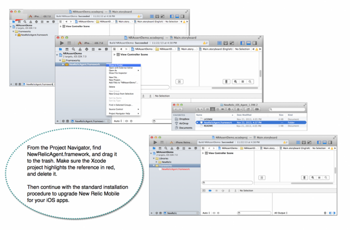

iOSエージェントをインストール、設定、アップグレードするには、アカウント管理者である必要があります。最新バージョンについては、 [リリースノート](/docs/releases/ios) をご参照ください。

## iOSフレームワークの置き換え [#upgrading]

管理者の方へ新しいバージョンのiOS SDKにアップグレードする前に、古いバージョンのiOSエージェントフレームワークを置き換える必要があります。

<figcaption>
  ここでは、既存のiOSエージェントフレームワークを削除し、新しいバージョンに置き換えられるようにするためのワークフローの例を示します。
</figcaption>

1. Xcodeのプロジェクトナビゲーター(**CMD 1**)から、 **NewRelicAgent.framework** を検索します。
2. **NewRelicAgent.framework** を右クリックまたはcontrolクリックし、 **Show in Finder** を選択します。
3. **NewRelicAgent.framework** をゴミ箱にドラッグします。
4. Xcodeプロジェクトで、 **NewRelicAgent.framework** への参照が赤でハイライトされていることを確認します。
5. **NewRelicAgent.framework** を右クリックまたはcontrolクリックし、 **Delete** を選択して、廃止された参照をプロジェクトから削除します。
6. **[one.newrelic.com](https://one.newrelic.com) > Mobile> (select an app)> Settings> Installation** にあるiOSアプリ監視の標準的なインストール手順を続けます。