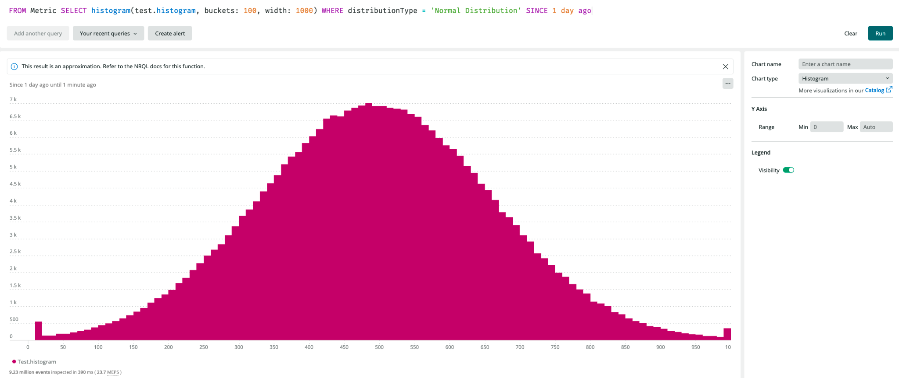

ここでは、OpenTelemetryがNew Relicとどのように連携しているかに基づいた、いくつかのベストプラクティスをご紹介します。

* [リソース](#resources)
* [バッチング](#batching)
* [圧縮](#compression)
* [トレース](#traces)
* [メトリクス](#metrics)
* [ログ](#logs)

<Callout variant="tip">
  特定の問題を解決するための情報については、 [トラブルシューティングガイド](/docs/more-integrations/open-source-telemetry-integrations/opentelemetry/opentelemetry-troubleshooting) を参照してください。
</Callout>

## リソース [#resources]

OpenTelemetry のリソースは、遠隔測定データを生成するエンティティに関する情報を表します。New Relic に送信されるすべての遠隔測定データは、New Relic の適切なエンティティとリンクできるように、リソースと関連付けられることが期待されています。 [OpenTelemetry Resource SDK specification](https://github.com/open-telemetry/opentelemetry-specification/blob/main/specification/resource/sdk.md) では、リソースを定義するためにすべての言語SDKが実装する機能を定義しています。

以下の一連の属性は、 [OpenTelemetry resource semantic conventions](https://github.com/open-telemetry/opentelemetry-specification/tree/main/specification/resource/semantic_conventions#resource-semantic-conventions) で定義されています。これらの属性は通常、OpenTelemetry SDKを使ってリソースを作成する際に設定されます。

* `service.*属性`

  * `service.name` 属性は、リソースをUIのエンティティと関連付けるために必要です。
  * `service.instance.id` は、特定のペインを点灯させるために必要です。

* `telemetry.sdk.language=java` JVMセクションのデータを見るために必要です。

## バッチング [#batching]

<Callout variant="caution">
  レート制限を受けないようにしましょうこのセクションで説明するように、OTLPエンドポイントへのリクエストをバッチ処理する必要があります。
</Callout>

デフォルトでは、OpenTelemetry SDKとCollectorは1つのリクエストにつき1つのデータポイントを送信します。これらのデフォルトを使用すると、アカウントがレート制限される可能性があります。

すべてのOpenTelemetry SDKとCollectorは、メモリ内のデータポイントをバッチ処理する `BatchProcessor` を提供しています。このバッチ処理により、リクエストを複数のデータポイントで送信することができます。

<table>
  <thead>
    <tr>
      <th style={{ width: "200px" }}>
        コンポーネント
      </th>

      <th>
        バッチプロセッサー
      </th>
    </tr>
  </thead>

  <tbody>
    <tr>
      <td>
        コレクター
      </td>

      <td>
        [バッチプロセッサー](https://github.com/open-telemetry/opentelemetry-collector/blob/main/processor/batchprocessor/README.md)
      </td>
    </tr>

    <tr>
      <td>
        Go SDK
      </td>

      <td>
        [BatchSpanProcessor](https://pkg.go.dev/go.opentelemetry.io/otel/sdk/trace#NewBatchSpanProcessor)
      </td>
    </tr>

    <tr>
      <td>
        JS SDK
      </td>

      <td>
        [BatchSpanProcessor](https://github.com/open-telemetry/opentelemetry-js/blob/main/packages/opentelemetry-sdk-trace-base/src/export/BatchSpanProcessorBase.ts)
      </td>
    </tr>

    <tr>
      <td>
        Python SDK
      </td>

      <td>
        [BatchExportSpanProcessor](https://open-telemetry.github.io/opentelemetry-python/sdk/trace.export.html#opentelemetry.sdk.trace.export.BatchExportSpanProcessor)
      </td>
    </tr>
  </tbody>
</table>

## 圧縮 [#compression]

New Relic は gRPC でエクスポートされる OTLP ペイロードの gzip 圧縮をサポートしています。リクエストごとに送信できるデータ量を最大化するために、すべてのOTLP エクスポーターで圧縮を有効にすることをお勧めします。他にサポートしてほしい圧縮形式がありましたら、 [CNCF Slack チャンネル](https://cloud-native.slack.com/archives/C024DRQ63UP) でお知らせください。

## トレース [#traces]

トレースやスパンがNew Relicに表示されるようにするために、これらのトレーストピックを熟知してください。

### 必須項目 [#required]

`startTimeUnixNano` と `endTimeUnixNano` スパン上のフィールドは、 [トレースデータ](https://github.com/open-telemetry/opentelemetry-proto/blob/74e38fb4882dd500d77b757d44e97de296c65b05/opentelemetry/proto/trace/v1/trace.proto#L145-L159) のための OpenTelemetry プロトコルに従って必要とされます。 `startTimeUnixNano` が存在しない場合、そのスパンはドロップされ、 [`NrIntegrationError`](/docs/telemetry-data-platform/manage-data/nrintegrationerror/) が作成されます。 `endTimeUnixNano` が存在しない場合、あなたのスパンの持続時間は大きくて負の値になります。

スパンイベントの `timeUnixNano` フィールドは必須です。 `timeUnixNano` が存在しない場合、そのスパンイベントは削除され、 [`NrIntegrationError`](/docs/telemetry-data-platform/manage-data/nrintegrationerror/) が作成されます。

スパンの `traceId` と `spanId` フィールドは、 [トレースデータ](https://github.com/open-telemetry/opentelemetry-proto/blob/74e38fb4882dd500d77b757d44e97de296c65b05/opentelemetry/proto/trace/v1/trace.proto#L73-L84) の OpenTelemetry プロトコルに従って必要となります。 `traceId` または `spanId` が存在しない場合、スパンは削除され、 [`NrIntegrationError`](/docs/telemetry-data-platform/manage-data/nrintegrationerror/) が作成されます。

### サンプリング [#sampling]

トレースデータは、最も成熟したOpenTelemetryのデータタイプです。このため、New Relic の OpenTelemetry のユーザーエクスペリエンスは、主にトレースデータに基づいており、したがって、サンプリング戦略に影響されます。

サンプリングの設定は様々な場所で行うことができます。

* **サービス：** お使いの言語のOpenTelemetry SDKをご利用ください。
* **コレクター：** OpenTelemetryコレクターの独自のインスタンスを実行している場合は、テールベースのサンプリング（[下記参照](#infinite-tracing) ）など、より洗練された形式のサンプリングを行うように設定できます。

さまざまなタイプのサンプリングを設定する方法については、こちらのドキュメントをご覧ください。

<CollapserGroup>
  <Collapser
    className="freq-link"
    id="built-in"
    title="OpenTelemetry内蔵サンプラー"
  >
    [内蔵サンプラー](https://github.com/open-telemetry/opentelemetry-specification/blob/main/specification/trace/sdk.md#built-in-samplers) OpenTelemetry SDKで各言語ごとに実装されています。
  </Collapser>

  <Collapser
    className="freq-link"
    id="ot-tail-based"
    title="OpenTelemetryのテールベース・サンプラー"
  >
    OpenTelemetryコレクタは、 [テールベースのサンプリングプロセッサ](https://github.com/open-telemetry/opentelemetry-collector-contrib/tree/main/processor/tailsamplingprocessor) を備えています。テールベースのサンプリングプロセッサの使用を示す [例](https://github.com/newrelic/newrelic-opentelemetry-examples/tree/main/collector/k8s-collector-tail-sampling) があります。
  </Collapser>

  <Collapser
    className="freq-link"
    id="infinite-tracing"
    title="Infinite TracingによるNew Relicのテールベースサンプリング"
  >
    Infinite Tracing は New Relic のテールベースのサンプリングオプションです。OpenTelemetryで計測したサービスと組み合わせて使用することができます。Infinite Tracing の設定では、OTLP gRPC を使用して New Relic のトレースオブザーバーにトレースデータをエクスポートするよう、アプリケーション (またはコレクター) を設定する必要があります。

    1. [Set up trace observer](/docs/distributed-tracing/infinite-tracing/set-trace-observer/) の手順で、

       <var>YOUR_TRACE_OBSERVER_URL</var>

       の値を取得します。

    2. [クイックスタートガイド](/docs/more-integrations/open-source-telemetry-integrations/opentelemetry/opentelemetry-quick-start/#review-settings) のステップを完了すると、

       <var>YOUR_TRACE_OBSERVER_URL</var>

       の値を使用して統合を設定します。 `YOUR_TRACE_OBSERVER_URL` は、 `https://{trace-observer}:443/trace/v1` という形式になります。OTLP gRPCエンドポイントを設定する際には， `/trace/v1` というサフィックスを取り除いて， `https://{trace-observer}:443` という形式のURLになります．

    3. New Relic にすべてのトレースを分析させたいので、トレースに関わるすべてのアプリケーションが [](https://github.com/open-telemetry/opentelemetry-specification/blob/main/specification/sdk-environment-variables.md)OpenTelemetry SDK にテールベースのサンプリングを可能にするサンプラーを設定していることを確認してください。デフォルトの `parent_based_always_on` や `always_on` サンプラーが良い選択です。

    トレース・オブザーバー・エンドポイントに送信できるのは、トレース・データのみであることに注意してください。アプリケーション（またはコレクター）は、OpenTelemetryのメトリクスとログのエクスポート戦略を別途設定する必要があります。
  </Collapser>
</CollapserGroup>

## メトリクス [#metrics]

OpenTelemetryメトリクスは、New Relicのディメンションメトリクスとほぼ互換性があります。OpenTelemetry メトリクス v0.10 をサポートしています。サポートしているすべてのメトリクスタイプには、独立した関連属性（名前と値のペア）のセットが含まれており、クエリ時にメトリクスデータのファセットやフィルタリングに使用できるディメンションに直接マッピングされます。OpenTelemetryメトリクスには、 [リソース](https://github.com/open-telemetry/opentelemetry-specification/blob/main/specification/resource/sdk.md#resource-sdk) 属性のセットが付属しています。この属性は、メトリクスを生成したオリジネーターを識別し、ファセット化やフィルタリングのためのディメンションにマッピングされます。

OpenTelemetry [data model](https://github.com/open-telemetry/opentelemetry-specification/blob/main/specification/metrics/datamodel.md#metric-points) for metricsでは、sum、gauge、histogram、summaryなど、さまざまな種類のメトリックを定義しています。

### 和の指標 [#sums]

OpenTelemetryの総和は、与えられた時間ウィンドウ上のすべてのデータポイントの総和であるスカラーメトリックです。 sumには、報告された値が以前の測定値を組み込んでいるか（累積時間性）、そうでないか（デルタ時間性）を示す [時間性の概念があります。](https://github.com/open-telemetry/opentelemetry-specification/blob/main/specification/metrics/datamodel.md#temporality)

[また、和は単調なもの（上にしか行かない、下にしか行かない）と、非単調なもの（上にも下にも行く）があります。](https://github.com/open-telemetry/opentelemetry-specification/blob/main/specification/metrics/datamodel.md#temporality)

#### [デルタ・サムズ [#delta]](https://github.com/open-telemetry/opentelemetry-specification/blob/main/specification/metrics/datamodel.md#temporality)

[New Relicでは、デルタメトリクスがモノトニックかノンモノトニックかによって処理が異なります。](https://github.com/open-telemetry/opentelemetry-specification/blob/main/specification/metrics/datamodel.md#temporality)

* * Monotonic delta sumはcountメトリックタイプにマッピングされます。

  * 非単調なデルタ・サムは、ゲージ・メトリック・タイプにマッピングされます。

#### [積算金額 [#cumulative]](https://github.com/open-telemetry/opentelemetry-specification/blob/main/specification/metrics/datamodel.md#temporality)

[単調な累積和と非単調な累積和は、New Relic のゲージメトリックタイプにマッピングされます。](https://github.com/open-telemetry/opentelemetry-specification/blob/main/specification/metrics/datamodel.md#temporality)

#### [サムの構成例 [#config-sums]](https://github.com/open-telemetry/opentelemetry-specification/blob/main/specification/metrics/datamodel.md#temporality)

[アグリゲーションのテンポラリーな設定方法については、 ](https://github.com/open-telemetry/opentelemetry-specification/blob/main/specification/metrics/datamodel.md#temporality)[Java](https://github.com/newrelic/newrelic-opentelemetry-examples/tree/main/java/sdk-nr-config) と [Go](https://github.com/newrelic/newrelic-opentelemetry-examples/tree/main/go/go-metrics) OpenTelemetry SDK を使った例をご覧ください。

### ゲージ・メトリクス [#gauge]

OpenTelemetry ゲージ メトリック データ ポイントは、特定の時間にサンプリングされた値を表します。これらの値は New Relic のゲージメトリックタイプに変換されます。OpenTelemetry ゲージには集約の時間性はありませんが、サンプリングされた値はクエリ時に集約することができます。

### ヒストグラム・メトリクス [#otel-histogram]

OpenTelemetry [ヒストグラム](https://github.com/open-telemetry/opentelemetry-specification/blob/87a5ed7f0d4c403e2b336f275ce3e7fd66a8041b/specification/metrics/datamodel.md#histogram) 記録された値の集団を、合計数や合計値とともにコンパクトに表現します。オプションとして、ヒストグラムには、明確な境界線を持つ一連のバケットと、そのバケットの人口に対するカウント値を含めることができます。

OpenTelemetry のヒストグラムは、New Relic の [ディストリビューション](https://docs.newrelic.com/docs/telemetry-data-platform/understand-data/metric-data/metric-data-type/#metric-types) メトリックタイプに変換され、スケールされた指数ベース2のヒストグラムに裏付けられています（より詳しい説明は [NrSketch](https://github.com/newrelic-experimental/newrelic-sketch-java#new-relic-sketch) を参照してください）。

OpenTelemetry のヒストグラムのバケットのカウント数は、線形補間を用いて New Relic の分布メトリックのバケットに割り当てられます。また、OpenTelemetry には負と正の無限大のバケットがありますが、New Relic ではこれをゼロ幅のバケットとして表現しています。これは、負と正の無限大を表現する方法がないためです。例えば、OpenTelemetryのバケットの境界が\[-∞, 10]の場合、New Relicのバケットは\[10,10]のゼロ幅で表現されます。この変換により、ディストリビューションの終点でバケット数が誇張されて表示されることがあります。

### サマリー・メトリクス [#summary-metric]

OpenTelemetry のサマリーメトリックのデータポイントは、分位値のサマリー（P99 レイテンシーなど）を表すために使用されます。これらは、New Relic のサマリーメトリックタイプに直接マッピングされます。

サマリーメトリクスのデータポイントには、カウント、サム、および分位値があり、0.0が最小、1.0が最大となります。OpenTelemetryでは、他のフォーマットとの互換性のために、サマリーメトリックを提供しています。

### 開始時間 [#start-time]

`startTimeUnixNano` フィールドは、OpenTelemetry [仕様](https://github.com/open-telemetry/opentelemetry-specification/blob/87a5ed7f0d4c403e2b336f275ce3e7fd66a8041b/specification/metrics/datamodel.md#temporality) によるとオプションです。このフィールドが提供されると、結果として得られるNewRelicメトリックのタイムスタンプに使用され、 `duration` は `timeUnixNano - startTimeUnixNano` として計算されます。 `duration` フィールドは、New Relic メトリック上で問い合わせ可能な `endTimeStamp` 属性を計算するために使用されますが、それ以外の意味的な目的はありません。

`startTimeUnixNano` が提供されない場合は、 `timeUnixNano` が結果として得られるNewRelicメトリックのタイムスタンプフィールドに使用され、デュレーションフィールドはゼロに設定されます。

### 属性の配列値 [#array-values]

OpenTelemetry のメトリクスやその他のシグナルには、プリミティブタイプの均質な配列で構成された属性が含まれることがあります。これらの属性は New Relic ではサポートされていません。

### 模範例 [#exemplars]

OpenTelemetry では、トレースのような他のシグナルをメトリックイベントに接続してコンテキストを提供するための模範的な値を定義しています。New Relic ではエグザンプルはサポートされていません。

### メトリクスの照会方法 [#query]

New RelicでメトリックなNRQLクエリを構築するためのヒントを考えてみましょう。

#### ゲージに格納された累積値の照会 [#sums-as-gauges]

累積和がゲージに変換されるので、データを照会する方法を紹介します。

<CollapserGroup>
  <Collapser
    className="freq-link"
    id="raw-gauge"
    title="例累積和のゲージ生値"
  >
    累積和の生のゲージ値を表示するには、 [`latest()`](/docs/query-your-data/nrql-new-relic-query-language/get-started/nrql-syntax-clauses-functions/#latest) NRQL 関数を使用します。

    ```sql
    SELECT latest(totalApiBytesSent) FROM Metric TIMESERIES FACET description, statusCode
    ```

    
  </Collapser>

  <Collapser
    className="freq-link"
    id="derivative-function"
    title="例積算値を指標とした変化率"
  >
    ゲージとして保存されている累積和の、ある時間間隔での変化率を見るには、 [`derivative()`](/docs/query-your-data/nrql-new-relic-query-language/get-started/nrql-syntax-clauses-functions/#derivative) NRQL 関数を使用します。

    ```sql
    SELECT derivative(totalApiBytesSent, 1 second) FROM Metric TIMESERIES 5 MINUTES SLIDE BY 1 MINUTE FACET description, statusCode
    ```

    

    New Relic は現在、 [のリセットやギャップ](https://github.com/open-telemetry/opentelemetry-specification/blob/87a5ed7f0d4c403e2b336f275ce3e7fd66a8041b/specification/metrics/datamodel.md#resets-and-gaps) の報告、または累積カウンターでの会計処理のいずれもサポートしていません。
  </Collapser>
</CollapserGroup>

#### クエリ・ゲージ・メトリクス [#query-gauges]

New Relic が累積和をゲージに変換する際には、 [`latest()`](/docs/query-your-data/nrql-new-relic-query-language/get-started/nrql-syntax-clauses-functions/#latest) または [`derivative()`](/docs/query-your-data/nrql-new-relic-query-language/get-started/nrql-syntax-clauses-functions/#derivative) NRQL 関数のいずれかを使用してクエリを実行できます。選択する関数は、生の値を見たいのか、変化率を計算したいのかによって異なります。

#### クエリ・ヒストグラム・メトリクス [#query-histograms]

OpenTelemetry のメトリクスから変換された New Relic のヒストグラムは、他の New Relic のヒストグラムと同じクエリセマンティクスを持っています。すなわち、 [`histogram()`](/docs/query-your-data/nrql-new-relic-query-language/get-started/nrql-syntax-clauses-functions/#func-histogram) NRQL 関数を使って、設定可能なバケット数とバケット幅でヒストグラムを表現することができます。なお、終点のバケットではバケット数が大きくなることがあります。これは、ゼロ幅のNew Relicバケットに、負と正の無限大結合のOpenTelemetryバケットを追加しているためです。

<CollapserGroup>
  <Collapser
    className="freq-link"
    id="normal-distribution"
    title="例正規分布"
  >
    ```sql
    FROM Metric SELECT histogram(test.histogram, buckets: 100, width: 1000) WHERE distributionType = 'Normal Distribution' SINCE 1 day ago
    ```

    
  </Collapser>

  <Collapser
    className="freq-link"
    id="histogram-heat-map"
    title="例ヒートマップ"
  >
    また、FACETキーワードでヒートマップチャートを作成することができます。

    ```sql
    FROM Metric SELECT histogram(test.histogram, buckets: 100, width: 1000) FACET distributionType SINCE 1 day ago
    ```

    
  </Collapser>
</CollapserGroup>

<Callout variant="important">
  TIMESERIES キーワードは、New Relic のヒストグラムには対応していません。
</Callout>

## ログ [#logs]

アプリケーションや環境から生成されるログは、遠隔測定の重要な要素です。これらは、アプリケーションログ、マシンが生成したイベント、またはシステムログを表すことがあります。OpenTelemetryでは、ログデータを表現するために、 [ログデータモデル](https://github.com/open-telemetry/opentelemetry-specification/blob/main/specification/logs/data-model.md) を定義しています。

OpenTelemetryツールを使ってログを送信し、アプリケーションと相関させ、New Relicで表示することができます。

### New Relicへのログ送信 [#send-logs]

[OpenTelemetry Collector](https://github.com/open-telemetry/opentelemetry-collector) と [OpenTelemetry Collector Contrib](https://github.com/open-telemetry/opentelemetry-collector-contrib) リポジトリには、ログデータを消費するためのコンポーネントが多数含まれています。一般的なパターンは、コレクターを以下のように構成することです。

1. 任意のログレシーバーからログを受信します。レシーバーのオプションには、 [Filelog Receiver](https://github.com/open-telemetry/opentelemetry-collector-contrib/tree/main/receiver/filelogreceiver) 、 [Fluent Forward Receiver](https://github.com/open-telemetry/opentelemetry-collector-contrib/tree/main/receiver/fluentforwardreceiver) 、 [Syslog Receiver](https://github.com/open-telemetry/opentelemetry-collector-contrib/tree/main/receiver/syslogreceiver) があります。
2. ログを処理し、リソース情報でアノテーションすることができます。プロセッサのオプションには、 [Resource Detection Processor](https://github.com/open-telemetry/opentelemetry-collector-contrib/tree/main/processor/resourcedetectionprocessor) や [Resource Processor](https://github.com/open-telemetry/opentelemetry-collector-contrib/blob/main/processor/resourceprocessor/README.md) などがあります。
3. OTLP エクスポーターを使ってログを New Relic にエクスポートします。

### アプリケーションログの相関関係 [#log-correlation]

アプリケーションログは、アプリケーションによって生成された他の遠隔測定データと相関している場合、より有用です。OpenTelemetry [サービスのセマンティックコンベンション](https://github.com/open-telemetry/opentelemetry-specification/tree/main/specification/resource/semantic_conventions#service) では、 `service.name` を必須フィールドとして指定しています。同じ `service.name` で New Relic に送信されたすべてのアプリケーション メトリック、トレース、ログ データは、同じ [エンティティ](/docs/new-relic-one/use-new-relic-one/core-concepts/what-entity-new-relic) に関連付けられています。

ログに `service.name` リソース属性をどのようにアノテーションするかは、アプリケーションの環境によって異なります。

* アプリケーションが構造化されたJSONログを生成することがありますが、その際、 `service.name` を別のフィールドとして含めるように設定することができます。
* アプリケーションは、専用の [Collector Agent](https://opentelemetry.io/docs/collector/getting-started/#agent) インスタンスと一緒に展開することができます。このインスタンスは、 [Resource Processor](https://github.com/open-telemetry/opentelemetry-collector/tree/main/processor/resourceprocessor) で構成され、 `service.name` 属性でログに注釈を付けることができます。

オプションとして、追加のアプリケーション [トレースコンテキスト](https://github.com/open-telemetry/opentelemetry-specification/blob/main/specification/logs/overview.md#log-correlation) （実行コンテキストと呼ばれることもあります）をログメッセージに伝搬することができます。この設定と利用可能性は、アプリケーションが使用する言語とロギングフレームワークに依存します。一般的な戦略は、構造化されたJSONログを書くようにアプリケーションを設定し、利用可能なログメッセージ上の指定された [トレースコンテキストフィールド](https://github.com/open-telemetry/opentelemetry-specification/blob/main/specification/logs/data-model.md#trace-context-fields) にトレースコンテキストを抽出するように設定することです。

GitHubの [Logs in Context with Log4j2 exampleでは、Log4j2を使ったシンプルなJavaアプリケーションのエンド・ツー・エンドの作業例を紹介しています。](https://github.com/newrelic/newrelic-opentelemetry-examples/tree/main/java/logs-in-context-log4j2)

### [OpenTelemetryのログを見る [#view-logs]](https://github.com/newrelic/newrelic-opentelemetry-examples/tree/main/java/logs-in-context-log4j2)

[ここでは、ログを表示する方法を2つご紹介します。](https://github.com/newrelic/newrelic-opentelemetry-examples/tree/main/java/logs-in-context-log4j2)

* [](https://github.com/newrelic/newrelic-opentelemetry-examples/tree/main/java/logs-in-context-log4j2)
* [New Relicを見る ](https://github.com/newrelic/newrelic-opentelemetry-examples/tree/main/java/logs-in-context-log4j2)[Logs UI](/docs/logs/log-management/ui-data/use-logs-ui/).
* ログがアプリケーションと関連している場合、アプリケーションの [コンテキストでログを表示します](/docs/integrations/open-source-telemetry-integrations/opentelemetry/view-your-opentelemetry-data-new-relic#logs) 。

### タイムフィールド [#log-time]

`timeUnixNano` フィールドは、ログデータの OpenTelemetry 仕様によるとオプションです。 `timeUnixNano` が存在しない場合、New Relic はデータを受信した時刻を New Relic ログのタイムスタンプとして使用します。