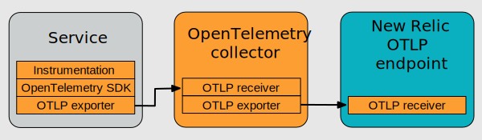

OpenTelemetry は、さまざまな方法で実装できる柔軟なツールキットです。New Relic で OpenTelemetry を設定するには、基本的に 4 つのステップで行うことをお勧めします。ここでは、プロセスの概要を説明し、続いて各ステップの詳細を説明します。

1. [前提条件](#prereqs)
2. [OpenTelemetryでサービスを計測する](#instrument)
3. [テレメトリーデータをNew Relicにエクスポートする](#export)
4. [New RelicのUIでデータを見る](#view-data)

## Step 1.前提条件 [#prereqs]

まず最初に

* まだお知り合いでなければ、 [New Relic の無料アカウントにサインアップしてください](https://newrelic.com/signup) 。
* [アカウントのライセンスキーをコピーする](https://one.newrelic.com/launcher/api-keys-ui.launcher).

## ステップ2.OpenTelemetryでサービスを計測する [#instrument]

まず始めに、OpenTelemetryでサービスを計測します。OpenTelemetryは言語別の製品やSDKを用意していますので、そちらをご利用ください。多くの言語では、一般的なライブラリやフレームワークのインストゥルメンテーションがすぐに利用できます。また、各言語は、サービスを手動で計測するためのAPIも提供しています。

お使いの言語のリポジトリにアクセスし、指示に従ってサービスの計測を行ってください。完了したら、ここに戻って [ステップ 3 を完了します。Telemetry データを New Relic にエクスポートする](#export) 。

* [C++](https://github.com/open-telemetry/opentelemetry-cpp)
* [アーラン](https://github.com/open-telemetry/opentelemetry-erlang)
* [Go](https://github.com/open-telemetry/opentelemetry-go)
* [Java](https://github.com/open-telemetry/opentelemetry-java)
* [Javascript/Node.js](https://github.com/open-telemetry/opentelemetry-js)
* [.NET](https://github.com/open-telemetry/opentelemetry-dotnet)
* [PHP](https://github.com/open-telemetry/opentelemetry-php)
* [Python](https://github.com/open-telemetry/opentelemetry-python)
* [Ruby](https://github.com/open-telemetry/opentelemetry-ruby)
* [ラスト](https://github.com/open-telemetry/opentelemetry-rust)
* [Swift](https://github.com/open-telemetry/opentelemetry-swift)
* [...GitHubで言語の全リストを見る](https://github.com/open-telemetry)

## ステップ3.テレメトリーデータをNew Relicにエクスポートする [#export]

[OpenTelemetry Protocol](https://github.com/open-telemetry/opentelemetry-specification/blob/main/specification/protocol/otlp.md) 、略してOTLPは、OpenTelemetryプロジェクトのために設計された、汎用のテレメトリデータ配信プロトコルです。このプロトコルは、テレメトリーデータのエンコードと送信方法を記述しているため、データ伝送に適しています。各言語のSDKにはOTLPエクスポーターが用意されており、OTLP経由でデータをエクスポートするように設定できます。

このステップでは、お使いのサービスにOTLPエクスポーターを設定し、データを直接New Relicにエクスポートする方法を中心に説明します。データをOpenTelemetryコレクターに最初にエクスポートしたい場合は、別途 [の手順をご用意しています](#collector) 。

 <figcaption>サービスからNew Relicに直接データを送信する例です。</figcaption>

この3つ目のステップを完了するためには、まず必要なNew Relicの設定について理解し、次にお使いの言語のOTLPエクスポーターのドキュメントに記載されているステップを完了します。

### エクスポートに関するNew Relicの設定を確認する [#review-settings]

外部のOTLPエクスポーターのドキュメントを見る前に、以下の表を参考にして、次のことができるようにしてください。

* OTLP エクスポーターを設定し、データを送信したい New Relic アカウントのライセンスキーを値とするヘッダー (`api-key`) を追加します。
* お使いの統合に基づいて、エクスポーターがデータをNew Relicに送信するエンドポイントを設定します。ほとんどのユーザーは、US Native OTLP または EU Native OTLP 統合を使用することになるでしょう。

<table>
  <thead>
    <tr>
      <th>
        インテグレーション
      </th>

      <th>
        gRPC
      </th>

      <th>
        HTTP/1.1
      </th>

      <th>
        エンドポイント
      </th>

      <th>
        APIヘッダー名
      </th>

      <th>
        APIヘッダーの値
      </th>

      <th>
        TLS暗号化が必要
      </th>
    </tr>
  </thead>

  <tbody>
    <tr>
      <td>
        USネイティブOTLP
      </td>

      <td>
        ✅
      </td>

      <td>
        ❌
      </td>

      <td>
        <a
          href="https://otlp.nr-data.net:4317"
          target="_blank"
          rel="noopener noreferrer"
        >
          [https://otlp.nr-data.net:4317](https://otlp.nr-data.net:4317)
        </a>
      </td>

      <td>
        `api-key`
      </td>

      <td>
        <a href="https://one.newrelic.com/launcher/api-keys-ui.launcher">
          ライセンスキー
        </a>
      </td>

      <td>
        ✅
      </td>
    </tr>

    <tr>
      <td>
        EUネイティブOTLP
      </td>

      <td>
        ✅
      </td>

      <td>
        ❌
      </td>

      <td>
        <a href="https://otlp.eu01.nr-data.net:4317">
          [https://otlp.eu01.nr-data.net:4317](https://otlp.eu01.nr-data.net:4317)
        </a>
      </td>

      <td>
        `api-key`
      </td>

      <td>
        <a href="https://one.newrelic.com/launcher/api-keys-ui.launcher">
          ライセンスキー
        </a>
      </td>

      <td>
        ✅
      </td>
    </tr>

    <tr>
      <td>
        US FedRamp Native OTLP<br/> （詳細は [FedRAMP compliance](/docs/security/security-privacy/compliance/fedramp-compliant-endpoints/#otlp-api) をご参照ください。）
      </td>

      <td>
        ✅
      </td>

      <td>
        ❌
      </td>

      <td>
        <a href="https://gov-otlp.nr-data.net:4317">
          [https://gov-otlp.nr-data.net:4317](https://gov-otlp.nr-data.net:4317)
        </a>
      </td>

      <td>
        `api-key`
      </td>

      <td>
        <a href="https://one.newrelic.com/launcher/api-keys-ui.launcher">
          ライセンスキー
        </a>
      </td>

      <td>
        ✅
      </td>
    </tr>

    <tr>
      <td>
        Infinite Tracing<br/> （エンドポイントの詳細については [ベストプラクティス](/docs/more-integrations/open-source-telemetry-integrations/opentelemetry/opentelemetry-concepts/#infinite-tracing) をご参照ください。
      </td>

      <td>
        ✅
      </td>

      <td>
        ❌
      </td>

      <td>
        `https://{trace-bserver}:443`
      </td>

      <td>
        `api-key`
      </td>

      <td>
        <a href="https://one.newrelic.com/launcher/api-keys-ui.launcher">
          ライセンスキー
        </a>
      </td>

      <td>
        ✅
      </td>
    </tr>
  </tbody>
</table>

<Callout variant="important">
  Node.jsでは、 [opentelemetry-collector-export-grpc](https://www.npmjs.com/package/@opentelemetry/exporter-trace-otlp-grpc) ライブラリは、TLSを有効にするための追加オプションが必要です。
</Callout>

### エクスポート設定の手順を完了する [#complete-configs]

お使いの言語の下のリンクをクリックして、設定ステップを完了してください。完了したら、ここに戻って [ステップ 4 を完了します。New Relic UI でデータを見る](#view-data) 。

* [C++](https://github.com/open-telemetry/opentelemetry-cpp/tree/master/exporters/otlp)
* [アーラン](https://github.com/open-telemetry/opentelemetry-erlang/tree/master/apps/opentelemetry_exporter)
* [Go](https://pkg.go.dev/go.opentelemetry.io/otel/exporters/otlp)
* [Java](http://github.com/open-telemetry/opentelemetry-java-instrumentation#getting-started)
* [Javascript/Node.js](https://www.npmjs.com/package/@opentelemetry/exporter-collector-grpc)
* [.NET](https://github.com/open-telemetry/opentelemetry-dotnet/tree/master/src/OpenTelemetry.Exporter.OpenTelemetryProtocol)
* [PHP](https://github.com/open-telemetry/opentelemetry-php/blob/master/examples/AlwaysOnOTLPExample.php)
* [Python](https://opentelemetry-python.readthedocs.io/en/stable/exporter/otlp/otlp.html)
* [Ruby](https://github.com/open-telemetry/opentelemetry-ruby/tree/master/exporter/otlp)
* [ラスト](https://crates.io/crates/opentelemetry-otlp)
* [Swift](https://github.com/open-telemetry/opentelemetry-swift/tree/master/Sources/Exporters/OpenTelemetryProtocol)
* [...GitHubで追加のOTLP言語サポートを見つける](https://github.com/open-telemetry)

<CollapserGroup>
  <Collapser
    className="freq-link"
    id="collector"
    title="OpenTelemetry Collectorへのデータのエクスポート（オプション）"
  >
    [OpenTelemetry Collector](https://opentelemetry.io/docs/collector/) は、テレメトリデータを受信、処理、およびエクスポートするための、設定可能で拡張可能なソフトウェアコンポーネントです。コレクターを設定すると、ゲートウェイとしてもエージェントとしても動作します。

    * **ゲートウェイ：** コレクターは、様々なソースからデータを受け取り、標準的な処理を施してからバックエンドにエクスポートします。
    * **エージェント：** コレクターは、環境内の各ホストに配備され、ホストおよびホスト上で実行されているプロセスに関する遠隔測定データを収集することができます。

    コレクターを使用する場合は、上記のOTLPをサービスに設定する場合と同様の手順で開始します。この場合、データを直接 New Relic にエクスポートするのではなく、自分で設定したコレクターを介してエクスポートします。コレクターでは、New Relic にデータをエクスポートするために、 [OTLP エクスポーター](https://github.com/open-telemetry/opentelemetry-collector/tree/main/exporter/otlpexporter) を設定します。

    データがコレクターを経由するときのトランスポートは次のようになります。

    

    ここでは、コレクターYAMLを使ってOpenTelemetryのコレクターをセットアップして実行するDockerの例を紹介します。

    1. 以下を `otel-config.yaml` として保存します。

    ```
    receivers:
      otlp:
        protocols:
          grpc:
          http:

    processors:
      batch:

    exporters:
      otlp:
        endpoint: ${OTEL_EXPORTER_OTLP_ENDPOINT}
        headers:
          api-key: ${NEW_RELIC_LICENSE_KEY}

    service:
      pipelines:
        traces:
          receivers: [otlp]
          processors: [batch]
          exporters: [otlp]
        metrics:
          receivers: [otlp]
          processors: [batch]
          exporters: [otlp]
        logs:
          receivers: [otlp]
          processors: [batch]
          exporters: [otlp]
    ```

    2. 以下の変更を行った後、OpenTelemetry コレクターを実行します。

       * <var>OTLP_ENDPOINT_HERE</var>

         を適切な\[エンドポイント]に置き換えてください(#review-settings.

       * <var>YOUR_KEY_HERE</var>

         をお客様のアカウントの [ライセンスキー](https://one.newrelic.com/launcher/api-keys-ui.launcher) に置き換えてください。

    ```
    export OTEL_EXPORTER_OTLP_ENDPOINT=<var>OTLP_ENDPOINT_HERE</var>
    export NEW_RELIC_LICENSE_KEY=<var>YOUR_KEY_HERE</var>

    docker run --rm \
      -e OTEL_EXPORTER_OTLP_ENDPOINT \
      -e NEW_RELIC_LICENSE_KEY \
      -p 4317:4317 \
      -v "${PWD}/otel-config.yaml":/otel-config.yaml \
      --name otelcol \
      otel/opentelemetry-collector \
      --config otel-config.yaml
    ```
  </Collapser>
</CollapserGroup>

## ステップ4.New RelicのUIでデータを見る [#view-data]

サービスをインストルメント化し、New Relic にデータをエクスポートするように設定したら、New Relic One のユーザーインターフェイスで [トレース](https://one.newrelic.com/launcher/nr1-core.explorer?overlay=eyJuZXJkbGV0SWQiOiJkYXRhLWV4cGxvcmF0aW9uLnF1ZXJ5LWJ1aWxkZXIiLCJpbml0aWFsQWN0aXZlSW50ZXJmYWNlIjoibnJxbEVkaXRvciIsImluaXRpYWxOcnFsVmFsdWUiOiIiLCJpbml0aWFsUXVlcmllcyI6W3sibnJxbCI6IkZST00gU3BhbiBTRUxFQ1QgY291bnQoKikgd2hlcmUgbmV3cmVsaWMuc291cmNlPSclb3RscCUnIFRJTUVTRVJJRVMifV0sImluaXRpYWxDaGFydFNldHRpbmdzIjp7ImNoYXJ0VHlwZSI6IkNIQVJUX0xJTkUiLCJsaW1pdCI6NzU0MiwibGlua2VkRW50aXR5R3VpZCI6bnVsbCwibGlua2VkRGFzaGJvYXJkSWQiOm51bGwsInlTY2FsZSI6eyJzdGF0aWMiOmZhbHNlLCJkb21haW4iOltudWxsLG51bGxdfSwieVplcm8iOnRydWV9fQo=) 、 [メトリクス](https://one.newrelic.com/launcher/nr1-core.explorer?overlay=eyJuZXJkbGV0SWQiOiJkYXRhLWV4cGxvcmF0aW9uLnF1ZXJ5LWJ1aWxkZXIiLCJpbml0aWFsQWN0aXZlSW50ZXJmYWNlIjoibnJxbEVkaXRvciIsImluaXRpYWxOcnFsVmFsdWUiOiIiLCJpbml0aWFsUXVlcmllcyI6W3sibnJxbCI6IkZST00gTWV0cmljIFNFTEVDVCBjb3VudCgqKSB3aGVyZSBuZXdyZWxpYy5zb3VyY2UgTElLRSAnJW90bHAlJyBUSU1FU0VSSUVTIn1dLCJpbml0aWFsQ2hhcnRTZXR0aW5ncyI6eyJjaGFydFR5cGUiOiJDSEFSVF9MSU5FIiwibGltaXQiOjc1NDIsImxpbmtlZEVudGl0eUd1aWQiOm51bGwsImxpbmtlZERhc2hib2FyZElkIjpudWxsLCJ5U2NhbGUiOnsic3RhdGljIjpmYWxzZSwiZG9tYWluIjpbbnVsbCxudWxsXX0sInlaZXJvIjp0cnVlfX0K) 、 [ログ](https://one.newrelic.com/launcher/nr1-core.explorer?overlay=eyJuZXJkbGV0SWQiOiJkYXRhLWV4cGxvcmF0aW9uLnF1ZXJ5LWJ1aWxkZXIiLCJpbml0aWFsQWN0aXZlSW50ZXJmYWNlIjoibnJxbEVkaXRvciIsImluaXRpYWxOcnFsVmFsdWUiOiIiLCJpbml0aWFsUXVlcmllcyI6W3sibnJxbCI6IkZST00gTG9nIFNFTEVDVCBjb3VudCgqKSB3aGVyZSBuZXdyZWxpYy5zb3VyY2U9JyVvdGxwJScgVElNRVNFUklFUyJ9XSwiaW5pdGlhbENoYXJ0U2V0dGluZ3MiOnsiY2hhcnRUeXBlIjoiQ0hBUlRfTElORSIsImxpbWl0Ijo3NTQyLCJsaW5rZWRFbnRpdHlHdWlkIjpudWxsLCJsaW5rZWREYXNoYm9hcmRJZCI6bnVsbCwieVNjYWxlIjp7InN0YXRpYyI6ZmFsc2UsImRvbWFpbiI6W251bGwsbnVsbF19LCJ5WmVybyI6dHJ1ZX19Cg==) を確認してみましょう !

OpenTelemetry の UI は APM エージェントの UI と似ている部分がありますので、そちらに慣れている方はそのまま UI に進むことができます。OpenTelemetry の UI オプションの理解や、データが UI に表示されるようにする方法については、 [View your OpenTelemetry data in New Relic](/docs/integrations/open-source-telemetry-integrations/opentelemetry/view-your-opentelemetry-data-new-relic) をご覧ください。

## OpenTelemetryの事例を見る [#examples]

[OpenTelemetry と New Relic](https://github.com/newrelic/newrelic-opentelemetry-examples) の使用例をご覧ください。

## 次のステップ [#next]

初期設定を行った後は、OpenTelemetryとNew Relicの利用を向上させるための様々な設定に関するヒントを、 [best-practices](/docs/integrations/open-source-telemetry-integrations/opentelemetry/opentelemetry-concepts/) ガイドでご確認ください。