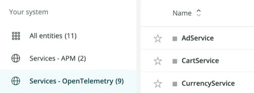

OpenTelemetry のデータを New Relic にインポートした後は、さまざまなツールを使って分析することができます。これらのUIオプションを見てみましょう。

* [エクスプローラー](#explorer)
* [データエクスプローラとクエリビルダ](#query-builder)

## エクスプローラー。全体像と詳細を把握する [#explorer]

New Relic **Explorer** タブは、サービスに関する情報収集を始めるのに適した場所です。このタブでは、サービスをフィルタリングし、データをフィルタリングすることで、さまざまなデータを表示することができます。

### サービス（実体）を探す [#find-entity]

エクスプローラーを始めるためには、自分のサービスを見つける必要があります。

1. [one.newrelic.com](https://one.newrelic.com)に移動します。

2. 左のサイドバーで「 **サービス」-「OpenTelemetry」** をクリックします。

   

3. 中央のペインでは、詳細を知りたいサービスをクリックするか、上部のフィルターバーに名前を入力してサービスを探します。

### フィルターでデータを絞る [#filter]

エンティティを取得したら、サービスからのデータをフィルタリングすることができます。

フィルターバー **Narrow data to...** を使えば、サービスに記録されたテレメトリの特定の面を強調することができます。例えば、カナリア・インスタンスにデプロイしたサービスの特定のバージョンのエラー・レートを見たい場合は、 `service.version='1.2.3'` のフィルターを追加します。

フィルターは、サービスのデータの異なるビュー間を移動する際に保存されます。例えば、 `service.version='1.2.3'` のフィルターは、 **Transactions** のビューに引き継がれ、サービスのバージョン1.2.3を実行しているエンドポイント（トランザクション）へのリクエストに関するテレメトリーが表示され、他のバージョンは表示されません。

フィルターは、 **Summary**, **Transactions**, **Databases**, **Externals**, **Errors**, **JVMs** のビュー間を移動する際にも保持されます。

フィルターは、 **Distributed tracing** ビューに移動しても保持されますが、制限があります。現在、 **Distributed tracing** に移動する際にサポートされているのは、equals 演算子 ("=") を使用するフィルタ条件のみです。 **Distributed tracing** ページからナビゲートバックすると、前のビューで選択したフィルタが戻ってきます。

データをフィルタリングすると、UIには左のナビゲーションペインに様々なビューが用意されています。ビューの詳細については、以下の説明を参照してください。

### 概要ページ [#summary]

**Explorer** タブでサービスをクリックすると、 **Summary** ページが表示され、エンティティに関するさまざまなゴールデンシグナルが一覧表示されます。ゴールデンシグナルとは、レスポンスタイム、スループット、エラーレートなどの主要なモニタリング情報です。この情報を利用することで、より深く調査する必要があるかどうかを素早く判断することができます。

このセクションに表示されるデータは、以下の条件を満たしている必要があります。

<table>
  <thead>
    <tr>
      <th style={{ width: "200px" }}>
        UIエリア
      </th>

      <th>
        属性
      </th>
    </tr>
  </thead>

  <tbody>
    <tr>
      <td>
        レスポンスタイム
      </td>

      <td>
        `span.kind = server` or `consumer`
      </td>
    </tr>

    <tr>
      <td>
        スループット
      </td>

      <td>
        `span.kind = server` or `consumer`
      </td>
    </tr>

    <tr>
      <td>
        エラー率
      </td>

      <td>
        * `span.kind = server` or `consumer`
        * `otel.status_code = ERROR`
      </td>
    </tr>

    <tr>
      <td>
        サービスインスタンスペイン
      </td>

      <td>
        `service.instance.id` （通常はOTel resource APIで設定します。）
      </td>
    </tr>
  </tbody>
</table>

### ディストリビューティッド（分散）トレーシング [#tracing]

**Distributed tracing** では、トレースの位置を確認したり、スパンの詳細を調べたりすることができます。トレースデータをNew RelicのUIに表示するためには、 [OpenTelemetry trace semantic conventions](https://github.com/open-telemetry/opentelemetry-specification/tree/main/specification/trace/semantic_conventions#trace-semantic-conventions) に準拠する必要があります。また、 [ベストプラクティス](/docs/integrations/open-source-telemetry-integrations/opentelemetry/opentelemetry-concepts#traces) ガイドの「トレース」のセクションでは、トレースやスパンをNew Relicに表示させるためのヒントが紹介されています。

以下の属性は、通常、スパンに明示的に追加されることはありません。むしろ、スパンを作成するときや、OpenTelemetry SDKを使用してスパンに対して操作（エラーの記録など）を行うときに設定するのが一般的です。

<table>
  <thead>
    <tr>
      <th style={{ width: "200px" }}>
        属性
      </th>

      <th>
        説明
      </th>
    </tr>
  </thead>

  <tbody>
    <tr>
      <td>
        name
      </td>

      <td>
        スパンの名前は通常、 [スパンを開始するときに設定されます](https://github.com/open-telemetry/opentelemetry-specification/blob/main/specification/trace/api.md#span-creation) 。名前は一般的に何でも構いませんが、OpenTelemetryの仕様では、 [Database spans](https://github.com/open-telemetry/opentelemetry-specification/blob/main/specification/trace/semantic_conventions/database.md#semantic-conventions-for-database-client-calls) や [HTTP spans](https://github.com/open-telemetry/opentelemetry-specification/blob/main/specification/trace/semantic_conventions/http.md#name) のような特定のタイプのスパンについてのガイダンスを提供しています。
      </td>
    </tr>

    <tr>
      <td>
        [span.kind](https://github.com/open-telemetry/opentelemetry-specification/blob/main/specification/trace/api.md#spankind)
      </td>

      <td>
        スパンの種類は通常、 [スパンを開始する際に設定されます](https://github.com/open-telemetry/opentelemetry-specification/blob/main/specification/trace/api.md#span-creation) 。New Relic は `span.kind` を使って、あるスパンが特定のサービスへのエントリーポイントであることを推測します。 `span.kind = server` or `consumer` の場合は、エントリーポイントであると考えられます。 `span.kind = client` or `producer` の場合は、外部サービスやデータベースシステムへの呼び出しとみなされます。
      </td>
    </tr>

    <tr>
      <td>
        otel.status_code
      </td>

      <td>
        * スパンの [ステータスは、スパン API を使用して](https://github.com/open-telemetry/opentelemetry-specification/blob/main/specification/trace/api.md#set-status) 設定されます。 `otel.status_code` 属性は、New Relic でどのように表示されるかを示しています。
        * UIは主に、エラーを識別する目的で、 `otel.status_code` を使用しています。
      </td>
    </tr>
  </tbody>
</table>

#### トレースとその関連スパンの検索

ここでは、検索対象を絞るための方法をご紹介します。

1. 欲しいトレースを見つけるには、フィルターバーで以下のようなクエリを実行します。

   * `service.name = YOUR_SERVICE_NAME`
   * `TRACE.ID = YOUR_TRACE_ID`

2. 興味深いトレースを見つけたら、それをクリックすると、トレースのスパンを示すウォーターフォール図が表示されます。

3. トレース内の特定のスパンをクリックすると、右側のパネルにスパンの詳細が表示されます。

<Callout variant="tip">
  トレースをフィルタリングするその他の方法については、 [distributed tracing UI page](/docs/understand-dependencies/distributed-tracing/ui-data/understand-use-distributed-tracing-ui) を参照してください。
</Callout>

#### エラーのあるスパンの表示

トレースウォーターフォールビューでスパンをクリックすると、右パネルの **エラーの詳細** にスパンのエラーが表示されます。

エラーの詳細は、 `otel.status_code = ERROR` を含むスパンによって入力され、 `otel.status_description` の内容を表示します。

エラーのあるスパンを絞り込んで検索するには、 `otel.status_code = ERROR` を分散型トレースのフィルターバーに直接入力します。

#### スパンのイベントを見る

[OpenTelemetry 仕様](https://github.com/open-telemetry/opentelemetry-specification/blob/main/specification/trace/api.md#add-events) で説明されているようにスパンイベントを送信すると、New Relic UI でそのイベントを見ることができます。スパンイベントには、一般的に 2 つのタイプがあります。

* 例外
* 非例外（例えば、ログなど）

スパンイベントがある場合は、右ペインにそのリンクが表示されます。

1. ウォーターフォールビューでスパンをクリックします。

2. 右ペインで、 **View span events** をクリックするか、 **Error details** を展開して、エラーの下部にあるリンクをクリックします。

   

3. スパンイベントで、例外のみを表示したい場合は、トグルをスライドさせます **Only show exceptions**.

<Callout variant="tip">
  アプリ／サービスで処理されるOpenTelemetryの例外は、スパンのエラー・ステータスとは別に表示され、必ずしもスパンのエラー・ステータスとは関連しません。
</Callout>

### データベース [#databases]

**データベース** ページには、アプリケーションのデータベースとキャッシュのデータが表示されます。このページでは、個々のデータベーストランザクションがソート可能なテーブルとして表示され、オペレーション、スループット、およびレスポンスタイムがチャートで表示されます。

このセクションに表示されるデータは、以下の条件を満たしている必要があります。

<table>
  <thead>
    <tr>
      <th style={{ width: "200px" }}>
        UIエリア
      </th>

      <th>
        属性
      </th>
    </tr>
  </thead>

  <tbody>
    <tr>
      <td>
        トップ・データベース・コール
      </td>

      <td>
        * `span.kind = client` or `producer`
        * `db.system`
        * スパン名によるファセット
      </td>
    </tr>

    <tr>
      <td>
        上位のデータベース（問い合わせ時間順）
      </td>

      <td>
        * `span.kind = client` or `producer`
        * `db.system`
        * `db.systemによるFacets`
      </td>
    </tr>

    <tr>
      <td>
        上位データベース（スループット順）
      </td>

      <td>
        * `span.kind = client` or `producer`
        * `db.system`
        * `db.systemによるFacets`
      </td>
    </tr>
  </tbody>
</table>

### エラー [#errors]

Errorsページでは、エラーの総数や、エラー数やエラー率を示すグラフを見ることができます。

このセクションに表示されるデータは、以下の条件を満たしている必要があります。

* `span.kind = server` or `consumer`
* `otel.status_code = ERROR`
* スパン名によるファセット

### エクスターナル [#externals]

エクスターナルは、Webサービスやクラウド上のリソース、その他のネットワークエンティティなど、プロセス外のサービスへの呼び出しを捕捉します。

このセクションに表示されるデータは、以下の条件を満たしている必要があります。

* `span.kind = client` or `producer`
* `db.system` は存在しません。

### JVM

特定のJVMにドリルインすると、JVMのメトリックデータに基づいたチャートがUIに表示されます。

* JVMメトリクスは、ランタイム環境メトリクスの一般的な [セマンティックな規約に従っています](https://github.com/open-telemetry/opentelemetry-specification/blob/main/specification/metrics/semantic_conventions/runtime-environment-metrics.md#runtime-environment-specific-metrics---runtimeenvironment) 。
* Java固有のランタイムメトリクスは、十分に文書化されていません。 [実装](https://github.com/open-telemetry/opentelemetry-java-instrumentation/tree/main/instrumentation/runtime-metrics/library/src/main/java/io/opentelemetry/instrumentation/runtimemetrics) は、事実上のドキュメントであり、変更される可能性があります。

このセクションに表示されるデータは、以下の条件を満たしている必要があります。

* Requires a unique `service.instance.id` attribute for rendering the list of JVMs
* `Service.instance.id` はOpenTelemetryのリソース属性です。

### ログ [#logs]

**Logs** ページには、アプリケーションからのログが表示されます。New Relic でログデータをアプリケーションに関連付ける方法については、 [OpenTelemetry and logging documentation](/docs/integrations/open-source-telemetry-integrations/opentelemetry/opentelemetry-logs) をご覧ください。

このセクションに表示されるデータは、以下の条件を満たしている必要があります。

* `service.name`
* トレースデータと相関させるために、ログには `trace.id` と `span.id` の属性が含まれている必要があります。

### メトリクスエクスプローラー [#metric-explorer]

選択されたOpenTelemetry言語では、このセクションでメトリクスに関する情報を見ることができます。また、OpenTelemetryでPrometheusエクスポーターを使用している場合は、ここでメトリックデータを見ることができます。

### トランザクション [#transactions]

**Transactions** を使用して、アプリケーションの応答時間の急上昇の原因となっている可能性のある低速またはエラーのトランザクションを特定します。トランザクションの一覧を表示するには **Transaction Summary** ページから、トランザクションテーブルを選択します。

このセクションに表示されるデータは、以下の条件を満たしている必要があります。

<table>
  <thead>
    <tr>
      <th style={{ width: "200px" }}>
        UIエリア
      </th>

      <th>
        説明
      </th>
    </tr>
  </thead>

  <tbody>
    <tr>
      <td>
        トップ・トランザクション  

      </td>

      <td>
        * `span.kind = server` or `consumer`
        * スパン名によるファセット
      </td>
    </tr>

    <tr>
      <td>
        スループット
      </td>

      <td>
        * `span.kind = server` or `consumer`
        * スパン名によるファセット
      </td>
    </tr>
  </tbody>
</table>

## データエクスプローラとクエリビルダ [#query-builder]

[データエクスプローラー](/docs/query-your-data/explore-query-data/data-explorer/introduction-data-explorer) を使ってメトリクスやトレースを調べたり、クエリビルダーで NRQL を使って独自のクエリを書いたりすることができます。New Relic に取り込んだデータを照会する方法については、 [データの照会](/docs/query-your-data/explore-query-data/explore-data/introduction-querying-new-relic-data) および [NRQL の紹介](/docs/query-your-data/nrql-new-relic-query-language/get-started/introduction-nrql-new-relics-query-language) を参照してください。