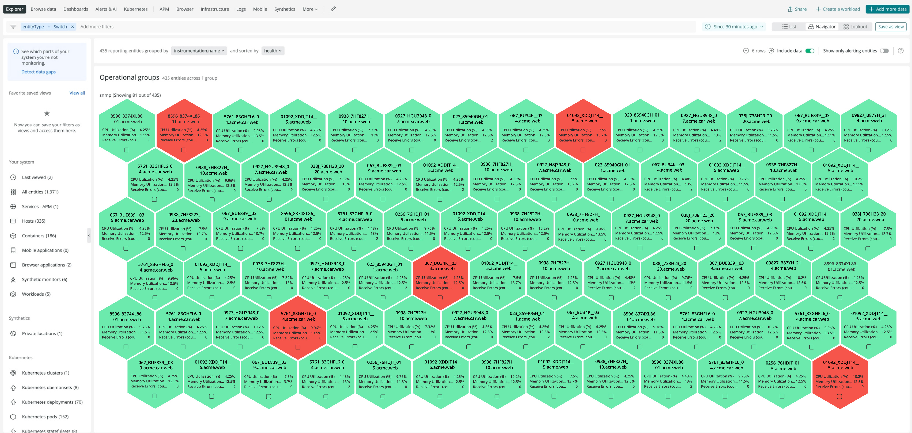

システムのパフォーマンスが低下した場合、その原因がコードにあるのか、インフラにあるのか、あるいはネットワークにあるのかを知る必要があります。また、その原因を迅速に把握することで、対策に注力することができます。ネットワーク・パフォーマンス・モニタリングでは、アプリケーション、インフラ、デジタル・エクスペリエンス、ネットワークのデータをすべて1つの場所で関連付けて分析し、ネットワーク・パフォーマンスとシステム全体のパフォーマンスがお互いにどのような影響を与えるかを把握することができます。

<Callout variant="tip">
  ネットワークパフォーマンスモニタリングがNew Relicに含まれるようになりました [FedRAMP Moderate authorization](/docs/security/security-privacy/compliance/data-encryption/)!

  [SNMP](/docs/network-performance-monitoring/setup-performance-monitoring/snmp-performance-monitoring/#setup-snmp-monitoring) および [ネットワークフロー](/docs/network-performance-monitoring/setup-performance-monitoring/network-flow-monitoring/#setup-network-flow-monitoring) のガイド付きインストールを使用して、 [FedRAMP 認可の API エンドポイント](/docs/security/security-privacy/compliance/fedramp-compliant-endpoints/#data-ingest-apis) を自動的に検出して構成するか、 [SNMP](/docs/network-performance-monitoring/setup-performance-monitoring/snmp-performance-monitoring/#manual-setup) および [ネットワークフロー](/docs/network-performance-monitoring/setup-performance-monitoring/network-flow-monitoring/#manual-setup) のドキュメントで手動セットアッププロセスを確認してください。
</Callout>

<figcaption>
  ネットワーク・パフォーマンス・モニタリングでのNavigatorの使用。
</figcaption>

ネットワークパフォーマンスモニタリングは、すでに [New Relic One](https://one.newrelic.com) で収集しているアプリケーションやインフラストラクチャのデータに、ネットワークデータのコンテキストを追加します。ネットワークデータをモニタリングすることで、以下のことが可能になります。

* スタック全体（アプリケーションとインフラ）のパフォーマンスを分析・把握することで、システムのパフォーマンスを全体的に把握することができます。
* すべてのデータを単一のプラットフォームに集約し、死角をなくす。
* ある問題にネットワークが関係しているかどうかが一目瞭然。

<ButtonGroup>
  <ButtonLink
    role="button"
    to="https://newrelic.com/signup"
    variant="primary"
  >
    無料でご登録いただけます。
  </ButtonLink>
</ButtonGroup>

クレジットカードは不要です。すでにアカウントをお持ちの場合[ログイン](http://one.newrelic.com/)。

<Video
  id="2GH8YrEv9YA"
  type="youtube"
/>

## ネットワークパフォーマンスデータの種類 [#network-performance-data-types]

以下の種類のネットワークパフォーマンスデータを監視することができます。

* **SNMPデータ**: SNMP（Simple Network Management Protocol）は、ネットワーク機器間で管理情報を交換するためのアプリケーション層のプロトコルです。SNMP データを [New Relic One](https://one.newrelic.com) に送信するには、 [Set up SNMP data monitoring](/docs/network-performance-monitoring/setup-performance-monitoring/snmp-performance-monitoring) を参照してください。
* **ネットワークフローデータ**: オンプレミスネットワークのネットワークインターフェースに出入りするIPトラフィックの情報を取得します。ネットワークフローデータを [New Relic One](https://one.newrelic.com) に送信するには、 [Set up network flow data monitoring](/docs/network-performance-monitoring/setup-performance-monitoring/network-flow-monitoring) を参照してください。

<Callout variant="important">
  ネットワークの可視性を高めるために、SNMPとネットワークフローデータの両方を設定することをお勧めします。これにより、パフォーマンス指標とトラフィックパターンの両方が提供され、ネットワークのトラブルシューティングと最適化が可能になります。
</Callout>

## ハイレベルアーキテクチャの概要 [#architecture]

当社のソリューションは、当社のパートナーであるKentik社が開発した [ktranslate](https://github.com/kentik/ktranslate) のDockerコンテナをベースにしています。この単一のコンテナイメージがお客様の環境でホストされ、お客様のデータを収集して処理し、Event、Metric、Logの各APIにエクスポートしてNew Relic Oneに表示します。

<figcaption>
  ネットワーク・パフォーマンス・モニタリング・アーキテクチャの概要
</figcaption>