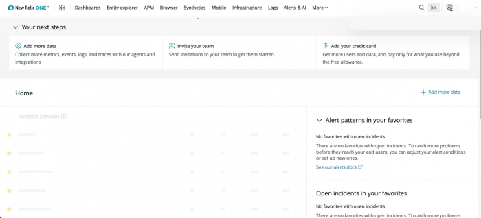
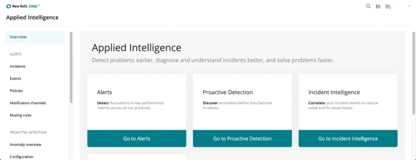
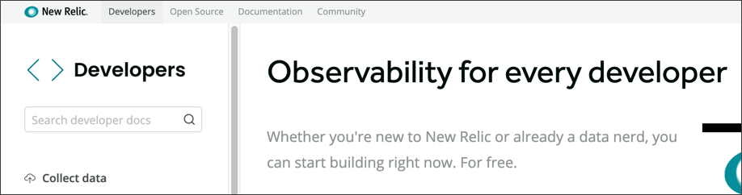
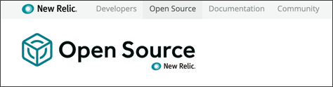

[New Relic One](/docs/new-relic-one/use-new-relic-one/get-started/introduction-new-relic-one)にようこそ！当社では、Full-Stack Observabilityプラットフォームを一元化および強化し、オープン、接続し、プログラム可能なものとしました。この移行ガイドでは、新たな機能を活用し、New Relic で以前行っていた同じ目標を達成する方法などについて説明しています。

当社は、New Relic One プラットフォームでの体験を継続的に改善し、簡素化することに努めています。これまでどおりサポートを提供しますが、お客様の新たな体験での好ましい点や問題点についてもお聞かせいただければ幸いです。

ダークモードでUIを表示するには[テーマの明暗を切り替える方法について知る](/docs/using-new-relic/welcome-new-relic/get-started/view-our-ui-dark-mode)。

 ただちにフィードバックするには、New Relic One のUIページの上部にある**コメント**アイコンをクリックします。

## 重要な理由を知る [#why]

ソフトウェアエンジニア、オペレーションチームの一員、サイトの信頼性担当エンジニア、管理職のいずれであるかにかかわらず、ビジネスを実行し、顧客を満足させる必要があります。New Relic Oneへの移行を開始するには、このビデオ（約3分30秒）をご覧ください。

<Video
  type="youtube"
  id="NjkHQDS870k"
/>

New Relic One を使用すると、次のことを迅速かつ簡単にできます。

* ソフトウェアスタック全体を観察、可視化、トラブルシューティング。問題を迅速に予想、検索、解決し、ソフトウェアのパフォーマンスがビジネスの結果をどのように推進するかを理解。
* ソフトウェアスタック全体のあらゆる場所の障害とパフォーマンスの問題をピンポイントで検索し、ただちに問題を解決し復旧。
* アップタイムとパフォーマンスを改善し、業務効率を高め、市場投入までの時間を短縮。
* 見落としがないようすべてのインストゥルメントを行い、複雑なシステムを迅速に理解し効率的に活動できるようにし、ビジネスを推進するビューとワークフローを構築。
* すべてのテレメトリーデータを1か所に収集し、Full-Stack Observabilityとインテリジェンスの応用により得られた知見を活用し、サービスの信頼性を確実に改善し、市場投入までの時間を短縮。

**<Icon style={{color: 'green'}} name="fe-info"/>
移行成功について詳細に知る:**

* [New Relicの概要](/docs/using-new-relic/welcome-new-relic/get-started/introduction-new-relic)

## スタートガイド [#get-started]

New Relic One では、プラットフォームのナビゲーションや問題の検索や診断、新たなより強力な機能の活用が容易になるよう、ユーザー体験が一元化されています。開始するには、適宜[one.newrelic.com](https://one.newrelic.com)または[one.eu.newrelic.com](https://one.eu.newrelic.com)に移動します。

お気に入りのアプリやチーム、その他のリソースをホームページに追加して、New Relic One エクスペリエンス をカスタマイズできます。

New Relic Oneホームページから、次のことを行えます:

* エコシステムでの現在の状況を表示する。
* 問題のトラブルシューティングを行い、アノマリーでのパターンを検索する。
* データのクエリを行い、他のユーザーと情報を共有する。
* パフォーマンスを最適化する分野を探す。

<Callout variant="tip">
  初回の閲覧時にNew Relic Oneホームページに何も表示されない場合、お気に入りのアプリやサービス、チームなどを追加します。その後、ホームページには、現在の状況やアラートパターン、違反、詳細やリソースへのリンクを含む、エコシステムのリソースについてのすべての重要な情報が1か所に表示されます。
</Callout>

**<Icon style={{color: 'green'}} name="fe-info"/>
移行成功について詳細に知る:**

* [New Relicの概要](/docs/new-relic-one/use-new-relic-one/get-started/introduction-new-relic-one)

## UIのナビゲーション [#ui-new]

New Relic One のプラットフォームは単一で、このプラットフォームではテレメトリーデータをまとめ、フルスタックリソースをつなぎ、より完全なソフトウェアを構築できるようになります。お客様のニーズに最適の方法でUIのナビゲーションを行えるよう、ホームページを整理しています。

<Table>
  <thead>
    <tr>
      <th style={{ width: "200px" }}>
        UIのナビゲーション
      </th>

      <th>
        移行成功のヒント
      </th>
    </tr>
  </thead>

  <tbody>
    <tr>
      <td>
        ホームページでの表示を一元化
      </td>

      <td>
        以前のUIエクスペリエンスでは、アプリケーションを表示するには別個のページに移動（`rpm.newrelic.com`を通じて）するか、（`infrastructure.newrelic.com`を通じて）ホストとインテグレーションを表示する必要がありました。新たなUIでは、アクセスを迅速、容易にするため、1つのページに、すべてのフルスタックモニタリングのニーズをまとめています。

        [**one.newrelic.com**](https://one.newrelic.com)または[**one.eu.newrelic.com**](https://one.eu.newrelic.com)に移動すると、すべてのリソースへのリンクが表示されます。テレメトリーデータのクエリやチャート作成、ダッシュボードの共有もここから行えます。
      </td>
    </tr>

    <tr>
      <td>
        エンティティエクスプローラー
      </td>

      <td>
        上部にある[エンティティエクスプローラー](/docs/new-relic-one/use-new-relic-one/ui-data/new-relic-one-entity-explorer-view-performance-across-apps-services-hosts)から、すべてのサービスやホスト、アプリケーション、グループに移動できます。検索やフィルタの適用、お気に入りの選択、メタデータの見直し、カラーコードで分けられた稼働ステータスの取得を迅速に行えます。

        <Callout variant="tip">
          メタデータでGUIDをコピーし、切り詰める必要がある場合、**CMD C**（Mac）または**CTRL C**（Windows）を使用します。
        </Callout>
      </td>
    </tr>

    <tr>
      <td>
        グローバル検索
      </td>

      <td>
        ホームページの上部にあるグローバル検索機能を使用して、すべてのアプリとリソース全体で検索を行えます。New Relic にレポートするすべてのデータタイプでも検索を行えます。ダッシュボードかアプリケーション、ホスト、合成スクリプト、クラウドサービスかによらず、一回の検索ですべて見つかります。
      </td>
    </tr>

    <tr>
      <td>
        オンラインヘルプ
      </td>

      <td>
        UIでドキュメントとサポートリソースを直接表示するには：ページの上部で、質問<Icon name="fe-help-circle"/>
        アイコンをクリックします。
      </td>
    </tr>

    <tr>
      <td>
        カスタマイズ可能な体験
      </td>

      <td>
        自身の体験に[アプリランチャー](/docs/using-new-relic/welcome-new-relic/get-started/glossary#launcher)を移行しました。ホームページで、**アプリ**アイコンをクリックしてから次のことを行います:

        * お気に入りのアプリとエンティティを追加し、簡単に見つけられるようにする。
        * [Nerdpackマネージャー](/docs/new-relic-one/use-new-relic-one/build-new-relic-one/new-relic-one-applications-requirements-security#security)の場合、アカウントで他のユーザーを追加します。
        * 一般に公開されているアプリと、UIで直接作成するアプリの[New Relic Oneのカタログ](/docs/new-relic-one/use-new-relic-one/build-new-relic-one/discover-manage-applications-new-relic-one-catalog)をブラウズします。
        * [CLI](https://developer.newrelic.com/explore-docs/nr1-cli)をダウンロードし、自身のアプリを構築します。
      </td>
    </tr>

    <tr>
      <td>
        UI表示の切り替え
      </td>

      <td>
        元のUI表示に希望する機能がある場合、またはNew Relic Oneに元の表示で希望した機能がある場合、ページの右上で表示を切り替えることができます。
      </td>
    </tr>
  </tbody>
</Table>

**<Icon style={{color: 'green'}} name="fe-info"/>
移行成功について詳細に知る:**

* New Relic Oneの[中心的なコンセプト](/docs/new-relic-one/use-new-relic-one/core-concepts)
* New Relic Oneの[UIとデータ収集](/docs/new-relic-one/use-new-relic-one/ui-data)
* [New Relic Oneで構築](/docs/new-relic-one/use-new-relic-one/build-new-relic-one/new-relic-one-build-your-own-custom-new-relic-one-application)
* [New Relic Oneのカタログ](/docs/new-relic-one/use-new-relic-one/build-new-relic-one/discover-manage-applications-new-relic-one-catalog)

New Relic Oneでは、複数の方法で[データのクエリとチャート作成](#explore-data)を、ナビゲーションの先頭にある**ダッシュボード**リンクから行えます。そのため、Insightsはそこに掲載されていませんが、ホームページの上部にある**詳細**ドロップダウンから以前のInsightsダッシュボードにアクセスするか、**ダッシュボード**をクリックすることもできます。[InsightsからNew Relic Oneへの移行](/docs/new-relic-one/use-new-relic-one/core-concepts/transition-new-relic-one-insights)の方法の詳細をご覧ください。

## インストゥルメンテーションを開始 [#instrumentation]

 単一の場所からNew Relicに流入するスタックからデータを取得し、最新のエージェントやインテグレーション、レポートサービスにより最新の状態を保ちます。

* すでにNew Relic Oneを使用している場合：UIの先頭で、**追加**をクリックしてから、ご希望のものを検索または選択します。
* New Relic Oneのホームページに何も表示されていない場合: **追加**をクリックしてから、ご希望のものを検索または選択します。

**追加**をクリックすると、New Relic Oneは一元化されたページとなり、そこで必要なあらゆるプログラミング言語とフレームワークにより、インストゥルメンテーションを拡張できます。

UIによりただちにインタラクティブな手順が始まるので、必要な言語とフレームワークを選択します。

<Table>
  <thead>
    <tr>
      <th style={{ width: "200px" }}>
        インストゥルメンテーションを拡張
      </th>

      <th>
        コメント
      </th>
    </tr>
  </thead>

  <tbody>
    <tr>
      <td>
        フロントエンドとバックエンドのモニタリング
      </td>

      <td>
        次のものについてのプログラミング言語とフレームワーク、顧客体験モニタリング：

        * バックエンド（C、Go、Java、.NET、Node.js、PHP、Python、Ruby）
        * フロントエンド（ブラウザまたは合成モニター）
        * モバイル（Android、iOS、tvOS）アプリケーション
      </td>
    </tr>

    <tr>
      <td>
        クラウドおよびプラットフォームテクノロジー
      </td>

      <td>
        Amazon Web Services（AWS）、Amazon ECS、Microsoft Azure、Google Cloud Platform、Kubernetes、Lambdaを含む、クラウドコンピューティングおよびコンテナオーケストレーション、サーバレステクノロジー
      </td>
    </tr>

    <tr>
      <td>
        ホストのオペレーティングシステム
      </td>

      <td>
        Amazon LinuxおよびCentOS、CoreOS、Debian、RHEL、SLES、Ubuntu、Windows Serversを含む、LinuxおよびWindowsシステム
      </td>
    </tr>

    <tr>
      <td>
        Log ingestion
      </td>

      <td>
        FluentdおよびAWS Cloudwatch、Logstash、Fluen t Bit、AWS FireLensを含む、ログアグリゲータおよびログフォワーダーのプラグイン
      </td>
    </tr>

    <tr>
      <td>
        Infrastructure
      </td>

      <td>
        データストア、メッセージブローカー、プロキシサーバ、その他のサービス
      </td>
    </tr>

    <tr>
      <td>
        オープンソース モニタリング システム
      </td>

      <td>
        JMXやNagios、Prometheus、SNMP、StatsD、Kamon、Micrometer、OpenTelemetryなど、その他のテレメトリー収集システムとのインテグレーション
      </td>
    </tr>
  </tbody>
</Table>

**<Icon style={{color: 'green'}} name="fe-info"/>
移行成功について詳細に知る:**

* [すべてのインテグレーション](https://newrelic.com/integrations)
* New Relic エージェントの[インストレーション](/docs/agents/manage-apm-agents/installation/install-agent)と[設定](/docs/using-new-relic/cross-product-functions/install-configure/configure-agent)
* [サーバレステクノロジー](/docs/serverless-function-monitoring)
* [ホストのオペレーティングシステムのインテグレーション](/docs/integrations/host-integrations/installation/install-host-integrations-built-new-relic)
* [ロギング プラグイン](/docs/logs/enable-logs/enable-logs/enable-new-relic-logs)
* [Infrastructureインテグレーション](/docs/integrations/infrastructure-integrations/get-started/introduction-infrastructure-integrations)
* [オープンソース テレメトリのインテグレーション](/docs/integrations/open-source-telemetry-integrations)

## データを詳しく調べる [#explore-data]

オープンで一元化されたテレメトリーデータベースを使用して、あらゆるソースからのすべてのメトリックスやイベント、ログ、トレースを収集して詳しく調べ、アラートを送信します。オープンソースツールの自動的なインテグレーションにより簡単にセットアップが行えるため、追加のモニタリングシステムやデータストアのホストや運用、管理のコストと複雑さが減少します。

メトリックスやイベント、ログ、トレースを含む、あらゆるデータタイプを詳しく調べることが可能な単一のリソースを使用するには：New Relic One のページの上部にある**データをクエリ**アイコンをクリックします。

いくつかの方法で、データを詳しく調べることができます：

* [NRQL](/docs/query-your-data/nrql-new-relic-query-language)を使用しない場合、データエクスプローラーを使用してデータのナビゲーションを行い、カスタマイズされた表示を作成します。
* 初めてクエリを実行している場合、[クエリビルダー](/docs/chart-builder/use-chart-builder/get-started/introduction-chart-builder)に移動すると、アシスト付きの（基本）モードを使用してクエリを実行し、チャートを作成できます。
* NRQLや[PromQL](/docs/integrations/prometheus-integrations/view-query-data/translate-promql-queries-nrql)タイプのクエリを実行することに問題がない場合、クエリビルダーの上級モードをお試しください。
* 複数のクエリを実行する場合、`TIMESERIES`を含めます。

New Relic One の**データエクスプローラー**のページから、すべてのデータタイプに移動するか、または**クエリビルダー**をクリックして、このデータのクエリや視覚化、共有を行えます。

**<Icon style={{color: 'green'}} name="fe-info"/>
移行成功について詳細に知る:**

* [データタイプ](/docs/using-new-relic/data/understand-data/new-relic-data-types)
* [UI または API を介してデータのクエリを行う](/docs/using-new-relic/data/understand-data/query-new-relic-data)
* [チャートとダッシュボードでデータを視覚化する](/docs/dashboards/new-relic-one-dashboards/get-started/introduction-new-relic-one-dashboards)
* New Relic Oneのプレビュー期間中の[条件](/docs/licenses/product-or-service-licenses/new-relic-one/preview-access-new-relic-one)

[Insights から New Relic One への移行](/docs/new-relic-one/use-new-relic-one/core-concepts/transition-new-relic-one-insights)を行う際に、Insights からの移動に問題がない場合: New Relic One のページの上部で、**詳細 > Insights** の順に選択します。

## より効率的にトラブルシューティングを実行 [#troubleshoot]

すべてが New Relic One と相互に関連しています。アプリやサービス、アラート間の関係は、すべて単一の一元化されたユーザーインタフェースにまとめられています。特に問題を検知した場合、テクノロジーエコシステム全体を総合的に把握できます。

New Relic One の**アラートとAI**リンクは、顧客に影響が出る前にエコシステムで問題を特定しトラブルシューティングを行い、問題を防止する単一の基点となります。

例えば：

* New Relic Diagnostics は、New Relicエージェントにより一般的な問題を自動的に検知し、トラブルシューティングの手順を提案します。トラブルシューティングのデータを、サポートチケットに自動的に添付することもできます。
* アラートにより、重要なことで問題が発生すると通知が行われ、インテリジェンスの応用とミュートルールにより、表示したくない項目を画面に表示しないようにすることができます。
* ワークロードは、意味のある方法でエンティティをグループ化しモニターするツールとなります。これは、複雑なシステムを理解し、問題を検知し、問題の状況と理由を理解するのに役立つので、問題を迅速に解決できるようになります。

**<Icon style={{color: 'green'}} name="fe-info"/>
移行成功について詳細に知る:**

* [New Relic Diagnostics](/docs/using-new-relic/cross-product-functions/troubleshooting/new-relic-diagnostics)
* [Alert](/docs/alerts/new-relic-alerts/getting-started/introduction-new-relic-alerts)
* [インテリジェンスの応用](https://docs.newrelic.co.jp/docs/new-relic-one/use-new-relic-one/new-relic-ai/introduction-new-relic-ai)
* [ミュートルール](/docs/alerts/new-relic-alerts/managing-notification-channels/muting-rules-suppress-notifications)
* [ワークロード](/docs/new-relic-one/use-new-relic-one/core-concepts/new-relic-one-workloads-isolate-resolve-incidents-faster)

## 開発者リソースを使用 [#open-source]

New Relicは、開発者により開発者のために設立されました。こうした考えは今でも、当社のミッションの礎となっています。当社はリソースを一元化しコードを配信して入れ得ため、コードにより簡単にアクセスし、カスタマイズや貢献を行えます。

たとえば、開発者ハブである**[developer.newrelic.com](https://developer.newrelic.com)**を使用して、アプリや他のソリューションを作成できます。表示するデータをカスタマイズし、希望する方法で視覚化できます。

この開発者サイトはオープンソースで、コンテンツについての皆さんのご意見やご要望をお待ちしています。当社は、いくつかの開発タスクを開始し試すのに役立つ、次のような多くのガイドを作成しています：

* データを収集
* ワークフローを自動化
* アプリを構築
* New Relic API エクスプローラーまたは NerdGraph APIエクスプローラーを使用

**[opensource.newrelic.com](https://opensource.newrelic.com)**を通じて、当社は開発者のコミュニティと、（180件以上の）オープンソースプロジェクトのライブラリを作成しています。このサイトにより、必要な正確なデータを入手し、お望みの方法で可視化できます。

また、[開発者支援](https://developer.newrelic.com/developer-champion)プログラムを通じて、技術コミュニティの開発者の専門知識とリーダーを表彰します。一度ご覧になりご参加ください。

**<Icon style={{color: 'green'}} name="fe-info"/>
移行成功について詳細に知る:**

* 開始のためのガイドとビデオを見直してから、**[developer.newrelic.com](https://developer.newrelic.com)**でコーディングを開始します。
* ビデオの概要を見てから、**[opensource.newrelic.com](https://opensource.newrelic.com)**にあるオープンソースとオープン標準プロジェクトを詳しく調べます。
* [GitHubについての開発者ツールキット](https://newrelic.github.io/developer-toolkit/)をチェックし、[CLI](https://github.com/newrelic/newrelic-cli)の詳細について調べます。
* [オープンソースコミュニティのリソースについてのブログ投稿](https://blog.newrelic.com/product-news/announcing-new-relic-open-source/)をお読みください。

## New Relic 機能のサポート終了のお知らせ [#eol-release-notes]

UIの多くの変更は、提供終了（EOL）となった機能に関連するものです。EOL体験をNew Relic Oneでの新たな体験に移行するのに役立つ実行項目を含む詳細については、[2020年7月のEOLの発表](/docs/new-relic-one/use-new-relic-one/ui-data/new-relic-feature-end-life-announcements-july-2020)をご覧ください。

## その他のヘルプ [#more_help]

さらに支援が必要な場合は、これらのサポートと学習リソースを確認してください：

* [Explorers Hub](https://discuss.newrelic.com/)を参照して、コミュニティから支援を受け、ディスカッションに参加してください。
* [当社のサイトで回答を見つけ、サポートポータルの使用方法について学びます](/docs/using-new-relic/welcome-new-relic/get-started/find-help-use-support-portal)。
* Linux、Windows、およびmacOSのトラブルシューティングツールである[New Relic Diagnosticsを実行します](/docs/using-new-relic/cross-product-functions/troubleshooting/new-relic-diagnostics)。
* New Relicの[データセキュリティ](/docs/security)と[ライセンス](/docs/licenses)ドキュメントを見直してください。
