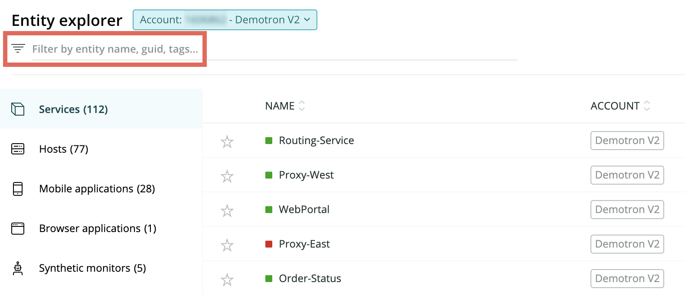

タグは、エンティティに追加できるキーの値のペアになります。タグは、データのグループ化、検索、フィルタリング、そしてフォーカスに役立つため、ご利用環境の理解とトラブルシューティングが可能となります。たとえば、タグを使用して次の操作を行えます：

* すべての[エンティティ](/docs/what-are-new-relic-entities)を効率よく整理する。
* チーム、役割、または地域を特定して、誰が何に責任を負っているかをすばやく知ることができます。
* 重要なデータはエンティティまたはデータに関連した[ダッシュボード](/docs/get-started)を簡単に見つけることができます。

<Callout variant="important">
  2020年7月に、APMと合成モニターのラベルは、タグに置き換えられました。[詳細情報](#labels)。
</Callout>

## タグを追加、編集、管理する [#manage]

[New Relic NerdGraph](/docs/apis/graphql-api/get-started/introduction-new-relic-nerdgraph)を使用して、タグを作成、管理できます。作成したタグは、[New Relic One](/docs/new-relic-one-overview)における貴社の複雑なシステム要素のフィルタリング、ファセット処理、そして整理に使用できます。

既に[NerdGraph GraphiQLエクスプローラー](https://api.newrelic.com/graphiql)に慣れ親しんでいる場合は、以下のチュートリアルからサンプルクエリの詳細を確認してください：

* [タグの管理](/docs/apis/graphql-api/tutorials/graphql-tagging-api-tutorial): エンティティのタグを追加、削除、表示、そして置換
* [エンティティのクエリ](/docs/apis/graphql-api/tutorials/use-new-relic-graphql-api-query-entities): エンティティ間の関係性を検索して確認

## エンティティに関するタグとメタデータを表示する [#attached-tags]

タグを作成した後は、様々なエンティティタイプにどのタグが追加されたか把握することが大事です。エンティティに追加したタグは、以下の二通りの方法で確認できます：

* **UI**：[エンティティエクスプローラー](/docs/new-relic-one-entity-explorer)のインデックスから、エンティティを選択します。**サマリー**ページでは、エンティティに追加された全てのタグ、またエンティティのGUID、アカウントID、そしてアプリIDを確認できます。
* **API**：NerdGraphを使用して[エンティティの既存タグを確認します](/docs/apis/graphql-api/tutorials/graphql-tagging-api-tutorial#read-tags)。

エンティティエクスプローラーからエンティティを選択すると、New Relicはこれに対応するメタデータを自動的に表示します。エンティティの種類によっては（サービス、ホスト、ブラウザ、またはモバイルアプリなど）、以下の複数の方法でメタデータのタグ、閲覧、ファセット処理、検索、またはクエリを実行できます：

* [チャートビルダ](/docs/introduction-chart-builder)
* [NerdGraph](/docs/apis/graphql-api/getting-started/introduction-new-relic-graphql-api)
* [NRQL](/docs/insights/nrql-new-relic-query-language/nrql-reference/nrql-syntax-components-functions)
* [REST API](/docs/apis/rest-api-v2/getting-started/introduction-new-relic-rest-api-v2)

<CollapserGroup>
  <Collapser
    id=""
    title="メタデータの説明と例"
  >
    <Table>
      <thead>
        <tr>
          <th style={{ width: "200px" }}>
            メタデータ
          </th>

          <th>
            説明
          </th>
        </tr>
      </thead>

      <tbody>
        <tr>
          <td>
            `Account ID`
          </td>

          <td>
            エンティティと関連性のあるNew Relic [アカウントID](/docs/accounts/install-new-relic/account-setup/account-id)は、データの閲覧または管理権限が誰にあるかを定義します。

            たとえば、`Account ID`を知っている場合は、以下を実行できます：

            * アカウントに同僚を追加して、彼らがエンティティを確認できるようにする
            * アカウントに関する、より厳密なトラブルシューティング体験を得られる
          </td>
        </tr>

        <tr>
          <td>
            `Account name`
          </td>

          <td>
            このエンティティと関連性のあるNew Relicの[アカウント名](/docs/accounts/accounts/account-maintenance/change-your-new-relic-account-name)。どのビジネスユニットがアカウントを管理しているのか、背景情報を提供できます。

            たとえば、グローバル検索またはエンティティインデックスから`Account name`を使用して、特定のアカウントに関するエンティティリストを確認できます。
          </td>
        </tr>

        <tr>
          <td>
            `Agent version`

            APMのみ
          </td>

          <td>
            このアプリケーションに現在インストールされた、言語エージェントのバージョン。（使用しているバージョンが最新であることを確認するには、具体的なエージェントの[リリースノート](/docs/release-notes/agent-release-notes)を確認してください。）
          </td>
        </tr>

        <tr>
          <td>
            `App ID`、`Browser ID`、`Mobile ID`
          </td>

          <td>
            特定のエンティティに関するNew Relicの[アプリケーションID](/docs/using-new-relic/welcome-new-relic/getting-started/glossary#application_id)。
          </td>
        </tr>

        <tr>
          <td>
            `Entity GUID`
          </td>

          <td>
            New Relicにおける特定のエンティティに関するグローバル一意識別子。汎用一意識別子(UUID)とも呼びます。
          </td>
        </tr>

        <tr>
          <td>
            `Language agent`

            APMのみ
          </td>

          <td>
            APMエージェントのプログラミング言語用特定の[言語エージェント](/docs/using-new-relic/welcome-new-relic/getting-started/glossary#agent)は、New Relic UIでの閲覧またはデータのクエリに関する追加機能を提供できる場合があります。
          </td>
        </tr>
      </tbody>
    </Table>
  </Collapser>
</CollapserGroup>

## タグ付けの例 [#examples]

以下の方法でタグを用いることで、組織全体にまたがるエンティティを整理できます：

<Table>
  <thead>
    <tr>
      <th style={{ width: "250px" }}>
        使用事例：
      </th>

      <th>
        使用タグ
      </th>
    </tr>
  </thead>

  <tbody>
    <tr>
      <td>
        エンティティを論理グループに編制する
      </td>

      <td>
        エンティティをアプリケーション、名前、ロール、またはリージョン別にグループ分けします。様々なグループ向けに異なるタグを使用することで、UIでより厳密なフィルタリングが可能になります。
      </td>
    </tr>

    <tr>
      <td>
        エンティティの所有権を示す
      </td>

      <td>
        チーム、アカウント名、または優先レベルにタグを使用して、何をどのチームが修正する必要があるのか把握できます。
      </td>
    </tr>

    <tr>
      <td>
        重要度に基づきエンティティにランクをつける
      </td>

      <td>
        重要度に基づきタグを作成してエンティティに追加することで、最も重要なエンティティを常に追跡できます。
      </td>
    </tr>

    <tr>
      <td>
        エンティティがデプロイされる環境を示す
      </td>

      <td>
        タグを使用して、AWSインテグレーションまたはコンテナを全て追跡できます。
      </td>
    </tr>

    <tr>
      <td>
        エンティティに関するファクトを示す
      </td>

      <td>
        タグを使用して、オペレーティングシステム、エージェントタイプ、テクノロジープラットフォーム、あるいはエンティティが動作しているアプリケーションを示すことができます。
      </td>
    </tr>
  </tbody>
</Table>

## フォーマットとパラメータ [#formatting]

タグを使用する際は、次のパラメータに注意してください：

* 任意のエンティティには、最大で100のキーと値のペアを結び付けることができます。これは、1つのキーに100の値、あるいは100の個別キーに単一の値がある場合でも有効となります。
* 1つのキーの最大文字数は128文字です。
* 1つの値の最大文字数は256文字です。

## New Relic Oneでタグを使用する [#new-relic-one]

**[one.newrelic.com](https://one.newrelic.com) > Entity explorer**: エンティティにタグを適用した後は、UIでエンティティを容易に検索できます。

NerdGraph GraphiQLエクスプローラーを使用してタグを適用した後は、UIで検索またはフィルタリングする際に利用できます。タグを選択してアカウントにまたがるタグをフィルタリングし、重要なデータとシステムステータスのみに注目しましょう。

タグを使用するには、`フィルタリング`フィールドが表示された任意の場所で、タグ付けされた用語を検索します。タグを使用してフィルタリングすることで、タグの付いた全てのエンティティが、アクセスするアカウント全体で表示されます。

組織全体で一貫性あるタグの名前を使用しましょう。一貫性あるタグを使用することで、複雑なシステム全体にわたってアカウント内の誰もが簡単にフィルタリングできるようになります。

## APM またはSyntheticsモニターからラベルを使用する [#labels]

<Callout variant="important">
  2020年7月に、APMとSyntheticsモニターのラベル機能は、タグで置換されました（このドキュメントで説明）。今回の移行の説明については、この[Explorers Hub投稿](https://discuss.newrelic.com/t/end-of-life-notice-synthetics-labels-and-synthetics-apm-group-by-tag/103781)をご覧ください。
</Callout>

APMまたはSyntheticsモニターの既存ラベルがある場合は、検索やフィルタリングの際にタグを使用するのと同じ方法でタグを使用できます。以下の手順に従い、既存のラベルをタグとして検索します:

1. [one.newrelic.com](https://one.newrelic.com/)に移動し、**エンティティエクスプローラー**をクリックします。
2. `タグでフィルタリング`フィールドにAPMまたはSyntheticsラベルを入力します。

## Infrastructure属性でフィルタリングする [#attributes]

[Infrastructureモニタリングで属性](/docs/infrastructure/new-relic-infrastructure/configuration/configure-infrastructure-agent)を使用する場合、Infrastructureモニタリングエージェントは一部の属性をタグとして登録します。こうしたタグは、UI内でデフォルトで検索およびフィルタリングできます。

以下は、ホスト向けに作成したデフォルトのタグの例になります：

* `hostname:production-app1.my-corp.net`
* `operatingsystem:linux`
* `agentversion:1.1.7`

Infrastructure属性から直接引き出したタグは、NerdGraphで編集できません。ただし、Infrastructureエンティティ向けにタグを追加して、NerdGraph経由でこれを編集または削除することは可能です。たとえば、あるホストをあるチームと関連づける場合は、`team:my-team`をタグとして適用し、後で必要に応じて編集または削除できます。

## その他のヘルプ [#more_help]

さらに支援が必要な場合は、これらのサポートと学習リソースを確認してください：

* [Explorers Hub](https://discuss.newrelic.com/)を参照して、コミュニティから支援を受け、ディスカッションに参加してください。
* [当社のサイトで回答を見つけ、サポートポータルの使用方法について学びます](/docs/using-new-relic/welcome-new-relic/get-started/find-help-use-support-portal)。
* Linux、Windows、およびmacOSのトラブルシューティングツールである[New Relic Diagnosticsを実行します](/docs/using-new-relic/cross-product-functions/troubleshooting/new-relic-diagnostics)。
* New Relicの[データセキュリティ](/docs/security)と[ライセンス](/docs/licenses)ドキュメントを見直してください。
