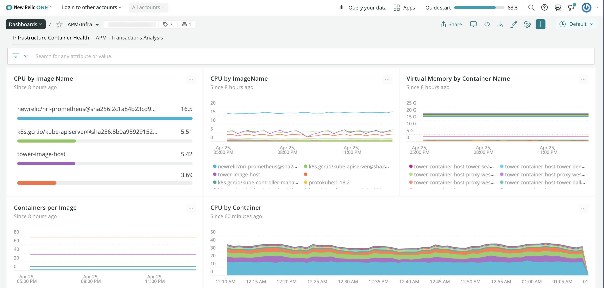

New Relic Oneは統合プラットフォームを提供します。ここではデータクエリやチャート作成などのコア機能を調べたり、UIでキューレートされた[オブザーバビリティ体験](/docs/full-stack-observability/monitor-everything/get-started-new-relic-monitoring-tools/get-started-full-stack-observability#h2-start-anywhere)を深く掘り下げたり、当社の[アラートおよび応用インテリジェンス](/docs/alerts-applied-intelligence)ツールを使用したりできます。New Relic Oneを使用すると、エコシステム全体ですべてのデータを確認および処理できます。

<figcaption>
  New Relic Oneにアクセスするには、**[one.newrelic.com](https://one.newrelic.com)**に移動します。または、EUデータセンターにデータをレポートする場合は**[one.eu.newrelic.com](https://one.eu.newrelic.com)**に移動します。
</figcaption>

<Callout variant="tip">
  本ドキュメントでは、New Relic Oneの機能がお客様のビジネスにとって重要である理由について詳しく説明します。先にスキップしたい場合は、[New Relicアカウントにサインアップ](https://newrelic.com/signup)してください。（永久無料です。）その後、[New Relicをインストール](/docs/using-new-relic/cross-product-functions/install-configure/install-new-relic/)したら、[データの処理](/docs/data-apis/get-started/nrdb-horsepower-under-hood)を開始できます。
</Callout>

## コンテキストを素早く理解 [#context]

システムの依存関係を理解できる複数の方法を用意しました。これで、全ての組み合わせを簡単に理解し、問題をトラブルシューティングできます。New Relic Oneは、複雑な内容を省略して貴社とチームにコネクテッドなビューを提供します。

<table>
  <thead>
    <tr>
      <th style={{ width: "250px" }}>
        以下を行う場合...
      </th>

      <th>
        これを使用
      </th>
    </tr>
  </thead>

  <tbody>
    <tr>
      <td>
        システムの全体像を表示し、パフォーマンスの詳細を掘り下げて把握します。
      </td>

      <td>
        * New Relic Oneの第一歩として、[New Relicエクスプローラー](/docs/new-relic-one/use-new-relic-one/core-concepts/entity-explorer-view-performance-across-apps-services-hosts)を使用します。アプリケーション、サービス、ホスト、コンテナなど、すべてのシステム[エンティティ](/docs/new-relic-one/use-new-relic-one/core-concepts/what-entity-new-relic)からパフォーマンスデータを観察、グループ化、フィルタリングします。
        * ソリューション内の各エンティティやアラートステータス、エンティティがどのように接続されているかを、詳細に可視化します。
        * [New Relic Navigator](/docs/new-relic-one/use-new-relic-one/core-concepts/new-relic-explorer-view-performance-across-apps-services-hosts/#view-navigator)を使用すると、すべてのエンティティの密度の高い概要が得られ、問題を一目で検知できます。
        * [New Relic Lookout](/docs/new-relic-one/use-new-relic-one/core-concepts/new-relic-explorer-view-performance-across-apps-services-hosts/#view-lookout)を使用して、予想される動作からの直近動作の乖離が起こっているエンティティを見つけます。
      </td>
    </tr>

    <tr>
      <td>
        エンティティのコンテキストを指定します。
      </td>

      <td>
        タグを使用して、監視内容の関係性とコンテキスト情報を図示します。エンティティへのタグ付けを慎重に行うことで、チームは複雑さと相互依存性のますます高まるシステムにおいて、必要なあらゆるデータを結び付けることができます。例：

        * 全てのエンティティに[タグ](/docs/tagging-use-tags-organize-group-what-you-monitor)を付けます、
        * 監視しているチームと全てのサービスに[APIを介してタグを作成](/docs/apis/graphql-api/tutorials/graphql-tagging-api-tutorial)します。
      </td>
    </tr>

    <tr>
      <td>
        貴社システムの各部分がどのように結びついているかを確認します。
      </td>

      <td>
        アップストリームおよびダウンストリームの依存関係を示す[サービスマップ](/docs/service-maps-new-relic-one)を確認します。
      </td>
    </tr>

    <tr>
      <td>
        モニターする全てからの集計したヘルスおよびアクティビティデータを可視化します。  

      </td>

      <td>
        あらゆるエンティティを[ワークロード](/docs/new-relic-one/use-new-relic-one/core-concepts/new-relic-workloads-create-groupings-entities)で、機能チーム志向、プロジェクト志向のグループ、あるいはその他の属性にグループ化し、モニターします。
      </td>
    </tr>

    <tr>
      <td>
        特定のデータをフェッチおよび分析します。
      </td>

      <td>
        クエリの作成および編集過程でデータ定義を表面化させる[クエリビルダー](/docs/introduction-chart-builder)を使用中に、より多くのコンテキストを取得します。
      </td>
    </tr>

    <tr>
      <td>
        ビジネス上のニーズを一目で確認できるビジュアルを作成します。
      </td>

      <td>
        固有のニーズに合わせて[カスタムダッシュボード](#dashboards)を調整できます。
      </td>
    </tr>

    <tr>
      <td>
        複雑な環境でサービスまたはダッシュボードを見つけます。
      </td>

      <td>
        * 統合検索で[すべてのアカウント](/docs/new-relic-one/use-new-relic-one/core-concepts/cross-account-features-security)を名前で検索します。
        * エクスプローラーをタグまたはテキストでフィルタリングします。
        * 組織全体にまたがるエンティティやダッシュボードなど、監視している全ての内容を1か所に表示します。
      </td>
    </tr>

    <tr>
      <td>
        サービスに関する全ての依存関係一覧を表示します。
      </td>

      <td>
        エンティティサマリの[依存関係](/docs/new-relic-one/use-new-relic-one/ui-data/new-relic-one-dependencies-page)タブを使用して、表示しているエンティティに関するすべての依存関係を確認します。
      </td>
    </tr>

    <tr>
      <td>
        分散システム全域を移動するアクティビティを追跡します。
      </td>

      <td>
        当社の[ディストリビューティッド（分散）トレーシング](/docs/distributed-tracing-new-relic-one)ソリューションを使用して、複雑な環境を解析します。
      </td>
    </tr>

    <tr>
      <td>
        API経由で全てがどのように繋がっているかを理解します。
      </td>

      <td>
        [NerdGraph GraphiQLエクスプローラー](/docs/apis/graphql-api/getting-started/introduction-new-relic-graphql-api)を使用して、貴社のエンティティ、タグ、関係性をすべて管理します。
      </td>
    </tr>
  </tbody>
</table>

## データのクエリを容易にする [#chart-builder]

上部のナビゲーションメニューの**データ参照**メニューでは、基本的なテレメトリデータ（メトリクス、イベント、ログおよびトレース）に簡単にアクセスできます。

UIでは場所に関係なく、**データをクエリ**を使用できます。クエリ言語の習熟度にかかわらず、カスタムのクエリとチャートを作成できます。

* [データエクスプローラー](/docs/query-your-data/explore-query-data/data-explorer/introduction-data-explorer)で、クエリを行わずにデータを参照します。
* NRQL（当社のクエリ言語）の専門知識を使用して、[クエリビルダー](/docs/specify-data-chart#use-advanced)でカスタムチャートを作成します。
* クエリビルダーで、[PromQLスタイルのクエリを実行](/docs/query-your-data/explore-query-data/query-builder/use-advanced-promql-style-mode-query-data)します。

<figcaption>
  **[one.newrelic.com](https://one.newrelic.com) > データをクエリ**：NRQLおよびPROMQLに似たクエリをビルド。
</figcaption>

## ダッシュボードの拡充 [#dashboards]

<figcaption>
  **[one.newrelic.com](https://one.newrelic.com) > Dashboards**：New Relic Oneのダッシュボードでは、情報の密集したカスタムビューから最も重要なデータを迅速に導きます。
</figcaption>

New Relic One[ダッシュボード](/docs/introduction-new-relic-one-dashboards)では、より優れた可視化を簡単に作成でき、カスタマイズするオプションが増えます。ダッシュボードには、次の機能が含まれます。

* [クエリビルダー](/docs/insights/nrql-new-relic-query-language/using-nrql/introduction-nrql)を使用することで、[NRQL](/docs/chart-builder/use-chart-builder/get-started/introduction-chart-builder)クエリを実行し、プラットフォーム内のあらゆる場所にチャートとダッシュボードを作成します。
* クイックアクセスCRUDメニューと編集オプションで、[チャートとダッシュボード管理](/docs/explore-dashboards-index)を容易にします。
* 高度なツールチップとズームイン機能でデータを調査およびコンテキスト化し、リアルタイムでシステムをモニターできます。
* ダッシュボードで属性とメトリクスを検索します。
* エージェント、インテグレーション、APIを使用して、ダッシュボードに[データを送信](/docs/insights/insights-data-sources/custom-data/send-custom-data-insights)します。
* .pdfとしてダッシュボードまたはチャートを共有、または外部サイトにチャートを埋め込みます。

## New Relic Oneで構築 [#build]

カスタムチャートとダッシュボードで現在の問題が解決しない場合、次のようなReact JavaScriptアプリケーションを構築するフレームワークを提供します。

* その他のNew Relicがモニターするデータとともに、[New Relic One](/docs/new-relic-one/use-new-relic-one/get-started/introduction-new-relic-one)プラットフォーム上に存在。
* 高度にカスタマイズされた可視化機能。
* New Relicが監視するエンティティ、またはサービスやAPIからのデータを問わず、必要なソースからデータを表示します。

コミュニティが構築したオープンソースアプリを使用し、自身のオープンソースアプリを作成できます。

詳細については、[New Relic Oneアプリケーション](/docs/new-relic-programmable-platform-introduction)を参照してください。

## 次のステップ [#what-next]

New Relic Oneでデータの探索を始めましょう！

* [基本的なUI機能](/docs/new-relic-one/use-new-relic-one/ui-data/basic-ui-features/)の使用を開始します。
* [データエクスプローラー](/docs/query-your-data/explore-query-data/data-explorer/introduction-data-explorer)でどのデータを使用できるかを確認します。
* [New Relicエクスプローラー](/docs/new-relic-one/use-new-relic-one/ui-data/new-relic-one-entity-explorer)でモニターしたエンティティを参照します。
* [NerdGraph API](/docs/apis/graphql-api/getting-started/introduction-new-relic-graphql-api)を使用してデータに[タグを追加](/docs/apis/graphql-api/tutorials/graphql-tagging-api-tutorial)します。
* [ダッシュボード](/docs/dashboards/new-relic-one-dashboards/get-started/introduction-new-relic-one-dashboards)の詳細を調べます。