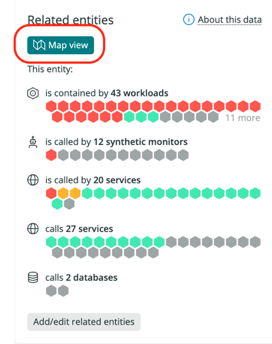

New Relic の automap 機能は、エンティティ中心のマップを表示し、相互に接続されたサービスを介して連鎖するインシデントのトラブルシューティングに役立ちます。automapでは、サービスに影響を与える依存関係を表示することで、問題がいつ、どこで発生したかを特定することができます。

automap を使用するには、New Relic のアカウントが必要です。 まだお持ちでない方は、こちら [無料アカウントにサインアップしてください。](https://newrelic.com/signup)

<figcaption>
  [ここでは、automapを使ったトラブルシューティングの例をご紹介します。](https://newrelic.com/signup)
</figcaption>

## [使用方法 [#how-works]](https://newrelic.com/signup)

[New Relic の automap は、あなたのアーキテクチャにおけるエンティティ間の関係を表示します。バージョン1では、automapに表示される関係は、サービス間の直接呼び出しに基づいています。例えば、APM サービスはグラフ上の頂点 (六角形) として表現され、ダイレクトコールはエッジ (線) として表現されます。これにより、これらのサービスがお互いにどのように依存しているかがわかります。](https://newrelic.com/signup)

[オートマップは、オートマップ起動後3時間以内に健康状態の変化があったソースエンティティに関連するエンティティのみを表示します。そのため、ソースエンティティに関連するすべてのエンティティが表示されるわけではありません。エンティティとリレーションシップ、およびテレメトリデータからエンティティプラットフォームがどのように両者を合成するかについては、 ](https://newrelic.com/signup)[エンティティ](https://docs.newrelic.com/docs/new-relic-one/use-new-relic-one/core-concepts/what-entity-new-relic/) および [リレーションシップ](https://docs.newrelic.com/docs/apis/nerdgraph/examples/nerdgraph-relationships-api-tutorial/) を参照してください。

<Callout variant="important">
  オートマップの自動展開ロジックは、エンティティの健康状態に依存しており、それは主にそのエンティティのアラートステータスによって決定されます。automapで最適なトラブルシューティングを行うためには、 [アラートが適切に設定されていることを確認してください](docs/new-relic-solutions/best-practices-guides/alerts-applied-intelligence/alerts-best-practices/) 。
</Callout>

## オートマップを開く [#open-automap]

Automapは、サポートされているエンティティタイプの任意の **Related entities** ペインに表示されます。

1. **エクスプローラー** で、フィルターを挿入してエンティティ/サービスを検索します（例： `アラート` ）。

2. エンティティ/サービスをクリックします。

3. **「Summary」ページ** で、右ペインの「 **Related entities」** に移動します。

4. クリック **地図表示**:

   

**Map view** ボタンは、以下のタイプのエンティティでのみ使用できます。

<table>
  <thead>
    <tr>
      <th style={{ width: "200px" }}>
        エンティティタイプ
      </th>

      <th>
        説明
      </th>

      <th>
        アイコン
      </th>
    </tr>
  </thead>

  <tbody>
    <tr>
      <td>
        apm|application
      </td>

      <td>
        New Relic APM エージェントがインストールされたアプリケーションサービス
      </td>

      <td style="text-align:center">
        
      </td>
    </tr>

    <tr>
      <td>
        ブラウザ、アプリケーション
      </td>

      <td>
        New Relic Browserエージェントでインストルメントされたブラウザアプリケーション
      </td>

      <td style="text-align:center">
        
      </td>
    </tr>

    <tr>
      <td>
        EXT|SERVICE
      </td>

      <td>
        OpenTelemetryで計測されたサービス（Pixieで計測されたサービスを含む
      </td>

      <td style="text-align:center">
        
      </td>
    </tr>

    <tr>
      <td>
        モバイル｜アプリケーション
      </td>

      <td>
        モバイルアプリにNew Relicエージェントを搭載
      </td>

      <td style="text-align:center">
        
      </td>
    </tr>

    <tr>
      <td>
        NR1｜ワークロード
      </td>

      <td>
        [ワークロード](https://docs.newrelic.com/docs/new-relic-one/use-new-relic-one/workloads/workloads-isolate-resolve-incidents-faster/)
      </td>

      <td style="text-align:center">
        
      </td>
    </tr>

    <tr>
      <td>
        SYNTH|MONITOR
      </td>

      <td>
        合成モニター
      </td>

      <td style="text-align:center">
        
      </td>
    </tr>
  </tbody>
</table>

## 歴史を探る

New Relic [maps in context](https://docs.newrelic.com/docs/new-relic-one/use-new-relic-one/ui-data/maps-in-context/) のような単純なナビゲーション・マップとは異なり、automap は、時間的に前後にスクロールすることができるので、問題がどのように発展したかを理解するのに役立ちます。また、興味のないエンティティを選別することもできます。

### タイムワープカーソル：時間をさかのぼる [#timewarp-cursor]

インシデントがいつ、どこで発生したかを正確に特定するには、 **Timewarp** カーソルを動かすだけで、マップ上のエンティティの健康状態の変化を確認できます。 **Timewarp** カーソルが表示されない場合は、オートマップの右上にある時計のアイコンをクリックしてください。履歴をスクロールすると、New Relic Lookout で異常な動作が検出された時期がわかります。

以下はスクロールの例で、 `FulfillmentService` と `BillingService` の間で問題が発生したことがわかります。

<Video
  type="wistia"
  id="xqj83ghoog"
/>

### コントロール。必要なものだけを見る [#filter-automap]

**コントロール** カーソルの下にあるメニューでは、 **Timewarp** オプションのチェックを外すことで、マップ上の特定のエンティティを強調しないようにすることができます。例えば、ヘルシーサービスを非表示にして、タイムラインを閲覧する際に警告を発するものだけに焦点を当てることができます。

ここでは、操作方法の一例をご紹介します。

<Video
  type="wistia"
  id="e15c99hsr2"
/>

## 地図記号 [#map-symbols]

ここでは、様々な健康状態のアイコンを表にしてみました。

<table>
  <thead>
    <tr>
      <th style={{ width: "200px" }}>
        稼働ステータス
      </th>

      <th style="text-align:center">
        アイコン
      </th>
    </tr>
  </thead>

  <tbody>
    <tr>
      <td>
        クリティカル
      </td>

      <td style="text-align:center">
        
      </td>
    </tr>

    <tr>
      <td>
        警告
      </td>

      <td style="text-align:center">
        
      </td>
    </tr>

    <tr>
      <td>
        鳴らない
      </td>

      <td style="text-align:center">
        
      </td>
    </tr>

    <tr>
      <td>
        未設定
      </td>

      <td style="text-align:center">
        
      </td>
    </tr>

    <tr>
      <td>
        アノマリー
      </td>

      <td style="text-align:center">
        
      </td>
    </tr>
  </tbody>
</table>