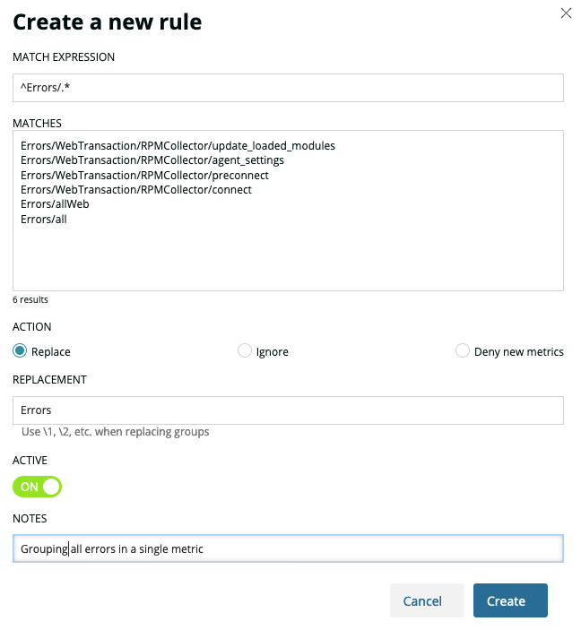

アプリケーションが、グループで管理した方が良いと思われる多くの個別のメトリクスを送信する場合があります。このようなケースの多くは、URL から名前が付けられた Web トランザクション・メトリクスで発生します。この問題の詳細については、 [Metric grouping issues](/docs/using-new-relic/cross-product-functions/troubleshooting/metric-grouping-issues) (MGIs)** を参照してください。**

高いカーディナリティを減らし、メトリックのグループ化の問題を防ぐために、New Relic はメトリックをグループ化またはフィルタリングするためのルール（正規化）をサポートしています。場合によっては、メトリックの数が著しく多いMGIが検出されると、ルールが自動的に作成され、プラットフォームをパフォーマンスの低下から保護します。

## メトリックの正規化ルール管理 [#create-rules]

高いカーディナリティのメトリクスから発生するノイズを処理する新しいルールを作成、管理するには、メトリクス正規化ツールを使用します。このツールは、 [New Relic Explorer](/docs/new-relic-one/use-new-relic-one/ui-data/new-relic-one-entity-explorer-view-performance-across-apps-services-hosts) の各サービスダッシュボードからアクセスできます。そこでは、左サイドバーで **Metric Normalization** を選択します。

ここでは、既存のルールを確認したり、新しいルールを作成したりすることができます。ルールを変更するにはルールをクリックし、新しいルールを作成するには **Create a new rule** をクリックします。ルールを設定するための新しいペインが表示されます。

<ImageSizing width="324px" height="352px"> </ImageSizing>利用可能なフィールドは以下の通りです。

* **Match expression**: ルールに含めたいすべてのメトリクスをグループ化するための正規表現を入力します。

* **Matches**: ここでは、上記の正規表現でマッチしたメトリクスのプレビューが表示されます。

* **アクション**: メトリクスに対して実行したいアクションです。

  * **Replace**: 正規表現でマッチしたメトリクスを **Replacement** フィールドに記述されている値で置き換えます。
  * **Ignore**: 正規表現にマッチしたメトリックを無視する。
  * **新しいメトリクスを拒否する**: 既に報告されたメトリクスのみを書き込み、正規表現にマッチしたものは無視する。

* **Replacement**: **Replace** が有効な場合のみ有効です。マッチしたメトリクスは、フィールドの値で置き換えられます。正規表現がグループをキャプチャしている場合、 `˶1` 、 `˶2` で、それぞれ `1` 、 `2` というグループのプレースホルダーを使用できます。

* **アクティブ**: ルールは削除できませんが、無効にすることができます。トグルをクリックして、ルールを有効または無効にします。ルールを削除したい場合は、New Relic のサポートに連絡してください。

* **Terminate**: 有効にすると、関連するパターンがマッチしたときに、ルールのウォーターフォールが終了します。

* **注意事項**: 規則に関する内部的な注意事項です。ルールには影響しません。

フィールドの設定が完了したら、 **Create** （既存のルールを編集する場合は **Edit** ）をクリックすると、 **Active** であれば、すぐにルールが適用されます。