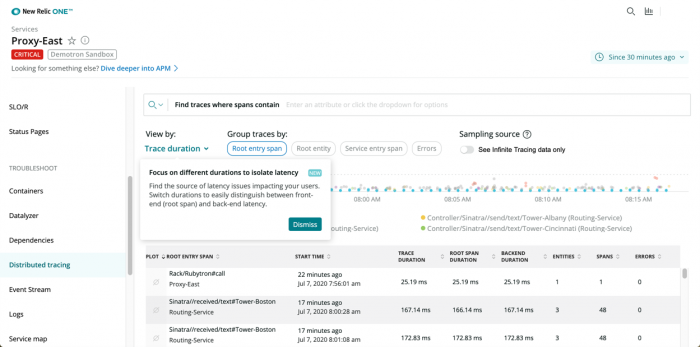

New Relicでの体験を改善するため、プラットフォームを大幅に改善しました。それにより、今後数週間で一部の古い機能のサポートが終了します。多くはすでに「提供終了」と一般に発表されています。今回の変更は、プラットフォームとのインタラクション改善への当社のコミットメントを表すものです。

テレメトリーデータをまとめ、フルスタックリソースをつなぎ、より完全なソフトウェアを構築できるような、1つのオブザーバビリティプラットフォームを提供することが、当社の使命です。そのため、当社はトラブルシューティングやアラート、データ可視化を簡単に行えるようにすることに注力しています。

変更の詳細や、新たな機能を活用して同じ目標を達成する方法についての役立つリンクとガイドは以下のとおりです。これまでどおり、当社はお客様を支援します。[Explorers Hub](https://discuss.newrelic.com/t/new-relic-feature-end-of-life-announcements/105772/)でつながるか、またはご質問はアカウントチームまでお寄せください。

## 以前の Kubernetes インテグレーション エージェントバージョン [#kubernetes]

統一された体験を改善するため、2020年8月12日水曜日以降、v1.7以前のバージョンを使用するKubernetesインテグレーションは推奨されません。`infrastructure.newrelic.com`ドメインでのUIは、今後ご利用いただけません。New Relic Oneでのみご利用いただけます。

* すでに[最新のKubernetes エージェントバージョン](/docs/release-notes/platform-release-notes/kubernetes-integration-release-notes)を使用している場合、対応は不要です。
* v1.7以前のバージョンを使用している場合、Kubernetesパフォーマンスデータを引き続き表示するには、インテグレーションを更新する必要があります。

ドキュメントに記載の説明に従い、最新バージョンのKubernetesインテグレーションにアップグレードします。

**<Icon style={{color: 'green'}} name="fe-info"/> 移行成功のための実行項目：**

1. [Kubernetes エージェントの非推奨通知](/docs/release-notes/platform-release-notes/kubernetes-integration-release-notes/deprecation-notice-kubernetes-v17-or-lower)を見直す。
2. [最新バージョンにKubernetesエージェントをアップグレード](/docs/integrations/kubernetes-integration/installation/kubernetes-installation-configuration#update)する標準の手順に従う。
3. New Relic One にある[KubernetesクラスタエクスプローラーUI](/docs/integrations/kubernetes-integration/understand-use-data/kubernetes-cluster-explorer)の詳細を調べる。

詳しくは、[Explorers Hubの投稿](https://discuss.newrelic.com/t/important-end-of-life-kubernetes-integrations-v1-7-or-older/102167)をご覧ください。

## 掲載ページとSyntheticラベルをモニター [#synthetics]

Syntheticモニターとラベルの体験を改善するため、両方をNew Relic Oneプラットフォームに移行しました。Syntheticsラベル管理用のREST APIを使用する場合、今後はタグのAPIを更新する必要があります。よいニュース：NerdGraphタグAPIを使用して、すべてのエンティティを単一のリクエストにまとめてグループ化できます。

以下の点の詳細については、[Explorers Hubの投稿](https://discuss.newrelic.com/t/end-of-life-notice-synthetics-labels-and-synthetics-apm-group-by-tag/103781)をご覧ください。

**<Icon style={{color: 'green'}} name="fe-info"/> 移行成功のための実行項目：**

<table>
  <thead>
    <tr>
      <th style={{ width: "200px" }}>
        Syntheticモニターの移行
      </th>

      <th>
        コメント
      </th>
    </tr>
  </thead>

  <tbody>
    <tr>
      <td>
        モニター索引リスト
      </td>

      <td>
        移行の完了後は、お客様は新しいSyntheticsエンティティの掲載ページを使用するための対応は必要ありません。2020年7月20日以後に、新たな体験を自動的にご利用いただけます。詳細については、[New Relic Oneのエクスプローラー](/docs/new-relic-one/use-new-relic-one/ui-data/new-relic-one-entity-explorer-view-performance-across-apps-services-hosts)が[Synthetics モニター索引](/docs/synthetics/new-relic-synthetics/pages/synthetics-monitors-index-access-your-monitors)をどのように置換するかについてご確認ください。
      </td>
    </tr>

    <tr>
      <td>
        既存の Synthetics ラベル
      </td>

      <td>
        UIに、SyntheticsモニターラベルをNew Relic Oneのタグに移行するオプションがすでに表示されている場合があります。このオプションを選択していない場合、当社で対応いたします。

        ラベルからタグへの自動的な移行は、2020年7月8日に開始されます。詳細については、[New Relic One でのタグ作成](/docs/new-relic-one/use-new-relic-one/core-concepts/tagging-use-tags-organize-group-what-you-monitor)が[Synthetics モニターのラベル](/docs/using-new-relic/user-interface-functions/organize-your-data/labels-categories-organize-apps-monitors)をどのように置換するかについてご確認ください。
      </td>
    </tr>

    <tr>
      <td>
        REST API
      </td>

      <td>
        [Synthetics ラベル管理用のREST API](/docs/apis/synthetics-rest-api/label-examples/use-synthetics-label-apis)を使用する場合、次の手順に従いタグのAPIを更新します。

        1. [NerdGraph](/docs/apis/nerdgraph/get-started/introduction-new-relic-nerdgraph)について詳細に調べる。

        2. [NerdGraphのタグを作成するAPIチュートリアル](/docs/apis/nerdgraph/examples/nerdgraph-tagging-api-tutorial)を見直す。

        3. [NerdGraphを使用するための個人APIキー](/docs/apis/nerdgraph/get-started/introduction-new-relic-nerdgraph#authentication)があることを確認する。

        4. [Explorers Hubの投稿](https://discuss.newrelic.com/t/end-of-life-notice-synthetics-labels-and-synthetics-apm-group-by-tag/103781)にある手順に従い（**「Synthetics APIからタグAPI（NerdGraph）にスクリプトを移行するには?」**セクションを探してください）、[api.newrelic.com/graphiql](https://api.newrelic.com/graphiql)にあるGraphiQLエクスプローラーで既存のタグを更新してください。

           NerdGraphはGraphQL APIであり、フェッチの過不足なしに、必要なデータだけをリクエストできるクエリ言語です。NerdGraphは、単一のリクエストで必要なすべてのデータを呼び出します。また、NerdGraphでは、簡単にAPIを経時的に進化させることもできます。
      </td>
    </tr>
  </tbody>
</table>

## Syntheticsでの「ロールアップ」 [#rollup]

複雑なソフトウェアシステムのオブザーバビリティを単一プラットフォームで提供するため、SyntheticsはNew Relic Oneに移行しています。このため、サービスやアプリケーション、モニターにタグ（またはラベル）を付けるのに使用するツールを一本化しています。提供終了となった特定の機能は、**モニターを検索**ドロップダウンメニューの下にある**ロールアップ**機能です。

New Relic Oneでは、ドロップダウンごとに個別の**ロールアップ**を使用せずに、タグを使用してモニターをグループ化できます。新たなSyntheticsモニターを表示するページを使用するには、変更は不要です。2020年7月20日以後に、新たな体験をご利用いただけます。

ドキュメント：

* [New Relic Oneでのタグ作成](/docs/new-relic-one/use-new-relic-one/core-concepts/tagging-use-tags-organize-group-what-you-monitor)が[Syntheticsモニターのラベル](/docs/using-new-relic/user-interface-functions/organize-your-data/labels-categories-organize-apps-monitors)を置換。
* [New Relic Oneのエクスプローラー](/docs/new-relic-one/use-new-relic-one/ui-data/new-relic-one-entity-explorer-view-performance-across-apps-services-hosts)が[Syntheticsモニター索引](/docs/synthetics/new-relic-synthetics/pages/synthetics-monitors-index-access-your-monitors)を置換。

**<Icon style={{color: 'green'}} name="fe-info"/> 移行成功のための実行項目：**

現在 Synthetics ロールアップを使用している場合:

Explorers Hubの投稿にある手順に従い、サポートが終了するロールアップを再び作成します。

1. ロールアップのサポート終了についての[Explorers Hubの投稿](https://discuss.newrelic.com/t/end-of-life-notice-synthetics-labels-and-synthetics-apm-group-by-tag/103781)に移動します。特に、投稿の**FAs**セクションで、**New Relic Workloadsを使用して、アプリケーションとモニターのグループを可視化する方法**を探します。
2. Explorers Hubの投稿にある手順に従い、サポートが終了するロールアップを再び作成します。

## 組み込みチャート

冗長性を減らし体験をより統一したものとするため、[組み込みチャート](/docs/apm/apm-ui-pages/features/embed-charts-external-webpages)機能は、New Relic Oneの**Get chart**で置換されます。現在使用しておりNew Relicドメイン外でホストされている組み込みチャートは、引き続き機能します。変更には次のものが含まれます：

* チャートを生成するチャートメニューの名前は、**組み込み**から**チャートを取得**リンクに変更されます。
* 今後サポートされないチャートについては、**組み込み**は**このチャートでサポートされていないチャートリンクを取得**で置換されます。
* 組み込まれたすべてのチャートリンクを表示するAPM UIページは、今後ご利用いただけません。

ドキュメント：

* [Explorers Hubの投稿](https://discuss.newrelic.com/t/change-to-shareable-charts-in-apm-embedded-charts/102240)
* New Relic Oneの[高度なクエリビルダー機能](/docs/chart-builder/use-chart-builder/use-charts/use-your-charts#get-chart-link)は、[EOLとなった組み込みチャート機能](/docs/apm/apm-ui-pages/features/embed-charts-external-webpages)を置換します。

**<Icon style={{color: 'green'}} name="fe-info"/> 移行成功のための実行項目：**

一般にアクセス可能なリンクを生成し、内部および外部のウェブサイトに追加できます。ユーザーは、チャートのリンクを表示するのに、New Relicにログインする必要はありません。[チャートの組み込み](/docs/chart-builder/use-chart-builder/use-charts/use-your-charts#get-chart-link)機能は引き続き利用できますが、（UIからは削除される）**Embed**をクリックする代わりに、（同じ場所にある）**Get chart link**をクリックします。これにより、さらに広範なチャート表示と、サポートが終了する機能を有するリンクを取得できます。

New Relic One での表示の例は次のとおりです:

* 作成した既存のチャートを**組み込み**に変更するには、New Relic One の**チャートのリンクを取得**を使用して新規のURLを作成し、使用するウェブページに挿入します。
* 組み込みチャートがあり、メッセージ**チャートのリンクの取得は、このチャートではサポートされていません**が表示される場合、別のクエリを実行し、利用できるチャートタイプを選択してから、**組み込み**を選択します。

## レガシーのディストリビューティッド（分散）トレーシングUI [#distributed-tracing]

ユーザー体験を標準化するため、`rpm.newrelic.com`ドメイン内にある古いディストリビューティッド（分散）トレーシングUIは廃止されます。提供終了となったものと同じUIでサポートされたすべての機能により卓越した体験を提供するNew Relic Oneを通じて、ディストリビューティッド（分散）トレーシングにアクセスできます。

ドキュメント：

* New Relic Oneでの[グローバルおよびサービス特定のディストリビューティッド（分散）トレーシング表示](/docs/understand-dependencies/distributed-tracing/ui-data/additional-distributed-tracing-features-new-relic-one#find-data)
* [廃止されたディストリビューティッド（分散）トレーシングUI](/docs/apm/distributed-tracing/ui-data/understand-use-distributed-tracing-data)

**<Icon style={{color: 'green'}} name="fe-info"/> 移行成功のための実行項目：**

対応は不要ですが、新規のUIの準備を行うことはできます。

<figcaption>
  New Relic One のディストリビューティッド（分散）トレーシングのページでは、すでにご存じの機能を活用しています。
</figcaption>

* 高度な[New Relic Oneのディストリビューティッド（分散）トレーシング機能](/docs/understand-dependencies/distributed-tracing/ui-data/additional-distributed-tracing-features-new-relic-one)についての理解を深めます。これには、アカウント間のトレースの詳細による検索、フィルタ機能や、[NerdGraph API](/docs/apis/nerdgraph/examples/nerdgraph-distributed-trace-data-tutorial)によるクエリオプション、（期間など重要な値のトレース分布を迅速に理解するのに役立つ）ヒストグラムチャートが含まれます。
* ヘッドベースのサンプリング（標準のディストリビューティッド（分散）トレーシング）とテールベースのサンプリング（無限トレーシング）で利用可能な、[サンプリングオプションをトレース](/docs/understand-dependencies/distributed-tracing/get-started/how-new-relic-distributed-tracing-works#sampling)を見直します。

## 違反の変更 [#violations]

ユーザー体験を統一したものとするため、当社ではBrowser、モバイル、Syntheticsのモニター違反を廃止し、New Relic Oneと同様のものに置き換えています。New Relic Oneユーザーは、次のオプションの1つを使用して、違反にアクセスできます。

* New Relic OneのメインUIの**アラートとAI**リンクをクリックする。
* エンティティリストのアクティビティストリームを見直す。
* `操作`および`警告`、`重要`違反の新規インジケータを通じて、特定のエンティティ内からアラートの詳細を表示する。

`one.newrelic.com`に移動すると、アラートの詳細が自動的に表示されます。

ドキュメント：

* [インテリジェンスの応用とNew Relic Oneでのアラート](/docs/new-relic-one/use-new-relic-one/new-relic-ai/introduction-new-relic-ai)
* [Browserアラート違反](/docs/browser/new-relic-browser/configuration/view-browser-apps-alert-information)（New Relic Oneに移行）
* [Mobile違反](/docs/mobile-monitoring/new-relic-mobile/getting-started/alert-information-new-relic-mobile#violations)（New Relic Oneに移行）
* [Monitor違反](/docs/synthetics/new-relic-synthetics/pages/view-monitors-alert-information)（New Relic Oneに移行）

**<Icon style={{color: 'green'}} name="fe-info"/> 移行成功のための実行項目：**

対応は不要ですが、新規のUIの準備を行うことはできます。

<figcaption>
  New Relic One の一部のエンティティのアラート違反についての詳細情報の例は次のとおりです。
</figcaption>

<table>
  <thead>
    <tr>
      <th style={{ width: "200px" }}>
        New Relic Oneでの違反の詳細
      </th>

      <th>
        コメント
      </th>
    </tr>
  </thead>

  <tbody>
    <tr>
      <td>
        全体ビュー
      </td>

      <td>
        New Relic Oneのホームページで、エンティティリストは、アラート違反のある**すべての**エンティティの活動を表します。エンドユーザーやモバイル、モニター違反の個別のリストに移動する必要はなくなりました。
      </td>
    </tr>

    <tr>
      <td>
        高度なトラブルシューティングツール
      </td>

      <td>
        New Relic Oneのホームページで、**Alerts & AI**（Applied Intelligence）リンクも表示されます。ここから、アノマリー検知やインシデント相関、ノイズ軽減により、迅速に問題を解決できます。
      </td>
    </tr>

    <tr>
      <td>
        特定の違反
      </td>

      <td>
        一部のエンティティで、違反を`通常`や`警告`、`重大`として識別する新しいボタンや、エンティティのメタデータ、インシデントについての有用な詳細が表示されます。
      </td>
    </tr>
  </tbody>
</table>

## 接続エージェントのページ [#connected-agents]

接続されたエージェントの検索がこれまで以上に簡単になりました!New Relic Oneの**Query your data**リンクで行えます。[この`NrDailyUsage`クエリ](https://discuss.newrelic.com/t/replicate-the-connected-agents-report-in-insight/77575)を実行し、接続されたエージェントとホストのリストを取得します。以前の**接続されたエージェント**のページは使用停止となり、削除されます。

ドキュメント：

* [Explorers Hubの投稿](https://discuss.newrelic.com/t/replicate-the-connected-agents-report-in-insight/77575)
* [NRQLクエリツール](/docs/query-your-data/nrql-new-relic-query-language/query-tools)
* [NrDailyUsageデータ定義](/attribute-dictionary/?event=NrDailyUsage)

**<Icon style={{color: 'green'}} name="fe-info"/> 移行成功のための実行項目：**

接続されたアプリやホストのクエリを行うには、New Relic OneのクエリビルダやGraphQL APIなどの既存の[NRQLクエリツール](/docs/query-your-data/nrql-new-relic-query-language/query-tools)を使用できます。

**推奨事項：**アプリやホストに関する包括的なデータを検索する最善の結果を得るには、New Relic Oneの[クエリビルダ](/docs/chart-builder/use-chart-builder/get-started/introduction-chart-builder#specify-data)または[NerdGraph API](/docs/apis/nerdgraph/examples/nerdgraph-nrql-tutorial)を使用します。

## New Relic One で使用しないアプリ [#inactive-apps]

2020年6月8日以降、New Relic Oneは、93日間データを報告していない APMアプリケーションの表示を継続しません。パブリッシュされた APM [データ保持期間ガイドライン](/docs/accounts/accounts/data-management/overview-data-retention-components#apm)に適合するよう、データを報告していないアプリケーションは、New Relic UI 内で90日間利用できます。

90日後に、このアプリケーションはUIから削除されます。ただし、主要なメトリクスはサブスクリプションレベルに基づいて、[New Relic REST API](/docs/apis/rest-api-v2/getting-started/introduction-new-relic-rest-api-v2)を介して引き続き利用できます。これは、アプリケーション名は、[REST APIエクスプローラー](/docs/apis/rest-api-v2/api-explorer-v2/introduction-new-relics-rest-api-explorer)を介して恒久的に削除されるまで保持されることによります。

**<Icon style={{color: 'green'}} name="fe-info"/> 移行成功のための実行項目：**

データのレポートを以後行わない古いアプリのアプリ名を再利用する場合：

* [REST API v2](/docs/apis/rest-api-v2/application-examples-v2/summary-data-examples-v2)または[APIエクスプローラー](https://api.newrelic.com/)を使用して、アプリIDや名前、稼働ステータス（灰色を検索）、最終報告日などを含む、要旨データを取得します。
* アプリの[エージェントをアンインストール](/docs/using-new-relic/cross-product-functions/install-configure/uninstall-agent)します。
* REST APIまたはAPIエクスプローラーを使用して、アプリを削除します。

## Synthetics モニターアラート通知と条件 [#synthetics-alerts]

ユーザー体験を統一したものとするため、当社ではSyntheticsモニター[アラート通知](/docs/synthetics/new-relic-synthetics/using-monitors/alerting-synthetics)と[条件違反](/docs/synthetics/new-relic-synthetics/pages/view-monitors-alert-information)を廃止します。このページは、New Relic Oneでの新たなSyntheticsモニターの概要を記載したページに代わります。この新しい体験により、モニターのオープン違反とアラート条件を単一のビューで確認できるため、違反やアラート条件を表示するために複数のタブを開く必要がなくなります。

**<Icon style={{color: 'green'}} name="fe-info"/> 移行成功のための実行項目：**

対応は不要ですが、次を含む、[New Relicアプライドインテリジェンス](/docs/new-relic-one/use-new-relic-one/new-relic-ai/introduction-new-relic-ai)についての文書を見直して、新たなUIに備えることもできます。

* New Relic Alerts ですでになじみのあるアラート機能など
* ノイズを減らし、インシデント解決プロセスの時間を短縮するIncident Intelligence
* 関連する問題を明らかにし、原因について自動的に説明を行うProactive Detection