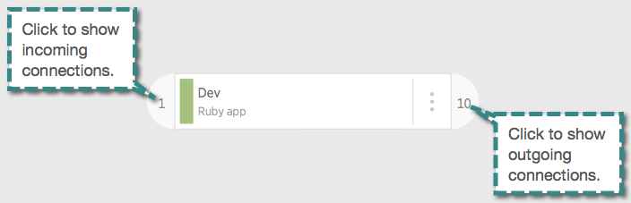

ここでは、レガシーAPMのサービスマップ機能を使用して、サービスマップを作成、カスタマイズ、および使用する方法について説明します。現行のサービスマップ機能の使用方法については、 [サービスマップの使用方法](/docs/understand-dependencies/understand-system-dependencies/service-maps/how-use-service-maps) を参照してください。

## 要件 [#requirements]

APM のレガシーサービスマップ機能は、お使いの New Relic エージェントのバージョンによって異なります。

<table>
  <thead>
    <tr>
      <th width={200}>
        **機能**
      </th>

      <th>
        **要件**
      </th>
    </tr>
  </thead>

  <tbody>
    <tr>
      <td>
        アプリの視認性
      </td>

      <td>
        アプリがサービスマップに表示されるためには、以下のいずれかの条件が満たされている必要があります。

        * アプリは、 [ディストリビュートトレーシングに必要な最小のエージェントバージョンを持ち、](/docs/understand-dependencies/distributed-tracing/enable-configure/enable-distributed-tracing) ディストリビュートトレーシングが有効になっている必要があります。注： [モバイルモニタリングはまだ分散型トレーシングをサポートしておらず、分散型トレーシングが有効になっているアプリとの関係は表示されません](/docs/apm/distributed-tracing/getting-started/transition-guide-distributed-tracing#maps-no-browser-mobile) 。
        * アプリには、クロスアプリトレーシングに必要な [最小限のAPMエージェントのバージョンがあり、クロスアプリトレーシングが有効になっている必要があります。](/docs/apm/transactions/cross-application-traces/troubleshooting-cross-application-tracing#agents)
        * 

        
      </td>
    </tr>

    <tr>
      <td>
        ホストとインスタンスの可視性
      </td>

      <td>
        特定のホスト、インスタンス、およびデータベース情報の種類を表示するには、エージェントが [APM データベースおよびインスタンス機能](/docs/apm/applications-menu/features/analyze-database-instance-level-performance-issues#compatibility) と同じ最小エージェントバージョンを満たし、互換性のあるデータベースドライバのいずれかを使用する必要があります。
      </td>
    </tr>

    <tr>
      <td>
        データベースのみの表示
      </td>

      <td>
        APMのサービスマップ機能には、ディープ、ホスト、インスタンスレベルの表示をオプトアウトする機能があります。 しかし、サービスマップ **でデータベースをインスタンスレベルの詳細を表示せずに見るためには、やはり [**データベースとスロークエリ** 機能](/docs/apm/applications-menu/monitoring/databases-slow-queries-page#availablity) と同じ最小エージェントバージョンを満たす必要があります。**

        ****
      </td>
    </tr>
  </tbody>
</table>

## 地図の作成 [#creating-maps]

APMのサービスマップ機能は、デフォルトのマップや、自動的にデフォルトのマップを構築するアーキテクチャの提案を提供することで、最初のマップの作成を支援します（10個以上のレポートアプリがある場合）。これらの提案されたマップを見るには、 **[one.newrelic.com](https://one.newrelic.com) > その他> サービスマップ> 提案されたマップ**.

新しいマップを作成するには

1. 次のうち1つを行います。

   * ゼロからのスタートです。Go to **[one.newrelic.com](https://one.newrelic.com) > More> サービスマップ> マップリスト> Create new map <Icon name="fe-plus-circle"/>**.
   * 既存の地図をコピーします。Go to **[one.newrelic.com](https://one.newrelic.com) > More> Service maps> (select a map)> Save as new**.

2. 地図に名前をつける。

3. [必要に応じて、マップ上のノード](#select-arrange-group-nodes) を再配置したり、グループ化したり、 [ノード](#add-nodes) を追加したりします。

<Callout variant="important">
  これまでは、プライベートなサービスマップを持つことができました。現在は、すべてのユーザーが、アカウント内の既存または新規のサービスマップをすべて表示、編集、削除することができます。
</Callout>

## マップの保存と名前の変更 [#save-rename-share-maps]

ここでは、マップの保存と名前の変更についてご紹介します。

<CollapserGroup>
  <Collapser
    id="saving"
    title="保存"
  >
    * マップへの変更を保存するには、 **Save** を選択します。
    * 現在のマップのコピーを作成するには、 **Save as new** を選択します。
  </Collapser>

  <Collapser
    id="renaming"
    title="名前の変更"
  >
    マップの名前を変更するには

    1. Go to **[one.newrelic.com](https://one.newrelic.com) > More> サービスマップ> (select a map)**.

    2. マップ名の横にある鉛筆

       <Icon name="fe-edit-2"/>

       のアイコンを選択します。

    3. 名前を変更して、 **保存** を選択します。
  </Collapser>
</CollapserGroup>

## マップにノードを追加・削除 [#add-nodes]

を作成するか、マップを保存した後、ノードを追加してマップを構築します。ノードは、ノードの種類によってマップに追加される内容が異なります。

マップから任意のノードを削除するには、ノードの上にマウスを置いて、削除 **X** アイコンを選択します。

<CollapserGroup>
  <Collapser
    id="app-browser-db-nodes"
    title="アプリケーションとモバイルアプリ"
  >
    他のノードを追加するには、アプリケーションやモバイルアプリのノードをマップに追加する必要があります。ノードは、選択するとマップに追加され、接続されます。チェックマーク <Icon name="fe-check"/>アイコンは、そのノードがすでにマップ上にあることを意味します。

    マップにアプリを追加するには

    1. Go to **[one.newrelic.com](https://one.newrelic.com) > More> サービスマップ> （地図を選択）> アプリ／サービス**.
    2. **App/Service** リストから任意のアプリケーションを選択します。
    3. [必要に応じて、](#select-arrange-group-nodes) を再配置したり、グループ化したりします。
  </Collapser>

  <Collapser
    id="connected-nodes"
    title="ブラウザ、データベース、外部サービス、コネクテッド・アプリ"
  >
    New Relic の UI では、プロセス外のサービスは [Web 外部](/docs/using-new-relic/welcome-new-relic/get-started/glossary#web-external) またはバックグラウンド外部データと呼ばれます。ブラウザアプリ、データベース、外部サービス、その他の接続アプリをマップに追加するには

    1. 着信または発信の接続ウィジェットを選択します。

    2. 接続のリストから、アプリやサービスにマウスオーバーし、プラス <Icon name="fe-plus"/>のアイコンを選択します。

    3. [必要に応じて](#select-arrange-group-nodes) を再配置する。

       
  </Collapser>

  <Collapser
    id="custom-nodes"
    title="カスタムノード"
  >
    カスタムノードをマップに追加するには、次のようにします。

    1. Go to **[one.newrelic.com](https://one.newrelic.com) > More> サービスマップ> （地図を選択）> アプリ／サービス**.

    2. **App/Service** リストから、  **Create custom node** を選択します。

    3. ノードに名前を付けます。

    4. 接続を追加します。左（着信用）または右（発信用）の矢印 <Icon name="fe-arrow-right"/>アイコンを選択します。次に、ターゲットノードのプラス <Icon style={{color: '#B9D7B6'}} name="fe-plus-circle"/>アイコンを選択します。

    5. Select **Save**.

    6. [必要に応じて](#select-arrange-group-nodes) を再配置する。

       カスタムノードの接続を追加または削除するには、次のようにします。

    7. カスタムノードの上にマウスを置き、鉛筆 <Icon name="fe-edit-2"/>のアイコンを選択します。

    8. 左（受信用）または右（送信用）の矢印 <Icon name="fe-arrow-right"/>アイコンを選択します。

    9. 接続を追加するには、プラス <Icon style={{color: '#B9D7B6'}} name="fe-plus-circle"/>のアイコンを選択します。

    10. 接続を削除するには、マイナス <Icon style={{color: '#D75968'}} name="fe-minus-circle"/>のアイコンを選択します。

    11. Select **Save**.

        
  </Collapser>
</CollapserGroup>

## マップの移動 [#moving-map]

パンニングやズームイン、ズームアウトで地図を移動することができます。

<table>
  <thead>
    <tr>
      <th style={{ width: "200px" }}>
        **以下を行う場合...**
      </th>

      <th>
        **操作...**
      </th>
    </tr>
  </thead>

  <tbody>
    <tr>
      <td>
        マップをパンする
      </td>

      <td>
        * パン

          <Icon name="fe-move"/>

          モードで、クリックしてドラッグします。

        * ドラッグセレクト

          <ImageSizing width="22px"> </ImageSizing>

          モードでは、 **Alt** キーを押しながら、クリックしてドラッグします。
      </td>
    </tr>

    <tr>
      <td>
        ズームイン/アウト
      </td>

      <td>
        いずれのモードでも、マウスのホイールをスクロールさせることで、ズームイン、ズームアウトが可能です。
      </td>
    </tr>

    <tr>
      <td>
        マップ全体を [トラフィックライト](/docs/data-analysis/user-interface-functions/view-your-data/service-maps-visualize-monitor-apps-entire-architecture#traffic-lights) モードで表示します。
      </td>

      <td>
        ノードの詳細がフェードアウトし、健康状態の色に変わるまでズームアウトします。
      </td>
    </tr>

    <tr>
      <td>
        トラフィック・ライト・ビューのオン／オフを切り替える
      </td>

      <td>
        **Views** を選択し、次に **Traffic light mode** を選択します。
      </td>
    </tr>

    <tr>
      <td>
        すべてのノードとその依存関係を表示
      </td>

      <td>
        選択 **自分の環境を発見する**.
      </td>
    </tr>

    <tr>
      <td>
        ノードからより詳細な情報へのドリルダウン
      </td>

      <td>
        [標準的なUI機能を使用](/docs/apm/new-relic-apm/ui-functions/standard-dashboard-features#drilldown).
      </td>
    </tr>
  </tbody>
</table>

## ノードの選択、配置、グループ化 [#node-groups]

ノードをクリックすると、そのノードが選択され、パフォーマンスの概要が表示されます。また、複数のノードを一度に選択して、グループ化したり、グループ化解除したりすることもできます。

<CollapserGroup>
  <Collapser
    id="selecting-nodes"
    title="ノードの選択"
  >
    1つのノードを選択するには、そのノードをクリックします。複数のノードを選択するには

    * drag-select <ImageSizing width="22px"> </ImageSizing>アイコンをクリックすると、ドラッグセレクトモードに切り替わります。マウスをクリック＆ドラッグして、選択したいノードの周りに四角を描きます。

      または

    * **Shift** キーを押しながら、選択したい各ノードをクリックします。
  </Collapser>

  <Collapser
    id="arranging-nodes"
    title="ノードの配置"
  >
    <Callout variant="caution">
      オートアレンジは元に戻すことができません。まず、地図のコピーを保存することを検討してください。
    </Callout>

    * ノードをマップ上に配置するには、1つまたは複数のノードを選択して、マップ上のスナップポイントにドラッグします。
    * すべてのノードと接続を自動的に整理するには、 **Auto-arrange map** を選択します。
  </Collapser>

  <Collapser
    id="group-nodes"
    title="ノードのグループ化とグループ解除"
  >
    <table>
      <thead>
        <tr>
          <th style={{ width: "200px" }}>
            **以下を行う場合...**
          </th>

          <th>
            **操作...**
          </th>
        </tr>
      </thead>

      <tbody>
        <tr>
          <td>
            地図上でノードをグループ化する
          </td>

          <td>
            2つ以上のノードを選択し、 <ImageSizing width="22px"> </ImageSizing>**Create group**.
          </td>
        </tr>

        <tr>
          <td>
            新しいグループの名前
          </td>

          <td>
            グループにマウスオーバーして、鉛筆 <Icon name="fe-edit-2"/>のアイコンを選択します。
          </td>
        </tr>

        <tr>
          <td>
            既存のグループの名称変更
          </td>

          <td>
            鉛筆 <Icon name="fe-edit-2"/>のアイコンを選択します。
          </td>
        </tr>

        <tr>
          <td>
            グループからノードを削除する
          </td>

          <td>
            グループを選択し、削除したい項目ごとにマイナス <Icon name="fe-minus-circle"/>のアイコンを選択します。

            
          </td>
        </tr>
      </tbody>
    </table>
  </Collapser>
</CollapserGroup>

## ダッシュボードにマップやチャートを追加 [#dashboards]

<figcaption>
  **[one.newrelic.com](https://one.newrelic.com) > ダッシュボード**: ダッシュボードにサービスマップを追加することで、報告されているデータとそのデータがどこから来ているのかというコンテキストを提供します。
</figcaption>

レガシーサービスマップは、 [ダッシュボード](/docs/dashboards/new-relic-one-dashboards/get-started/introduction-new-relic-one-dashboards) に追加することができます。たとえば、複数のエンティティのパフォーマンス指標を紹介するダッシュボードがある場合、サービスマップをダッシュボードに追加することで、すべてのエンティティがどのように関連しているかを示し、システムに関する追加のコンテキストを提供することができます。

ダッシュボードにサービスマップを追加するには

1. [one.newrelic.com](https://one.newrelic.com) にアクセスし、 **エクスプローラー** を選択します。
2. インデックスからエンティティを選択します。
3. **サービスマップ** をクリックしてください。
4. **ダッシュボードへの追加** をクリックします。マップを追加するダッシュボードを検索します。

## マップの削除 [#deleting]

マップを削除するには

1. Go to **[one.newrelic.com](https://one.newrelic.com) > More> サービスマップ> (select a map)**.

2. マップ名の鉛筆

   <Icon name="fe-edit-2"/>

   アイコンを選択します。

3. Select **Delete map**.

## 外部サービスの問題点の把握 [#identify-external-issues]

アプリが New Relic が監視していない [外部サービス](/docs/using-new-relic/welcome-new-relic/get-started/glossary#web-external) に接続している場合 (たとえばサードパーティの API)、New Relic はそのサービスの応答時間をベースラインにするために 1 週間監視します。New Relic が統計的に有意な数のデータポイント (100 以上) を収集できた場合、New Relic は現在の応答時間をこのベースラインと比較し、これを健康状態の指標の設定に使用します。

* <Icon
    style={{color: '#A5C27C'}}
    name="fe-square"
  />

  緑色。サービスからの応答時間がベースラインの1.75倍以下であること。

* <Icon
    style={{color: '#FCB95D'}}
    name="fe-square"
  />

  黄色。サービスからの応答時間がベースラインの1.75倍よりも長い。

* <Icon
    style={{color: '#D75966'}}
    name="fe-square"
  />

  赤。サービスからの応答時間がベースラインの2.5倍よりも長い。

* <Icon
    style={{color: '#A8A8A8'}}
    name="fe-square"
  />

  グレー：アラートは、健康状態を判断するのに十分なデータを持っていないと判断しました。

* <Icon
    style={{color: '#A67EAA'}}
    name="fe-square"
  />

  紫です。アラートは、健康状態を判断するのに十分なデータを持っているかどうか、まだ結論を出すことができません。

## 複雑なアーキテクチャーの可視化と監視 [#features]

サービスマップを使用して、複雑なアーキテクチャを視覚化し、監視することができます。最新の機能を紹介するチュートリアルは、サービスマップの質問アイコンを選択すると表示されます。

<CollapserGroup>
  <Collapser
    id="nodes"
    title="ノード"
  >
    ノードは、マップを構成する基本的な要素です。 以下のような様々なタイプのノードを追加することができます。

    <table>
      <thead>
        <tr>
          <th width={250}>
            ノードタイプ
          </th>

          <th>
            説明
          </th>
        </tr>
      </thead>

      <tbody>
        <tr>
          <td>
            New Relic [APM](/docs/apm/new-relic-apm/getting-started/welcome-new-relic-apm)-監視対象のアプリ
          </td>

          <td>
            [アプリ](/docs/apm/applications-menu/monitoring/customize-service-maps#app-browser-db-nodes) をマップに追加すると、データベース、ブラウザアプリ、アウトオブプロセスサービス、その他のインスツルメンテッドアプリへの接続が表示されます。(New Relic UI では、あなたのアウトオブプロセスサービスは、 [ウェブ外部](/docs/using-new-relic/welcome-new-relic/get-started/glossary#web-external) またはバックグラウンド外部データとも呼ばれています)。
          </td>
        </tr>

        <tr>
          <td>
            [ブラウザ](/docs/browser/new-relic-browser/welcome-new-relic-browser/new-relic-browser) アプリ
          </td>

          <td>
            各アプリが自動的に検出され、 [が追加されます。](/docs/apm/applications-menu/monitoring/customize-service-maps#connected-nodes) は、「着信接続」ウィジェットを介して表示されます。APMアプリ にリンクされたブラウザアプリ [のみを表示します（スタンドアロンのブラウザアプリはサポートされていません）。](/docs/browser/new-relic-browser/installation-configuration/adding-apps-new-relic-browser#options)

            
          </td>
        </tr>

        <tr>
          <td>
            New Relic [モバイルモニタリング](/docs/mobile-monitoring/new-relic-mobile/getting-started/new-relic-mobile) アプリ
          </td>

          <td>
            自動的に検出され、 [追加された](/docs/apm/applications-menu/monitoring/customize-service-maps#connected-nodes) アプリ/サービスリストパネル [を介して](#app-map-pickers) 。
          </td>
        </tr>

        <tr>
          <td>
            [外部サービス](/docs/apm/applications-menu/monitoring/external-services-dashboard)
          </td>

          <td>
            サービスマップは、外部サービスを自動的に検出し（ [コネクションウィジェットに表示されます](#connections) ）、アプリの外部依存関係を追跡し、 [それらの接続の健全性を監視します](#identify-external-issues) 。
          </td>
        </tr>

        <tr>
          <td>
            カスタムノード
          </td>

          <td>
            [app/service list panel](#app-map-pickers) 経由でカスタムノード を追加して、New Relic で自動的にインスツルメントされないアプリやサービス（ロードバランサー、実装計画など）を含めることができます。
          </td>
        </tr>

        <tr>
          <td>
            グループノード
          </td>

          <td>
            [グループノード](#arrange-group) は、複数の他のノードを含みます。アプリの場合、グループノードは、グループ内のすべてのノードの要約された [健康状態インジケータ](/docs/alerts/new-relic-alerts-beta/getting-started/alerts-glossary#health-status) を含みます。
          </td>
        </tr>
      </tbody>
    </table>
  </Collapser>

  <Collapser
    id="arrange-group"
    title="ノードの配置とグルーピング"
  >
    ノードをクリックしてドラッグすると、 [マップ上を移動することができます。](/docs/apm/applications-menu/monitoring/customize-service-maps#select-arrange-group-nodes) アーキテクチャーの表示をカスタマイズすることができます。

    アプリノードは、関連するアプリやサービスをよりよく整理するために、1つのノードにグループ化することもできます。グループ化されたノードには、グループ内のすべてのノードの要約された [健康状態インジケータ](/docs/alerts/new-relic-alerts-beta/getting-started/alerts-glossary#health-status) が含まれます。グループからアイテムを削除するには、グループにマウスオーバーして、鉛筆 _鉛筆_ アイコンを選択した後、マイナス _マイナスの円_ アイコンを選択してください。

    
  </Collapser>

  <Collapser
    id="connections"
    title="着信接続と発信接続"
  >
    サービスマップは、エンティティ間のHTTPコールに基づいて、受信および送信される接続を自動的に検出します。ノードにマウスオーバーすると、そのノードの接続がハイライト表示されます。各ノードの末尾にあるウィジェットには、そのノードの接続数が表示されます。これらのウィジェットをクリックすると、関連するエンティティをマップに追加することができます。

    
  </Collapser>

  <Collapser
    id="info-panel"
    title="パフォーマンスサマリーの表示"
  >
    アプリをクリックすると、そのアプリの過去30分間のパフォーマンスが表示されます。チャートのデフォルトは、 **応答時間** ですが、利用可能な **Apdex** 、 **Throughput** 、 **Error rate** のリンクを選択することで、他のメトリクスを表示することができます。チャートでは直近30分のパフォーマンスデータを使用しますが、サービスマップ全体では直近5分のデータを使用します。

    APMまたはブラウザでアプリを表示し、オーバーフロー _ellipsis-v_ アイコンを選択して、その [ラベル](/docs/data-analysis/user-interface-functions/labels-categories-organize-your-apps-servers) を表示します。アプリ名を再度クリックすると、サマリーチャートが非表示になり、オーバーフロー _ellipsis-h_ アイコンを再度選択すると、その他の詳細が非表示になります。

    
  </Collapser>

  <Collapser
    id="app-map-pickers"
    title="マップリスト、アプリ/サービスリストパネル"
  >
    **マップリスト** パネルを選択します。

    * 自分の地図を検索して表示したり、他のユーザーが共有している地図にアクセスしたりすることができます。

    * [新しい地図の作成](/docs/data-analysis/service-maps/customize-service-maps#creating-maps).

      **App/Service List** パネルを選択します。

    * 新しいアプリやモバイルアプリをマップに追加することができます。

    * [カスタムノードを作成](/docs/data-analysis/service-maps/customize-service-maps#custom-nodes) と [それらをマップに追加](/docs/data-analysis/service-maps/customize-service-maps#add-nodes) 。
  </Collapser>

  <Collapser
    id="health-performance"
    title="健康状態とパフォーマンスの評価指標"
  >
    ほとんどのノードのヘルスステータスインジケータを見ることができます。プロセス外のサービス ([外部サービス](/docs/using-new-relic/welcome-new-relic/get-started/glossary#web-external) またはバックグラウンドサービス ) を除き、エンティティは New Relic Alerts で使用されているヘルスステータスインジケータ [を使用しています](/docs/alerts/new-relic-alerts-beta/getting-started/alerts-glossary#health-status) 。

    プロセス外の（外部）サービスについては、健康状態インジケーター [が、外部サービスへの接続](#identify-external-issues) の健康状態を測定します。
  </Collapser>

  <Collapser
    id="view-all"
    title="接続されているすべてのアプリケーションとサービスを表示"
  >
    **Discover your environment** 機能を使うと、ワンクリックですべてのアプリケーション、サービス、依存関係をまとめて見ることができます。この機能は、接続されているすべてのアプリケーションやサービス（外部機器やデータベースを含む）を検出し、ソフトウェア・アーキテクチャ環境全体を包括的に把握することができます。

    接続されているすべてのアプリケーションとサービスを表示するには

    1. APMでは、 **サービスマップ** を選択します。

    2. **マップリスト** から、 **Discover your environment** を選択すると、すべてのノードが表示されます。

    3. ノードの上にカーソルを置くと、そのノードの依存関係や、サービスマップの他の部分との接続方法が表示されます。個々のノードをクリックすると、ズームインして詳細が表示されます。

       **Discover your environment** 機能は、古いバージョンの New Relic エージェントを使用している場合は利用できない場合があります。バージョン情報については、 [Troubleshooting cross application tracing](/docs/apm/transactions/cross-application-traces/troubleshooting-cross-application-tracing#agents) を参照してください。また、多くの要素を持つ非常に複雑なサービスマップでは、この機能が利用できない場合があります。

       

       <figcaption>
         Go to **[one.newrelic.com](https://one.newrelic.com) > More> サービスマップ> マップリスト> Discover your environment:** このオプションを使用すると、すべてのノードとその依存関係を一箇所で表示できます。
       </figcaption>
  </Collapser>

  <Collapser
    id="traffic-lights"
    title="トラフィックライトモード"
  >
    トラフィックライトモードでは、アーキテクチャ全体の健康状態を一目で確認することができます。この機能により、多数のノードが存在する複雑な環境であっても、サービスやアプリの問題を素早く見つけることができます。このモードを切り替えるには、 **Views** タブを選択し、 **Traffic light mode** を選択します。

    トラフィックライトモードが **On** の場合、サービスマップ上で十分にズームアウトすると、ノードの表示が文字情報から健康状態の色のみに切り替わります。個々のノードをクリックすると、ズームインして詳細を表示できます。トラフィックライトモードはデフォルトでオンになっています。

    トラフィックライトモードが **Off** の場合、サービスマップのノードはテキスト情報を保持し、どれだけズームアウトしても健康状態の色には切り替わりません。

    

    **[one.newrelic.com](https://one.newrelic.com) > More> サービスマップ> ビュー> トラフィックライトモード：** トラフィックライトモードが有効な場合、サービスマップをズームアウトすると、ノードがヘルスステータスカラーで表示されます。
  </Collapser>

  <Collapser
    id="midnight-mode"
    title="ミッドナイトモード"
  >
    **ミッドナイトモード** 画面の色を反転させ、白い背景から暗い背景へと変化させます。ミッドナイトモードは、特に低照度環境での眼精疲労を軽減します。

    このモードを切り替えるには、 **Views** タブを選択し、 **Midnight mode** を選択します。
  </Collapser>
</CollapserGroup>