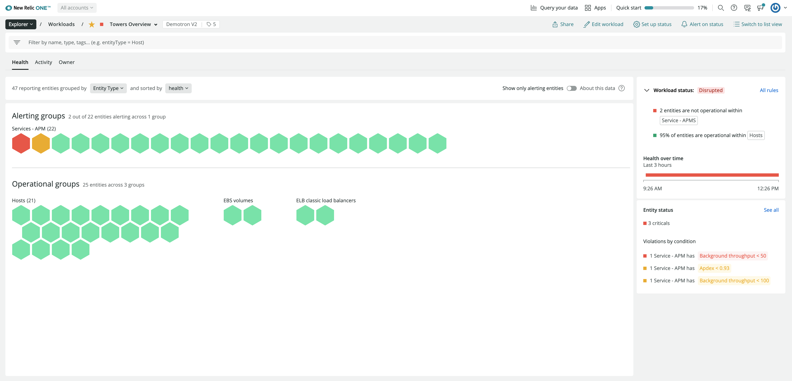

[ワークロードを見るには](/docs/new-relic-one/use-new-relic-one/core-concepts/new-relic-one-workloads-isolate-resolve-incidents-faster) 、 [one.newrelic.com](https://one.newrelic.com) にアクセスし、 **エクスプローラー** で見つけてください。3つのメインタブ（Health、Activity、Owner）とヘッダーがあります。

## 健康 [#health]

ワークロードの **Health** タブは、ワークロードの運用に役立つ関連するステータスデータを提供します。ワークロードのグローバルステータス、およびワークロードを構成するすべてのエンティ ティの各時点での個別のステータスが表示されます。以下のように表示される。

以下のように構成されています。

1. ナビゲータービューには、ワークロードを構成するエンティティが表示され、それらをグルー プ化およびソートするためのコントロールが用意されています。 [エンティティを動的に選択するためにクエリーを使用している場合](/docs/new-relic-one/use-new-relic-one/workloads/use-workloads/#query-logic) 、ワークロードのエンティティは時間の経過とともに変化します。
2. [ワークロードステータス](/docs/new-relic-one/use-new-relic-one/workloads/workload-status-views-notifications/) では、ワークロード内のエンティティの個別のアラートステータスに基づいて、ワークロードのパフォーマンスを通知します。health over time」では、ワークロードの状態が過去3時間でどのように変化したかを確認できます。
3. 1つ以上のエンティティーが警告を発している場合、クリティカルやワーニングのカウント、オープンコンディションのサマリーが表示されるので、最も重要な問題の特定とトラブルシューティングが容易になります。

## アクティビティ [#activity]

**Activity** タブには、ワークロード内のエンティティに関連するパフォーマンスデータと、それらの時系列の変化を説明するイベントが表示されます。これは次のようなものです。

ここでは、最も重要なセクションを紹介します。

1. リンクされたダッシュボード。ワークロードからダッシュボードへのリンクを追加したり、 [ダッシュボードへの事前にフィルタリングされたワークロード関連のリンクを作成することができます](/docs/new-relic-one/use-new-relic-one/workloads/use-workloads/#add-dashboards) 。
2. ゴールデンメトリクス。これは、アプリケーションのリクエスト数、応答時間、エラーレートなど、各エンティティタイプに最も関連性の高いメトリクスを示したチャートです。異なるエンティティ（2つのアプリケーションなど）や異なるスタック層（アプリケーションやホストなど）の相関関係を検出するためのチャートです。ワークロード上の各エンティティタイプについて表示されるゴールデンメトリクスは、 [NerdGraph API](/docs/apis/nerdgraph/examples/golden-metrics-entities-nerdgraph-api-tutorial/#customize-golden-metrics) を通じて、アカウントレベルまたはワークロードレベルでカスタマイズすることができます。
3. イベントのタイムライン。これには、ワークロードエンティティを参照するインシデントおよび異常の開始時刻と終了時刻が含まれます。また、展開や構成の変更など、ワークロードの状態やパフォーマンスの変化を説明することができる他のイベントタイプも表示されます。

ゴールデンメトリクスAPIを使用することで、ワークロードエンティティの可視化に使用するゴールデンメトリクスを制御することができます。詳しくは、こちらのショートビデオ（約4分）をご覧ください。

<Video
  id="3JSb68Gdhlg"
  type="youtube"
/>

## オーナー [#owner]

**Owner** タブでは、ワークロードに責任を持つチームに関する情報が表示されます。以下のように表示されます。

含んでいます。

1. ワークロードを担当するチームです。複数のチームを含めることができます。
2. ワークロードの説明です。ワークロードの使命と、それが表すビジネスロジックを共有します。それはウェブアプリケーションですか？APIですか？バックエンドプロセスですか？あなたのチーム、または組織内の他のチームに関連する詳細を記入してください。
3. 連絡先を入力します。ドロップダウンメニューから、あなたのチームが希望する連絡方法を選択してください。
4. ワークロードの操作に最も関連するリソースへのリンクです。ここでは、ランブック、コードリポジトリ、生産性向上ツールなど、手元に必要なワークロードに関連するあらゆるものへのリンクを追加できます。

## ヘッダー [#header]

**ヘッダー** には、フィルターバーとエディションコントロールがあります。

1. フィルターバー。ワークロード内の特定のエンティティのみに焦点を当てる必要がある場合は、高度なフィルタリングオプションを使用します。
2. ワークロードを編集します。ワークロードの一部となるエンティティと、それらを取得するアカウントを定義します。
3. ステータスを設定する。ワークロードエンティティの健全性に基づいて、グローバルワークロードのステータスをどのように決定するかを設定します。
4. サマリーページ。ワークロードに追加されたすべてのタグと、ワークロードの識別子（GUID）やアカウントなどのメタデータを確認できます。

タグを活用することで、動的に更新されるワークロードを作成することができます。その方法については、こちらのショートビデオ（約3分）をご覧ください。

<Video
  id="nXCH_3XjGkQ"
  type="youtube"
/>

## ワークロードの作成 [#create]

ワークロードには、あなたとあなたのチームが見たいと思うエンティティが含まれている必要があります。エンティティの選択は、組織の構造や目標によって異なります。

<figcaption>
  **[one.newrelic.com](https://one.newrelic.com) > Explorer> Workloads> ワークロードを作成します。** [ワークロードを作成するとき](#create) 、関連するアカウントと監視対象のエンティティを選択します。
</figcaption>

New Relic One または [the NerdGraph API](/docs/nerdgraph-workloads-tutorials) を使用してワークロードを作成することができます。以下の手順で、UI を使用してワークロードを作成します。

1. [one.newrelic.com](https://one.newrelic.com) にアクセスし、 **エクスプローラー** をクリックし、 **+ Create a workload** をクリックします。

2. ワークロードには、後で自分やチームにとって意味のある名前をつけましょう。

3. **Select an account** ドロップダウンから、 [workload account](#accounts) を選択します。

4. [Choose scope accounts](#scope-accounts) をクリックすると、このワークロードに関連するすべてのアカウントがチェックされます。

5. ワークロードを構成するエンティティを検索して選択します。探している結果が得られたら、特定のエンティティを追加したり、ワークロードのエンティティを動的に更新するクエリを追加したりすることができます。

   * エンティティタイプ、 [タグ](#tags) 、または [アトリビュート](/docs/using-new-relic/welcome-new-relic/get-started/glossary#attribute) （エンティティ名、アカウントID、AWSリージョンなど）で検索できます。
   * **+ Add this query** をクリックして、ワークロードの動的に更新されるエンティティのリストを作成します。システムの変更に合わせてワークロードがエンティティを更新する場合は、この方法をお勧めします。
   * エンティティの横にある **+ Add** をクリックすると、ワークロードに追加されます。この方法は、システムが変更されてもエンティティが有用であることがわかっている場合に適しています。

6. ワークロードには、クエリと特定のエンティティの組み合わせを追加することができ、これらは [クエリロジック](#query-logic) に従って組み合わせられます。

7. **Create a workload** をクリックしてワークロードを保存します。ワークロードを作成した後は、いつでも編集することができます。

ワークロードに1つ以上のダッシュボードが含まれている場合、 [それらのダッシュボードのリンクにフィルターを設定することができます](#filter-dashboards) 。

以下では、ワークロードを定義する方法のいくつかの側面について詳しく説明します。

<CollapserGroup>
  <Collapser
    id="tags"
    title="タグを使ってワークロードの内容を定義"
  >
    [タグ](/docs/new-relic-one/use-new-relic-one/core-concepts/tagging-use-tags-organize-group-what-you-monitor) と [属性](/docs/using-new-relic/welcome-new-relic/get-started/glossary#attribute) の両方を使用して、ワークロードのエンティティを照会および選択することができます。したがって、ワークロードの使用を最適化するためには、適切なエンティティタグ付け戦略を持つことが役立ちます。 [tagging documentation](/docs/new-relic-one/use-new-relic-one/core-concepts/tagging-use-tags-organize-group-what-you-monitor) を読むことをお勧めします。
  </Collapser>

  <Collapser
    id="query-logic"
    title="ダイナミッククエリロジックの仕組み"
  >
    複数の個別のエンティティやクエリを追加してワークロードを定義することができます。

    * クエリには、複数の検索語を含めることができます。これらはAND演算子で結合されます。
    * ワークロード内の別々のクエリは、OR演算子で結合されます。
    * 文字列をパーセント記号で囲み（`%` ）、クエリ内の正確な部分文字列にマッチさせることができます。エンティティ名に部分文字列を使用してエンティティを分類している場合（例： `< team>-<env>-<appName>` ）、フィルタリングやグループ化により強力な [タグ](/docs/new-relic-one/use-new-relic-one/core-concepts/tagging-use-tags-organize-group-what-you-monitor) を補完的に使用することを検討してください（例： `team:awesome`, `env:production` ）。
    * 500以上のエンティティを返す可能性のあるダイナミッククエリでは、パーセント記号(`%`)を使用しないことをお勧めします。このようにすることで、ユーザーインターフェースがより一貫したものになります。
  </Collapser>

  <Collapser
    id="add-dashboards"
    title="ダッシュボードをワークロードに追加"
  >
    [カスタムダッシュボード](/docs/dashboards/new-relic-one-dashboards/get-started/introduction-new-relic-one-dashboards) があり、どのデータがチームのワークロードの観察や操作に関連するかがすでにわかっている場合は、ワークロードからそれらのダッシュボードをリンクすることができます。また、ダッシュボードにフィルタを設定して、ワークロード固有のコンテキストにスコープすることもできます。ユーザがワークロードからそのダッシュボードを選択すると、フィルタが既に適用された状態で開きます。

    

    <figcaption>
      **one.newrelic.com> Apps> Workloads**: ワークロードにダッシュボードを追加することができます。
    </figcaption>

    ダッシュボードをワークロードに追加するには

    1. ワークロードの作成または編集時に、ワークロード検索バーに「 `Dashboard` 」と入力して、ダッシュボードエンティティにフィルタリングする。

    2. 他の検索語を追加して、特定のダッシュボードにフィルタリングすることができます。

    3. **Add** をクリックします。

       

       <figcaption>
         **one.newrelic.com> アプリ> ワークロード**: ワークロードにリンクしたダッシュボードにフィルターを設定することができます。
       </figcaption>

       ワークロードのダッシュボードをフィルタリングするには

    4. ワークロードの **Overview** ページから、ダッシュボードを選択します。

    5. 検索語を追加してダッシュボードをフィルタリングし、そのワークロードに関連するビューを表示します。

    6. 選択 **このワークロードのフィルタを保存**.
  </Collapser>
</CollapserGroup>

## APIの使用 [#api]

[ワークロードのクエリ、作成、更新は、NerdGraph API](/docs/nerdgraph-workloads-tutorials) で行うことができます。