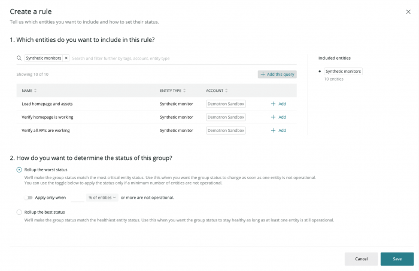

ワークロードの状態を取得するには、自動と固定の2つの方法があります。

* **自動状態**: 一連のルールから計算されます。
* **静的なステータス**: ワークロードステータスの自動計算を上書きします。

ワークロードのステータスを作成または編集するには、ワークロードの概要から **Status details and setup** アイコンをクリックします。

## 自動ワークロード状態の設定 [#configure-automatic]

<Callout variant="important">
  この構成を実行するには、 [ワークロード管理権限](/docs/new-relic-one/use-new-relic-one/core-concepts/new-relic-one-workloads-isolate-resolve-incidents-faster#accounts) が必要です。
</Callout>

ワークロードのステータスを1つの値にまとめるために、ワークロードに属するエンティティのそれぞれのステータスを使用することができます。

ワークロード内のすべてのエンティティが、パフォーマンス、エラー、可用性の観点から同じように重要であるとは限りません。

* Syntheticsのモニターやサービスに重大な違反があった場合、ワークロードに障害が発生したと表示したい場合があります。
* しかし、ホストインフラに一定の冗長性と障害への耐性がある場合は、1台のホストでアラート違反が発生したからといって、ワークロードのステータスを **Operational** から変更する必要はないかもしれません。

デフォルトでは、ワークロードを作成すると、そのステータスを計算するための以下のルールが追加されます。

1. デジタル・エクスペリエンスに近いエンティティ・タイプ（合成モニター、ブラウザ・アプリケーション、モバイル・アプリケーション、サービスなど）については、利用可能な最悪のステータスが伝搬されます。
2. その他のエンティティタイプ（基本的にはインフラストラクチャ・エンティティ）については、利用可能な最善のステータスが伝搬されます。

### カスタムルールの作成 [#create-custom-tules]

自動ワークロードの状態をカスタマイズするために、独自のルールを定義することができます。ルールは、エンティティのグループとロールアップモードで構成されます。

1. エンティティタイプ、タグ値、GUID、またはそれらの組み合わせに基づいて、エンティティのグループを定義します。

2. これらのエンティティのステータスをグループのステータスに伝搬させる方法を決定します。

   * **Roll up the best status**: グループのステータスは、所属するすべてのエンティティのクリティカルでないステータスと一致します。グループ内の少なくとも1つのエンティティが稼働している限り、グループのステータスを稼働させたい場合にこのオプションを使用します。
   * **最悪のステータスをロールアップ**: グループのステータスは、所属するすべてのエンティティの最も重要なステータスと一致します。このオプションは、グループ内の1つのエンティティが動作しなくなった時点で、グループのステータスがサービスの低下や中断を示すようにしたい場合に使用します。また、一定の数のエンティティが稼働していない場合にのみ、最悪のステータスをロールアップすることもできます。

3. ルールを保存し、必要に応じて別のルールの作成に進みます。

最終的なワークロードの状態は、すべての個々のグループの状態の中で最も悪い状態に等しい。

<Callout variant="important">
  この最終的な計算において、ワークロードマネージャーによって [静的なステータス](#configure-static) が設定されている場合、自動的に計算されたステータスは上書きされます。
</Callout>

### 残留組のルール [#remaining-entities]

より簡単かつ動的なステータス設定のために、以前に定義した他のルールで評価されていないすべてのエンティティにロールアップタイプを使用することができます。特に、他のルールを一切追加しない場合、残りのエンティティに対するルールは、ワークロード内のすべてのエンティティを考慮します。

この特別なルールは、エンティティタイプ別にグループ化するオプションと組み合わせることで、各エンティティタイプにルールを設定しなくても、ワークロード内の各エンティティタイプの状態を大まかに把握することができます。したがって、タイプ別にグループ化された残りのすべてのエンティティに対して常にルールを設定し、ワーストステータスをロールアップすることで、ワークロードスタックのレイヤー内のすべてのエンティティが稼働していないことを迅速に検出することをお勧めします。

## ワークロードの状態を固定する [#configure-static]

ルールに基づいた [自動計算](#configure-automatic) に関係なくワークロードのステータスを伝えたい場合は、 [利用可能なステータス値](/docs/workload-status#obtain-status) の中からワークロードの静的なステータス値を設定することができます。

これは、メンテナンス作業中に、作業負荷の状態が中断されていることを他のチームに伝えたり、さらなる情報を提供したり、作業負荷が再び動作可能になる予定の時間を伝えたりするのに便利です。

<Callout variant="tip">
  デプロイメントやオペレーションのプロセスにより、定期的に一時的なステータスを伝える必要がある場合は、 [API](/docs/apis/nerdgraph/tutorials/nerdgraph-workloads-api-tutorials) をワークフローに統合することで、静的なステータスの設定を自動化することができます。
</Callout>

<Callout variant="important">
  ワークロードマネージャーによって設定された静的なステータスは、自動的に計算された他のステータス値 [に常に優先します。](#configure-automatic) 。
</Callout>

静的なワークロードの状態を設定するには

1. 静的なステータス値を設定します。
2. オプションとして、ステータスの短いサマリーと、ワークロードに何が起こっているかの長い説明を書きます。
3. スタティック・ステータスが有効になっていることを確認します。

## ステータス値の把握 [#understand-value]

ワークロードの概要」には、ワークロードのステータスの結果が表示されます。 **Status details and setup** アイコンをクリックすると（ワークロードマネージャのロールを持っていない場合は、 **Status details** だけでも）、ステータス計算がどのように構成されたか、およびグローバルワークロードス テータス値を計算するために考慮されたすべてのルールおよび／または静的ステータスの結果が表示され ます。

ワークロードのステータス設定で行った変更は、変更を保存して初めて有効になります。自動ルールや静的なステータスを設定している間は、その時点で設定を保存した場合のステータスの結果がプレビューとして表示されますので、便利です。

