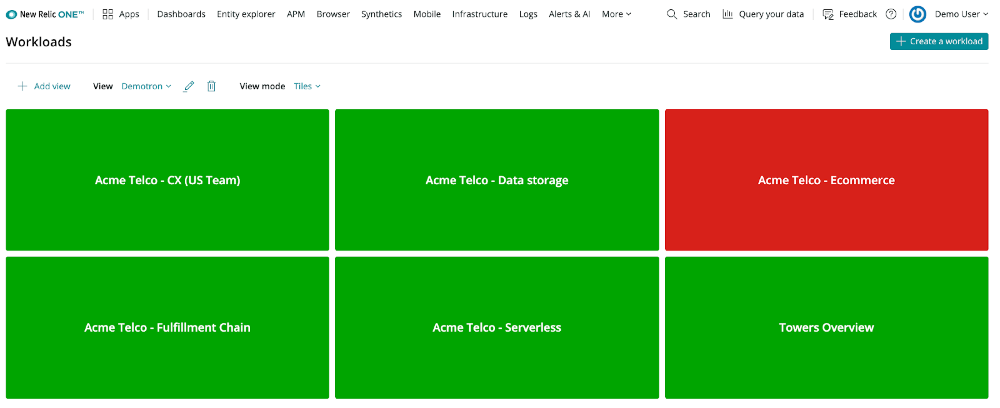

ワークロードステータスは、 [ワークロード](/docs/new-relic-one/use-new-relic-one/core-concepts/new-relic-one-workloads-isolate-resolve-incidents-faster) に含まれるエンティティのアラートステータスから得られるもので、ワークロードがどのように動作しているかを知らせてくれます。

## 重要な理由 [#why-matters]

ワークロードの状態

* システムの状態を迅速に表示し、ワークロードに対応する必要があるかどうかを一目で把握することができます。
* お客様のニーズに合わせて、各事業体の重要性に合わせて対応します。
* ワークロードの状態を共有することができます。サービスやインフラに依存している他のチームは、システムのアーキテクチャの詳細を理解したり、カスタムダッシュボードを見たりすることなく、ワークロードのステータスを知ることができます。

## ワークロードの状態を把握することができます。 [#get-started]

[New Relic One](/docs/new-relic-one/use-new-relic-one/get-started/introduction-new-relic-one) では、 [New Relic アラート](/docs/alerts) の結果をもとに、すべてのエンティティのステータス値を提供しています。 [色分けされた各エンティティのアラートステータス](/docs/alerts/new-relic-alerts/configuring-alert-policies/identify-entities-without-alert-policies#colors) を [New Relic Explorer](/docs/new-relic-one/use-new-relic-one/ui-data/new-relic-one-entity-explorer-view-performance-across-apps-services-hosts) で確認したり、API を通してアラートステータスの値を消費したりすることができます。例えば、クリティカルな違反が進行中であることを示す赤いアラートステータスが表示されることがあります。

ワークロードを使用すると、複雑なシステムの一部であるエンティティを **グループ化し、ワークロード内のすべてのエンティティのステータスを** まとめた単一のグローバルな値を取得することができます。そのため、ワークロードが動作しなくなったことを素早く検知したり、潜在的なインシデントやサービス品質の低下を予測したりすることができます。

### ワークロードステータスの取得 [#obtain-status]

ワークロードは、以下のいずれかのステータス値を持つことができます。

* **運用**: ワークロードは問題なく動作しています。
* **Degraded**: ワークロードのパフォーマンスやエラーに若干の劣化が見られますが、まだ許容できるレベルのサービスを提供しているため、緊急の対応は必要ありません。
* **Critical or Disrupted**: ワークロードが許容できるレベルのサービスを提供していないため、緊急に対応する必要があります。
* **不明**: ワークロードの状態を計算する方法が設定されていないか、ワークロードエンティティの状態を判断できるアラート条件が設定されていません。

ワークロードの状態を定義または編集する方法については、 [ワークロードの状態の設定](/docs/workload-status-configuration) を参照してください。

## ワークロードのセットでビューを保存 [#save-views]

通常、特定のワークロードグループのステータスを確認する必要がある場合は、それらのワークロードのみを含むビューを保存することができます。タイルビューモードでは、ワークロードを素早く見つけ、そのステータスを一目で確認することができます。

ビューを作成するには、以下の手順で行います。

1. [one.newrelic.com](https://one.newrelic.com/ "新しいウィンドウにリンクが開きます。") にアクセスし、 **More** > **Workload views** をクリックします。
2. Add view」をクリックします。
3. ビューに意味のある名前（チームやビジネスユニットの名前など）を付け、ビューを関連付けるアカウントを選択します。
4. ビューに含めたいワークロードを、名前やタグで選択します。
5. 新しいビューを保存します。



ステータス表示は、複数のワークロードに責任を持つチーム、サポート役、ビジネスユニットマネージャーに最も有効です。

## ワークロードの状態が変化したときに通知される [#get-notified]

ワークロードのステータスを確認する必要があるのは、そのワークロードが自分のチームが担当しているサービスを表している場合と、自分のサービスが他のチームが管理しているワークロードに依存している場合があります。

すべてのワークロードの状態は定期的に計算され、その結果は `WorkloadStatus` イベントを通じて NRDB に保存されます。これにより、ワークロードが「Disrupted」または「Degraded」の状態になったときに通知する警告条件を設定することができます。

警告条件を設定するには、以下の手順で行います。

1. [one.newrelic.com](https://one.newrelic.com) にアクセスし、 **Alerts& AI** を選択します。新しいアラート条件を追加したいポリシーを選択するか、適切な通知チャネルを持つ新しいポリシーを作成します。その後、 **Create a condition** をクリックします。

2. プロンプトが表示されたら、 **Select a product** をクリックし、 **NRQL** をクリックします。

3. 以下のNRQLクエリを追加します。

   ```
   SELECT latest(statusValueCode) FROM WorkloadStatus WHERE workloadGuid = '<GUID>' FACET workloadGuid as 'entity.guid', entity.name
   ```

4. * ワークロードの GUID は、ワークロード UI 上の **See metadata and manage tags** をクリックすることで取得できます。
   * 警告条件が、（例のように）1つのワークロードだけに適用されるように、または複数のワークロードに適用されるように、WHERE句を記述します。また、アカウント上のすべてのワークロードに警告条件を適用したい場合は、WHERE句を削除します。
   * FACETを追加することで、以下に説明するように、アラートの説明にこれらのフィールドを使用することができます。

5. 次のいずれかの静的しきい値を設定します。

   * (推奨） **Critical** クエリが3に等しい値を返したとき ****少なくとも1分間、ワークロードの状態が乱れたときに通知を受けたい場合。
   * **クリティカル** クエリが2に等しい値を返したとき ****少なくとも1分間、ワークロードの状態が低下したときに通知を受けたい場合。
   * 警告のしきい値では、インシデントの発生や通知の送信は行われないことを覚えておいてください。そのため、ステータスの変化を通知したい場合は、重要なしきい値を持つ2つの警告条件を作成する必要があります（上で説明したとおり）。

6. 注意喚起の条件を満たす

   * 違反の時間制限を設定することで、長期間続いた違反を選択した時間後に自動的に強制終了させることができます。
   * Choose to fill data gaps with **Last known value**.

7. オプションで、ワークロード名とUIへのパーマネントリンクを含むカスタム違反説明をアラート通知に追加することもできます。

   ```
   Workload: {{tag.entity.name}}
   Direct link: https://one.newrelic.com/redirect/entity/{{tag.entity.guid}}
   ```