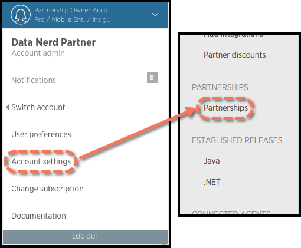

パートナーシップ管理コンソールは、お客様のアカウントと New Relic との統合を管理するためのインターフェースです。コンソールにアクセスするには、パートナーシップのオーナーアカウントにサインインし、次のページに進みます。

```
https://partner-admin-console.newrelic.com/accounts/<var><a href="/docs/accounts-partnerships/accounts/account-setup/account-id">ACCOUNT_ID</a></var>/admin_console/
```

また、New Relic の UI からコンソールにアクセスすることもできます。

1. **[one.newrelic.com](https://one.newrelic.com) > [（アカウントのドロップダウン）](/docs/accounts-partnerships/education/getting-started-new-relic/glossary#account-dropdown) > アカウント設定**.
2. 左のメニューバーから、 **「パートナーシップ」** を選択します。



<figcaption>
  **[one.newrelic.com](https://one.newrelic.com) > [(account dropdown)](/docs/accounts-partnerships/education/getting-started-new-relic/glossary#account-dropdown) > Account settings> Partnerships**: パートナーシップのオーナーは、New Relic UI のアカウント設定からパートナーシップ管理コンソールにアクセスできます。
</figcaption>

## コンソールのコンポーネント [#components]

Partnership Admin Consoleには2つの主要コンポーネントがあります。

* パートナーシップの設定
* カスタマー・アクティビティ・モニタリング

New Relic の親アカウントに複数のパートナーシップが関連付けられている場合、メニューにはパートナーシップのアカウントを切り替えるためのオプションも含まれています。

## パートナーシップの設定 [#console-settings]

New Relic との統合を開発する際には、いくつかの設定を指定する必要があります。これらの設定は、便宜上パートナーシップコンソールにまとめられており、ヘッダー/フッターや各種リダイレクト用のURL、SSOの設定、キーとその操作機能などが含まれています。

## カスタマー・アクティビティ・モニタリング [#customer-monitoring]

New Relic では、お客様を管理するための 2 つのツールを提供しています。Statof-the-Partnershipレポートと、パートナーシップに配備されたすべてのNew Relicエージェントのライブモニタリングです。これらのツールはどちらも、New Relic を使用しているお客様についての情報を提供します。これらのツールは、アップセールの機会を特定したり、サポートグループのプロアクティブなサポートを支援するために使用することができます。

### Statof-the-Partnershipレポート [#report]

Stat-of-the-Partnership レポートでは、New Relic アカウントをお持ちのお客様とその活動内容をまとめています。このレポートは、各アカウントに展開されているエージェントの言語、エージェントのバージョン、言語バージョンごとに分かれています。このレポートは、各パートナーに対して毎週実行されます。また、New Relic Business Development の担当者にご依頼いただければご提供いたします。このレポートは、New Relic アカウントをお持ちのお客様のうち、どのお客様が実際にサービスを利用しているかを確認するのに最適な方法です。

### パートナーの顧客モニタリング [#monitoring]

パートナー顧客モニタリング機能では、お客様のサービス上で稼働しているNew Relic対応アプリケーションのパフォーマンスデータを提供します。この機能により、パフォーマンスの問題が発生しているお客様を簡単に特定することができます。

性能問題の原因がキャパシティ不足である場合、これらのお客様は優れた販売機会となります。また、サポートやサービスを提供している企業では、お客様の問題を事前に把握したり、コンサルティングサービスを提供する上で有用な情報となります。

## 任意のお客様の表示 [#viewing-customer]

フィルタリングされたどのビューにも表示されていないお客様のアクティビティを表示するには。 **[one.newrelic.com にアクセス](https://one.newrelic.com) > [（アカウントのドロップダウン）](/docs/accounts-partnerships/education/getting-started-new-relic/glossary#account-dropdown) > Switch accounts> Other accounts**.

New Relic は、パートナーシップのすべてのレポートアカウントをリストアップします。このリストはフィルタリングや検索が可能です。

## お客様の詳細データの閲覧 [#viewing-details]

通常、パートナー様はお客様の New Relic アカウントのサマリーレベルのデータのみを見ることができます。パートナーシップ管理コンソールを通じて、パートナーはより詳細なプレゼンテーションにドリルダウンすることができます。

Partnership Admin Console からドリルダウンしたい場合は、自分のユーザ(通常は `support@partner.com` など)をアカウントに追加します。通常、これはアカウント作成時に行います。このユーザをアカウントの Owner としてプロビジョニングすることは避けてください。