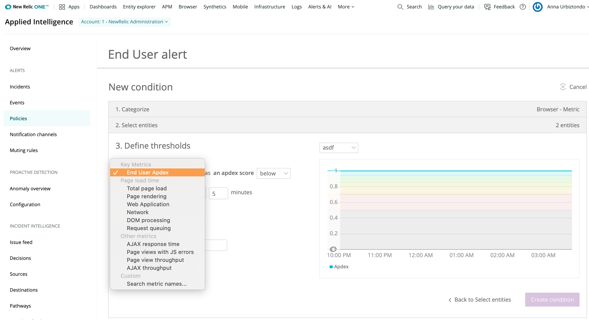

**すべてのユーザーが知っておくべきブラウザ監視のヒント**

[Browserモニタリング](https://newrelic.com/platform/full-stack-observability)の機能をさらに活用して、ウェブサイトおよびそのユーザーに対する可視性を高めます。以下に、リアルユーザー監視（RUM）を使用して問題をすばやく探して顧客体験を向上させるための10のベストプラクティス

## 1. Browser SPAエージェントを使用する [#spa]

**Browser SPAエージェントを使用して可視性を高める**

最近のウェブサイトは、動的コンテンツと精巧なロジックによって複雑化しています。ユーザーインタラクションについての理解を深め、Browserで[シングルページアプリケーション（SPA）エージェント](/docs/browser/single-page-app-monitoring/get-started/introduction-single-page-app-monitoring)を有効にし、ユーザーアクションとその背後の基礎となるウェブページイベントを可視化します。

このフレームワークに依存しないエージェントは、React、Angular、Ember、Backboneなどのシングルページアプリケーションフレームワークだけでなく、カスタムフレームワークおよびその他の動的コンテンツを含むすべてのページに使用できます。高度なタイミング分析機能によって、[Navigation Timing Specification API](/docs/browser/new-relic-browser/page-load-timing-resources/instrumentation-browser-monitoring)サブタイミングに、ページのレンダリングやDOM処理に関してより細かい粒度の情報を格納しています。これらはすべてのページのライフサイクルを理解するのに役立つ、詳細なパフォーマンスデータのフィルタリング機能を提供しています。

### 設定方法

これは、デフォルトでは、新しい[ブラウザエージェントのインストール](/docs/browser/browser-monitoring/installation/install-browser-monitoring-agent)に対して有効になっています。この設定を編集するには、Browserアプリの[**App settings**ページ](/docs/browser/new-relic-browser/configuration/browser-app-settings-page)に移動します。

## 2. APM自動インストゥルメンテーションを使用する [#auto-instrument]

**コピー／ペーストの代わりにAPMの自動インストゥルメンテーションを使用する**

[APM](https://newrelic.com/application-monitoring)も使用している場合は、[自動インストゥルメンテーション](/docs/browser/new-relic-browser/installation-configuration/add-apps-new-relic-browser)をできるだけ有効にすることをお勧めします。この機能は、BrowserモニタリングJavaScriptエージェントをフロントエンドに自動的に挿入します。この手法により、Browserエージェントは、最新の状態が自動的に維持されるだけでなく、これらの製品を一緒に使用することにより、フロントエンドからバックエンドまでの可視性を統一できます。

たとえば、フロントエンドのAJAX呼び出しを対応するバックエンドのトランザクションにリンクして、Insightsダッシュボードでフロントエンドとバックエンドのデータを一緒に並べることができます。

<Callout variant="tip">
  バックエンドのフレームワークやCDN戦略によって、コピー／ペーストのほうが良い手法になることがあります。ただし、これには定期的な更新が必要になることに注意してください。
</Callout>

### 設定方法

「[Browserモニタリングの有効化](/docs/browser/browser-monitoring/installation/install-browser-monitoring-agent)」をご覧ください。

## 3. Apdexをカスタマイズする [#apdex]

**Apdexの閾値をカスタマイズする**

New Relicは[業界標準](/docs/apm/new-relic-apm/apdex/view-your-apdex-score)のメトリクスである[Apdex](/docs/apm/new-relic-apm/apdex/apdex-measuring-user-satisfaction)を使用して、アプリケーションのレスポンスタイムに対するユーザーの満足度を計測します。Apdexは、多くの測定値を0から1（0 = 満足したユーザーなし、1 = すべてのユーザーが満足）の均等スケールの単一の数値に変換します。[Apdex T](/docs/apm/new-relic-apm/apdex/change-your-apdex-settings)は、Apdexの中央値で、トランザクションが「満足できる」と考えられるレスポンスタイムです。

Apdex T値は、アプリケーションサーバーとエンドユーザーのブラウザパフォーマンスに個別の値を指定することによって、それぞれのアプリケーションに定義できます。（最近の多くのウェブサイトは、主にフロントエンドブラウザにボトルネックがあり、その90%以上がページ読み込み時間によるものであることに注意してください）。

T値の推奨の閾値は5秒ですが、各自のユーザーとアプリケーションのニーズに合わせてApdex T値をカスタマイズすることをお勧めします。たとえば、eコマースのサイトでは、遅いレスポンスに不満を持った潜在顧客の直帰率を下げるために、社内の従業員向けアプリケーションと比較してT値を低く設定することがあります。ただし、目標は時間経過とともに継続的にT値を下げて、顧客のデジタル体験を向上させることです。

### 設定方法

1. Browserのアプリケーションリストからアプリケーションを選択し、**Settings > Application settings**を選択します。
2. このアプリケーションの**Apdex T**値（秒）を設定します。
3. **Save application settings**をクリックします。


<figcaption>
  [one.newrelic.com](https://one.newrelic.com) > ブラウザ（Browser） > 設定（Settings） > アプリケーション（Application）
</figcaption>

## 4. アラートを作成する [#alerts-policies]

**アラートポリシーを作成・評価する**

Apdexスコアが閾値を超えると、どうなると思いますか？顧客を失う前に問題の原因を調査できるよう、閾値を越した際にアラートを受信できるようにしましょう。

New Relicには、常に内部の状況を把握できるように、Browserモニタリングを含むすべての製品に対して[統一されたアラート機能](/docs/alerts/new-relic-alerts/getting-started/alert-policy-workflow)があります。アラートは、Apdexスコアを監視するように設定することをお勧めします。以下のサンプルアラートを使用すると、すぐに作業を開始できます。

* **Apdexスコア：**スコアが5分間0.8未満になるとアラートを発令します。（Apdexスコアが0.8未満の場合は、20%以上のユーザーがウェブサイトの使用体験に「満足」していないことを意味します）。
* **ページロードタイム：**平均ページロードタイムが5分間10秒を超えるとアラートを発令します。（平均ページロードタイムのスパイクが始まると、ウェブページに何らかの不具合があり、その結果、処理速度が大きく低下していることを示しています。これは、Apdexスコアに対するアラートを補完します。
* **JSエラー：**エラー率が5分間5%を超えるとアラートを発令します。（フロントエンドのエラー率のスパイクが始まると（特にデプロイメント後）、フロントエンドに不良なJavaScriptを導入した可能性があり、修正が必要です）。

### 設定方法

1. **Alerts & AI**で**Go to Alerts**を選択し、左側の列で**Policies**を選択します。
2. **(+) New alert policy**を選択して新規のアラートポリシーを作成し、意味のある名前を付けます。
3. **Create a condition**をクリックして最初の条件を作成し、製品に**Browser**を選択し、条件に**Metric**を選択します（デフォルト設定）。**Nextをクリックして、エンティティを選択します**。
4. アラートを発報するアプリケーションのチェックボックスをオンにし、**Nextをクリックして閾値を定義します**。
5. 目的のメトリックスを選択し、アラートをトリガーするタイミングを決定するための閾値を選択します。



<figcaption>
  [one.newrelic.com](https://one.newrelic.com) > アラートとAI（Alerts & AI） > ポリシー（Policies） > 新しいアラートポリシー（New alert policy）
</figcaption>

## 5. ベースラインアラートを使用する [#alerts-anomalies]

**異常な動作とイベントにアラートを発令する**

単純に特定の閾値に対して検知できるメトリクスもありますが、周期性があったり、健全と見なす範囲が変化するようなデータもあります。その良い例がトラフィックのスループットで、かなり周期性がありますが、トラフィックの大きな低下やスパイクは、ユーザートラフィックを妨げている障害やDDoS攻撃によるトラフィックのスパイクを示す重要な指標である可能性があります。[ベースラインアラート](/docs/alerts/new-relic-alerts/defining-conditions/create-baseline-alert-conditions)は、正常な動作が期待される「帯域」を作成して、ノイズではなく重要なシグナルをアラートとして通知するのに役立ちます。

### 設定方法

1. **Alerts & AI**で**Go to Alerts**を選択し、左側の列で**Policies**を選択します。
2. **(+) New alert policy**を選択して新規のアラートポリシーを作成し、意味のある名前を付けます。
3. **Create a condition**をクリックして最初の条件を作成し、製品に**Browser**を選択し、条件に**Metric Baseline**を選択します（デフォルト設定）。**Nextをクリックして、エンティティを選択します**。
4. アラートを発報するアプリケーションのチェックボックスをオンにし、**Nextをクリックして閾値を定義します**。
5. **Page view throughput**を選択し、スライダーを使用してアラートをトリガーするための正常範囲を定義します。


<figcaption>
  [one.newrelic.com](https://one.newrelic.com) > アラートとAI（Alerts & AI） > ポリシー（Policies） > 新しいアラートポリシー（New alert policy）
</figcaption>

## 6. ワークフローにアラートを追加する [#alerts-notifications]

**アラートをワークフローに統合する**

異なるアラートポリシーを設定することにより、利用可能な異なる[アラート通知チャネル](/docs/alerts/new-relic-alerts/managing-notification-channels/notification-channels-controlling-where-send-alerts)を活用してチームのワークフローに統合できます。結局のところ、誰にも知られていないアラートには意味がありません。

アラートは、Slack、PagerDuty、Webhook、メールなどを介して送信できます。ChatOpsとのインテグレーションまたはアラートへの[ランブックのリンク](/docs/alerts/new-relic-alerts/defining-conditions/provide-runbook-instructions-alert-activity)など、アラート通知を応答プロセスに連携させることもできます。アラートポリシーを定期的に評価して、常に有効であることを確認してください。

### 設定方法

1. **Alerts & AI**で**Notification channels**をクリックします。
2. さまざまな[通知チャネル](/docs/alerts/new-relic-alerts/managing-notification-channels/notification-channels-controlling-where-send-alerts)を設定して、異なる[アラートポリシー](/docs/alerts/new-relic-alerts/getting-started/alert-policy-workflow)で使用できます。

## 7. ダッシュボードを作成する [#insights-dashboards]

**独自のダッシュボードを作成**

Browserは、自動的に必要な情報を収集して問題の優先順位を決定できますが、[クエリビルダー](/docs/query-your-data/explore-query-data/dashboards/introduction-new-relic-one-dashboards)を使用してフロントエンドデータのカスタム[ダッシュボード](/docs/query-your-data/explore-query-data/query-builder/use-advanced-nrql-mode-specify-data)を作成することもできます。フロントエンドで起こっていることのリアルタイムの概要を一意に把握し、他のテクノロジースタックとの適合性を確認します。

たとえば、次のことが可能です。

* パーセンタイル、持続時間、およびページビューに関するブラウザごとの詳細を作成する。

  ```
  SELECT average(duration),percentile(duration,50,75,95) as 'Percentile', count(*) as 'Pageviews' FROM PageView WHERE userAgentName='Chrome' SINCE 1 week ago
  ```

* ルート変更のパフォーマンスをパーセンタイルで分析する。

  ```
  SELECT count(*) as 'Route Change', average(duration) as 'Avg PageLoad',percentile(duration,50,75) as '%' ,average(jsDuration) as 'JS Duration' FROM BrowserInteraction FACET targetUrl where category = 'Route change' SINCE 1 day ago
  ```

* APMでフロントエンドのパフォーマンスをバックエンドのパフォーマンスと比較する。

  ```
  SELECT average(duration) as 'Avg Frontend Duration', average(backendDuration) FROM PageView SINCE 2 minutes ago UNTIL 10 seconds ago TIMESERIES
  ```

これらの個別のウィジェットは、チームダッシュボードとして集約でき、さまざまな開発チームや会社全体と共有できます。ウェブ、モバイルアプリケーションのデータ、バックエンドのデータ、インフラストラクチャのデータ、Syntheticsのモニタリングデータなどを集めて、[New Relic One](/docs/new-relic-one/use-new-relic-one/get-started/introduction-new-relic-one)全体で単一のカスタムダッシュボードにまとめることができます。


<figcaption>
  [one.newrelic.com](https://one.newrelic.com) > ダッシュボード（Dashboards）：
</figcaption>

### 設定方法

1. **[one.newrelic.com](https://one.newrelic.com)**へ移動します。次に、**Query your data**をクリックして[クエリビルダー](/docs/query-your-data/explore-query-data/query-builder/introduction-query-builder)にアクセスします。
2. クエリビルダーのNRQLタブで、クエリを**NRQL>**クエリバーに貼り付け、**Run**をクリックします。
3. **ウィジェットのタイトル**を入力し、既存のダッシュボードまたは新しいダッシュボードのいずれかに追加します**。**
4. **Dashboards**に移動し、新しいダッシュボードを確認します。

詳細については、[データのクエリ](/docs/using-new-relic/data/understand-data/query-new-relic-data)と[ダッシュボード](/docs/query-your-data/explore-query-data/dashboards/introduction-new-relic-one-dashboards)に関するドキュメントをご覧ください。

## 8. データのグループ化 [#segment-whitelist]

**データを適切なカテゴリーにグループ化する**

各ウェブサイトには異なるURLアーキテクチャーがあり、コンテンツ構造、技術フレームワーク、またはSEO戦略によって異なります。例：

* website.com/product/widget-name
* website.com/gallery?product=109832
* website.com/gallery/housewares/lamps/widget-name
* website.com/product#widget-name

URL構造の可能性は無限であり、Browserには、データをさまざまなURLグループに分類するための基準を設定する自動グループ化アルゴリズムがあります。[URLグループ化で許可されたリスト](/docs/browser/new-relic-browser/configuration/url-whitelists-grouping-browser-metrics)を使用して、データをグループ化する方法をカスタマイズすることをお勧めします。これにより、対応するパフォーマンス情報をより使いやすく整理して、各自のウェブサイトのアーキテクチャに合わせることができます。

このデフォルトのグループ分けによって生成されるデータがハイレベルな分類で使いにくい場合は、URLグループを作成してデータを構成要素で分解して細分化すると使いやすくなります。例えば、以下によって分類できます。

* 異なるページタイプ：製品ページと検索ページ
* 異なるフォーム、API、またはユーザーグループ
* モバイルまたはモバイル以外
* 認証済または未認証
* 異なるコンテンツ配信ネットワーク（CDN）

### 設定方法

1. BrowserモニタリングUIで、**Settings** > **Segment allow lists**の順に選択します。
2. **Allow listed segments**セクションで、**+**アイコンをクリックします。
3. ページビューとAJAXページのグループに表示するURLセグメントを入力します。


<figcaption>
  [one.newrelic.com](https://one.newrelic.com) > ブラウザ（Browser） > 設定（Settings） > セグメント許可リスト（Segment allow lists）。
</figcaption>

## 9. 適切なデータを取得する [#domain-conditions]

**データは必ず正しいソースから取得する**

Browserデータは、JavaScriptエージェントのコピーが開発、ステージング、またはその他の環境などで重複している場合にも、エージェントがインストゥルメントされるすべての場所から生成されます。その結果、本稼動データに含めるべきではないデータがこれらのソースから追加されることがあります。[ドメイン条件](/docs/browser/new-relic-browser/configuration/monitor-or-block-specific-domains)を使用すると、監視対象のウェブサイトのドメインからのデータを許可または拒否できます。

### 設定方法

1. BrowserモニタリングUIで、**Settings** > **Domain conditions**の順に選択します。
2. ドメイン条件が設定されていない場合は、**Enable domain conditions**を選択します。条件が存在する場合は、**Next, Choose your setting**を選択します。
3. **Deny Only**または**Allow Only**を選択して、監視するドメインから収集するデータを指定します。次に、**Next, Create conditions**を選択します。
4. データ収集を拒否または許可するドメインの条件文字列を入力します（10条件まで）。
5. ドメイン条件の設定を表示して確認します。


<figcaption>
  [one.newrelic.com](https://one.newrelic.com) > ブラウザ（Browser） > 設定（Settings） > ドメイン条件（Domain conditions）。
</figcaption>

## 10. パフォーマンスデータを分析する [#breakdown]

**ユーザー、ビジネスなどでパフォーマンスを分析する**

[New Relic API](/docs/apis/get-started/intro-apis/introduction-new-relic-apis#browser-api)を活用することにより、技術、ユーザー、およびビジネスに関するパフォーマンスデータに不可欠なコンテキストを追加できます。モニタリングツールはすべて、[New Relic One](/docs/new-relic-one/use-new-relic-one/get-started/introduction-new-relic-one)にデータを送信します。これにより、ダッシュボードのカスタマイズ性と拡張性が大いに向上します。オムニチャネルエンゲージメントのために、さまざまなデータソース間（ブラウザとモバイル間など）でカスタムイベントとカスタム属性の命名を標準化してください。

以下に、測定できる対象の例をいくつか示します。

* **ビルドID**：バージョン間のA/Bテストの差にビルド番号を渡す
* **ユーザーID：**VIP顧客を管理してその体験を追跡する
* **カート値：**チェックアウト中にエラーが発生した場合に消失する可能性がある収益額を確認する
* **コンテンツタイプ：**参照しているユーザーのコンテンツタイプを追跡する
* **ビデオ再生：**ユーザーのメディアコンテンツの使用状況を確認する

可能性は無限です。以上のように、この種のレポート機能は、アプリケーションのパフォーマンスがビジネスの他の領域に及ぼす影響の手がかりを提供します。

### 設定方法

* [当社のAPI](/docs/apis/get-started/intro-apis/introduction-new-relic-apis#browser-api)を使用して、New Relic Oneに人、もの、金額などに関するカスタムデータを渡します。
* [**one.newrelic.com**](https://one.newrelic.com)を閲覧し、利用できるようになったカスタムデータを照会します。

詳細については、[データのクエリ](/docs/using-new-relic/data/understand-data/query-new-relic-data)と[ダッシュボード](/docs/query-your-data/explore-query-data/dashboards/introduction-new-relic-one-dashboards)に関するドキュメントをご覧ください。


<figcaption>
  [insights.newrelic.com](https://one.newrelic.com) > ダッシュボード（Dashboards） > （選択したダッシュボード）。
</figcaption>

## ユーザー用の詳細なヒントが必要ですか？ [#more-tips]

* [New Relic University](https://learn.newrelic.com/)でトレーニングビデオをご覧ください。
* [Browserに関するドキュメント](/docs/browser)を読みます。
* [チュートリアル](https://newrelic.com/resources/tutorials)ページをチェックしてください。
* ご質問は、[New Relicコミュニティフォーラム](https://discuss.newrelic.com/)をご利用ください。