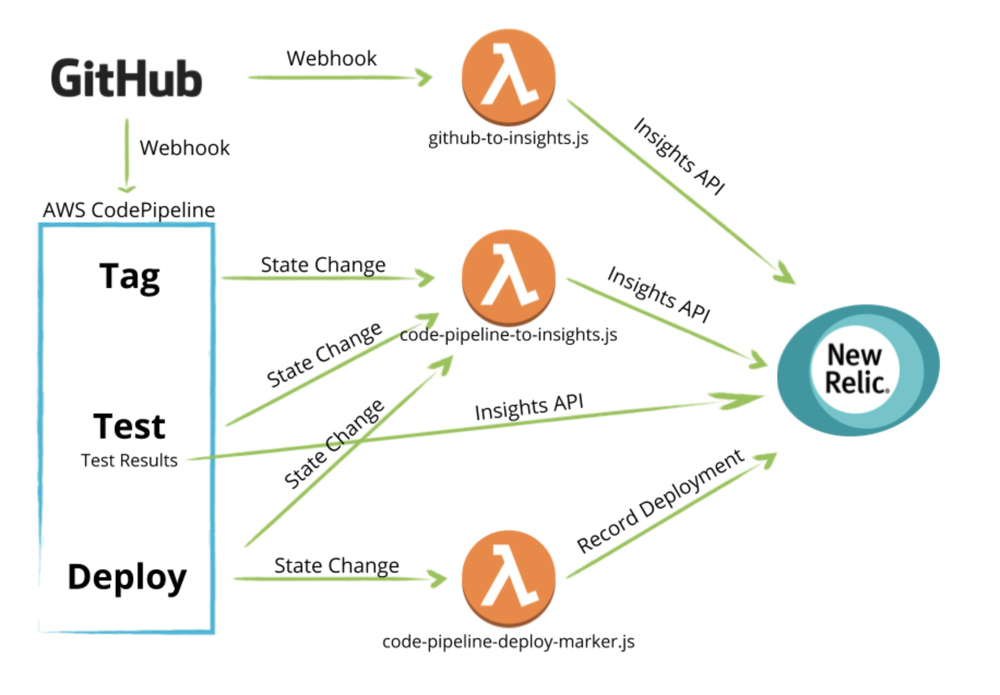
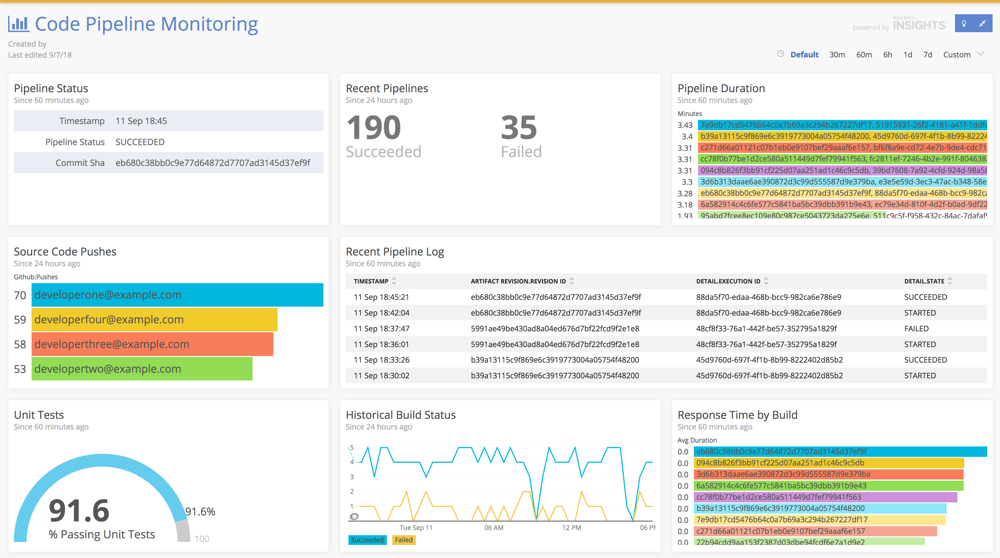

高機能なDevOpsチームは、インスツルメンテーションを使用して、より頻繁に、より少ないリスクで変更を本番環境にプッシュします。このプロセスは重要なインサイトをもたらします。ビルド・パイプラインのパフォーマンスはどうか？どこに問題があるのか？重要なのは、パイプラインを追跡し、改善するために、パイプラインを計測することです。

## 前提条件

このチュートリアルを始める前に、 [Establish team dashboards](/docs/using-new-relic/welcome-new-relic/measure-devops-success/establish-team-dashboards-gather-visualize-key-metrics) チュートリアルを必ず完了してください。

## 1.何を追跡するかを特定する

CI/CDシステムを見て、収集したい統計データを決定します。最低でも、コミットメタデータ、ビルドステータス、テスト結果、デプロイステータス、パフォーマンスメトリクスから始めることをお勧めします。

<figcaption>
  どの統計情報をNew Relicに報告するかを決定します。
</figcaption>

## 2.パイプラインの計測に必要なイベントの取得

1. パイプライン/CI/CDシステムの状態変化をタイムスタンプ付きで記録し、あるステージがいつ開始されたか、そのステージが成功したか失敗したかを示します。このステップにより、デプロイメントの頻度、ビルドの品質、その他のパフォーマンス指標の傾向を見ながら、デプロイメントプロセスを時系列で追跡することができます。
2. 最も簡単に追跡できるように、ソースコード管理システム（SCM）にタイムスタンプ付きの変更を取り込み、少なくとも作成者とハッシュまたは固有の変更IDを入力します。この情報を可能な限り広めましょう。
3. 独自のビルドシステムをお持ちの場合は、各ステージでカスタムイベントを発行するコードを追加します。ホスティングサービスの場合は、これらのカスタムイベントをフォーマットして転送するための軽量な仲介サービス／FaaS（function-as-a-service）を作成します。

以下の例では、 [AWS CodePipeline](https://aws.amazon.com/codepipeline/) を使用して、GitHub でソースを取得し、 [AWS CodeBuild](https://aws.amazon.com/codebuild/) でビルドとテストを行い、 [Elastic Beanstalk](https://aws.amazon.com/elasticbeanstalk/) でデプロイしたアプリケーションのフローを管理しています。この例では、Node.jsで書かれたシンプルなサービスと、GitHubやAWSからNew Relicにデータをプッシュするために必要な"グルーコード" とイベントハンドラを利用しています。この例のコードは [github.com/newrelic/webinar](https://github.com/newrelic/webinar) で公開しています。

<figcaption>
  AWS CodePipelineを使用して、フローのさまざまな部分を理解します。
</figcaption>

ここで使用しているツールや製品は、コード・パイプラインをインスツルメンテーションする際に考慮すべきデータやイベントの種類に関するコンセプトを説明することを目的として、例として選んだものです。しかし、このサンプルコードは、ほとんどのツールセットに対応できるような汎用性のあるものになっています。

## アウトカム

以下は、コードパイプラインを追跡するために作成したダッシュボードのサンプルです。

<figcaption>
  New Relic Insights でダッシュボードを作成し、コードパイプラインを追跡します。
</figcaption>

このようなダッシュボードは、以下のような多くのメリットをもたらします。

* デプロイサイクルの短縮化
* 頻繁にデプロイ障害が発生するサービスやテストカバレッジにギャップがあるサービスを特定し、信頼性向上のための作業を優先させることができる。
* 品質を犠牲にしてまでスピードを追求する必要はありません。
* 変化に伴う失敗に、より効果的に対応する。