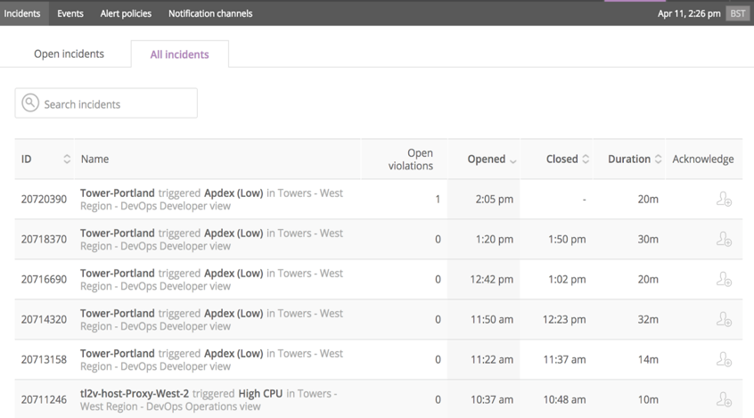

DevOps を成功裏に拡大するには、アプリケーションチームや関連サービス間の依存関係をしっかりと理解する必要があります。 [New Relics のサービスマップ](/docs/using-new-relic/service-maps/get-started/introduction-service-maps) を使用して、アップストリームおよびダウンストリームのサービスからリスクのある依存関係を発見し、軽減します。

## 前提条件

このチュートリアルは、 [これまでのDevOpsの手順](/docs/using-new-relic/welcome-new-relic/measure-devops-success/guide-measuring-devops-success) を完了していることを前提としています。

## 1.サービスマップによる依存関係の分析

[サービスマップ](/docs/using-new-relic/service-maps/get-started/introduction-service-maps) を各アプリケーションに使用し、依存するシステムやトランザクションを記します。

New Relic では、まず **Discover your environment** オプションを使って、アーキテクチャ全体を見ることをお勧めします。


<figcaption>
  **[one.newrelic.com](https://one.newrelic.com) > サービスマップ> アプリ・サービス一覧**
</figcaption>

この初期表示では、お客様のアカウントで設定されているすべてのアプリケーションが表示されます。警告のしきい値に違反したアプリケーションは黄色で表示され、警告が有効なアプリケーションは赤で表示されます。健全なアプリケーションは緑色で表示されます。

New Relic では、アプリケーションと、そのアプリケーションが接続しているサービス（データベースなど）を太い線でマッピングしています。これらのマップをよく理解して、アプリケーションとそのサービスがどのように組み合わされているかを確認してください。どのアプリケーションが最も多くの依存関係を持っているか、どのアプリケーションがAPIなどの同じ依存関係に依存しているかに注意してください。

アプリケーションをクリックすると、過去30分間のスループット、レスポンスタイム、Apadexスコア、エラーレートなど、そのアプリケーションに関するハイレベルなメトリクスが表示されます。スループットを追跡することは、どのアプリケーションが最も多くのトラフィックを提供しているかを判断する良い方法です。

アーキテクチャ全体を確認した後、依存関係が最も多いアプリケーションを確認します。 **App/Services** リストを選択すると、アプリケーションの全リストが表示されます。


<figcaption>
  **[one.newrelic.com](https://one.newrelic.com) > サービスマップ> アプリ・サービス一覧**
</figcaption>

この例では、 **App/Services** のリストから **Tower-Chicago** を選択しています。 **Tower-Chicago** に送られているすべてのトラフィックは、 **Proxy-East** から来ています。この場合、 **Tower-Chicago** は、毎分48.3のリクエストを表示しており、これは **Proxy-East** を流れる毎分426のリクエストの11.3%にあたります。


<figcaption>
  **[one.newrelic.com](https://one.newrelic.com) > サービスマップ> アプリ・サービス一覧**
</figcaption>

多くの場合、サービスマップで表現される個別のアプリケーションやサービスは、別々のチームによって作成され、維持されています。アーキテクチャの依存関係を確認するこの作業には、それぞれのチームの代表者が参加する必要があります。

チームで協力して、次のような質問をしてみましょう。

* その依存性はどの程度重要なのでしょうか？
* 仮に潰れてしまったらどうなるのか？
* 前回ダウンしたときはどうだったのでしょうか？
* 収入減はありましたか？

## 2.バックエンドアプリケーションの依存性リスクの特定

アプリケーションの依存関係を分析したら、依存関係の実行の質を調べてみましょう。例えば、特定した各アプリケーションやトランザクションについて、依存関係が安定していて予測可能かどうか。

そのためにはまず、アプリケーションについて収集したデータをより詳細に分析することができる [New Relic Insights](https://newrelic.com/solutions/real-time-analytics) から、できる限りの情報を収集する必要があります。

[以下は、バックエンドサービスのパフォーマンスをさらに分析するためのNRQL](/docs/insights/nrql-new-relic-query-language/nrql-resources/nrql-syntax-components-functions) クエリの例です。

```
SELECT count(appName)/30 as 'Throughput', apdex(duration), average(duration), stddev(duration), max(duration), count(error_type), uniquecount(host) FROM Transaction FACET appName SINCE 30 MINUTES AGO
```

このクエリは、各アプリケーションの 1 分あたりのリクエスト数（スループット）、Apadex スコア、およびアプリケーションの全体的なパフォーマンスの概要を表示します（標準偏差の計算により、数値が低いほど一般的に優れています）。また、期間中のエラーや、アプリケーションを実行しているホストの数も表示されます。


<figcaption>
  **[insights.newrelic.com](https://insights.newrelic.com) > 問い合わせ結果**
</figcaption>

次に、 [New Relic Alerts](/docs/alerts) からサービスに関連するインシデントやイベントの情報を収集します。

* クリック **アラート** > **インシデント** > **オールインシデント**.

  

  <figcaption>
    **[alerts.newrelic.com](https://alerts.newrelic.com) > インシデント> オールインシデント**
  </figcaption>

* クリック **アラート** > **イベント** > **すべてのイベント**.

  

  <figcaption>
    **[alerts.newrelic.com](https://alerts.newrelic.com) > 事件> すべてのイベント**
  </figcaption>

<Callout variant="tip">
  Webhooks を使用して [New Relic Insights](https://newrelic.com/solutions/real-time-analytics) にアラートイベントを送信すると、ダッシュボードにアラートデータを補足することができます。その手順は、 [このコミュニティのディスカッションポスト](https://discuss.newrelic.com/t/sending-alerts-data-to-insights/34693) で紹介されています。
</Callout>

ここでは、この演習の結果を簡略化した例を紹介します。

<table>
  <thead>
    <tr>
      <th>
        アプリケーション
      </th>

      <th>
        依存関係の数
      </th>

      <th>
        RPM
      </th>

      <th>
        ホスト
      </th>

      <th>
        APDEX（平均値）
      </th>

      <th>
        最後の停電
      </th>

      <th>
        TTR (hrs)
      </th>
    </tr>
  </thead>

  <tbody>
    <tr>
      <td>
        ルーティングサービス
      </td>

      <td>
        10
      </td>

      <td>
        983
      </td>

      <td>
        4
      </td>

      <td>
        .93
      </td>

      <td>
        2/19/18
      </td>

      <td>
        .75
      </td>
    </tr>

    <tr>
      <td>
        タワー・オースティン
      </td>

      <td>
        1
      </td>

      <td>
        58
      </td>

      <td>
        1
      </td>

      <td>
        .95
      </td>

      <td>
        10/11/17
      </td>

      <td>
        1.5
      </td>
    </tr>

    <tr>
      <td>
        プロキシ・イースト
      </td>

      <td>
        11
      </td>

      <td>
        498
      </td>

      <td>
        4
      </td>

      <td>
        .92
      </td>

      <td>
        1/4/18
      </td>

      <td>
        .25
      </td>
    </tr>

    <tr>
      <td>
        プロキシ・ウエスト
      </td>

      <td>
        11
      </td>

      <td>
        495
      </td>

      <td>
        4
      </td>

      <td>
        .97
      </td>

      <td>
        12/3/17
      </td>

      <td>
        .25
      </td>
    </tr>

    <tr>
      <td>
        ウェブポータル
      </td>

      <td>
        7
      </td>

      <td>
        396
      </td>

      <td>
        8
      </td>

      <td>
        .98
      </td>

      <td>
        4/1/18
      </td>

      <td>
        2.5
      </td>
    </tr>
  </tbody>
</table>

このデータを、チームがサービスについて知っているデータや、ステップ1の依存関係の演習で収集したデータと補足し、そのデータを使って、緩和すべきサービスの中で最もリスクの高い分野についての仮説を立てます。

## 3.フロントエンドの依存性リスクの特定

バックエンドの依存関係を分析した後は、フロントエンドの依存関係を調べます。これは重要なステップです。というのも、スタックの上位に行くほど、またユーザーに近づくほど、より多くの依存関係や抽象化が発生する可能性があるからです。

サービスマップは、 [ブラウザ監視](/docs/browser/new-relic-browser/getting-started/introduction-new-relic-browser) と [モバイル監視](/docs/mobile-monitoring) のデータをシームレスに統合し、フロントエンドのユーザーインターフェースからバックエンドのサービスまでの依存関係を理解するのに役立ちます。


<figcaption>
  **[one.newrelic.com](https://one.newrelic.com) > サービスマップ**
</figcaption>

サービスマップビューを使用してフロントエンドの依存関係を掘り下げ、バックエンドの依存関係について実施したものと同様の演習を行います。この演習でも、対処すべきリスク領域を特定し、最適化するためのデータが得られます。ユーザーインターフェース（UI）チームと一緒に分析を行うことをお勧めします。そうすることで、UIチームが経験に基づいて何が重要だと考えているか、補完的な質的理解を得ることができます。UIチームが最も重要と考える依存関係のランキングは、この作業の有用なアウトプットとなります。

## 4.マイクロサービスの依存関係の特定

マイクロサービスを使用している場合、数百とは言わないまでも、何十ものサービスがお互いに呼び出していることがあります。 **Distributed Tracing** を使用して、これらすべてのサービスがどのように接続されているか、また、リクエストがこれらの異なるサービスをどのように通過するかを確認します。

分散トレースでは、リクエストが分散システムを通過する際の経路を確認することができます。分散トレースは、複数の"スパンで構成されています。" は、サービスやサービスのリソースに費やされた時間を表しています。

APM の左ナビにある **Distributed tracing メニュー** をクリックします。トレースリスト "画面が表示され、低速のトレースやエラーのあるトレースを素早く識別することができます。散布図では、異常値を簡単に確認できます。その下にはトレースのサマリーがあり、トレースをクリックすると詳細が表示されます。分散されたトレースに入り、各スパンにかかる時間を確認できます。各スパンをクリックすると、過去のパフォーマンス・チャートや関連する属性が表示され、問題の理解やトラブルシューティングに必要なコンテキストが重ねて表示されます。


<figcaption>
  **[one.newrelic.com](https://one.newrelic.com) > APM> (select an app)> 分散型トレース**
</figcaption>

これで、依存関係のリストが完成しました。

## 5.リスクを軽減するためのアクションプランの作成

フロントエンドとバックエンドの両方のサービスからアプリケーション全体の依存関係を分析したら、依存関係のリスクを減らし、サービスレベル目標（SLO）を達成するためのアクションプランを作成します。

次のステップへの優先順位を決める際には、以下の4つの原則を念頭に置くことをお勧めします。

1. **リスクの許容範囲を理解します。** リスクの許容範囲を明確に把握することは有益であり、理想的にはサービスレベル目標から情報を得るべきです（詳細については、 [Establish Objectives and Baselines](/docs/establish-objectives-baselines) チュートリアルを参照してください）。SLO達成との関連性が高いと判断した依存関係を監視するために、アラートポリシーを設定します。
2. **依存関係を最小限にします。** コードをシンプルにすればするほど、他のモジュールを参照する機能が少なくなります。不必要な複雑さを排除することは、顧客の期待に応える保守可能なシステムを確保するための重要な手段です。
3. **依存関係をローカリゼーションする。** あなたが書くコードでは、可能な限り相互に依存する関数をパッケージ化してください。
4. **依存関係を安定させる。** 依存関係が避けられない場合は、これらの依存関係が、最も変更される可能性が低い、または代替が容易なモジュールを指すようにすることで、リスクを軽減します。

アクションプランが完了したら、取り組みの結果をモニタリングしてください。依存性リスクを解決するためのアクションの有効性は、最終的にはSLOによって評価されるべきです。