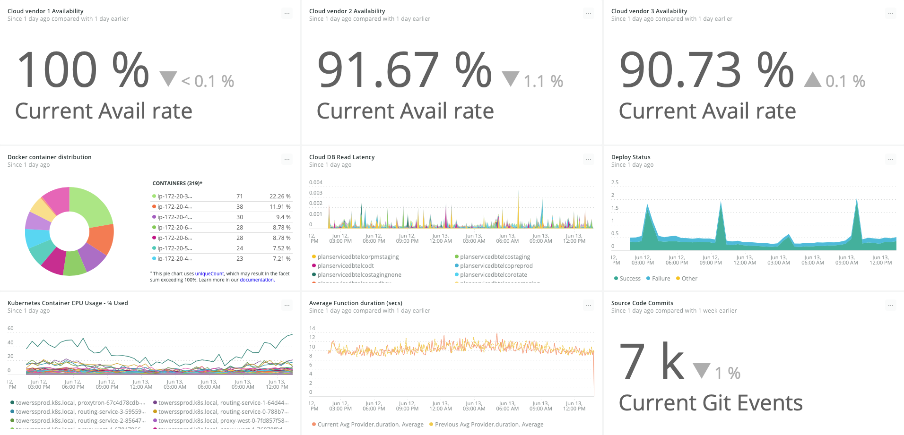

クラウドへの移行が完了したばかりであっても、クラウド・ベースのサービスを以前から利用している場合であっても、あるいは常にクラウドを利用している場合であっても、最新で最先端の技術やサービスを導入していることに気づくかもしれません。新しいサービスを自信を持って簡単に導入できる能力を身につけることが重要です。クラウドを利用している企業にとって技術革新は止まることがなく、新しい技術を積極的に取り入れることで、企業は競争上の大きな差別化を図ることができます。

これらの最新技術は、例えば、 **Docker** 、 **Kubernetes** 、 **Amazon AWS ECS** や **Fargate** などのコンテナソリューションかもしれません。あるいは、 **AWS Lambda** 、 **Microsoft Azure** 、 **Google Cloud Platform Functions** などのサーバーレスサービスである可能性もあります。また、クラウドベースのデータベースであったり、オペレーションを維持するインフラからサービスを抽象化する様々なクラウドサービスであったりします。

このような状況では、最新のテクノロジーとクラウドベースのサービスの両方について、パフォーマンスや使用状況のメトリクスを監視、照会、警告したいと思うでしょう。これにより、チームはより迅速にデプロイし、自信を持って新しいサービスを採用し、より良いビジネス上の意思決定を行うことができるようになり、全般的にテクノロジーの視野が広がります。

ここでは、 [New Relic Platform](https://newrelic.com/platform) を使って、最新のテクノロジーやクラウドサービスを監視するための手順をご紹介します。

## 1.サービスと技術の特定 [#identify-apps]

以下の質問に答えることで、モニターする必要のあるコンポーネントを決定します。

* どのようなクラウドベースのアプリケーションを有しているか?
* 元になるクラウドベースのサービスやテクノロジー、これらのアプリケーションをサポートするインフラストラクチャは何か?

アーキテクチャ [を完全に理解していれば、組織のアプリケーション環境に影響を与える可能性のある依存関係や新しいサービスを見落とす可能性を減らすことができます。](/docs/identify-application-dependencies-inventory)

## [2.New Relic インフラストラクチャの導入 [#deploy-Infrastructure]](/docs/identify-application-dependencies-inventory)

[New Relic Infrastructure の ](/docs/identify-application-dependencies-inventory)[要件](/docs/infrastructure/new-relic-infrastructure/getting-started/compatibility-requirements-new-relic-infrastructure) を確認した後、 [Infrastructure エージェント](/docs/infrastructure/new-relic-infrastructure/installation) をステップ 1 で確認したホストにインストールし、クラウド サービスを監視できるようにします。

自動化に[AnsibleまたはChef、Puppet](/docs/infrastructure/new-relic-infrastructure/config-management-tools)を使用している場合、これらのツールを使用してInfrastructureエージェントをホストにディプロイできます。

## 3. クラウドインテグレーションを設定 [#configure-integrations]

新しいクラウドサービスを統合する際には、New Relic を使用してこれらのサービスに関するデータを監視し、レポートすることで、アーキテクチャ全体を1つの包括的な概要として把握することができます。

クラウドサービスの統合を設定するには、 [Amazon Web Services (AWS)](/docs/infrastructure/amazon-integrations/aws-integrations-list) 、 [Microsoft Azure](/docs/infrastructure/microsoft-azure-integrations/azure-integrations-list) 、 [Google Cloud Platform (GCP)](/docs/integrations/google-cloud-platform-integrations) のサービスプロバイダーのアカウントを New Relic とリンクさせます。

## 4. ダッシュボードでのデータの追跡 [#integration-dashboards]

[New Relic Infrastructure インテグレーション](/docs/infrastructure/infrastructure-integrations/get-started/introduction-infrastructure-integrations)は、ダッシュボードに、AWSやAzure、GCPなどのクラウドプロバイダーからのメトリックスを自動入力するので、クラウドの採用を成功させるのに不可欠なデータを追跡できます。

<Callout variant="tip">
  複数のクラウドプロバイダーからなるハイブリッドクラウドを採用している場合、New Relicはクラウドプロバイダーに依存しない[全体的な視点](#insights-dashboards)を提供できます。
</Callout>

<CollapserGroup>
  <Collapser
    id="aws-ec2-dashboard"
    title="AWS EC2モニタリングインテグレーションダッシュボード"
  >
    [AWS EC2モニタリングインテグレーション](/docs/integrations/amazon-integrations/aws-integrations-list/aws-ec2-monitoring-integration)用のこのデフォルトのダッシュボードで、New Relicは地域やインスタンスの状態、インスタンスのタイプごとにEC2インスタンスのメトリクスを取得します。ダッシュボードには、これらのインスタンスでインストールされるさまざまなソフトウェアパッケージや設定のインベントリも表示されます。

    

    <figcaption>
      **[one.newrelic.com](https://one.newrelic.com) > Infrastructure > Integrations > Amazon Web Services**：AWS EC2モニタリングインテグレーションのデフォルトのダッシュボードでAWS EC2データを表示します。
    </figcaption>
  </Collapser>

  <Collapser
    id="azure-vms-dashboard"
    title="Azure VMモニタリングインテグレーションダッシュボード"
  >
    デフォルトの[Azure仮想マシンインテグレーション](/docs/integrations/microsoft-azure-integrations/azure-integrations-list/azure-vms-monitoring-integration)ダッシュボードには、VMのサイズや地域ごとのVM、リソースグループごとのVMのデータが表示されます。

    

    <figcaption>
      **[one.newrelic.com](https://one.newrelic.com) > Infrastructure > Integrations > Microsoft Azure**：Azure VM監視インテグレーションのデフォルトのダッシュボードでAzure仮想マシンデータを表示します。
    </figcaption>
  </Collapser>

  <Collapser
    id="gcp-dashboard"
    title="Google Compute Engineのモニタリングインテグレーションダッシュボード"
  >
    Google Cloud Platform用のこのデフォルトのダッシュボードで、New Relicは、ゾーンごとのインスタンスやインスタンスのステータス、ファイアウォールが中断したパケット、保留されたコア、ディスクスロットリングオペレーションのメトリクスを取得します。ダッシュボードには、これらのインスタンスでインストールされるさまざまなソフトウェアパッケージや設定のインベントリも表示されます。

    

    <figcaption>
      **[one.newrelic.com](https://one.newrelic.com) > Infrastructure > Integrations > Google Cloud Platform**：GCP計算エンジンモニタリングインテグレーションのデフォルトのダッシュボードでGCP計算エンジンデータを表示します。
    </figcaption>
  </Collapser>

  <Collapser
    id="modern-dashboard"
    title="最新のクラウドサービスダッシュボードの例"
  >
    このダッシュボードの例では、3つの異なるクラウドベンダーと最新テクノロジー、クラウドサービス、インフラストラクチャインスタンスの場所、DevOpsウィジェットを組み合わせて、全体的に表示されます。

    

    <figcaption>
      **[one.newrelic.com](one.newrelic.com) > ダッシュボード**: ベンダー、テクノロジー、サービス、インスタンスなど、DevOpsチームにとって重要な詳細情報のデータを含むInsightsダッシュボードの例です。
    </figcaption>
  </Collapser>
</CollapserGroup>

## 5. クラウドベースのメトリクスのアラートを追加 [#add-alerts]

クラウドベースのサービスを監視する際には、システムへのすべての変更を [アラート](/docs/alerts/new-relic-alerts/getting-started/introduction-new-relic-alerts) で追跡することが不可欠です。New Relic Infrastructureとの統合により、 [お客様にとって最も重要なメトリクスに対して](/docs/alerts/new-relic-alerts/defining-conditions/create-alert-conditions-nrql-queries) アラートを作成することができます。

ここでは、 [ベースラインアラートの例として、 ](/docs/alerts/new-relic-alerts/defining-conditions/create-baseline-alert-conditions)[ALB監視統合のための全てのAWS Elastic Load Balancing(ALB)システムで受信したリクエスト数に基づいて通知される](/docs/integrations/amazon-integrations/aws-integrations-list/aws-alb-monitoring-integration) を紹介します。

<figcaption>
  **[alerts.newrelic.com](https://alerts.newrelic.com) > Alert policies >（選択したポリシー）> Alert **conditions：NRQLベースラインアラートを作成し、ALBシステムの受信リクエスト数を監視します。
</figcaption>

## 6. 追加モニタリングの設定 [#additional-monitoring]

アプリケーションのあらゆる側面をフルスタックで可視化するには、他のタイプのNew Relicモニタリングをデプロイすることをお勧めします。

* [APM](/docs/apm)を使用して、アプリケーションとティアのパフォーマンスメトリクスをレポートします。
* [ブラウザモニタリング](/docs/browser)を使用して、フロントエンドのウェブメトリクスをレポートします。
* [モバイルモニタリング](/docs/mobile-monitoring)を使用して、フロントエンドのモバイルアプリメトリクスをレポートします。
* [Syntheticモニタリング](/docs/synthetics)を使用して、ウェブサイトや重要なビジネストランザクション、APIエンドポイントをモニターします。

## 7.CI/CDパイプラインの統合 [#pipeline-integration]

デプロイメントを追跡し、コードやインフラの変更がエンドユーザー・エクスペリエンスに与える影響を把握することは重要です。 [APM](/docs/apm/new-relic-apm/getting-started/introduction-new-relic-apm) デプロイ・マーカーを使用すると、アプリケーションごとに [デプロイメントを記録することができます](/docs/apm/new-relic-apm/maintenance/record-deployments) 。

デプロイメントマーカーとは、デプロイメントが行われたことを示すイベントのことです。マーカーは、ソースコード管理（SCM）システムのメタデータ（ユーザーID、リビジョン、変更ログなど）と組み合わせることができます。APM は、デプロイメントイベントのタイムスタンプを示す縦線（マーカー）をチャートやグラフに表示します。この線の上にカーソルを置くと、そのデプロイメントに関連するメタデータが表示されます。

デプロイメントを追跡することは、アプリケーションの即時的、長期的、または段階的な劣化の根本原因を特定するための貴重な方法です。

推奨します。New Relic REST API への POST リクエストは、CI/CD デプロイメントを成功させるための最終ステップとして、 [API ドキュメント](/docs/apm/new-relic-apm/maintenance/record-deployments) に記載されている通りに行います。

次のツールには、CI/CDデプロイメントの自動化に役立つインテグレーションやプラグインがあります：

* [Chef](https://supermarket.chef.io/cookbooks/newrelic) (newrelic_deployment参照)
* [Jenkins](https://wiki.jenkins.io/display/JENKINS/New+Relic+Deployment+Notifier+Plugin)
* [Ansible](https://docs.ansible.com/ansible/latest/modules/newrelic_deployment_module.html)
* [Puppet](https://puppet.com/docs/pipelines-for-apps/free/integrate-newrelic.html)

## 8.AWS Lambdaのモニタリング [#pipeline-integration]

New Relic Oneには、エフェメラルなLambda関数にコストと時間の観点から高度に最適化されたアップデートされたAPMエージェントが搭載されています。 [AWS Lambda](/docs/serverless-function-monitoring/aws-lambda-monitoring/get-started/enable-new-relic-monitoring-aws-lambda) のNew Relicモニタリングを有効にすることで、起動数、エラー率、関数の継続時間、コールドスタートなどを評価することができます。また、 [New Relic の Infrastructure integration with Lambda](/docs/integrations/amazon-integrations/aws-integrations-list/aws-lambda-monitoring-integration) を利用して、追加のレポート機能を利用することもできます。