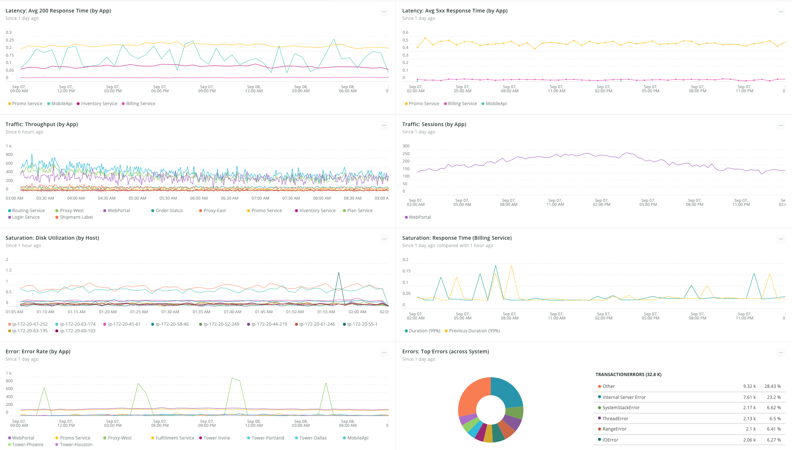
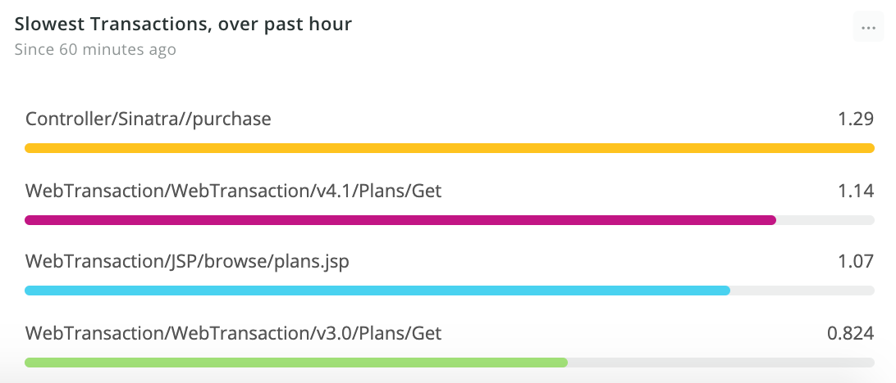
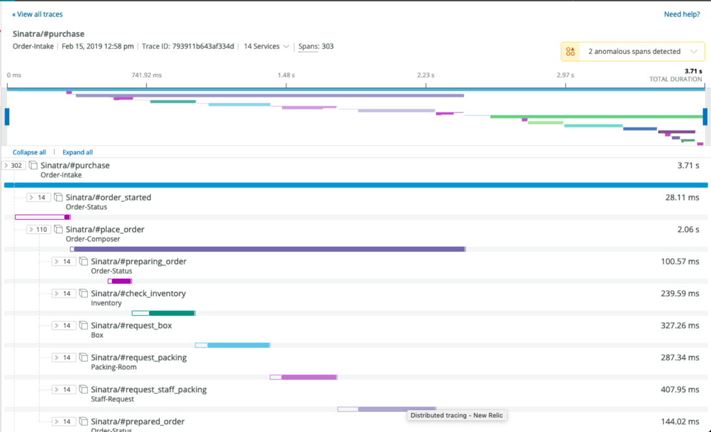

モノリシックなアプリケーションでは、シンプルなスタックトレースにコード欠陥の根本原因を特定するのに十分な診断データが含まれています。しかし、クラウドコンピューティングとマイクロサービスは、ソフトウェアとインフラストラクチャの境界線を曖昧にしています。最新のアーキテクチャでは、リクエストは、オンプレミスとクラウドの両方の環境でホストされた、多くの小さなサービス（多くの場合、一時的な寿命を持つ）に分散されます。コードの欠陥を発見することはより複雑になります。APMの分散トレースは、このような分散システムのトラブルシューティングを自動的にサポートします。

分散型トレースは、よく監視されたシステムの1つの要素に過ぎません。特に不具合の根本的な原因を追跡する場合は、評価・理解すべきデータが大量にあるため、分散システムの全体像を把握する必要があります。マイクロサービス環境を管理する際には、平均解決時間（MTTR）やエンドユーザー・エクスペリエンスを低下させないように、ボトルネックや問題の広がりを迅速に発見する能力が重要になります。

New Relicでは、これらの課題を本質的に理解しています。私たちは、Ruby のモノリスから、300 以上のマイクロサービス上に構築された多言語の分散環境へと移行し、1 日に平均 50 のコードをデプロイしてきました。このような課題は、New Relic の構築方法と監視方法の両方に反映されています。

New Relicプラットフォームを使用してデータを適切なインサイトに変換することで、共通のフレームワークを使ってコラボレーションを行い、コンテキストを構築し、複雑な分散システムの最適化やトラブルシューティングを迅速に行うことができます。

## 1.モニタリングすべき優先度の高い分野の特定 [#identify-areas]

分散システムは複雑です。New Relicプラットフォームを利用する前に、システムの中で最も重要な観測領域を特定し、優先度の高い領域を最初にインスツルメンテーションすることに集中することをお勧めします。Google の [SRE ハンドブックでは、次のダッシュボードに示すように、"4 つのゴールデンシグナル"](https://landing.google.com/sre/sre-book/chapters/monitoring-distributed-systems/#xref_monitoring_golden-signals) : トラフィック、レイテンシー、エラー、サチュレーションを監視することを提案しています。



<figcaption>
  **ダッシュボード**: ダッシュボードで監視すべき重要なエリアを視覚化します。
</figcaption>

しばしば、チームは、1）測定が容易なもの、2）解釈可能なものをモニターします。このような誤りを避けるために何をモニターするかを決める際には、プロダクトマネージャーや他のステークホルダーを巻き込みましょう。目的は、ビジネスにとって重要なものをモニターすることであり、チームに過剰なノイズを与えることではありません。

## 2.必要な視認性を得るための機器 [#instrument]

重要な優先事項を特定したら、システムの適切な部分にNew Relicプラットフォームを導入します。

* [APM](/docs/apm) でウェブアプリを監視します。 [Compatibility and requirements for New Relic agents and products](/docs/agents/manage-apm-agents/installation/compatibility-requirements-new-relic-agents) を参照して、サポートされている各言語の正確な互換性の詳細を確認してから、 [APM エージェント](/docs/agents/manage-apm-agents/installation/install-agent) をアプリケーションスタックにインストールしてください。APM エージェントをインストールする手順は、言語によって異なります。
* [APMのdistributed tracing](/docs/apm/distributed-tracing/enable-configure/enable-distributed-tracing) を有効にします。この機能は既存のAPM機能の一部に影響を与えます。Distributed TracingなしでAPMを使用することに慣れている場合は、この機能を有効にする前に、 [transition guide](/docs/distributed-tracing-transition-guide) をお読みください。
* [インフラストラクチャ](/docs/infrastructure) でコンピュートリソースを監視します。サポートされているオペレーティングシステムと環境については、 [互換性とインフラストラクチャ監視のための要件](/docs/infrastructure/new-relic-infrastructure/getting-started/compatibility-requirements-new-relic-infrastructure) を参照してください。また、 [オン・ホスト・インテグレーション](/docs/infrastructure/host-integrations/host-integrations-list) を使って、他の製品やサービスをインストゥルメントすることもできます。
* [モバイル](/docs/mobile) と [ブラウザ](/docs/browser) で、フロントエンドのエクスペリエンスを監視します。

## 3.ダッシュボードの作成 [#insights-dashboards]

[ダッシュボード](/docs/query-your-data/explore-query-data/dashboards/introduction-new-relic-one-dashboards) を使用して、システム全体の概要とベースライン・パフォーマンスを把握することで、コンポーネントがどのように連携しているかをよりよく理解することができます。Insightsは、関連するデータに基づいて、異なるチームを調整するための単一のフレームワークを提供します。この最初の構築は、システムにコンテキストを持たせるための出発点として、チームに反応を与えるものです。分散システムの分析、トラブルシューティング、最適化を行いながら、ダッシュボードの構築と反復を続けていく必要があります。

システムを基本的に理解した後も、ダッシュボードを使用して、今後の意思決定に役立ててください。ダッシュボードは、すべての利害関係者がシステムの健全性に関するコンテキストを構築できるように、真実の中心となるリポジトリを提供します。以下は、最も遅いアプリケーションを表示するクエリの例です。

```
SELECT percentile(duration, 99) as 'Slowest duration' FROM Transaction FACET name
```

このクエリを使用すると、最も遅いアプリケーションに焦点を当てて、より深く掘り下げることができます。



<figcaption>
  クエリを実行すると、ダッシュボードには最も遅い持続時間が表示されます。
</figcaption>

## 4.分散型トレースで深堀りする [#distributed-tracing]

基本的なインスツルメンテーションとコンテクストに基づいたダッシュボードが整備されたら、トラブルシューティングやシステムの最適化のために、より深く掘り下げることができるようになります。 [New Relic OneのGlobal Distributed Tracing](/docs/apm/distributed-tracing/ui-data/additional-distributed-tracing-features-new-relic-one) の差別化された機能は、調査対象の漠然とした文脈から入って、 **すべての** アカウントとトレースを検索して、トレースのどこかに __の属性を持つ実際のユーザーインタラクションを突き止めることができることです。そのアプリケーションを含むトレースを検索するために、アプリケーションや特定のエンティティから始める必要はもうありません。

例えば、複雑なサービスコールの分析から始めて、 [分散型トレーシング](/docs/apm/distributed-tracing/getting-started/introduction-distributed-tracing) UIを使って

* 分散したトレースの頻度や継続時間などの散布図を見ることができます。
* ルート・エントリ、サービス、サービス・エントリ、またはエラーのあるトレースでトレースをグループ化
* トレースリストの表示
* 特定のパラメータを満たすトレースをフィルタリング

さらに一歩進んだ分析を行うために、トレースにユーザーIDなどのトラブルシューティングに役立つ情報をアノテーションしたいと思うことでしょう。New Relic では、 [カスタムアトリビュート](/docs/agents/manage-apm-agents/agent-data/collect-custom-attributes) を使ってこれを行うことができます。



<figcaption>
  **[one.newrelic.com](https://one.newrelic.com) > APM> Distributed tracing**: **distributed tracing** UIを使って、最新の分散システムを監視・分析します。
</figcaption>

## 5.分散型トレーシングペイロードAPIによるメッセージキューのアノテーション [#annotate-queues]

例えば、キューに大きく依存しているシステムなど、いくつかの環境でサービス間の接続を確認するためには、ペイロードを確実に伝播させるために、 [分散型トレーシングペイロード APIs](/docs/apm/distributed-tracing/enable-configure/enable-distributed-tracing#agent-apis) を使用して手動で計測を行う必要があるかもしれません。これにより、エージェントは適切な相関関係を持つスパンを作成するために必要なコンテキストを得ることができます。キューを経由するものを含め、リンクされたすべてのサービスのエンドツーエンドのトレースが表示されます。

<CollapserGroup>
  <Collapser
    id=""
    title="アノテーションされたメッセージキューの例"
  >
    たとえば、

    1. トランザクションを開始します。

    2. プロデューサーサービス上で、New Relic トランザクション内に分散トレーシングのペイロードを作成します。

    3. メッセージの一部として、分散型トレーシングのペイロードを追加します。

       ```
       ​​newrelic.setTransactionName("Send Message")
        // Create SQS service object
        var sqs = new AWS.SQS({apiVersion: '2012-11-05'});
        var transactionHandle = newrelic.getTransaction();
        var payload = transactionHandle.createDistributedTracePayload();
        var jsonPayload = payload.text();

       //add the jsonPayload as a MessageAttribute
        var params = {
           DelaySeconds: 10,
           MessageAttributes: {
             "Testing": {
               DataType: "String",
               StringValue: "123"
           },
           "TraceContext": {
             DataType: "String",
             StringValue: jsonPayload
           }
         },
         MessageBody: "Testing 123",
       QueueUrl: "https://sqs.us-west-2.amazonaws.com/408155283954/sqs-testing"
         };
       ```

    4. トランザクションのコンテキストで、コンシューマーサービスでペイロードを受け取ります。

       ```
       sqs.receiveMessage(params, function(err, data) {
          if (err) {
            console.log("Receive Error", err);
          } else if (data && data.Messages) {
            console.log("trace context:")
            var traceContext = 
       data.Messages[0].MessageAttributes.TraceContext.StringValue;
            if (traceContext != "") {
              var transactionHandle = newrelic.getTransaction();
              transactionHandle.acceptDistributedTracePayload(traceContext);
            }
       ```
  </Collapser>
</CollapserGroup>

## 6.カスタム属性によるトレースのアノテーションとタグ付け

[カスタムアトリビュート](/docs/apm/other-features/attributes/collecting-custom-attributes) を使用して、イベントに追加情報を装飾し、より良いトレースを行うことをお勧めします。たとえば、キーと値のペアを追加することで、ユーザーIDを添付し、コールスタックを通じて特定のユーザーを追跡し、失敗したリクエストを確認して、そのユーザーが異常に悪い体験をしていないかどうかを判断することができます。

例えば、受注管理システムを構築している場合は、トレースに注文番号のカスタム属性を追加することができます。

カスタム属性を追加するには、まずエージェントに対して属性を有効にし、次に属性を記録するためのAPIコールを行う必要があります。

<Callout variant="tip">
  カスタム属性の収集に関するエージェント固有の情報については、 [カスタム属性の収集を参照してください。](/docs/agents/manage-apm-agents/agent-data/collect-custom-attributes)
</Callout>

```
sqs.sendMessage(params, function(err, data) {
   if (err) {
     res.send("Error: "+ err);
   } else {
     res.send("Success! Message ID: "+ data.MessageId);
     newrelic.addCustomAttribute("Message ID", data.MessageId)
   }
 });
```

## 7.Syntheticsを活用して、システムの健全性をハイレベルで把握する

複雑な分散システムでは、多くの信号を追跡・監視する必要があります。時には、1つのシグナルには問題がないのに、システム全体が異常な動作をしていることがあります。全体像を把握するためには、システムレベルのデータと併せて、症状を示すデータを分析することが重要です。 [Synthetics](/docs/synthetics/new-relic-synthetics/getting-started/introduction-new-relic-synthetics) では、外部ユーザと同じようにシステム全体を操作することができ、パフォーマンスやユーザ・エクスペリエンスに関するハイレベルなチェックをチームに提供します。このような外部からのチェックは、特定のシグナルが示すものとは関係なく、システム全体が望んだとおりに動作しているかどうかを理解するのに役立ちます。