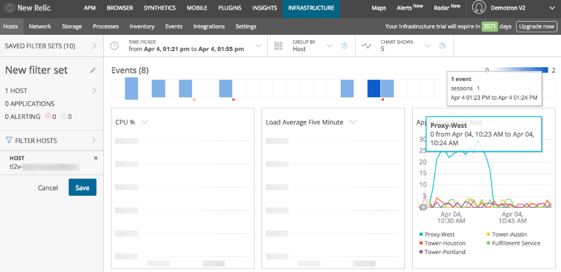

適切な計測を行うことで、チームはシステムに加えた変更の影響を完全に把握することができます。変更前と変更後の具体的で測定可能なメトリクスを取得することで、チームは変更を単独で最適化し、システムで行われている他の作業への影響を軽減することができます。

## 前提条件

このチュートリアルを始める前に、 [Establish objectives and baselines](/docs/establish-objectives-baselines-define-team-slos) を完了してください。

## 1.開発プロセスに計測を組み込む [#integrate-measurements]

開発サイクルのすべてのフェーズに適切な測定を組み込むことで、顧客が発見する前にエラーやパフォーマンスの問題を明らかにすることができます。 アプリケーションチームが作業を計画する際には、毎日のスタンドアップやその他の計画会議で [KPI ダッシュボードを使用して、必要なデバッグ作業を分析し、最近のデプロイメントが成功したかどうかを評価し、その他の作業の優先順位を決定します。開発チームと運用チームが計画や議論の際にダッシュボードを使用することで、顧客の体験や信頼性リスクに関するフィードバックを開発作業に一貫して取り入れることができます。](/docs/using-new-relic/welcome-new-relic/measure-devops-success/establish-team-dashboards)

[適切なテストを行うためには、プリプロダクション環境のインスツルメンテーションが本番環境と同等であることを確認してください。ダッシュボードを使用して環境を比較し、環境間で行ったコードとインフラストラクチャの変更が正しいかどうかを検証し、コードを本番環境にプッシュする前に異常を排除します。](/docs/using-new-relic/welcome-new-relic/measure-devops-success/establish-team-dashboards)

[ソフトウェアのパフォーマンスを測定するために計測器を使用するだけでなく、チームの効率性を分析するためにも計測器を使用します。例えば、アラートのデータを使って、 ](/docs/using-new-relic/welcome-new-relic/measure-devops-success/establish-team-dashboards)[NRQL](/docs/insights/nrql-new-relic-query-language/using-nrql/introduction-nrql) と外部の統合機能を使って、各イベントの現在の状態がOPEN→ACKNOWLEDGED→CLOSEDと変化する際に、イベントのタイムスタンプの差を引くことで、平均修復時間（MTTR）を計算します。

また、 [GitHubなどのソースコード管理（SCM）システムからInsights](/docs/insights/insights-data-sources/custom-data/insert-custom-events-insights-api) にプッシュイベントを入力し、コミットイベントのタイムスタンプとデプロイイベントのタイムスタンプを比較することで、コード変更が本番になるまでの時間を計算します。これを時間軸でプロットすると、DevOps改革のKPIになります。

## 2.自動化されたデプロイメント・マーカーの追加 [#deployment-markers]

デプロイメントを追跡し、コードやインフラの変更がエンドユーザ・エクスペリエンスに与える影響を把握することは重要です。 [APM](/docs/apm/new-relic-apm/getting-started/introduction-new-relic-apm) のデプロイメントマーカーを使用して、 [アプリケーションごとにデプロイメント](/docs/apm/new-relic-apm/maintenance/record-deployments) を記録することができます。

デプロイメントマーカーとは、デプロイメントが発生したことを示すイベントで、SCM システムから得られるメタデータ（ユーザー、リビジョン、変更ログなど）と対になっています。APMは、デプロイメントイベントのタイムスタンプで、チャートやグラフに縦線（マーカー）を表示します。この線の上にカーソルを置くと、APM はそのデプロイメントに関連するメタデータを表示します。

<figcaption>
  **[one.newrelic.com](https://one.newrelic.com) > APM> (select an app)> Monitoring> Overview**
</figcaption>

APMは、アプリケーションのデプロイメントの時系列リストも提供します。また、デプロイ時からのエラーレートやApdexなどの追加メトリクスも利用できます。

<figcaption>
  **[one.newrelic.com](https://one.newrelic.com) > APM> (select an app)> Events> Deployments**
</figcaption>

デプロイメントを追跡することは、アプリケーションの即時的、長期的、または漸進的な劣化の根本原因を判断する貴重な方法です。

New Relic では、CI/CD 導入を成功させるための最終ステップとして、New Relic REST API への POST リクエストを行うことを推奨しています。その方法は、 [API ドキュメント](/docs/apm/new-relic-apm/maintenance/record-deployments) で説明しています。以下のツールには、この作業を自動化するための統合機能やプラグインが用意されています。

* [Chef](https://supermarket.chef.io/cookbooks/newrelic) (newrelic_deployment参照)
* [Jenkins](https://wiki.jenkins.io/display/JENKINS/New+Relic+Deployment+Notifier+Plugin)
* [Ansible](https://docs.ansible.com/ansible/latest/modules/newrelic_deployment_module.html)
* [Puppet](https://forge.puppet.com/claranet/newrelic/readme)

## 3.パイプラインをインフラでテスト

クラウドネイティブ環境を最適化するためには、コードやインフラの変更をより小さく、より頻繁に行うことに文化的にシフトすることが重要です。このチュートリアルの最初の2つのステップが完了したら、テストを開始し、デプロイメント・パイプラインに関する適切なパフォーマンス情報を収集して、変更による影響をより明確に把握します。

コードの変更は、変更するコードの行数やソースファイルの数ができるだけ少なくなるようにします。また、変更に関わるチームメンバーの数もできるだけ少なくします。これにより、エラーが発生した場合に、問題の所有者を特定し、根本的な原因を特定することが非常に容易になります。

同様に、インフラストラクチャの変更も、各変更によって影響を受けるアプリケーションの数を最小限にするために、できるだけフットプリントを小さくする必要があります。 [New Relic Infrastructure](/docs/infrastructure/new-relic-infrastructure/installation/install-infrastructure-linux) では、次の例に示すように、インフラストラクチャの変更によって問題が急増した場合を確認することができます。

<figcaption>
  **[one.newrelic.com](https://one.newrelic.com) > Infrastructure> Hosts**
</figcaption>

クラウドインフラの変更や大規模なコード変更の場合は、 [ブルー/グリーンデプロイメント](https://martinfowler.com/bliki/BlueGreenDeployment.html) 戦略の使用を検討してください。APMは、 [複数のアプリ名](/docs/agents/manage-apm-agents/app-naming/use-multiple-names-app) をサポートしており、このモデルに適しています。

この戦略を実行するために

1. アプリケーションのあるバージョンを、「ブルー」バージョン（またはコントロールバージョン）であることを示すロールアップアプリ名を使って、既存のインフラにデプロイします。
2. アプリケーションの新バージョンを、インフラのサブセット（またはインフラの代替セット）に、「グリーン」バージョン（または実験バージョン）であることを示すロールアップ名を付けてデプロイします。
3. 両バージョン間でトラフィックが適切にルーティングされていることを確認します。
4. 両バージョンの確立されたKPIダッシュボードを相互に比較する。
5. KPI目標を達成するために、新バージョンを適宜最適化する。
6. アプリケーションのパフォーマンスに満足したら、新しいバージョンを元のアプリケーション名でインフラストラクチャ全体にデプロイし、今後アプリケーションに加える変更の新しいベースラインとします。