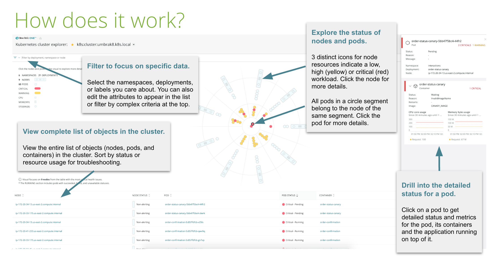
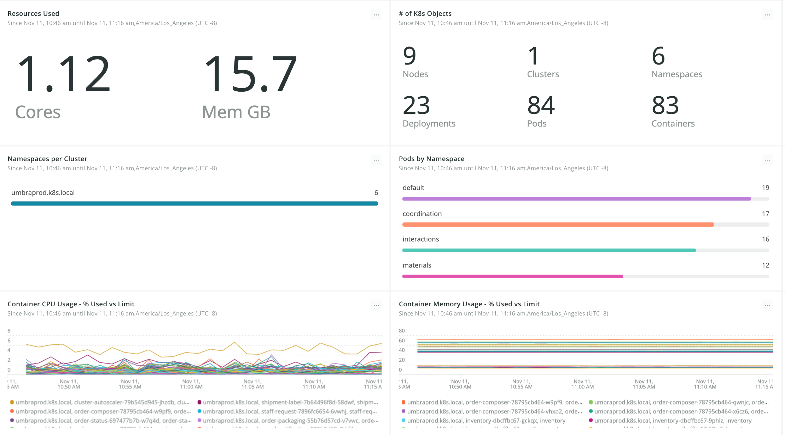

コンテナが広く採用されたことで、アプリケーションの作成やデプロイの方法が変わりました。 [Kubernetes](https://kubernetes.io/) などのコンテナオーケストレーション技術により、コンテナ化されたアプリケーションのスケジューリング、デプロイ、管理が容易になっています。しかし、その一方で、環境やアプリケーションの監視方法を見直す必要があるという課題もあります。

* 課題1：コンテナは本質的に儚いものです。アプリケーションが現在実行されているコンテナやポッド、ノード（ホスト）を知っていても、問題が発生した5分前、15分前、30分前に実行されていた場所を示すとは限りません。コンテナは動的で常に進化する環境にデプロイされるため、最新のモニタリング手法が必要です。
* 課題2：多くの場合、組織はモノリシックなアプリケーションを複数のマイクロサービスに分解するためにコンテナを採用しています。この新しいアプローチは、システムに新たな複雑さをもたらし、コンテナの巨大なスケールと次元は、理解しやすい形式で概念化することが困難です。
* 課題3：差別化されたエンドユーザ・エクスペリエンスを提供することは、すべての組織にとって重要な取り組みであり、より良いソフトウェアをより早くリリースするためにコンテナが採用されています。しかし、この大きなチャンスにはリスクも伴います。なぜなら、新しいコンテナがデプロイされるたびに、クラスターにも影響が及ぶからです。企業は、インフラの変更がアプリケーション・スタックにどのような影響を与えるのか、また、インフラとアプリケーション・スタックの両方の変更がエンドユーザー・エクスペリエンスにどのような影響を与えるのか、といったコンテキストを必要としています。このようなデータをすべてリアルタイムで把握しやすい形式で取得することは、分散型のコンテナ環境では大きな課題です。

New Relicプラットフォームは、コンテナ化されたKubernetes環境の使いやすさと導入のしやすさの両方をお客様に提供します。数回クリックするだけで、インテリジェントに前進するためのデータと自信を得ることができます。

この6つのステップでは、New Relic Oneプラットフォームを使用してコンテナを管理する方法と、コンテナのスケジュール設定方法を説明します。

## 1.最新のインフラストラクチャエージェントに更新し、Kubernetesの統合を有効にする [#update]

まず始めに、最新のInfrastructureエージェントをDaemonSet [でKubernetesクラスタにデプロイする必要があります。新しいノードがデプロイされたり、クラスタがスケールアップ/ダウンしたりすると、DaemonSetはこれらの新しいノードでNew Relicエージェントが実行されていることを保証するため、DaemonSetsの活用はダイナミックなコンテナ環境では不可欠です。さらに、Kubernetes環境の全体像を構築するために、New RelicはKube-stateメトリクスを含む多くのリソースからデータを集約しています。New Relicの「Kubernetesを意識した」アプローチにより、Kubernetesが1つのノード、クラスタ、イベントも見逃すことなく、オーケストレーターとしての役割を果たすことが容易になります。](/docs/integrations/kubernetes-integration/installation/kubernetes-installation-configuration)

## [2.Kubernetesのクラスタエクスプローラを活用して、クラスタのパフォーマンスと健全性をさらに探求する [#kubernetes]](/docs/integrations/kubernetes-integration/installation/kubernetes-installation-configuration)

[Kubernetesインテグレーションがインストールされると、New Relic ](/docs/integrations/kubernetes-integration/installation/kubernetes-installation-configuration)[Kubernetesクラスタエクスプローラ](/docs/integrations/kubernetes-integration/understand-use-data/kubernetes-cluster-explorer/) にアクセスできるようになります。このエクスプローラは、Kubernetesクラスタの健全性とパフォーマンスを視覚化する、差別化された直感的な方法を提供します。また、Kubernetesエンティティのフィルタリング、ソート、検索などの高度な機能を適用し、チームが環境内の関係性や依存性を理解するのに役立ちます。これは、Kubernetesを大規模に運用する際の課題を解決する、強力で革新的なソリューションです。

## 3.すぐに使えるダッシュボードを使って、Kubernetes環境の過去のメトリクスを分析する [#navigate]

クラスターエクスプローラーが提供する以上に、New Relicは、お客様がKubernetes環境のパフォーマンスや運用メトリクスを分析できるように、すぐに使えるダッシュボードを提供しています。主な指標としては、コンテナ数、リソース消費量、保留中のポッド、Out of Memory（OOM）キル、スタックポッドなどがあります。これらの指標は、事前に設定したしきい値に対するリソース消費量について、信頼性の高い最新の情報を必要とするKubernetes管理者にとって、特に重要な意味を持ちます。

これらのダッシュボードには、クラスタエクスプローラから直接アクセスすることができ、まずクラスタを視覚的に探索し、フィルタを使用して、フィルタに一致する特定のダッシュボードに絞り込むことができます。

## 4.APMでKubernetes上で動作するアプリケーションを監視する [#monitor]

New RelicのInfrastructureエージェントがアプリケーションを認識することの利点は、新しいアプリケーションにデプロイされたNew Relicエージェントをクラスタエクスプローラーが自動的に認識することです。 [この機能を十分に活用するためには、Kubernetesで稼働している既存および将来のコンテナ化されたアプリケーションすべてに、APMエージェント](/docs/agents/manage-apm-agents/installation/install-agent) をインストールして監視することをお勧めします。

クラスタ・エクスプローラーから再びスタートすると、Kubernetesクラスタのコンテキストからアプリケーションで何が起こっているかを掘り下げることができます。これにより、インフラとアプリケーションを直感的に関連付け、スタック全体のトラブルシューティングを分析的に開始することができます。クラウドネイティブなアプリケーションは、相互に接続された多くのサービスを使用します。クラスタエクスプローラは、アプリケーションを相関させ、その分散トレースにリンクします。複雑なシステムでは、経路やレイテンシーのボトルネックをトレースして特定する能力はオプションではありません。

## ブラウザとシンティック・モニタリングを用いて、Kubernetesのバックエンドとエンドユーザー・エクスペリエンスを相関させる。 [#correlate]

エンドユーザー向けのアプリケーションをオーケストレーションしている場合、New Relicを使用することで、インフラやサービスが顧客体験に与えるエンドツーエンドの影響を確認することができます。エンドユーザー管理には2つの方法で取り組んでいます。

* シンセティック・モニタリングでは、世界中のさまざまな場所からアプリケーションの可用性とパフォーマンスを追跡し、地理的な要因によるカスタマー・エクスペリエンスへの影響を可視化することができます。
* ブラウザやモバイルでは、ロードタイムや可用性などのKPIをモニタリングすることをお勧めします。

エンドユーザーのデータと、クラスター・エクスプローラーが提供するメトリクスやダッシュボードを組み合わせることで、オペレーター、管理者、アプリケーション開発者、ビジネス担当者が共通のイニシアティブを取ることができます。

## 6.特定のビジネスユースケースやKPIに合わせたダッシュボードでチームをまとめる [#teams]

[ダッシュボード](/docs/query-your-data/explore-query-data/dashboards/introduction-new-relic-one-dashboards) を使用すると、エンドツーエンドのサービスの観点からカスタムビジュアライゼーションを構築し、クラスター、ポッド、アプリケーション、エンドユーザーのエクスペリエンスを1つのクリーンなビジュアル表示で分析することができます。New Relic のダッシュボードを使用することで、組織を超えたチームが連携して共通言語と単一の真実の情報源を共有することができ、より良い意思決定とビジネスインパクトの促進に役立ちます。

このサンプルダッシュボードの上2行は、Kubernetes環境の様々な側面を視覚化し、3行目はこのクラスタにデプロイされたアプリケーションに関する貴重な情報を示しています。一番下の行には、エンドユーザーの視点が表示されています。

## 詳細情報 [#learn]

* 積極的に、1つの場所にいる1人のユーザーの可用性監視を可能にする場合、 [の合成監視を行います。](/docs/synthetics/new-relic-synthetics/getting-started/introduction-new-relic-synthetics)
* 受動的には、 [ブラウザ監視](/docs/browser/new-relic-browser/installation/install-new-relic-browser-agent) と [モバイル監視](/docs/mobile-monitoring/new-relic-mobile/getting-started/introduction-new-relic-mobile) で、すべての地域のすべてのユーザーのマクロビューを分析することができます。
* 特定のビジネスユースケースやKPIに合わせたダッシュボードでチームをまとめる
* [Kubernetesモニタリングガイド](https://www.newrelic.com/platform/kubernetes/monitoring-guide)