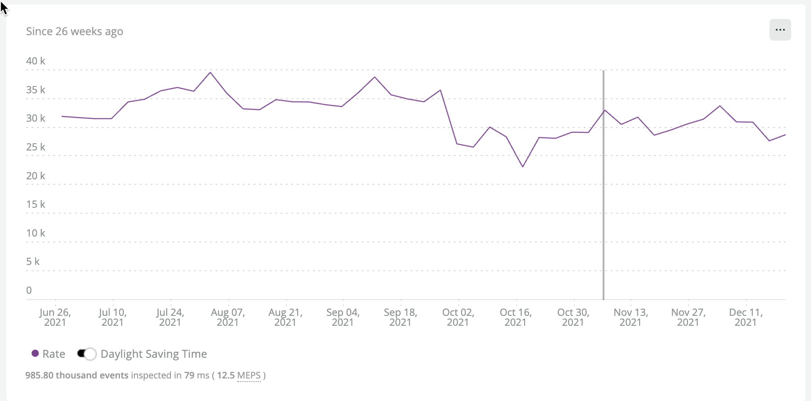
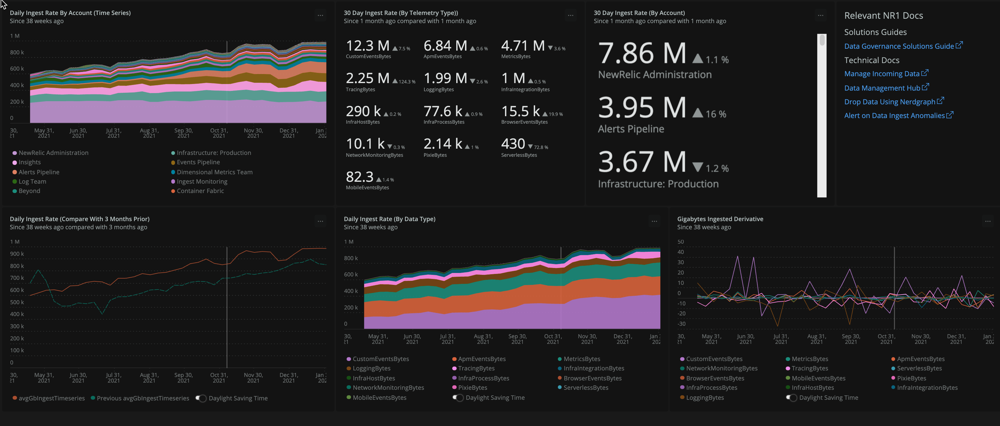
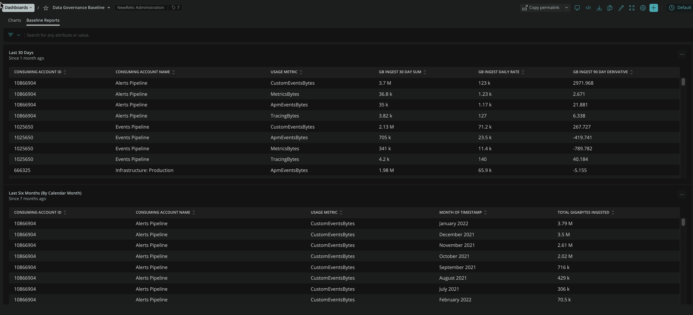
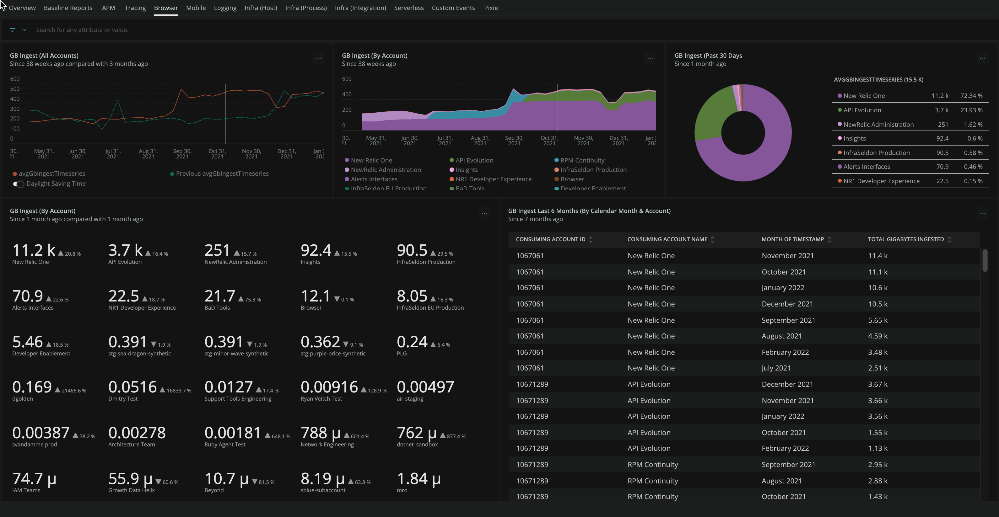
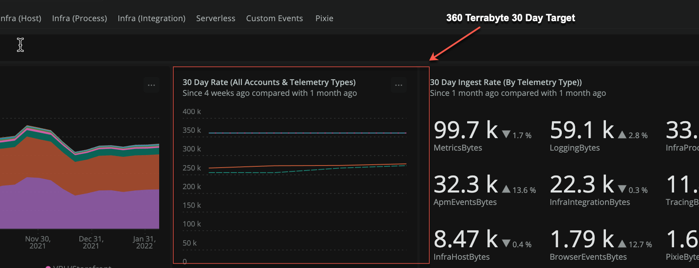
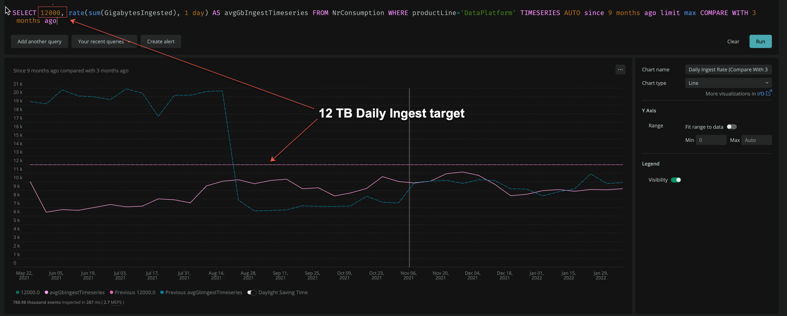
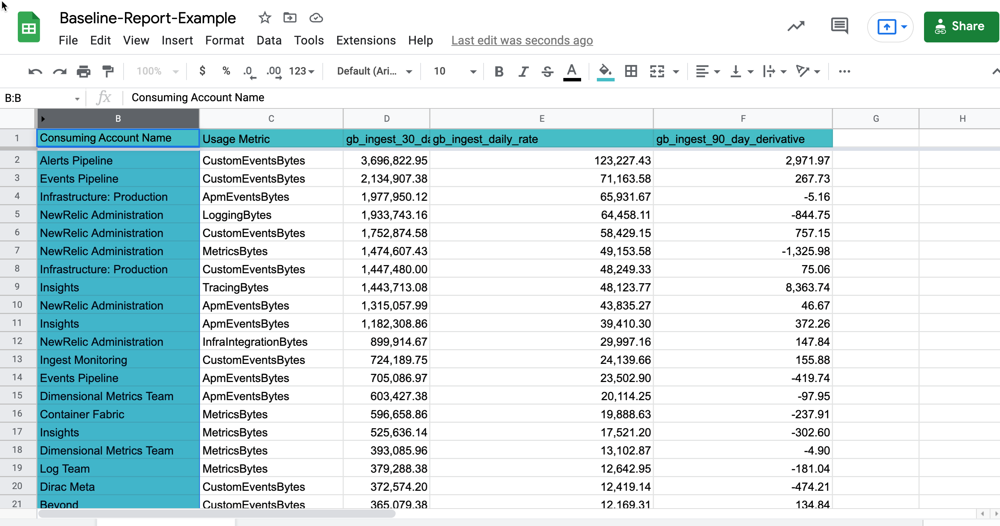
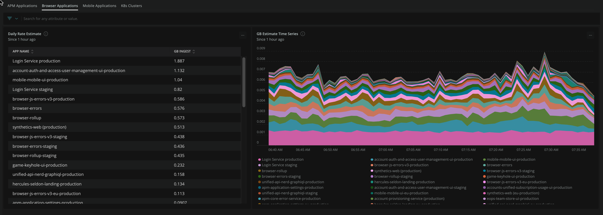

import baseliningicon from 'images/oma-oe-dg-baseline-icon.png'


この段階では、現在組織で生成されているすべてのテレメトリのハイレベルなビューを取得する必要があります。このユニットでは、インジェスト統計情報をアカウント、テレメトリータイプ、アプリケーションなどの様々なグループに分類することに重点を置いています。これらの数値は、 [Optimize your ingest data](/docs/new-relic-solutions/observability-maturity/operational-efficiency/dg-optimizing) and [Forecast your ingest data](/docs/new-relic-solutions/observability-maturity/operational-efficiency/dg-growth) ステージに情報を提供するために使用されます。

以下のディメンジョンについて、構造化された内訳レポートを作成する方法を学びます。

* 組織
* サブアカウント
* ビラブルテレメトリータイプ

さらに、以下のような詳細なブレイクダウンを作成する方法を学びます。

* アプリケーション (APM|ブラウザ|モバイル)
* K8sクラスタ
* インフラ統合

## 望ましい結果 [#desired-outcome]

組織内のどのグループが、どのような種類のデータをどれだけ提供しているかを正確に把握する。

## 前提条件

<CollapserGroup>
  <Collapser
    id="understand-nr-consumption-metrics"
    title="消費イベントの種類を理解する"
  >
    すべての請求可能な遠隔測定は、 `NrConsumption` および `NrMTDConsumption` イベントタイプで追跡されます。このガイドでは、 `NrMTDConsumption` よりも詳細なリアルタイムデータを提供する `NrConsumption` イベントタイプを照会する方法に焦点を当てます。 `NrConsumption` attribute `usageMetric` telemetry typeを示す。

    `NrConsumption` を使って、次のような質問をすることができます。"各サブアカウントが過去30日間に摂取したブラウザデータはどれくらいか？過去 30 日間から摂取量はどのように変化したか？"

    ```
    FROM NrConsumption SELECT sum(GigabytesIngested) WHERE usageMetric = 'BrowserEventsBytes' SINCE 30 days AGO COMPARE WITH 30 days AGO FACET consumingAccountName
    ```

    このレスポンスでは、アカウント別に何GBのBrowserデータを摂取したかが表示されます。

    ```
    Banking Platform, 75 GB, +2.9%
    Marketing Platform, 40 GB, -1.3%
    ```

    以下は、 `usageMetric` の種類、構成するイベント（データが格納されるイベントの種類）、データ取り込みを作成するエージェントやメカニズムの種類の内訳である。

    _請求可能なテレメトリーの内訳_

    <table>
      <thead>
        <tr>
          <th style={{ width: "200px" }}>
            NrcConsumption.usageMetric。
          </th>

          <th style={{ width: "200px" }}>
            コンスティチューター・イベント
          </th>

          <th>
            ソース
          </th>
        </tr>
      </thead>

      <tbody>
        <tr>
          <td>
            InfraHostBytes
          </td>

          <td>
            `SystemSample`, `StorageSample`, `ContainerSample`, `InfrastructureEvent`
          </td>

          <td>
            インフラストラクチャー・エージェント
          </td>
        </tr>

        <tr>
          <td>
            InfraProcessBytes
          </td>

          <td>
            `ProcessSample`
          </td>

          <td>
            インフラストラクチャー・エージェント
          </td>
        </tr>

        <tr>
          <td>
            InfraIntegrationBytes
          </td>

          <td>
            各種イベント
          </td>

          <td>
            [On-Host-Integrations](/docs/infrastructure/host-integrations/get-started/introduction-host-integrations/) および特定の [Cloud Integrations](/docs/infrastructure/infrastructure-integrations/get-started/introduction-infrastructure-integrations/#cloud)
          </td>
        </tr>

        <tr>
          <td>
            ApmEventsBytes
          </td>

          <td>
            `トランザクション`, `TransactionError`
          </td>

          <td>
            APMエージェント（複数可）
          </td>
        </tr>

        <tr>
          <td>
            TracingBytes
          </td>

          <td>
            `Span`, `SpanEvent`
          </td>

          <td>
            APMエージェントとOTEL
          </td>
        </tr>

        <tr>
          <td>
            BrowserEventsBytes
          </td>

          <td>
            `Browser`, `Browser:EventLog`, `Browser:JSErrors`, `PcvPerf`, `PageViewTiming`
          </td>

          <td>
            ブラウザーエージェント
          </td>
        </tr>

        <tr>
          <td>
            MobileEventsBytes
          </td>

          <td>
            `Mobile`, `MobileRequestError`, `MobileSession`, `MobileHandleException`, `MobileCrash`
          </td>

          <td>
            モバイルエージェント
          </td>
        </tr>

        <tr>
          <td>
            SeverlessBytes
          </td>

          <td>
            クラウド固有のもの（AWS Lambdaのイベントなど）
          </td>

          <td>
            クラウド特化型（AWS Lambdaとの連携など）
          </td>
        </tr>

        <tr>
          <td>
            LoggingBytes
          </td>

          <td>
            `Log` と、パターン `[partition].Log` のパーティション固有のイベントを記録します。
          </td>

          <td>
            各種（Fluentd、FluentBit、Syslog、クラウド専用ストリーミングサービス）
          </td>
        </tr>

        <tr>
          <td>
            MetricEventBytes
          </td>

          <td>
            `メトリック`
          </td>

          <td>
            Metrics APIまたは、ブラウザエージェント、apmエージェント、モバイルエージェントなどのエージェント。メトリクスAPI経由で送られてくるメトリクスには、様々なディメンションメトリクス（Prometheus、クラウド固有のストリームメトリクス）が含まれる。エージェントが生成するメトリクスは、次元のタイムスリックです。
          </td>
        </tr>

        <tr>
          <td>
            CustomEventBytes
          </td>

          <td>
            各種
          </td>

          <td>
            各種API
          </td>
        </tr>
      </tbody>
    </table>
  </Collapser>

  <Collapser
    id="understand-monthly-ingest-targets"
    title="組織の月間インジェスト目標値を把握する"
  >
    New Relic の消費モデルでは、テレメトリーデータとユーザーの両方が消費に貢献します。このガイドでは、遠隔測定データの価値を最大化することに重点を置いています。このセクションでユーザーについて言及するのは、ユーザーとデータのバランスをとるためのさまざまなオプションについて理解するためです。

    利用計画には、一般的に3つのタイプがあります。利用プランは、組織のインジェストターゲットの設定方法に影響する場合があります。

    ### _APoF_

    `Annual Pool of Funds` (APoF) 契約をしている場合、データ取り込みの月次目標予算が設定されていることが多いでしょう。例えば、1日あたり5TB、100FSOユーザーという目標が設定されているかもしれません。この種の計画では、データとユーザーを"で交換することができます。" しかし、観測可能性の目標に適した組み合わせを得るために、組織内の他の利害関係者と話し合うことが最善です。年間消費量の変動を考慮した計画を立てるお客様もいらっしゃいますが、ここでは、月間の消費予算をお客様のApoF / 12と仮定しましょう。

    必要なFSOとCoreのユーザー数がわかっている場合は、この計算式を使うことができます。

    `(monthly_target_spend - (num_fso_users*per_fso_cost) - (num_core_users*per_core_cost))/0.25`

    _0.25ドルで割って、1ヶ月のGBインジェスト目標値を算出するために変換します。_

    ### _ペイ・アズ・ユー・ゴー_

    従量課金制の場合、年間契約はありませんが、毎月の使用限度額は決まっているはずです。このモデルでは、次のような方法で目標摂取量を決定します。

    `(monthly_target_spend - (num_fso_users*per_fso_cost) - (num_core_users*per_core_cost))/0.25`

    _0.25ドルで割って、1ヶ月のGBインジェスト目標値を算出するために変換します。_

    ### 無料ティア

    永久無料層では、月に100GBまでデータの取り込みが可能です。現在、Free Tierのアカウントで作業されている方は、100GBを月間インジェスト目標量とお考えください。無料アカウントでは、月100GBを超えるデータの取り込みは、1GBあたり0.25ドルで課金されます。

    このトピックに関する詳しい情報は、 [利用計画書](/docs/licenses/license-information/usage-plans/new-relic-one-usage-plan-descriptions/) に記載されています。
  </Collapser>

  <Collapser
    id="nrql-operators-for-baselining"
    title="ベースライン作成に有効なNRQLオペレーションを理解する& 変更のモデリング"
  >
    <CollapserGroup>
      <Collapser
        id="the-rate-operator"
        title="レート"
      >
        <Callout
          variant="IMPORTANT"
          title="使用するタイミング"
        >
          `rate` 演算子は、ある期間から抽出したデータのサンプルを取り、所定のレートを生成する必要がある場合に使用します。例えば、1日分のデータをサンプルとして、それに基づいて30日分のレートを計算します。
        </Callout>

        _与えられたデータのサンプルに基づき、レートを計算する_

        過去1ヶ月の1日平均摂取量を確認する。

        ```
        SELECT rate(sum(GigabytesIngested), 1 day) AS 'Daily Ingest Rate (GB)' FROM NrConsumption WHERE productLine = 'DataPlatform' LIMIT MAX SINCE 30 days AGO
        ```

        組織全体に対する私たちのシンプルな回答は

        ```
        Daily Ingest Rate: 30.4 k
        ```

        このクエリでは、先月の1日の取り込み量が約30TBであったことがわかります。
      </Collapser>

      <Collapser
        id="the-month-of-operator"
        title="MonthOf"
      >
        <Callout
          variant="IMPORTANT"
          title="使用するタイミング"
        >
          インジェスト計算を特定の暦月に限定することが重要な場合。例えば、ある統合のための取り込みは、1月下旬に増加し、2月中旬まで続いているかもしれません。この演算子は、取り込みを請求に使用される特定の暦月に面付けするのに役立つ。
        </Callout>

        _暦月別のファセット_

        ```
        SELECT sum(GigabytesIngested) AS 'Daily Ingest Rate (GB)' FROM NrConsumption WHERE productLine = 'DataPlatform' FACET monthOf(timestamp) LIMIT MAX SINCE 56 weeks AGO
        ```

        その結果、かなりばらつきの大きい表が出来上がりました。なお、8月と9月はかなり `hot` 。その一部は私たちの組織の季節性ですが、テレメトリーカバレッジの幅を広げたことにも関連しています。

        | タイムスタンプの月   | GB INGESTED |
        | ----------- | ----------- |
        | 2021年12月\*。 | 636 k       |
        | 2021年11月    | 901 k       |
        | 2021年10月    | 873 k       |
        | 2021年9月     | 1.05 M      |
        | 2021年8月     | 1.08 M      |
        | 2021年7月     | 1.05 M      |
        | 2021年6月     | 887 k       |
        | 2021年5月     | 881 k       |
        |             |             |

        
      </Collapser>

      <Collapser
        id="change-analysis"
        title="比較する"
      >
        <Callout
          variant="IMPORTANT"
          title="使用するタイミング"
        >
          ある期間と別の期間の摂取量や摂取率の変化量を評価したい場合。これは、摂取量が不意に増えた場合に知るために重要です。
        </Callout>

        _簡易変更解析_

        ```
        SELECT sum(GigabytesIngested) FROM NrConsumption WHERE productLine = 'DataPlatform' AND usageMetric = 'BrowserEventsBytes' SINCE 6 months AGO UNTIL 1 week AGO TIMESERIES 7 weeks COMPARE WITH 2 months ago
        ```

        
      </Collapser>

      <Collapser
        id="sliding-window"
        title="スライディングウィンドウ"
      >
        <Callout
          variant="IMPORTANT"
          title="使用するタイミング"
        >
          より広いパターンを見るために、摂取の規則的な変動の影響を除去する必要があるとき。
        </Callout>

        テレメトリーは本質的にノイズが多い。現実の世界の現象は突発的に発生し、信号には多くのランダムなピークと谷が残ります。これはある意味良いことで、現象の複雑さを余すところなく見ることができます。しかし、トレンドを見ようとすると、細部に気を取られることがあります。NRQLは、各データポイントを少し古いポイントと組み合わせることによって、あらゆる時系列を平滑化する強力な方法を提供します。これにより、1つの極端な `increase` や `decrease` よりも、全体の時間トレンドに注目することができるようになります。

        1日の摂取量に対する生の時系列のギザギザに注意してください。

        ```
        FROM NrConsumption SELECT rate(sum(GigabytesIngested), 1 day) WHERE productLine = 'DataPlatform' SINCE 26 weeks AGO TIMESERIES 1 DAY
        ```

        

        ここで、 [スライディングウィンドウ](/docs/query-your-data/nrql-new-relic-query-language/nrql-query-tutorials/create-smoother-charts-sliding-windows/) を4日間使用して、1日だけのイベントの影響を軽減すれば、より明確な画像を見ることができます。4日は、`weekends`の影響を曖昧にするため、日曜日のデータが金曜日のデータなどとある程度組み合わされるため、適切な選択です。

        ```
        FROM NrConsumption SELECT rate(sum(GigabytesIngested), 1 day) WHERE productLine = 'DataPlatform' since 26 weeks ago TIMESERIES 1 DAY SLIDE BY 4 days
        ```

        
      </Collapser>

      <Collapser
        id="derivative"
        title="デリバティブ"
      >
        <Callout
          variant="IMPORTANT"
          title="使用するタイミング"
        >
          一定期間の統計的な変化率を推定するために使用します。変化率は、線形最小二乗回帰を使用して、微分を近似的に計算します。
        </Callout>

        NRQL は、変化率を評価するためのいくつかのツールを提供してくれます。これは、前の例で見たように、ブラウザのメトリクスで過去数ヶ月間に非常に大きな増加があったため、役に立ちます。この変化率分析では、 `derivative` 演算子を使用しており、9月上旬に主要な成長が起こったという確信を得ることができます。7 日間の派生値に基づく成長率はややマイナスであるため、BrowserEventsBytes の取り込みは現在、新しいプラトーに到達している可能性があります。

        ```
        SELECT derivative(sum(GigabytesIngested) , 7 day) FROM NrConsumption WHERE productLine = 'DataPlatform'  and usageMetric = 'BrowserEventsBytes'  LIMIT MAX SINCE 3 MONTHS AGO UNTIL THIS MONTH TIMESERIES 1 MONTH slide by 3 days COMPARE WITH 1 WEEK AGO
        ```

        

        このシナリオでは、上昇幅は非常に明白であり、単純なレートの時系列表示で十分である。しかし、デリバティブの利点は、相対的な成長量をより敏感に評価することができ、それがいつ始まったかを知ることができることです。これは、大きな上昇の初期段階にある場合に有用である。

        以下は、SUMの簡易プロットです。

        ```
        SELECT sum(GigabytesIngested) FROM NrConsumption WHERE productLine = 'DataPlatform'  and usageMetric = 'BrowserEventsBytes'  TIMESERIES  7 days SINCE 6 MONTHS AGO
        ```

        
      </Collapser>

      <Collapser
        id="baseline-query-examples"
        title="bytecountestimate()"
      >
        <Callout
          variant="IMPORTANT"
          title="使用するタイミング"
        >
          この演算子は、Raw イベントまたはメトリックのサブセットに対する取り込みデータのフットプリントを推定する必要がある場合に使用します。
        </Callout>

        <CollapserGroup>
          ### 例

          <Collapser
            id="ingest-by-application"
            title="アプリケーション別（APM|ブラウザ|モバイル）インジェスト"
          >
            これらのクエリーは、各サブアカウントで実行するか、アカウント固有のチャートでダッシュボードを表示します。このクエリーは、1週間の集金に基づき、30日分の料金を見積もる。

            _30日料金の見積もり_

            _APM_

            ```
            FROM Transaction, TransactionError, TransactionTrace, SqlTrace, ErrorTrace, Span SELECT rate(bytecountestimate()/10e8, 30 day) AS 'GB Ingest' FACET appName SINCE 1 WEEK AGO
            ```

            _Browser_

            ```
            FROM PageAction, PageView, PageViewTiming, AjaxRequest, JavaScriptError SELECT rate(bytecountestimate()/10e8, 30 day) AS 'GB Ingest' FACET appName SINCE 1 WEEK AGO 
            ```

            _モバイル_

            ```
            FROM Mobile, MobileRequestError, MobileSession SELECT rate(bytecountestimate()/10e8, 30 day) AS 'GB Ingest' FACET appName SINCE 1 WEEK AGO 
            ```
          </Collapser>

          <Collapser
            id="metric-ingest-by-integration"
            title="統合によるメトリックインジェスト"
          >
            このファセットで表示される `usage.Integration` value の例をいくつか挙げておきます。

            * com.newrelic.mssql (New Relic MSSQL OHI)
            * com.newrelic.rabbitmq (ニューレリックのRabbitMQ OHI)
            * EC2（AWSのEC2統合版）
            * Lambda（ラムダの統合版）

              これらのクエリーは、各サブアカウントまたはアカウント固有のチャートを持つダッシュボードで実行します。

              _30日料金の見積もり_

              ```
              FROM Metric SELECT rate(bytecountestimate()/10e8, 30 day) FACET usage.integrationName SINCE 1 WEEK AGO
              ```

              _7日間合計_

              ```
              FROM Metric SELECT bytecountestimate()/10e8 FACET usage.integrationName SINCE 1 WEEK AGO 
              ```
          </Collapser>

          <Collapser
            id="ingest-by-k8s-cluster"
            title="K8sクラスタによるインジェスト"
          >
            _30日料金の見積もり_

            ```
            FROM K8sClusterSample, K8sContainerSample,K8sDaemonsetSample, K8sDeploymentSample, K8sEndpointSample, K8sHpaSample, K8sNamespaceSample, K8sNodeSample, K8sPodSample, K8sReplicasetSample, K8sServiceSample, K8sVolumeSample SELECT rate(bytecountestimate()/10e8, 30 day) AS 'GB Ingest' FACET clusterName SINCE 1 WEEK AGO
            ```
          </Collapser>

          <Collapser
            id="ingest-by-process-sample"
            title="プロセスサンプル"
          >
            ProcessSampleは、かなりボリュームのあるイベントになります。この例では、コマンドラインごとに30日分のインジェストを計算することにします。

            _コマンド名による30日単位の見積もり_

            ```
            FROM ProcessSample SELECT rate(bytecountestimate()/10e8, 30 day) AS 'GB Ingested' FACET commandName SINCE 1 DAY AGO
            ```
          </Collapser>
        </CollapserGroup>
      </Collapser>
    </CollapserGroup>
  </Collapser>
</CollapserGroup>

## プロセス

[データガバナンスベースラインダッシュボードをインストール](#install-dashboard)  
[インジェストターゲット指標をダッシュボードに追加](#add-target-indicators)  
[表形式の30日インジェストレポートを生成](#generate-report)  
[レポートをカスタマイズ](#customize-report)  
[インジェスト異常を検出](#detect-anomalies)  
[エンティティブレークダウンダッシュボードをインストール （オプション）](#install-entity-breakdown-dashboard)  
[クラウド連携ダッシュボード（オプション）をインストールする。](#install-cloud-integration-dashboard)

### データガバナンスベースラインダッシュボードをインストールする [#install-dashboard]

1. [データガバナンスクイックスタート](https://onenr.io/0PoR8zpDYQG) に移動します。
2. ブラウザウィンドウの右上部分にある、 `Install this quickstart` をクリックします。
3. アカウントドロップダウンで、トップレベルのマスターアカウントまたはPOAアカウントを選択します。
4. インストールするエージェントがないため、 `Done` をクリックします。
5. クイックスタートのインストールが完了したら、 `Data Governance Baseline` ダッシュボードを開いてください。

そうすると、新しくインストールされたダッシュボードが表示されます。

#### ダッシュボードの概要

メインの概要タブには、強力な時系列表示を含む様々なチャートが表示されます。



2つ目のタブでは、サブアカウントと利用指標ごとのベースラインレポートが表示されます。



残りのタブは、ブラウザデータ、apmデータ、ログ、トレースなど、特定の遠隔測定タイプの詳細ビューを提供します。たとえば、次のスクリーンショットは、ブラウザの詳細ページを示しています。



ディテールタブは以下の通り。

* APM - `ApmEventsBytes`
* Tracing - `TracingBytes`
* Browser - `BrowserEventsBytes`
* Mobile - `MobileEventsBytes`
* Infra (ホスト) - `InfraHostBytes`
* Infra (Process) - `InfraProcessBytes`
* Infra (Integration) - `InfraIntegrationBytes`
* カスタムイベント - `CustomEventsBytes`
* サーバーレス - `ServerlessBytes`
* Pixie - `PixieBytes`

<Callout variant="caution">
  POAアカウントを使用している場合、 `consumingAccountName` によって、POAアカウント自体はファセットに含まれないことに注意してください。これは、POAアカウントが実際のテレメトリーを受信しないためです。ダッシュボードを通常の親アカウントにインストールする場合、その親アカウントの消費値は、親アカウントに直接取り込まれたデータとサブアカウントに送信されたデータの`sum`です。

  例えば、monthly ingestでファセットすると、次のように表示されます。

  * 親アカウントのインジェスト100GB
  * サブアカウント1 インジェスト50GB
  * サブアカウント2 インジェスト20GB

    `Parent Account Ingest` には、サブアカウント1および2のデータと、親アカウントに直接送信される追加の30GBが含まれています。
</Callout>

### インジェスト対象指標をダッシュボードに追加する [#add-target-indicators]

前提条件の項で、毎月の使用量目標の考え方について説明しました。実際には、軌道に乗せるためにいくつかの目標値を設定してもよいでしょう。

* デイリーレートまたは月間インジェストに関する組織全体の目標。
* 最適な内訳を確保するためのデータ種類ごとの目標（例えば、ログは1日1TB、メトリクスは1日2TBなど）。
* 特定のサブアカウントまたはビジネスユニットに対する目標。

この例では、組織全体のインジェストの目標を、 1ヶ月あたり`< `360TBとしています。これは、インジェストを1日あたり20TB以上（1ヶ月あたり600TB）から削減した後の新たな目標です。

ターゲットを測定しやすくするために、 `SELECT` ステートメントに静的な数字 `360000` を追加して、閾値の折れ線グラフを追加しました。

```
SELECT 360000, rate(sum(GigabytesIngested), 30 day) AS '30 Day Rate' FROM NrConsumption WHERE productLine='DataPlatform' since 30 days ago limit max compare with 1 month ago TIMESERIES 7 days
```



また、日割りの目標ラインを適用することも可能です。360000を30で割って、12000を日割りの目標値としましょう。 `Daily Ingest Rate (Compare With 3 Months Prior)` チャートを更新します。

```
SELECT 12000, rate(sum(GigabytesIngested), 1 day) AS avgGbIngestTimeseries FROM NrConsumption WHERE productLine='DataPlatform' TIMESERIES AUTO since 9 months ago limit max COMPARE WITH 3 months ago
```



### 30日分の表形式インジェストレポートの作成 [#generate-report]

1. 先にインストールした _データガバナンスベースライン_ ダッシュボードを開きます。
2. _ベースラインレポート_ タブをクリックします。
3. "過去 30 日間" の表の右上にある `...` をクリックし、 `Export as CSV`を選択します。
4. _Google Sheets_ またはお好みのスプレッドシートにCSVをインポートします。

_または、_ダッシュボードをインストールしなかった場合は、このクエリを使用して[Query Builder](/docs/query-your-data/explore-query-data/query-builder/introduction-query-builder/)でカスタムグラフを作成できます:

```
SELECT sum(GigabytesIngested) AS 'gb_ingest_30_day_sum', rate(sum(GigabytesIngested), 1 day) AS 'gb_ingest_daily_rate', derivative(GigabytesIngested, 90 day) as 'gb_ingest_90_day_derivative' FROM NrConsumption WHERE productLine='DataPlatform' since 30 days ago facet consumingAccountName, usageMetric  limit max
```

以下は、Google Sheetsに取り込んだシートの例です。



スクリーンショットは、30日間のインジェストトータルでソートされたテーブルです。

必要に応じて、タイムラインや一部のディテールを自由に調整してください。例えば、過去数ヶ月の変化をある程度把握するために、 _90日デリバティブ_ を抽出することにした。目的に応じて、デリバティブの期間を簡単に変更することができます。

### レポートのカスタマイズ [#customize-report]

_optimize_ や _forecast_ など、データガバナンスの他のフェーズを促進するために、レポートに有用なカラムを追加してください。以下のフィールドは、最適化と計画立案の判断材料になります。

* 注意事項成長の異常とそれに関する説明を記載すること。予測される大きな成長がある場合は、それを示す。
* 技術的な連絡先。特定のサブアカウントの管理者、または特定のテレメトリタイプに関連する人の名前。

### インジェスト異常の検出 [#detect-anomalies]

#### インジェスト異常時のアラート

[このインジェスト・アラート・ガイド](/docs/accounts/accounts-billing/new-relic-one-pricing-billing/usage-queries-alerts/) を使って、データ消費量の増加に不意打ちを食らわせないようにしましょう。最低限、作成してください。

* 季節的な増加を超えて、データ取り込みの月間目標値を超えた場合に通知する閾値アラート
* インジェストデータの急激な増加を通知するベースラインアラート

アラートを使用して消費量の異常を特定するだけでなく、ルックアウトを使用してインジェストの異常の可能性を探ることができます。

#### ルックアウトビュー

Lookoutでは、ほぼすべてのNRQLクエリを提供することができ、一定期間の異常を検索することができます。このビューは、クエリ

```
SELECT rate(sum(GigabytesIngested), 1 day) AS avgGbIngest FROM NrConsumption WHERE productLine='DataPlatform' FACET usageMetric 
```


ファセット・フィールドを `consumingAcountName` に変更すると、このような表示になります。


### エンティティブレークダウンダッシュボードをインストールする（オプション） [#install-entity-breakdown-dashboard]

前のセクションで、NrConsumption を主要なソースとして使用する ingest `baseline` ダッシュボードをインストールしました。このハイレベルなビューに加えて、 `bytescountestimate()` を使って、ほぼすべてのイベントやメトリックについてインジェストを推定する他のビジュアライゼーションを作成することができます。 `bytescountestimate()` の詳細な概要は、 [前提条件のセクションで説明しました](/docs/new-relic-solutions/observability-maturity/operational-efficiency/dg-baselining#baseline-query-examples) 。

1. [ベースライン・ダッシュボードに使用したのと同じクイックスタート](https://onenr.io/0PoR8zpDYQG) にアクセスします。
2. ブラウザウィンドウの右上のセクションにある、 `Install this quickstart` をクリックします。
3. このダッシュボードのインスタンスは、POAアカウントにインストールしないでください。代わりに、APM、ブラウザ、モバイルアプリケーション、またはK8sクラスタを含む任意のアカウントにインストールします。 [インポートダッシュボード機能](/docs/query-your-data/explore-query-data/dashboards/introduction-dashboards/#dashboards-import) 。このダッシュボードは、複数のアカウントにインストールすることができます。トップレベルの親アカウントにインストールし、ダッシュボードを変更して、アカウント固有のグラフを1つのダッシュボードで表示することができます。
4. インストールするエージェントがないため、 `Done` をクリックします。
5. クイックスタートのインストールが完了したら、 `Data Governance Entity Breakdowns` ダッシュボードを開いてください。



[このセクション](/docs/new-relic-solutions/observability-maturity/operational-efficiency/dg-baselining#understand-nr-consumption-metrics) を参照して、これらのブレイクダウンでどのイベントタイプが使用されているかを正確に確認することができます。

_注_ これらのクエリは、NrConsumptionのような事前に集計されたデータソースから作業していないため、より多くのリソースを消費する。環境によっては、時間枠を調整し、追加の `where` 節と `limit` 節を利用して、パフォーマンスを向上させることが必要な場合があります。

### クラウド連携ダッシュボードのインストール（オプション） [#install-cloud-integration-dashboard]

クラウドインテグレーションは、データインジェストの増加の大きな原因となることがよくあります。うまく可視化しないと、増加の原因を突き止めるのは非常に困難です。これは、これらの統合が非常に簡単に構成でき、組織の通常のCI/CDパイプラインの一部でないことが一因です。また、正式な構成管理システムの一部でない可能性もあります。 [幸いなことに、この強力なダッシュボードのセットは、New Relic I/O](https://onenr.io/0EPwJJO9Ow7) から直接インストールすることが可能です。このパッケージでインストールされる個々のダッシュボードは以下の通りです。

* AWSインテグレーション
* Azure インテグレーション
* GCP インテグレーション
* オンホストインテグレーション
* Kubernetes


## 結論

[プロセス](#process) このページのセクションでは、データインジェストのビジュアライゼーションとレポートの作成について説明しました。これで、データインジェストをデータドリブンなビジュアルアプローチでレビューすることができ、あなたとあなたの同僚がコラボレーションするために使用することができます。

今後は、どのビジュアライゼーションに使用するかを決定します。

* [月次インジェストチェックイン用](docs/new-relic-solutions/observability-maturity/operational-efficiency/dg-coe#monthly-ingest-check-ins)
* [年間インジェスト計画会議用](docs/new-relic-solutions/observability-maturity/operational-efficiency/dg-coe#yearly-ingest-target-planning)
* 1つまたは複数のサブアカウントのデータ取り込みを管理する人のためのベストプラクティスのビジュアライゼーションとして

## 追加リソース [#additional-resources]

* [受信データを管理する](/docs/data-apis/manage-data/manage-data-coming-new-relic/)
* [データ管理ハブ](/docs/data-apis/manage-data/manage-your-data/)
* [Nerdgraphを使用してデータを削除する](/docs/data-apis/manage-data/drop-data-using-nerdgraph/)
* [データ取り込みの異常に関するアラート](/docs/accounts/accounts-billing/new-relic-one-pricing-billing/usage-queries-alerts/)
* [テレメトリワークフローの自動化](https://developer.newrelic.com/automate-workflows/)
* [メトリクスの集約とメトリクスへのイベント](/docs/data-apis/convert-to-metrics/create-metrics-other-data-types/)
