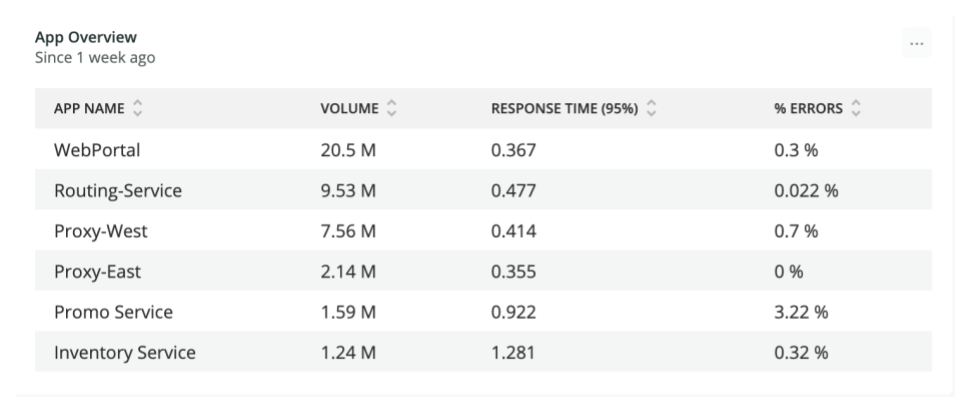

## 概要 [#overview]

ITオペレーションは、パフォーマンスと信頼性に関するビジネスの要求を満たすサービスを提供することが求められています。しかし、多くの運用チームは、リソース消費量の測定など、従来の方法でパフォーマンスと信頼性を測定しようとしています。そのため、アプリケーションのパフォーマンスや信頼性と関連付けるために、詳細なメトリクスの複雑なダッシュボードを作成することが必要になります。このような複雑なダッシュボードでは、ビジネス・ステークホルダーのために結果を解釈するために、サブジェクト・マター・エキスパートが必要となります。

従来の方法では、良いシステム状態がどのようなものか、また悪いシステム状態がどのようにビジネスに影響を与えるかを理解することができませんでした。基本的に、IT部門はビジネス部門と共通の指標を共有していません。このような根本的な断絶は、ITがビジネスに必要なサービスを提供できないという認識をもたらし、その認識がもたらすあらゆる影響やインパクトを伴うことになります。

サービスレベル管理（SLM）は、システムの全体的なパフォーマンスを、IT部門とビジネス部門の両方が理解しやすい言葉で説明することで、この断絶を解消します。その目的は、システムが期待されるパフォーマンスと信頼性を満たしているかどうか、また改善の傾向があるかどうかを示すことで、事前に対策を講じることができるようにすることです。最終的な目標は、ビジネスへの影響が最も大きい分野の問題にIT部門の注意が集中することで、システムが望ましいビジネス成果に向けてより良い方向に向かうことです。

以下のいずれかに当てはまる方は、SLMに適しています。

* 性能や信頼性の問題がビジネスに与える影響は、すべてのステークホルダーに十分理解されているとは言えません。
* あなたのMTTxは高すぎます。
* システムの問題を特定するために、多くのリソース消費メトリクス（CPU、ディスク、メモリなど）を収集したり、多くのメトリクスの相関ルールを管理したりしています。
* オブザーバビリティツールの価値がわからない。

## 望ましい結果 [#desired-outcome]

サービスレベル管理の全体的な目標は、デジタル製品やサービスの全体的な健全性、パフォーマンス、品質を簡単に測定し、すべての関係者に伝えることです。システムの主要な出力ポイントにSLMを導入することで、よりシンプルで迅速なオブザーバビリティの実践、ビジネスとの緊密な連携、そして改善への迅速な道筋が可能になります。

このガイドに記載されているSLMプロセスは、サービスパフォーマンスと品質の主要なパフォーマンス指標を測定すべきシステム内のポイントを特定するのに役立ちます。また、よりシンプルなアラート戦略、継続的な改善方法、問題解決のワークフローの改善を定義し、推進します。

## 主要なパフォーマンス指標 [#key-perf-indicators]

あなたは、SLMプロセスを使って、「ゴールデンシグナル」と呼ばれる以下のKPIを収集・測定します。

<CollapserGroup>
  <Collapser
    id="kpi-response"
    title="サービス応答時間"
  >
    サービスの応答時間とは、サービスがトランザクションを処理するのに必要な時間のことです。トランザクションのリクエストをサービスが受信した時点で始まり、レスポンスが送信された時点で終了します。

    **目標：** トランザクションの応答時間を短縮する。

    **ベストプラクティスです。**

    * サービス境界での応答時間を測定します。
    * 継続的な改善プロセスを用いて、レスポンスタイムを短縮する。
    * ビジネス以外の取引（健康診断など）が含まれたり測定されたりしないようにする。
    * このKPIをビジネスインパクトに結びつける。
    * KPIをすべてのステークホルダーに報告する。
  </Collapser>

  <Collapser
    id="kpi-quality"
    title="サービス品質"
  >
    サービス品質とは、処理されないエラーが発生したトランザクションの数です。一般的には、HTTPレスポンスコードが `400` 以上のトランザクションが該当します。

    **目標：** ハンドリングされないエラーの数を減らす。

    **ベストプラクティスです。**

    * サービス境界でのエラー率を測定する。
    * 大量のエラーが発生する原因を継続的に特定し、修正する。
    * このKPIをビジネスインパクトに結びつける。
    * KPIをすべてのステークホルダーに報告する。
  </Collapser>

  <Collapser
    id="kpi-attainment"
    title="サービスレベル目標の達成"
  >
    SLO達成度とは、ビジネスサービスがレスポンスタイムと品質の目標を達成している割合のことです。

    **目標：** 応答時間と品質を改善し、高いSLO達成率を確保する。

    **ベストプラクティスです。**

    * SLO達成度を維持・向上させるために、継続的な改善プロセスを用いる。
    * このKPIをビジネスインパクトに結びつける。
    * KPIをすべてのステークホルダーに報告する。
  </Collapser>

  <Collapser
    id="kpi-uptime"
    title="サービスのアップタイム"
  >
    サービスのアップタイムとは、少なくとも1人のクライアントがサービスにアクセスできる時間の割合のことです。一般的には、代表的な遠隔地からの合成トランザクションを使用して測定されます。

    **目標：** 継続的改善プロセスを使用して稼働時間の指標を監視し、稼働時間がビジネス要件を満たすように適切な措置を講じる。

    **ベストプラクティスです。**

    * SLO達成度を維持・向上させるために、継続的な改善プロセスを用いる。
    * このKPIをビジネスインパクトに結びつける
    * KPIをすべてのステークホルダーに報告する。
  </Collapser>
</CollapserGroup>

これらのKPIは、ITサービスの最も重要な側面であるスピードと品質を、技術者や非技術者のステークホルダーにわかりやすく、直感的に伝えられる方法で直接測定します。

## 前提条件 [#prerequisites]

始める前に、同等の経験がない場合は、 [New Relic University (NRU) Overview Course](https://learn.newrelic.com/overview-course) を修了してください。また、以下の基本的な理解が必要です。

* [New Relic One APMとインフラ監視](https://learn.newrelic.com/fundamentals-course)
* [New Relic One ダッシュボードとNRQL](https://learn.newrelic.com/webinar-getting-started-with-dashboards-nrql)
* [New Relic One アラート機能のベストプラクティス](https://learn.newrelic.com/webinar-new-relic-alerts-fundamentals)

## 現状の確立 [#current-state]

他の継続的改善プロセスと同様に、SLMの最初のステップは、KPIの現状を把握することです。そのためには、次のような作業を行う必要があります。

* [対象となるサービスを決定する](#determine-in-scope)
* [サービスの境界を特定する](#id-service-boundaries)
* [インストルメンテーションの導入](#deploy-instrumentation)
* [SLM教育ワークショップの実施](#perform-workshops)
* [KPIの分析とベースラインSLOの設定](#analyze-kpis)
* [アラートの設定・最適化](#establish-alerting)
* [問題解決のためのワークフローの構築](#build-workflows)
* [継続的改善レビューの実施](#execute-continuous-improvement)

このプロセスを説明するために、ITサービスの例として、携帯電話会社のECサイトに適用してみましょう。

### 対象となるサービスを決定する [#determine-in-scope]

まず最初に、SLM プロセスの初期段階で対象となる IT サービスを特定します。これらのサービスは、継続的な事業運営の鍵となるものであり、できるだけお客様に近いものでなければなりません。最も一般的なのは、SLM プロセスをアプリケーションに適用することです。

SLM はインフラストラクチャベースのサービスに適用することができますが、SLM はより高度なアプリケーションであり、適用できる組織はかなり限定されています。インフラストラクチャにSLMを導入することを検討している場合は、インストルメント化するサービスが、実際に組織のエンドカスタマーに最も近いものであることを確認する必要があります。インフラストラクチャが顧客向けのアプリケーションをホストしている場合、そのアプリケーションをSLMの対象とする必要があります。

他に何もない場合、対象となるサービスを特定するための良い方法は、災害復旧計画を参照することです。一般的には、最も重要なビジネスサービスが優先されます。

### サービスの境界を特定する [#id-service-boundaries]

次に、各サービスのバウンダリを特定する必要があります。バウンダリとは、トランザクションリクエストを送信するクライアントに最も近いサービスコンポーネントのことです。これは、クライアント、ブラウザ、またはモバイルデバイスからリクエストを受け取るアプリケーションである必要があり、"外部APIと呼ばれることもあります。"

リバースプロキシ、CDN、ロードバランサーは、サービス境界の一部ではありません。これらのサービスレベルへの準拠は、稼働率 KPI（接続性に関する外部からのテスト要求）を介して測定する必要があります。

サービスがAPMを使用している場合、 [サービスマップまたは依存関係](/docs/understand-dependencies/understand-system-dependencies/service-maps/) 機能を使用して、サービスの境界を識別することができます。サービスコンポーネントは、インバウンド接続がない場合、境界上にあります。以下の例（サービスマップ）では、WebPortalが境界上にあることがわかります。

<figcaption>
  New Relic One のサービスマップを使ってサービスの境界を特定した例。
</figcaption>

一方、次のスクリーンショット（「依存関係」ページ）では、WebPortalからの着信接続があるため、Inventory Serviceは境界上にありません。このガイドの後続の例では、WebPortalサービスのバウンダリをベースにしています。

<figcaption>
  New Relic Oneのdependencies UIを使ってサービスの境界を特定した例。
</figcaption>

SLMプロセスでは、サービス境界を依存関係の下流にあると定義していることを理解しておく必要があります。サービス境界とは、サービスの総応答時間と品質に寄与する、依存するサービスのすべての効果と影響が測定されるポイントです。

バウンダリでサービスレベルのコンプライアンスを測定することで、バウンダリの上流にあるすべてのサービスコンポーネントがサービス提供に与える影響を把握することができます。つまり、SLMの最初のステップでは、ユーザーに最も近いサービスに焦点を当てながら、より遠くのサービスの貢献度を把握することができます。実践が成熟してくると、SLMを直接導入することで利益を得られる次の上流サービスを特定できるようになるでしょう。

この例では、WebService は Fulfillment、Plan、Promo、Login、Inventory などのサービスの下流に位置しています。WebService に SLM を適用することで、上流のサービスが WebService に与える影響を確認することができます。上流のサービスで影響のある問題があれば、Web サービスのサービスレベル KPI に反映されます。1つのサービスをインストルメント化することで、5つの追加サービスの貢献度を把握することができます。これにより、観測を大幅に簡素化することができます。そのうち、問題のある上流のサービスは、直接SLMの計測を行う候補として自己認識するようになるでしょう。

### インストルメンテーションの導入 [#deploy-instrumentation]

SLMサービスの応答時間とトランザクションの成功率のKPIを収集するには、サービス境界上の本番アプリケーションのコンポーネントに計測器を導入する必要があります。本番環境でこれを行うことができるインスツルメンテーションがすでにない場合は、この作業を支援してくれるチームや関係者を巻き込む必要があります。この情報を収集できるNew Relicインスツルメンテーションのデプロイに関する詳細な情報は、 [APM install documentation](https://docs.newrelic.com/docs/using-new-relic/cross-product-functions/install-configure/install-new-relic/#apm-install) を参照してください。

アップタイムのKPIは、サービスにインスツルメンテーションを追加する必要のないシンセティック・トランザクションを使用して収集することができます。必要であれば、直接計測器がデプロイされるのを待っている間に、SLMの作業を開始することができます。アップタイム・テストでは、サービスの機能を基本的かつ現実的にチェックする必要があります。この機能の詳細については、 [シンセティック・モニタリング・ドキュメント](https://docs.newrelic.com/docs/synthetics/synthetic-monitoring/getting-started/get-started-synthetic-monitoring/) を参照してください。

### SLM教育ワークショップの実施 [#perform-workshops]

セルフペースの [New Relic Essentials](https://learn.newrelic.com/self-paced-new-relic-essentials) トレーニングコースを適切な関係者と共有し、New Relic テクノロジープラットフォームが SLM プロセスにどのように役立つかを理解してもらう必要があります。

### KPIの分析とベースラインSLOの設定 [#analyze-kpis]

SLMプロセスでは、スピードとクオリティを重要なパフォーマンス指標としています。技術的には、スピードは応答時間、品質はエラー率を意味します。このフェーズの終わりには、各サービスのベースラインサービスレベル目標をパーセンテージの形で作成します。例えば、次のようなものです。"サービスXのトランザクションの98%はエラーがなく、500ミリ秒以下で発生する。"

対象となる各サービスについて、サービス境界での速度と品質を分析する必要があります。これにより、サービス全体とその依存関係のすべてがどのように実行されているかを全体的に把握することができます。SLMプロセスを繰り返すうちに、直接SLM計測を必要とする上流のサービス・コンポーネントを特定し、優先順位をつけることができます。

KPIを分析するためには、サービスごとに以下のことを行う必要があります。

1. 比較的長い期間（通常は7日から1ヶ月の間）における、サービスの各トランザクションのボリュームと95パーセンタイルのレスポンスタイムを特定する。平均値ではなくパーセンタイルを使用することが重要です。そうすることで、外れ値を含む応答時間の全範囲を見ることができます。平均値を使用すると、外れ値が隠れてしまいます。

以下は、初期ベースラインレポートの例です。ここでは、WebPortalと他のいくつかのサービスのボリューム、p95レスポンスタイム、エラーボリュームが表示されています。WebPortalのp95応答時間は0.36秒（または36ミリ秒）なので、SLO目標を0.4秒に設定することにしました。

<figcaption>
  ボリュームと95パーセンタイルのレスポンスタイムを測定した初期ベースラインレポートの例。
</figcaption>

2. 次に、SLO達成度の計算に含めるべきではないため、ビジネス以外の取引を確認し、特定する必要があります。例えば、健康診断や生命維持のための取引を含めるべきではありませんし、管理上の取引を含めるべきではないでしょう。

   以下の例では、WebPortalサービスのトランザクションの一部を確認しています。 `about.jsp` トランザクションはビジネス以外のトランザクションであり、SLO達成度の計算では追跡すべきではないと判断しています。

<figcaption>
  SLOのために何を追跡するか（または追跡しないか）を特定するのに役立つ、最初のベースラインレポートのトランザクションの内訳を示す例。
</figcaption>

3. 最後に、SLMテンプレートダッシュボードをインポートして編集し、非業務用トランザクションを除外します。そして、p95の応答時間をベースラインの応答時間サービスレベル目標として使用します。

   この図の例では、応答時間のしきい値として0.4秒を選択し、サービス・レベル目標を95%に設定しています。つまり、WebPortalのビジネス・トランザクションの95%が0.4秒以下でエラーなく完了することを期待しています。グラフの赤い線は、95%のサービスレベル目標を示しています。

<figcaption>
  ビジネス以外の取引を除いた例示図。
</figcaption>

ご覧のとおり、アプリがSLOを満たしていない時間帯があります。95%の目標を維持するためには、これらの問題を引き起こしているサービスコンポーネントや依存関係を特定し、修正する必要があります。

### アラートの設定・最適化 [#establish-alerting]

サービスレベル目標を設定した後、SLOの達成度が目標を下回った場合に通知するアラートを設定します。これらのアラートは、ビジネスへの影響度が高いインシデントが発生した場合に表示されます。アラートが発生した場合、優先順位を高くし、適切なチームを巻き込んで問題の原因を診断するプロセスを開始する必要があります。

基本的には、SLO達成度がベースラインを10分以上下回った場合にアラートを発するように設定することから始めます。詳細については、 [Configuring alerts](https://docs.newrelic.com/docs/alerts-applied-intelligence/new-relic-alerts/get-started/) に関するドキュメントをご覧ください。

### 問題解決のためのワークフローの構築 [#build-workflows]

これまで説明してきたように、SLMプロセスの目的は、ビジネスに影響を与える問題がITサービスで発生した場合にそれを特定することです。この問題が発生した場合、診断調査を開始する必要があります。この調査の目的は、ビジネスに影響を与える問題の原因となっているサービス要素を特定することです。SLMは、ビジネスに影響を与える問題があることを教えてくれますが、診断プロセスは、問題がどこにあるかを見つけるのに役立ちます。

一般的に、高レベルの診断ワークフローは、サービス境界から始まり、次のようになります。

1. サービスの個々のトランザクションを見て、どのトランザクションがパフォーマンスや応答時間のSLOから外れているかを確認します。
2. 障害が発生しているコンポーネントが見つかるまで、そのトランザクションを提供する各サービスコンポーネントを調べます。
3. 徹底した診断で問題の根本原因を特定し、解決する。

### 継続的改善レビューの実施 [#execute-continuous-improvement]

これはSLMプロセスの継続的なフェーズであり、データを見直し、必要に応じて調整を行います。KPIは上層部に報告し、ステークホルダーのチームが適切に仕事の優先順位をつけていること、設定したSLOの目標を達成していることを確認します。

定期的にKPIを記録し、数ヶ月から数年に渡って保持することで、ベースラインを確立し、改善率を示すことができます。

さらに、継続的改善プロセスを実行するたびに、次のようにします。

1. 各サービスのアーキテクチャを確認し、計測器がバウンダリに配置されているか、観測性のギャップがないかを確認します。
2. 各サービスのトランザクションを確認し、ビジネストランザクションのみがSLOの計算に含まれていることを確認します。
3. 各サービスのSLOを見直し、それがビジネスのパフォーマンスと品質の要件を満たしているかどうかを判断します。もしそうでなければ、SLOを変更し、適切な利害関係者に通知して、パフォーマンスと品質の向上に努めてもらう必要があります。
4. SLOの達成度を確認し、SLMのプロセスに上流のサービスを追加すべきかどうかを判断する。

## 次のステップ [#next-steps]

SLMプロセスを確立した後は、SLM計測の恩恵を受けられる他のサービスを特定する必要があります。これらのサービスは、他の最前線のサービスであったり、SLOでカバーされているサービスの上流の依存関係にあり、SLO達成の失敗の原因となることが多いことがわかっています。

このようにして、SLM の適用範囲を、SLO が適用されているアプリケーションの割合として測定し、報告するようにしてください。例えば、アプリケーションの 20% に SLO が設定されているとします。SLM が組織に拡大し、その価値が経営陣やその他の利害関係者に認められるようになると、SLM プロセスを管理する専門チームが必要になるかもしれません。

また、SLMプロセスは、問題解決活動の優先順位を決定するための主要なドライバーとなるべきです。SLO達成の失敗は、ITサービスがビジネスに悪影響を与えていることを示す直接的な指標であり、パフォーマンスの低下や処理できないエラーとして顧客に表示されます。

## 価値実現 [#value-realization]

SLMプロセスが確立されると、ビジネスに影響を与える問題を特定するために必要な労力が削減され、ビジネス・ステークホルダーとのコミュニケーション能力が向上し、ITサービスへの投資に対するビジネスのリターンを容易に証明することができるようになります。SLMのKPIは、これらの改善を定量的に証明するものです。

さらに、パフォーマンスと品質を測定するという真の目的に対して、従来の消費メトリクスやそれらを関連付けるために必要なロジックへの依存を排除または削減することで、オブザーバビリティ戦略を簡素化することができるはずです。

SLMの目標への道筋がしっかりと見えてきたら、サービスレベル管理や信頼性エンジニアリングなど、アップタイム、パフォーマンス、信頼性のバリューストリーム内の他のユースケースへの移行を検討します。また、カスタマー・エクスペリエンスなど、他の観察可能な成熟度のバリュー・ストリームに移行することもできます。

## 追加リソース

お困りですか？自習型の [サービスレベル・マネジメント・トレーニングをご覧ください。](https://learn.newrelic.com/self-paced-service-level-management)