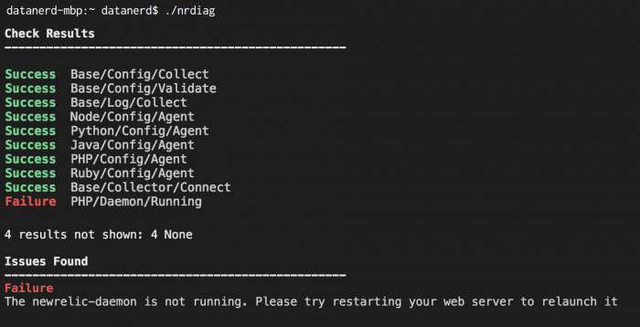

ターミナルからDiagnostics CLIを実行すると、各タスクが完了したときにその結果が表示されます。 `Warning` または `Failure` のステータスコードになったタスクには、実行中に見つかった可能性のある問題に関する追加の詳細が、トラブルシューティングの提案やドキュメントへの関連リンクとともに記録されます。 `-attach` フラグを使用すると、 [New Relic One で結果を確認することができます。](/docs/using-new-relic/cross-product-functions/diagnostics-cli-nrdiag/interpret-nrdiag-output/#diag-in-nr1)

<figcaption>
  Diagnostics CLIは、インストールで見つかった問題を、トラブルシューティングの提案とともに出力します。
</figcaption>

## ファイル出力

Diagnostics CLIは、3つのファイルを出力します。

<table>
  <thead>
    <tr>
      <th style={{ width: "200px" }}>
        診断用出力ファイル
      </th>

      <th>
        コメント
      </th>
    </tr>
  </thead>

  <tbody>
    <tr>
      <td>
        `nrdiag-output.zip`
      </td>

      <td>
        1つまたは複数の設定ファイルと既存のNew Relicログを含むフラット化されたフォルダ構造です。このファイルを New Relic アカウントに添付します。このアーカイブには、 `nrdiag-output.json` のコピーも含まれています。
      </td>
    </tr>

    <tr>
      <td>
        `nrdiag-output.json`
      </td>

      <td>
        個々のテストの出力。このアウトプットをNew Relicアカウントに添付します。
      </td>
    </tr>

    <tr>
      <td>
        `nrdiag-filelist.txt`
      </td>

      <td>
        見つかったファイルのリストです。 `nrdiag-output.zip` New Relic アカウントに添付したファイルには、このリストが自動的に含まれています。この `.txt` ファイルを別途添付する必要はありません。
      </td>
    </tr>
  </tbody>
</table>

## 結果のステータスコード [#status-codes]

Diagnostics CLIは、実行後に以下のステータスコードを返します。

<table>
  <thead>
    <tr>
      <th style={{ width: "125px" }}>
        ステータスコード
      </th>

      <th>
        定義
      </th>
    </tr>
  </thead>

  <tbody>
    <tr>
      <td>
        `成功`
      </td>

      <td>
        タスクは正常に実行され、問題は検出されませんでした。
      </td>
    </tr>

    <tr>
      <td>
        `警告`
      </td>

      <td>
        タスクは正常に実行されました。しかし、問題が発生する可能性があります。
      </td>
    </tr>

    <tr>
      <td>
        `失敗`
      </td>

      <td>
        問題が検出されたため、タスクは失敗しました。
      </td>
    </tr>

    <tr>
      <td>
        `エラー`
      </td>

      <td>
        タスクが実行できませんでした。これはパーミッションの問題である可能性があります。
      </td>
    </tr>

    <tr>
      <td>
        `なし`
      </td>

      <td>
        タスクは検出された環境とは無関係であると判断し、実行しなかった。
      </td>
    </tr>
  </tbody>
</table>

## NR1での診断用CLI出力 [#diag-in-nr1]

`nrdiag-output.json` の出力を New Relic One で調べることができます。選択したアカウントは、アップロードのためにDiagnostics CLIで検証されたライセンスキーと関連しています。

1. [New Relic One](https://one.newrelic.com) でアプリを選択し、 **Diagnostics CLI Output** を検索します。または、この [**Diagnostics CLI Output** permalink](https://onenr.io/0x0jldL3EjW) をクリックすると、直接ページに移動します。
2. 任意です。アイコンの横にある星マークをクリックすると、お気に入りに追加されます。
3. **Diagnostics CLI Output** ドロップダウンからアカウントを選択します。
4. 選択したアカウントで過去に行ったDiagnostics CLIの実行内容をリストから選択します。
5. 各タスクについて、結果のリストを確認し、必要に応じてフィルタリングします。ボタンをクリックすると、ステータスコード別に特定の結果が一覧表示されます。
6. ページの右側で、結果の生のJSONを確認します。