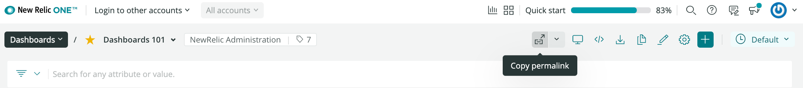
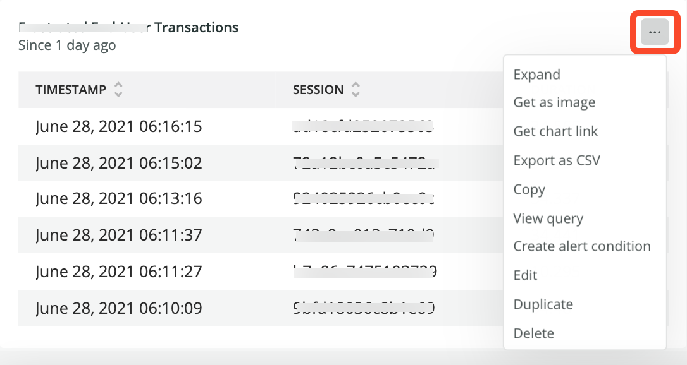

[ダッシュボード](/docs/query-your-data/explore-query-data/dashboards/introduction-dashboards/) は、システムの状況を視覚化して追跡するための強力なツールであり、問題に取り組み、次のステップを計画することができます。ダッシュボードをインポート、共有、エクスポートしたり、ダッシュボードにチャート（またはその他のコンテンツ）を追加して共有するための以下のオプションを使用して、チーム、顧客、またはその他の関係者とすべての情報を共有する方法を学びます。

## ダッシュボードのインポート、共有、エクスポート [#dashboards]

[dashboards index](/docs/query-your-data/explore-query-data/dashboards/introduction-dashboards/#get-started) で、 **[ダッシュボードを JSON としてインポートすることができます](docs/query-your-data/explore-query-data/dashboards/introduction-dashboards/#dashboards-import)** 。

どのダッシュボードからでも、以下のいずれかの方法で共有することができます。

* ダッシュボードのパーマリンクをコピーします。

* ダッシュボード **を JSON** としてコピーし、右隅にある **&lt; />** アイコンをクリックしてクリップボードに追加します。

* ダッシュボード **をpdfファイルとしてエクスポート**

  <Icon name="fe-download"/>

  アイコンをクリックします。

また、 [ダッシュボードを複製することもできます](/docs/query-your-data/explore-query-data/dashboards/introduction-dashboards/#dashboards-clone) 。

## ダッシュボードからチャートやコンテンツを追加・共有 [#charts]

### ダッシュボードに新しいコンテンツを追加 [#charts-add]

[データエクスプローラー](/docs/query-your-data/explore-query-data/data-explorer/introduction-data-explorer) と [クエリビルダ](/docs/introduction-chart-builder) の機能から、どのダッシュボードにも新しいコンテンツを追加することができます。

また、所定のダッシュボードで、コンテンツを追加することもできます。

* 右上の編集

  <Icon name="fe-edit-2"/>

  ボタンをクリックし、 **Add widget** ボタンをクリックして新しいコンテンツを作成します。 [クエリビルダー](/docs/chart-builder/use-chart-builder/get-started/introduction-chart-builder) を使って新しいチャートを追加したり、 [マークダウンエディタ](#markdown) を使ってテキスト、画像、リンクを追加したりすることができます。

* **+ Add to your dashboard** ボタンを使用します。

任意のチャートから、右上のチャートアクションメニューを使って、 **コピーや複製** 。

### チャートエラーのトラブルシューティング [#chart-error-messages]

チャートを追加する際に、以下のようなエラーメッセージが表示されることがあります。

<table>
  <thead>
    <tr>
      <th style={{ width: "400px" }}>
        **エラーメッセージ**
      </th>

      <th style={{ width: "400px" }}>
        **説明**
      </th>
    </tr>
  </thead>

  <tbody>
    <tr>
      <td>
        外部サービス 'NRDB' の実行結果が 400 - 原因です。TIMESERIESのステップ・サイズが現在のタイム・ウィンドウよりも大きい。
      </td>

      <td>
        [`TIMESERIES`](/docs/query-your-data/nrql-new-relic-query-language/get-started/nrql-syntax-clauses-functions/#sel-timeseries)ステップサイズが、選択した時間枠より大きい。ステップを変更して、クエリを再度実行します。
      </td>
    </tr>

    <tr>
      <td>
        外部サービス「NRDB」の実行結果が 400 - 原因です。クエリの開始時刻は終了時刻より前でなければなりません。
      </td>

      <td>
        指定されたクエリの`startTime`は、`endTime`より前でなければなりません。変更して、クエリを再度実行します。
      </td>
    </tr>

    <tr>
      <td>
        NerdGraphGetAuthorizedAccountsCommandの短絡とフォールバックが無効になっています。
      </td>

      <td>
        要求の承認中に通信に失敗しました。数分後にもう一度試してください。
      </td>
    </tr>

    <tr>
      <td>
        アプリケーションは一致しませんでした（appId、appName、entity.guidを指定しましたか？）
      </td>

      <td>
        クエリに一致するエンティティがありませんでした。指定された `appId`, `appName` または `entity.guid` を確認し、再度クエリを実行してください。
      </td>
    </tr>

    <tr>
      <td>
        NRQL構文エラー：1行目15番目の予期しない'FROM'のエラー

        FACETおよびTIMESERIESは、イベントではサポートされていません。
      </td>

      <td>
        クエリに構文の問題があります。[クエリビルダー](/docs/query-your-data/explore-query-data/query-builder/introduction-query-builder/)でエラーを確認します。
      </td>
    </tr>

    <tr>
      <td>
        このクエリグループによって検査済みカウント制限が超過したため、クエリは拒否されました。
      </td>

      <td>
        クエリ制限を超えました。[アカウントごとのデータ使用制限とポリシー](/docs/licenses/license-information/general-usage-licenses/new-relic-data-usage-limits-policies/)を確認してください。
      </td>
    </tr>

    <tr>
      <td>
        クエリの実行中に問題が発生しました。
      </td>

      <td>
        データの取得中に予期せぬエラーが発生しました。数分後に再度お試しください。それでも問題が解決しない場合は、 [https://support.newrelic.com/](https://support.newrelic.com/) までお問い合わせください。
      </td>
    </tr>

    <tr>
      <td>
        TIMESERIESは最大366個のバケットをサポートします
      </td>

      <td>
        [`TIMESERIES`](/docs/query-your-data/nrql-new-relic-query-language/get-started/nrql-syntax-clauses-functions/#sel-timeseries)バケットのサイズが小さすぎるため、選択したすべての時間枠にまたがることができません。バケットのサイズを変更して、クエリを再度実行します。
      </td>
    </tr>

    <tr>
      <td>
        アカウント2022412をクエリする権限がありません
      </td>

      <td>
        このアカウントへのアクセス権がありません。詳細については、管理者にお問い合わせください。
      </td>
    </tr>

    <tr>
      <td>
        クエリがタイムアウトしたか、負荷が高くなっています。さらにサポートが必要な場合は、[https://support.newrelic.com/](https://support.newrelic.com/)に移動してください。
      </td>

      <td>
        NRDBには大きな負荷がかかっており、断続的なタイムアウトが発生します。数分後にもう一度試してください。
      </td>
    </tr>

    <tr>
      <td>
        'nrql'の検証エラー：クエリを指定する必要があります
      </td>

      <td>
        有効なNRQLクエリを指定する必要があります。[当社のクエリ言語](/docs/query-your-data/nrql-new-relic-query-language/get-started/introduction-nrql-new-relics-query-language/)について詳細をご覧ください。
      </td>
    </tr>
  </tbody>
</table>

### チャートやマークダウンコンテンツの共有 [#charts-share]

チャートから、右上角のチャートアクションメニューにアクセスし、次のことを行います。

* チャートを **PNG イメージ** または **リンク** で共有します。チャートのメニューで、 **Get as image** または **Get chart link** のいずれかのオプションを選択してください。
* テーブルチャートのみの場合、 **`.csv` ファイル** としてエクスポートします。このファイルをMicrosoft ExcelやGoogle Sheetsなどの他のアプリケーションにインポートして、さらなる分析を行うことができます。
* チャートをダッシュボードにコピーする。

