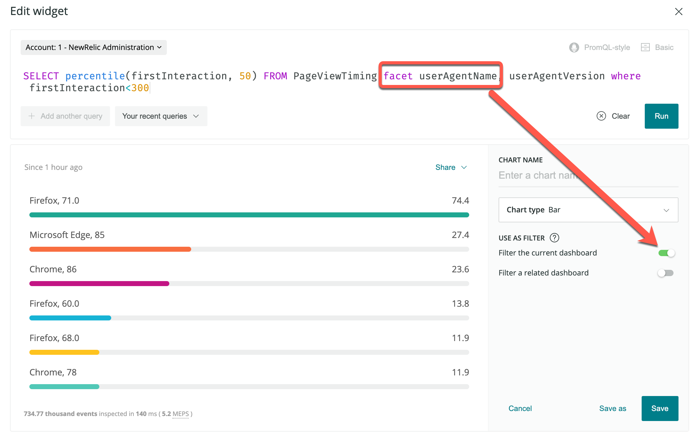

ファセット化した属性により[New Relic Oneダッシュボード](/docs/dashboards/new-relic-one-dashboards/get-started/introduction-new-relic-one-dashboards)にフィルターを適用し、ダッシュボードをよりインタラクティブなものとし使いやすくできます。

## ファセットによるフィルタリングを使用する理由 [#feature]

[New Relic Oneダッシュボード](/docs/dashboards/new-relic-one-dashboards/get-started/introduction-new-relic-one-dashboards)では、[`FACET`句を含み](/docs/query-data/nrql-new-relic-query-language/getting-started/nrql-syntax-components-functions#sel-facet)その他の[チャートタイプ要件を満たす](#requirements)NRQLクエリについて、ファセット化した属性を設定して、現在のダッシュボードや関連するリンクしたダッシュボードにフィルターを適用できます。ダッシュボードのフィルタリングを迅速に行い、フィルターを適用済みのダッシュボードにリンクすることで、ダッシュボードをよりインタラクティブなものとし使いやすくできます。

この機能は、新規のチャートをダッシュボードに追加、または既存のダッシュボードでチャートを編集する際に利用できます。

実際のこの機能については、[使用例](#example-use)をご覧ください。

## 要件 [#requirements]

この機能を使用するための要件：

* [New Relic Oneダッシュボード](/docs/dashboards/new-relic-one-dashboards/get-started/introduction-new-relic-one-dashboards)を開いている必要があります。[クエリビルダー](/docs/chart-builder/use-chart-builder/get-started/introduction-chart-builder)のスタンドアロンチャートでは機能しません。
* NRQLクエリに、[`FACET`句](/docs/query-data/nrql-new-relic-query-language/getting-started/nrql-syntax-components-functions#sel-facet)が含まれる必要があります。
* [バーチャート](/docs/insights/use-insights-ui/manage-dashboards/chart-types#widget-barchart)と[ヒートマップ](/docs/insights/use-insights-ui/manage-dashboards/chart-types#widget-heatmap)、[パイチャート](/docs/insights/use-insights-ui/manage-dashboards/chart-types#widget-piechart)、[表](/docs/insights/use-insights-ui/manage-dashboards/chart-types#widget-table)でしかご利用いただけません。

## ファセットによるフィルタリングの使用例 [#example-use]

New Relic Oneで、既存のダッシュボードについての、次のファセットを含むNRQLクエリを作成しているとします。

<figcaption>
  **[one.newrelic.com](https://one.newrelic.com) > Dashboards**: `FACET`句を含み[チャートタイプの要件](#requirements)を満たすクエリについては、この属性を設定して簡単なダッシュボードフィルターとして使用できます。属性を使用して、現在開いているダッシュボードにフィルターを適用、または選択した関連するダッシュボードにフィルターを適用できます。
</figcaption>

**現在のダッシュボードにフィルターを適用**を選択すると、そのチャートが使用され、利用可能な`userAgentName`属性により現在のダッシュボードにフィルターが適用されます。この属性の1つを選択し、そのダッシュボードにフィルターを適用するとこうなります。選択した属性は、上部の検索バーでフィルターとして表示されることに注意してください。

<figcaption>
  **[one.newrelic.com](https://one.newrelic.com) > Dashboards**: ファセットによるフィルタリングで設定した属性を選択すると、現在のダッシュボードにフィルターが適用されます。
</figcaption>

この機能の詳細については、[ファセットによるフィルタリングについてのExplorers Hubの投稿](https://discuss.newrelic.com/t/facet-linking-in-new-relic-one-now-you-can-use-facets-to-filter-your-new-relic-one-dashboards/82289)をご覧ください。

## その他のヘルプ [#more-help]

さらに支援が必要な場合は、これらのサポートと学習リソースを確認してください：

* [Explorers Hub](https://discuss.newrelic.com/)を参照して、コミュニティから支援を受け、ディスカッションに参加してください。
* [当社のサイトで回答を見つけ、サポートポータルの使用方法について学びます](/docs/using-new-relic/welcome-new-relic/get-started/find-help-use-support-portal)。
* Linux、Windows、およびmacOSのトラブルシューティングツールである[New Relic Diagnosticsを実行します](/docs/using-new-relic/cross-product-functions/troubleshooting/new-relic-diagnostics)。
* New Relicの[データセキュリティ](/docs/security)と[ライセンス](/docs/licenses)ドキュメントを見直してください。
