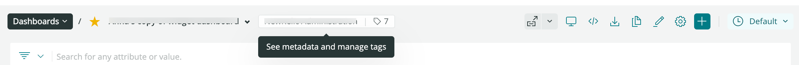

[New Relic Oneダッシュボード](/docs/dashboards/new-relic-one-dashboards/get-started/introduction-new-relic-one-dashboards)にアクセスし、チャートメニューから直接チャートを作成または管理し、ダッシュボードのレイアウトをカスタマイズし、表示モードを調整し、データのエクスポートを行います。

ダッシュボードをカスタマイズし、チャートを構築したら、データを詳しく知るための高度な視覚化機能とツールを使用して、データを関連付け分析します。

## ダッシュボードのカスタマイズ [#dash-manage]

ダッシュボードは非常に柔軟です：ダッシュボードのレイアウトをカスタマイズし、チャートのサイズを調整してデータの表示方法を最適化できます。

<Callout variant="tip">
  <Icon name="fe-tag"/>アイコンをクリックして、**メタデータを表示しタグを管理**モーダルにアクセスします。ここで、ダッシュボードのGUIDやアカウントID、アプリIDを表示し、ダッシュボードに追加されたすべてのタグを管理できます。
</Callout>

ダッシュボードには、次の機能が含まれます：

<CollapserGroup>
  <Collapser
    id="dash-edit"
    title="ダッシュボードを編集する"
  >
    編集<Icon name="fe-edit-2"/>ボタンを使用して、次の操作を行います。

    * ダッシュボードのパーマリンクをコピーします。
    * ダッシュボードの名前を変更する。名前は検索可能なため、意味のある名前を付けることを推奨します。
    * **ウィジェットを追加**ボタンをクリックして、新規コンテンツを作成する。[クエリビルダー](/docs/chart-builder/use-chart-builder/get-started/introduction-chart-builder)を使用して新規チャートを追加する、または[マークダウンエディタ](#markdown)を使用してテキストや画像、リンクを追加する。
    * チャートのサイズと範囲を変更する。設定したレイアウトが好みに合うように、任意のチャートを移動してダッシュボードの任意の場所に配置できます。適切なチャートを上に置いたり、使用頻度の低いチャートを隅にドロップしたりできます。最大で12列のチャートを設定できます。
  </Collapser>

  <Collapser
    id="dash-settings"
    title="設定メニュー"
  >
    右上にある設定メニューを使用します。

    * ダッシュボードの名前を変更する。[名前は検索可能](/docs/dashboards/explore-dashboards-index/explore-dashboards-index#search-dashboards)なため、ダッシュボードを簡単に検索できる意味のある名前を付けることを推奨します。

    * [ダッシュボードの許可](/docs/dashboards/explore-dashboards-index/explore-dashboards-index#dashboards-permission)を変更する。

      設定メニューで、[ダッシュボードの作成時期とダッシュボードに属するアカウント](/docs/dashboards/explore-dashboards-index/explore-dashboards-index#see-dashboards)も表示できます。この値は変更できません。
  </Collapser>

  <Collapser
    id="dash-visual-tv"
    title="TVモード"
  >
    テレビ画面での表示向けにダッシュボードを最適化する、全画面のTVモードを有効にできます。

    TVモードを有効にするには、次の2つの方法があります。

    * New Relic Oneでダッシュボードを表示している際に、右上の<Icon name="fe-tv"/>アイコンを選択します。

    * このパラメーターをダッシュボードのページのURL：`&platform[tvMode]=true`に追加します。

      TVモードを設定するには、ダッシュボードから<Icon name="fe-settings"/>アイコンを選択します。オプションに含まれるもの：

    * **ダッシュボード名が表示されます。**ダッシュボード名をオフにすると、画面上でダッシュボードのチャートのスペースが増えます。

    * **ページの切り替え。**[複数のページのあるダッシュボード](#)では、これによりページが自動的に切り替わります。
  </Collapser>

  <Collapser
    id="dash-visual-dark-full"
    title="ダークモード"
  >
    高コントラストモードを、ダッシュボードで使用できます。<Icon name="fe-moon"/>アイコンを、右上のメニューバーから選択します。
  </Collapser>

  <Collapser
    id="dash-json"
    title="ダッシュボードをJSONとしてコピーする"
  >
    ダッシュボードをJSONとしてコピーし、右隅の**&lt;/>**アイコンをクリックしてクリップボードに追加できます。
  </Collapser>

  <Collapser
    id="dash-esport"
    title="ダッシュボードをエクスポートする"
  >
    <Icon name="fe-download"/>アイコンをクリックして、PDFファイルとしてダッシュボードをエクスポートできます。
  </Collapser>

  <Collapser
    id="dash-clone"
    title="ダッシュボードを複製する"
  >
    許可レベルにかかわらず、複製アイコンをクリックしてご利用のダッシュボードの複製を作成できます。ダッシュボードは自動的にコピーされ、複製が[インデックス](/docs/query-your-data/explore-query-data/dashboards/introduction-dashboards/#get-started)に追加されます。複製には、[**パブリック - 読み取りと書き込み**許可](/docs/query-your-data/explore-query-data/dashboards/introduction-dashboards/#dashboards-permissions)があります。画面にポップアップ表示されるメッセージをクリックして、複製された新規ダッシュボードにアクセスします。

    複製版のダッシュボードには、元のダッシュボードの名前の後に「コピー」が付けられます。たとえば、`This is my dashboard`という名前のダッシュボードの複製を作成すると、複製は`This is my dashboard copy`として作成されます。複製の作成時に名前を変更できます。

    ダッシュボードの名前や許可などのその他のプロパティは、いつでも編集できます。
  </Collapser>
</CollapserGroup>

<Callout variant="tip">
  いつでも[検索](/docs/new-relic-one-core-ui-components)機能を使用して、[New Relic One](/docs/new-relic-one/use-new-relic-one/get-started/introduction-new-relic-one)全体でデータを検索できます。
</Callout>

## 新規コンテンツをダッシュボードに追加する [#dash-create-chart]

複数の方法で、ダッシュボードに新規コンテンツを追加できます：

* [データエクスプローラー](/docs/query-your-data/explore-query-data/data-explorer/introduction-data-explorer)および[クエリビルダー](/docs/introduction-chart-builder)機能から。
* **+ ダッシュボードに追加**ボタン（メインのダッシュボードのページから、または編集モードでアクセス可能）を使用して、[クエリビルダー](/docs/chart-builder/use-chart-builder/get-started/introduction-chart-builder)にアクセスするか、[マークダウンエディタ](#dash-create-chart)を使用してコンテンツ（テキストやリンク、画像など）を追加する。
* ダッシュボードから[既存のチャートをコピーする](#dash-manage-charts)。

新規コンテンツの追加で問題が発生した場合は、[エラーメッセージを確認](/docs/query-your-data/explore-query-data/dashboards/dashboards-charts-import-export-data/#chart-error-messages)してください。

### マークダウンエディタを使用して、カスタムコンテンツを追加する。 [#markdown]

マークダウンエディタには、コンテンツを入力する**マークダウン**ペインや、表示する**プレビュー**ペインが含まれます。マークダウン構文オプションの詳細については、[Commonmarkのウェブサイト](https://commonmark.org/help/)をご覧ください。

マークダウンウィジェットの楕円<Icon name="fe-more-horizontal"/>アイコンをクリックし、**編集**をクリックして、既存のコンテンツを編集することもできます。

## ページのあるダッシュボードを整理する [#add-pages]

複数のページを使用して、さまざまな表示でダッシュボードを整理できます。ページをそのダッシュボードに追加すると、ダッシュボードUIの上部にあるタブを使用して、そのページにアクセスできます。

<figcaption>
  **[one.newrelic.com](https://one.newrelic.com) > Dashboards**：ダッシュボードの上部にあるタブで表示された、複数のページのあるNew Relic Oneのダッシュボードの例は次のとおりです。ページをダッシュボードに追加し、既存のページをコピーし、ページタブを新たな位置にドラッグしてドロップできます。
</figcaption>

この機能を使用して、関連するダッシュボード表示をグループ化できます。これは、特定のプロジェクトやチーム、主題に関連する多くのデータとチャートを集計する際に有用です。

たとえば、モバイルアプリチームは、国ごとにアプリのパフォーマンスに重点を置いたダッシュボードを構築できます。最初のダッシュボードのページを、すべての国のパフォーマンスの概要とし、その他のページで特定の国を取り上げることができます。

当社では、ダッシュボードをつなぐその他の機能を提供しています。

* [マークダウンテキストを含むウィジェットを作成](#markdown)して、特定のUIページやダッシュボードへのダイレクトリンクを追加します。
* [ファセットによるフィルタリング](/docs/dashboards/new-relic-one-dashboards/manage-your-dashboard/filter-new-relic-one-dashboards-facets)を使用して、自動的にその他のダッシュボードにリンクしフィルタリングを行うリンクを作成します。
* ダッシュボード検索を使用して、似た名前のダッシュボードを検索します。この機能を活用して、チームやプロジェクトに固有の語句をダッシュボード名に追加できます。

### ページをダッシュボードに追加し編集する [#add-pages-edit]

ページをダッシュボードに追加、またはページを編集するには：

1. 新規または既存のダッシュボードで、

   <Icon name="fe-edit-2"/>

   アイコンを選択して編集モードで入力します。

2. 新規ページを追加する：

   * **ページを追加**を選択して空白のページを追加します。
   * ダッシュボード名の隣にあるドロップダウンをクリックし、**複製**を選択して、既存のページのクローンを作成します。

3. 編集モードの間、新規ページにウィジェットを追加し、ページタブを新たな場所にドラッグしてドロップしたり、その他の[ダッシュボード編集タスク](#dash-manage)を行えます。

4. 終了したら、**編集を完了**を選択します。

## チャートとマークダウンコンテンツを管理する [#dash-manage-charts]

マークダウン要素から、右上隅にあるアクセスメニューにアクセスし、編集または削除を行います。チャートから、右上角のチャートアクションメニューにアクセスし、次のことを行います。

* チャートを全画面に拡張する。
* 画像として、またはリンクを付けて[チャートを共有する](#dash-export)。
* チャートをダッシュボードにコピーする。
* テーブルチャートのみの場合、`.csv`ファイルとしてエクスポートします。このファイルをMicrosoft ExcelやGoogle Sheetsなどの他のアプリケーションにインポートして、さらに分析することができます。
* アラート条件を作成します。
* [NRQLコンソール](/docs/query-your-data/explore-query-data/query-builder/nrql-console/)を開き、チャートに関連付けられたクエリを表示または編集します。
* チャートを複製します。
* チャートを削除する。

<Callout variant="important">
  ダッシュボードに対する許可が**読み取り専用**の場合、チャートのクエリは編集できません。
</Callout>

詳細については、[チャートの使い方](/docs/query-your-data/explore-query-data/use-charts/use-your-charts)をご覧ください。

## チャートにフィルターを適用して絞り込む [#dash-search]

フィルタリング機能を使用して、ディスプレイで情報を絞り込むことができます。この機能は、クエリ条件を視覚的に表すものです。

* **フィルターバー**を使用して、表示する値や属性を選択し、チャートから残りの要素を削除する。
* **高度なフィルターバー**を開いてboolean演算子（`=`、`!=`、`CONTAINS`、`EXCLUDES`など）にアクセスし、データのフィルタリングのための複雑で組み合わされた条件を追加します。

フィルターを適用後、ダッシュボードには、選択した要素に関連するデータのみが表示されます。小さなカウンターは、1回にいくつのフィルターが適用されているかを表します。

デフォルト表示に戻るには、フィルターの横にある小さなXをクリックして削除します。

## チャート凡例を使用してフィルターを適用する [#filter-legend]

凡例のついたチャートで凡例をクリックして、その系列のみを表示し、チャートから残りのものを削除します。これにより、分析するデータを隔離できます。

CMD（Mac）またはCTRL（Windows）を使用して、選択したシリーズを削除し、残りのシリーズを保持します。

## ファセットを使用してダッシュボードにフィルターを適用する

チャートのNRQLクエリに`FACET`句が含まれる場合、ファセットのついた属性を使用して、現在のダッシュボードまたは別の関連するダッシュボードにフィルターを適用できます。詳細については、[ファセットによりフィルターを適用する](/docs/dashboards/new-relic-one-dashboards/manage-your-dashboard/filter-new-relic-one-dashboards-facets)をご覧ください。

## タイムピッカーを使用して時間設定を変更する [#dash-time-picker]

デフォルトでは、ダッシュボードの各チャートには、[クエリビルダーで作成](/docs/introduction-chart-builder)時に指定された期間のデータが表示されますが、タイムピッカーを使用して表示されるデータの時間範囲を変更し、すべてのチャートに同じ範囲を設定できます。これは、データを絞り込み特定の期間に何が発生したかを観察する必要がある場合、インシデントのトラブルシューティングの間に特に有用です。

更新率は、表示中の期間の長さにより異なります。将来と例については、[チャートの更新間隔](/docs/insights/use-insights-ui/manage-dashboards/insights-chart-refresh-intervals)をご覧ください。

時間範囲を変更するには：

* ドロップダウンメニューから、利用可能なオプション（`直近30分`から`直近7日`まで）を1つ選択します。
* カスタムメニューを使用して、特定の開始および終了タイムスタンプで時間範囲をカスタマイズします。

## データをエクスポートし共有する [#dash-export]

社内外でダッシュボードとチャートデータをエクスポートし共有することは、非常に簡単です。

* 右上のメニューバーにある**PDFとしてダッシュボードをエクスポート**ボタンを使用して、PDFファイルとしてダッシュボードをエクスポートできます。
* チャートをPNG画像またはリンクとして共有することもできます。チャートメニューに移動し、**画像として取得**または**チャートリンクを取得**オプションのいずれかを選択します。

## 削除されたダッシュボードを復元する [#deleted]

ダッシュボードを誤って削除した場合は、NerdGraphを使用することですばやく復元できます。その復元方法については、[Explorers Hubの投稿](https://discuss.newrelic.com/t/relic-solution-using-nerdgraph-to-recover-a-deleted-dashboard/142855)を読むか、この短いビデオ（2分13秒）をご覧ください。

<Video
  id="W_HblVC4mqU"
  type="youtube"
/>