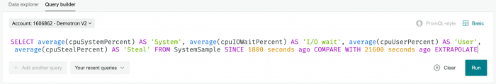

基本モードは、クエリ作成法について知らずにチャートを作成するのには適していますが、詳細（NRQL）モードでは、より強力な追加機能を利用できます。

**基本**モードで指定したデータは、**詳細（NRQL）**モードでNRQLクエリとして作成できます。

基本モードのデータ指定がNRQLクエリでどうなるかを確認するには、基本ページの詳細（NRQL）リンクをクリックします。

<figcaption>
  詳細（NRQL）クエリの例。
</figcaption>

## 詳細（NRQL）モードクエリを、基本モード仕様と比較する [#compare-nrql-basic]

**基本**モードから**詳細（NRQL）**モードに切り替えると、クエリで基本データ仕様と全く同じチャートが表示されます。

<Callout variant="important">
  基本モードを使用してクエリを作成**した後、**詳細（NRQL）モードでそのクエリを変更すると、基本モードに戻ってクエリを編集することは**できません**。

  追加変更は、詳細（NRQL）モードでのみ実行できます。
</Callout>

この表を使用して、基本モード仕様がどのように同様のNRQLクエリに対応しているかを理解してください。

<table>
  <thead>
    <tr>
      <th>
        この設定を行うには
      </th>

      <th>
        基本モードでは、...を入力します
      </th>

      <th>
        詳細（NRQL）モードでは、...を作成します
      </th>
    </tr>
  </thead>

  <tbody>
    <tr>
      <td>
        イベントタイプおよび属性、その属性の機能
      </td>

      <td>
        **トランザクションでチャートを表示** `：名前：unique_count`
      </td>

      <td>
        [`SELECT`](/docs/insights/nrql-new-relic-query-language/nrql-reference/nrql-syntax-components-functions#state-select) [`uniqueCount`](/docs/insights/nrql-new-relic-query-language/nrql-reference/nrql-syntax-components-functions#func-uniqueCount)(name) [`FROM`](/docs/insights/nrql-new-relic-query-language/nrql-reference/nrql-syntax-components-functions#sel-from) `Transaction`
      </td>
    </tr>

    <tr>
      <td>
        結果を絞り込み、「404 ページが見つかりません」エラーのあるトランザクションのみを表示します。
      </td>

      <td>
        **httpResponseCode='404'**`に結果を絞り込む`
      </td>

      <td>
        [`WHERE`](/docs/insights/nrql-new-relic-query-language/nrql-reference/nrql-syntax-components-functions#sel-where) `httpResponseCode = '404'`
      </td>
    </tr>

    <tr>
      <td>
        予備的な時系列表示を有効にする
      </td>

      <td>
        _基本モードでは不要_
      </td>

      <td>
        [`TIMESERIES`](/docs/insights/nrql-new-relic-query-language/nrql-reference/nrql-syntax-components-functions#sel-timeseries) — 線チャートタイプを有効にします（最初のチャート表示で必要）
      </td>
    </tr>

    <tr>
      <td>
        404エラーのある各アプリケーションの別個の値を表示する
      </td>

      <td>
        **appName**ごとに`ファセットを適用`
      </td>

      <td>
        [`FACET`](/docs/insights/nrql-new-relic-query-language/nrql-reference/nrql-syntax-components-functions#sel-facet) `` `appName` ``
      </td>
    </tr>

    <tr>
      <td>
        404エラーが多いアプリケーション上位5つを表示する
      </td>

      <td>
        **限度** `5` — デフォルト値は10です
      </td>

      <td>
        [`LIMIT`](/docs/insights/nrql-new-relic-query-language/nrql-reference/nrql-syntax-components-functions#sel-limit) `5`
      </td>
    </tr>

    <tr>
      <td>
        直近3時間のエラーを表示する
      </td>

      <td>
        `直近3時間`を選択 — NRQLクエリで秒に変換
      </td>

      <td>
        [`SINCE`](/docs/insights/nrql-new-relic-query-language/nrql-reference/nrql-syntax-components-functions#sel-since) `10800秒前`
      </td>
    </tr>

    <tr>
      <td>
        トランザクションデータのサンプリングの結果を改善する
      </td>

      <td>
        この機能は、基本モードでは自動的に実行されます
      </td>

      <td>
        [`EXTRAPOLATE`](/docs/insights/nrql-new-relic-query-language/nrql-reference/nrql-syntax-components-functions#extrapolate)
      </td>
    </tr>
  </tbody>
</table>

## 詳細（NRQL）モードについての注 [#notes-nrql]

NRQLで直接作成されたクエリは、基本モードで作成されたクエリより複雑な場合があります。たとえば、複数のNRQLクエリでウィジェットを作成する方法については、この短いビデオ（3分40秒）をご覧ください。

<Video
  id="73wzGefS_-c"
  type="youtube"
/>

[NRQLドキュメント](/docs/insights/nrql-new-relic-query-language/using-nrql/introduction-nrql)には、参照情報とクエリの例の両方が含まれます。この表では、留意すべき追加項目を特定します。

<table>
  <thead>
    <tr>
      <th width="25%">
        項目
      </th>

      <th>
        説明
      </th>
    </tr>
  </thead>

  <tbody>
    <tr>
      <td>
        プロンプト表示
      </td>

      <td>
        クエリの各文や関数について、ツールチップで有効なオプションのリストを表示できます。

        

        <figcaption>
          詳細（NRQL）モードのプロンプトの例。
        </figcaption>
      </td>
    </tr>

    <tr>
      <td>
        イベント
      </td>

      <td>
        NRQLクエリで、複数のイベントタイプを使用できます。
      </td>
    </tr>

    <tr>
      <td>
        属性
      </td>

      <td>
        NRQLクエリで、1イベントにつき複数のイベントタイプを使用できます。
      </td>
    </tr>

    <tr>
      <td>
        以前のクエリを表示
      </td>

      <td>
        NRQLクエリを実行した後、**直近のクエリ**ドロップダウンを使用して、実行した直近の1000件のクエリを表示します。ドロップダウンには、クエリ検索に役立つ検索ボックスがあります。
      </td>
    </tr>

    <tr>
      <td>
        基本モードとNRQLでの作業
      </td>

      <td>
        基本モードを使用してチャート作成を開始してから詳細（NRQL）に切り替える場合、NRQLクエリを変更すると基本モードでは変更が失われることに注意してください。
      </td>
    </tr>

    <tr>
      <td>
        自動コンプリータ
      </td>

      <td>
        クエリビルダーの自動コンプリータは、直近60分以内にレポートされたイベントと属性を表示します。この例としては、毎朝午前6:00に開始される標準のシステム健全性チェックなど、1日1回実行されるプロセスがあります。イベントのクエリを午前7:05に行おうとすると、イベントとその後の属性は自動完了ドロップダウンでは表示されません。

        このイベントと属性は、正確に文字列を入力してクエリを行えます。
      </td>
    </tr>

    <tr>
      <td>
        複数クエリ
      </td>

      <td>
        [`TIMESERIES`](/docs/query-data/nrql-new-relic-query-language/getting-started/nrql-syntax-clauses-functions#sel-timeseries)句を使用して、別のアカウントから最大で10件のクエリを実行し比較できます。

        複数クエリを使用するには、`TIMESERIES`とともに最初のクエリを入力して実行します。結果が出たら、**別のクエリを追加**ボタンが有効になり、別のクエリを追加できます。
      </td>
    </tr>
  </tbody>
</table>