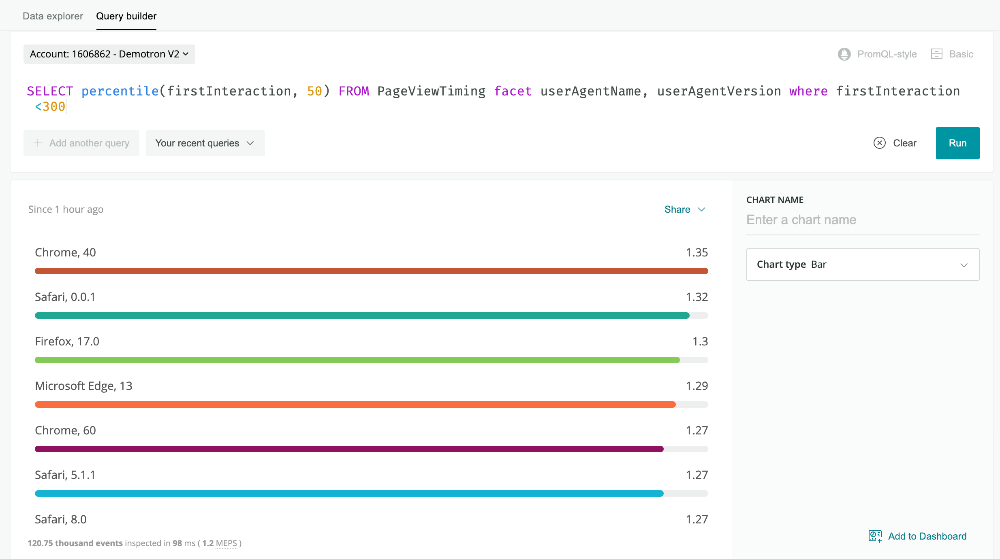
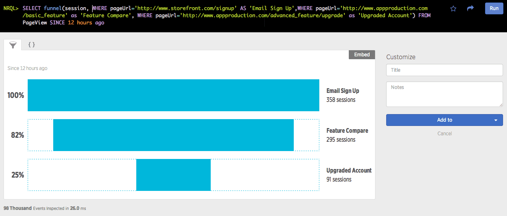

[クエリビルダ](/docs/query-your-data/explore-query-data/query-builder/introduction-query-builder/)を使用してクエリを構築する場合には、最適フォーマットでデータを表示するさまざまな視覚化タイプがあります。

この表にはすべてのチャートタイプが含まれます。チャートタイプをクエリで使用できるかどうかは、以下に依存します。

* クエリのタイプ（一部のクエリ結果は一部のチャートタイプとは一致しません）
* クエリモード（基本またはアドアンスト）

<CollapserGroup>
  <Collapser
    className="freq-link"
    id="widget-areachart"
    title="面グラフ"
  >
    面グラフには、単一の属性に関する時系列データが表示されます。

    

    <figcaption>
      面グラフは、単一属性に関する時系列を表します。
    </figcaption>

    面グラフを有効にするには、クエリに[`FACET`](/docs/insights/nrql-new-relic-query-language/nrql-reference/nrql-syntax-components-functions#sel-facet)を追加します。

    ファセットを使用して属性を最大5つまで、カンマで区切って追加できます。NRQLクエリで[FACET`を使用する場合は、`](/docs/insights/nrql-new-relic-query-language/nrql-reference/nrql-syntax-components-functions#sel-timeseries)TIMESERIES``関数を使用します。

    <table>
      <tbody>
        <tr>
          <td>
            以下の場合は、面グラフを使用します。
          </td>

          <td>
            指定した一定期間にわたる単一属性の測定を表示する場合。
          </td>
        </tr>

        <tr>
          <td>
            以下の場合は、面グラフの使用を避けます。
          </td>

          <td>
            属性を1つ以上含むグラフを表示する場合。[折れ線グラフタイプ](#widget-linechart)は、指定した時間範囲にわたる複数の属性を表示できる優れたオプションです。[バーチャートタイプ](#widget-barchart)は、属性間の比較表示に使用し、選択する時間範囲にわたる各属性の合計を使用します。
          </td>
        </tr>
      </tbody>
    </table>
  </Collapser>

  <Collapser
    className="freq-link"
    id="widget-barchart"
    title="バーチャート"
  >
    バーチャートには、クエリ結果で返されたカテゴリー間の比較が表示されます。

    

    <figcaption>
      バーチャートは関連する一連の値を比較します。
    </figcaption>

    バーチャートを有効にするには、クエリに[`FACET`](/docs/insights/nrql-new-relic-query-language/nrql-reference/nrql-syntax-components-functions#sel-facet)句を追加します。

    `FACET`句は、カンマで区切られた最大5つの異なる属性に使用できます。

    <table>
      <tbody>
        <tr>
          <td>
            以下の場合は、バーチャートを使用します。
          </td>

          <td>
            指定した時間範囲におけるカテゴリーのデータの総数をレポートするチャートを作成。バーチャート形式を使用すると、各カテゴリの違いを簡単に確認できます。
          </td>
        </tr>

        <tr>
          <td>
            以下の場合は、バーチャートの使用を避けます。
          </td>

          <td>
            一定期間にわたる測定値を含める場合。[TIMESERIES](/docs/query-data/nrql-new-relic-query-language/getting-started/nrql-syntax-clauses-functions#sel-timeseries)句を使用中の場合、このチャートタイプは使用できません。[折れ線グラフタイプ](#widget-linechart)は、このような視覚化に優れたオプションです。
          </td>
        </tr>
      </tbody>
    </table>
  </Collapser>

  <Collapser
    className="freq-link"
    id="widget-billboard"
    title="ビルボード"
  >
    ビルボードチャートは、結果を単一の、非常に見やすい値として表します。これは、このクエリから、クエリが単一の数を返す場合のオプションです。

    ```
    SELECT uniqueCount(session) FROM PageView since 1 day ago
    ```

    ビルボードチャートは、 [Apdex](/docs/apm/new-relic-apm/apdex/apdex-measure-user-satisfaction)関数などの単一統計クエリに便利です。ビルボードを使用すると、値を一目でモニターできます。

    ビルボードは、複数の状況にまたがる単一の値を比較する際にも使用できます。たとえば、[`COMPARE WITH`](/docs/insights/nrql-new-relic-query-language/nrql-reference/nrql-syntax-components-functions#sel-compare)句を使用して、2つの異なる時間枠の同じ属性を比較します。

    データをビルボードチャートで使用できるようにするには、単一の値を検索します。ドロップダウンからファセットを追加することで、複数の値を表示できます。

    **閾値**

    オプションで、ビルボードの**警告**および/または**クリティカル**閾値を設定できます。設定が完了すると、サービスが正しく機能している場合、チャートのフルボックスは緑色になります。閾値を超えると、チャートは黄色（警告）または赤色（クリティカル）に変わります。クエリビルダーのチャート編集ペインの右側にある閾値フィールドにアクセスします。

    

    <figcaption>
      ビルボードチャートは、単一の値を大きく読みやすいフォントで表示します。背景の色は、閾値に基づいて変化します。
    </figcaption>

    値が所定の値を上回るのでなく下回った場合にチャートを強調表示したい場合、**Warning（警告）**閾値を**Critical（クリティカル）**閾値より高く設定します。

    <Callout variant="tip">
      閾値フィールドは、単一の値を表すダッシュボードにのみ使用できます。たとえば、`COMPARE WITH`句を使用すると、編集ペインの閾値設定が無効になります。
    </Callout>

    **使用**

    <table>
      <tbody>
        <tr>
          <td>
            以下の場合は、ビルボードチャートを使用します。
          </td>

          <td>
            大きくて読みやすいフォントで、**クリティカル**および**警告**状態にある閾値を含めた値を監視する場合。
          </td>
        </tr>

        <tr>
          <td>
            以下の場合は、ビルボードチャートを使用を回避します。
          </td>

          <td>
            一定期間にわたってデータを表示する場合。[折れ線グラフタイプ](#widget-linechart)は、時間ごとにデータを表示できる優れたオプションです。
          </td>
        </tr>
      </tbody>
    </table>
  </Collapser>

  <Collapser
    className="freq-link"
    id="bullet-chart"
    title="ブレットチャート"
  >
    ブレットチャートタイプを使用して、リミットと呼ばれるターゲットまたは目標に向けた進捗状況を表します。このチャートタイプを使用するには、以下のような単一の数を返すクエリを実行します。

    ```
    SELECT uniqueCount(session) FROM PageView SINCE 1 day ago
    ```

    

    <figcaption>
      ブレットチャートは、リミットと比較した値を表示します。
    </figcaption>

    ブレットは、デフォルトで結果のクエリ値の2倍を限度とする値に設定されています。リミットを調整する場合は、\[**Limit（リミット）**] フィールドに別の数値を入力します。ブレットは、それに応じて変更されます。

    <Callout variant="tip">
      ブレットチャートタイプは、単一の値を表すチャートにのみ使用できます。たとえば、[`COMPARE WITH`](/docs/insights/nrql-new-relic-query-language/nrql-reference/nrql-syntax-components-functions#sel-compare)を使用するクエリでは、オプションとしてブレットがリストされません。
    </Callout>

    <table>
      <tbody>
        <tr>
          <td>
            以下の場合は、ブレットチャートを使用します。
          </td>

          <td>
            値を素早く確認するために、大きく読みやすいフォントでチャートを表示する場合。
          </td>
        </tr>

        <tr>
          <td>
            以下の場合は、ブレットチャートの使用を回避します。
          </td>

          <td>
            単一の値を越えるデータを表示する場合。この場合は、バーチャートおよび折れ線グラフタイプが優れたオプションです。  

          </td>
        </tr>
      </tbody>
    </table>
  </Collapser>

  <Collapser
    className="freq-link"
    id="funnel"
    title="ファネル"
  >
    指定した目標に向けたステップとなる一連の関連データ型を評価するには、[ファネル](/docs/insights/nrql-new-relic-query-language/nrql-query-examples/funnels-evaluate-data-series-events)を使用します。ファネルでは、以下を問い合わせできます。 「（A）を行った人のうち、（B）も行ったのは何人であり、また（A）と（B）を行った人のうち、（C）も完了した人は何人だったでしょうか？」

    

    <figcaption>
      ショッピングサイトのサンプルのファネルチャート。
    </figcaption>

    この例では、ランディングページを見た訪問者のうち、何人が以下を行ったか判別する必要があります。

    * 製品を閲覧した。

    * 次に、買い物かごに1つ以上の製品を追加した。

    * 最後に、買い物かご内の商品を購入した。

      他のクエリとは異なり、このクエリには[`SELECT`](/docs/insights/nrql-new-relic-query-language/nrql-reference/nrql-syntax-components-functions#state-select) [`funnel()`](/docs/insights/nrql-new-relic-query-language/nrql-reference/nrql-syntax-components-functions#func-funnel)ステートメントを使用する必要があります。ファネルチャートタイプは、他のどのクエリのタイプからも選択できません。

      さらに、ファネルチャートタイプは、ステップ数が8以下のクエリでしか使用できません。8を超えるステップを含むファネルクエリは、JSONとしてのみ結果を返します。

      ```
      SELECT funnel(session,
          WHERE pageUrl like '%/index.html' AS 'Landing',
          WHERE pageUrl LIKE '%/browse/phones' AS 'Browse ',
          WHERE pageUrl LIKE '%/shoppingcart' AS 'Cart',
          WHERE pageUrl LIKE '%/checkout' AS 'Purchased')
          FROM PageView where appName = 'WebPortal' AND duration < 1
          SINCE 1 week ago
      ```

      <table>
        <tbody>
          <tr>
            <td>
              以下の場合は、ファネルチャートを使用します。
            </td>

            <td>
              ランディングページとして指定するページをヒットした後に、訪問者が取るパスを視覚的に評価する場合。
            </td>
          </tr>

          <tr>
            <td>
              以下の場合は、ファネルチャートの使用は回避します。
            </td>

            <td>
              [`WHERE`](/docs/insights/nrql-new-relic-query-language/nrql-reference/nrql-syntax-components-functions#where-operator)句における属性数のみが必要な場合。クエリで`SELECT funnel`を使用しない限り、ファネルは選択できません。
            </td>
          </tr>
        </tbody>
      </table>
  </Collapser>

  <Collapser
    className="freq-link"
    id="widget-heatmap"
    title="ヒートマップ"
  >
    ヒートマップは、色のグラデーションを使用した表形式でデータを表示し、特定の時間バケットにおける頻度を示します。

    

    <figcaption>
      ヒートマップ は、色の濃さで値を表した値のファセット分布です。
    </figcaption>

    ヒートマップを有効にするには、数値属性を含む[`Histogram()`](/docs/insights/nrql-new-relic-query-language/nrql-reference/nrql-syntax-components-functions#func-histogram)関数を使用し、[`FACET`](/docs/insights/nrql-new-relic-query-language/nrql-reference/nrql-syntax-components-functions#sel-facet)を使用して、カンマで区切った属性を最大で5つまで追加します。

    ヒストグラムベースのチャートの詳細については、[ヒストグラム：データ分布を表示する](/docs/using-new-relic/user-interface-functions/view-your-data/histograms-view-data-distribution)を参照してください。

    <table style={{ fontSize: "12pt" }}>
      <tbody>
        <tr>
          <td>
            以下の場合は、ヒートマップを使用します。
          </td>

          <td>
            数値の代わりに色のグラデーションを使用して、一定期間にわたる複数の属性の表データを表示する場合。
          </td>
        </tr>

        <tr>
          <td>
            以下の場合は、ヒートマップの使用を回避します。
          </td>

          <td>
            一定期間にわたる複数の属性に関する厳密なデータを表示する場合。折れ線グラフまたはバーチャートがオプションです。
          </td>
        </tr>
      </tbody>
    </table>
  </Collapser>

  <Collapser
    className="freq-link"
    id="widget-histogram"
    title="ヒストグラム"
  >
    

    <figcaption>
      ヒストグラムチャート は、一連の値の範囲にわたる頻度を図表化します。
    </figcaption>

    ヒストグラムを使用して、時間バケットにまたがるデータ分布を示します。ヒストグラムベースのチャートの詳細については、[ヒストグラム：データ分布を表示する](/docs/using-new-relic/user-interface-functions/view-your-data/histograms-view-data-distribution)を参照してください。

    <table>
      <tbody>
        <tr>
          <td>
            以下の場合は、ヒストグラムを使用します。
          </td>

          <td>
            一連の値のデータの頻度を図表化する場合。
          </td>
        </tr>

        <tr>
          <td>
            以下の場合は、ヒストグラムの使用を回避します。
          </td>

          <td>
            [ヒート](#widget-heatmap)[マップ](#widget-heatmap)と同じデータを表示、または時間バケットなしでデータを表示する場合。
          </td>
        </tr>
      </tbody>
    </table>
  </Collapser>

  <Collapser
    className="freq-link"
    id="widget-json"
    title="JSON"
  >
    返されたJSONを使用して返された生データを確認し、New Relic Insightsとのインテグレーションの開発に役立てます。インテグレーションを実行するには、[リモートクエリ](/docs/insights/new-relic-insights/adding-querying-data/querying-your-data-remotely)を使用して、生のJASONをサービスとして取得します。

    これを使用するには、\[**Share（共有）**] メニューを選択し、\[**Copy JSON（JSONをコピー）**] をクリックします。

    NRQLクエリの例

    ```
    SELECT uniqueCount(name) FROM Transaction
    WHERE httpResponseCode = '200'
    TIMESERIES
    FACET appName
    LIMIT 10
    SINCE 24 hours ago
    ```

    JSOONレスポンスの例：

    ```
    {
      "metadata": {
        "contents": {
          "messages": [],
          "timeSeries": {
            "messages": [],
            "contents": [
              {
                "function": "uniquecount",
                "attribute": "name",
                "simple": true
              }
            ]
          },
          "bucketSizeMillis": 1800000
        },
        "eventTypes": [
          "Transaction"
        ],
        "eventType": "Transaction",
        "openEnded": true,
        "messages": [],
        "beginTimeMillis": 1556226069396,
        "endTimeMillis": 1556312469396,
        "beginTime": "2019-04-25T21:01:09Z",
        "endTime": "2019-04-26T21:01:09Z",
        "guid": "5238a2c6-328d-a5ff-9185-7f3f04c42d1e",
        "routerGuid": "1aea2ec5-0be8-3a60-7554-851e1b016eb0",
        "rawSince": "24 HOURS AGO",
        "rawUntil": "NOW",
        "rawCompareWith": "",
        "facet": "appName",
        "offset": 0,
        "limit": 10
      },
      "facets": [
        {
          "name": "RPM Combined Production",
          "beginTimeSeconds": 0,
          "endTimeSeconds": 0,
          "timeSeries": [
            {
              "results": [
                {
                  "uniqueCount": 415
                }
              ],
              "beginTimeSeconds": 1556226069,
              "endTimeSeconds": 1556227869,
              "inspectedCount": 4589471
            },
            [
              {
                "uniqueCount": 1714
              }
            ],
            "beginTimeSeconds": 1556310669,
            "endTimeSeconds": 1556312469,
            "inspectedCount": 53341469
          }
        ],
        "total": {
          "results": [
            {
              "uniqueCount": 2651
            }
          ],
          "beginTimeSeconds": 0,
          "endTimeSeconds": 0,
          "inspectedCount": 5053841114
        }
      },
      "performanceStats": {
        "inspectedCount": 6088068932,
        "responseTime": 8077
      }
    }

    ...
    ```
  </Collapser>

  <Collapser
    className="freq-link"
    id="widget-linechart"
    title="折れ線グラフ"
  >
    折れ線グラフは、経時的な動向を見つける上で役立ちます。

    

    <figcaption>
      折れ線グラフは、属性に対する時系列をプロットします。
    </figcaption>

    基本モードで作業する場合は、経時的にプロットできる単一属性を選択します。

    NRQLを使用する場合は、経時的にプロットできる1つ以上の属性を[`選択`](/docs/query-your-data/nrql-new-relic-query-language/get-started/nrql-syntax-clauses-functions/#state-select)してから、[`TIMESERIES`](/docs/insights/nrql-new-relic-query-language/nrql-reference/nrql-syntax-components-functions#sel-timeseries)関数を使用します。

    <table>
      <tbody>
        <tr>
          <td>
            以下の場合は、折れ線グラフを使用します。
          </td>

          <td>
            指定の時間枠にまたがる動向を簡単に表示するグラフを作成する場合。
          </td>
        </tr>

        <tr>
          <td>
            以下の場合は、折れ線グラフの使用を回避します。
          </td>

          <td>
            1つ以上の属性を使用してデータを表示し、それぞれの属性に関連した値を表示する場合。バーチャートまたはテーブルチャートがオプションです。
          </td>
        </tr>
      </tbody>
    </table>
  </Collapser>

  <Collapser
    className="freq-link"
    id="widget-piechart"
    title="円グラフ"
  >
    円グラフはテーブルのグラフ表現です。これは、[`FACET`](/docs/insights/nrql-new-relic-query-language/nrql-reference/nrql-syntax-components-functions#sel-facets)句が使用されるときに、一部の関数のオプションとして表示されます。このチャートタイプを使用するには、それぞれの属性セットに対して一つの値を返すクエリを実行します。

    

    <figcaption>
      円グラフは、一連の値を全体の一部としてマッピングします。
    </figcaption>

    円グラフを有効にするには、ドロップダウンから[`FACET`](/docs/insights/nrql-new-relic-query-language/nrql-reference/nrql-syntax-components-functions#sel-facet)を追加します。

    基本クエリモードで追加できる`FACET`は1つのみです。NRQLを使用している場合は、`FACET`を使用してカンマで区切られた属性を最大5つまで追加し、[`TIMESERIES`](/docs/insights/nrql-new-relic-query-language/nrql-reference/nrql-syntax-components-functions#sel-timeseries)関数を含めることができます。

    円グラフは、以下の[集計関数](/docs/insights/new-relic-insights/using-new-relic-query-language/nrql-reference#functions): `average`、`apdex`、`min`、`max`、`percentage`、および`percentile`を使用できます。`uniqueCount`では、パーセンテージを[100%以上に集計できます](#pie-percentage-problem)。

    <table>
      <tbody>
        <tr>
          <td>
            以下の場合は、円グラフを使用します。
          </td>

          <td>
            全体に対する一連の値の関連性をグラフィックに表示するグラフを作成する場合。円グラフは、たとえば、一定期間にわたる値を表示する際に効果的です。
          </td>
        </tr>

        <tr>
          <td>
            以下の場合は、円グラフの使用を回避します。
          </td>

          <td>
            全体との関連性を示す値を使用しない折れ線グラフなどでデータを表示する場合。
          </td>
        </tr>
      </tbody>
    </table>

    ### 円グラフのパーセント問題 [#pie-percentage-problem]

    [`uniqueCount`](/docs/insights/nrql-new-relic-query-language/nrql-resources/nrql-syntax-components-functions#func-uniqueCount)集計関数で円グラフを使用する場合、パーセントは100%以上まで追加できます。これは、一意にカウントされる属性を複数のファセットに表示できるためです。たとえば、クエリ`SELECT uniqueCount(user) FROM PageView FACET appName`では、単一の一意のユーザーで複数のアプリを使用できます。これらの各ユーザーは、適切な各ファセット（アプリ）のユニーク値に含まれますが、ユニークユーザーの合計数は変わりません。

    これを解決するには、[棒グラフ](#widget-barchart)または[テーブル](#widget-table)を使用して、`uniqueCount`データのより正確な可視化を提供します。
  </Collapser>

  <Collapser
    className="freq-link"
    id="widget-table"
    title="テーブル"
  >
    テーブルは、特定の属性に関連した一連の値を示す標準的な表示の仕方です（たとえば、ユーザーエージェント名別のすべてのページビューのカウント数）。デフォルトでは、すべてのテーブルをいずれのカラム別で並べ替えできます。

    [`FACET`](/docs/insights/nrql-new-relic-query-language/nrql-reference/nrql-syntax-components-functions#sel-facet)句を使用している場合、結果は通常テーブルとして返されます。

    テーブルのその他の機能

    * テーブルを他のダッシュボードへのショートカットとして使用できます。テーブルが属性別にファセットされている場合、エントリーを選択すると、[その属性別に絞り込まれた](/docs/query-your-data/explore-query-data/dashboards/filter-new-relic-one-dashboards-facets/)既存のダッシュボードに移動します。

    * テーブルチャートはCSVファイルにエクスポートできます。この機能の詳細：

      * フィルタがダッシュボードに適用されると、ダウンロードにはフィルタに基づくデータのサブセットのみが含まれます。
      * 特定の固定時間範囲が選択されると、CSVにはその期間のデータが含まれます。
      * 複数の属性でクエリすると、エクスポートにはクエリ内のすべてのFACETの列が含まれます。
      * 現時点に依存する時間範囲のチャートの場合（たとえば、` 30分前以来`）、CSVのデータは、チャートが初めて生成されたときではなく、現時点から生成されます。

      

      <figcaption>
        表形式のテーブルチャートタイプは、ダッシュボードのほか、レポートにおけるデータ共有などに適しています。
      </figcaption>

    <table>
      <tbody>
        <tr>
          <td>
            以下の場合は、テーブルを使用します。
          </td>

          <td>
            データを含むテキスト対応テーブルを作成する場合。たとえば、このテーブルを共有してレポートに使用、またはスプレッドシートにインポートできます。
          </td>
        </tr>

        <tr>
          <td>
            以下の場合は、テーブルの使用は回避します。
          </td>

          <td>
            グラフィック形式でデータを表示する場合。
          </td>
        </tr>
      </tbody>
    </table>
  </Collapser>
</CollapserGroup>