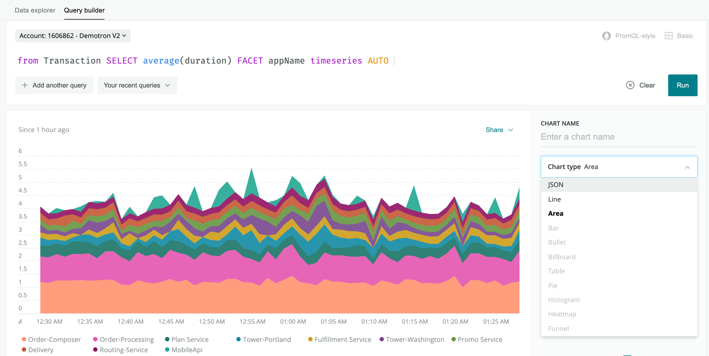

[New Relicデータのクエリ](/docs/using-new-relic/data/understand-data/query-new-relic-data)を行う1つの方法が、New Relic Query Language（NRQL）の使用です。このリソースでは、NRQL とは何か、いつ、どのように使用できるか、および基本的な構文ルールについて説明します。句と関数のリストやクエリの例など、クエリの詳細については、 [NRQL の構文、句、関数](/docs/query-your-data/nrql-new-relic-query-language/get-started/nrql-syntax-clauses-functions)を参照してください。

## NRQLとは [#what-is-nrql]

NRQLは、New RelicのSQLに似たクエリ言語です。NRQLを使用して、詳細なNew Relicデータを取得し、アプリケーションやホスト、ビジネスで重要なアクティビティについての洞察を得ることができます。

NRQLを使用する理由としては、次の点があります。

* トラブルシューティングやビジネス分析目的で質問に答える
* 新規チャートを作成する
* （例えば当社の[NerdGraph](/docs/apis/graphql-api/tutorials/nerdgraph-graphiql-nrql-tutorial) APIを使用して）New RelicデータのAPIクエリを行うには

NRQLは、一部のNew Relicチャートを生成する際に背後で使用するものです：


一部のNew RelicチャートはNRQLで作成されています。NRQLを使い始めるには、チャートのクエリを表示して、独自のカスタムチャートを作成できるよう編集する方法もあります。

## どこでNRQLを使用可能ですか? [#where]

次の場所でNRQLを使用できます。

* [New Relic Oneクエリビルダー](/docs/chart-builder/use-chart-builder/get-started/introduction-chart-builder):
  * **上級モード**は、NRQLクエリインタフェースです
  * **基本モード**では、NRQLについての知識は不要ですがNRQLを使用して結果を生成するので、クエリが単純化されます。
* [New Relic Insights](https://docs.newrelic.co.jp/docs/insights)
* [NerdGraph](/docs/apis/graphql-api/tutorials/nerdgraph-graphiql-nrql-tutorial): 当社のGraphQLフォーマットのAPIで、NRQLクエリ作成のオプションを含みます


**[one.newrelic.com](https://one.newrelic.com) > データのクエリ**: [New Relic One](/docs/new-relic-one/use-new-relic-one/get-started/introduction-new-relic-one)と[New Relic Insights](/docs/insights)の両方で、NRQLクエリを実行できます。このNRQLクエリには、エンティティ名別にファセットした[ディストリビューティッド（分散）トレーシング](/docs/understand-dependencies/distributed-tracing/get-started/introduction-distributed-tracing)スパンの数が表示されます。

NRQLは、New Relicデータのクエリを行ういくつかの方法のうちの1つです。すべてのクエリオプションについて詳しくは[データのクエリ（Query your data）](/docs/using-new-relic/data/understand-data/query-new-relic-data)を参照してください。

## どのデータをNRQLでクエリできるか? [#what-you-can-query]

NRQLを使用して、これらのNew Relic のデータタイプのクエリを実行できます:

* 次のものを含む、すべてのNew Relic製品からの[イベントデータ](/docs/using-new-relic/data/understand-data/new-relic-data-types#event-data):
  * [Transaction](/docs/insights/insights-data-sources/default-data/apm-default-events-insights)のような`APMイベント`
  * [PageView](/docs/insights/insights-data-sources/default-data/browser-default-events-insights)のような`New Relic Browserイベント`
  * [Mobile](/docs/insights/insights-data-sources/default-data/mobile-default-events-insights)のような`New Relic Mobileイベント`
  * `ProcessSample`のような[インフラストラクチャイベント](/docs/infrastructure/manage-your-data/data-instrumentation/default-infrastructure-events)
  * `SyntheticCheck`のような[Syntheticsイベント](/docs/insights/insights-data-sources/default-data/synthetics-default-events-insights)
  * [イベントAPI](/docs/insights/insights-data-sources/custom-data/introduction-event-api)によってサポートされるもののようなカスタムイベント
* [メトリックタイムスライスデータ](/docs/using-new-relic/data/understand-data/new-relic-data-types#timeslice-data)（New Relic APMおよびBrowser、Mobileによりレポートされるメトリックス）
* [`Metric`データタイプ](/docs/using-new-relic/data/understand-data/new-relic-data-types#metric-time-series)（Metric APIによりレポートされるメトリックスおよび、そのAPIを使用するデータソース）
* [`Span`データタイプ](/docs/using-new-relic/data/understand-data/new-relic-data-types#trace-data)（ディストリビューティッド（分散）トレーシングデータ）
* [`Log`データタイプ](/docs/using-new-relic/data/understand-data/new-relic-data-types#log-data)（New Relic Logsからのデータ）

<Callout variant="tip">
  モニタリング対象エンティティ間の関係など、一部のデータは NRQL を介して利用できませんが、[NerdGraph API](/docs/apis/nerdgraph/get-started/introduction-new-relic-nerdgraph)を介して利用できます。
</Callout>

## NRQLを使い始めるには [#start-learning]

NRQLを使い始めて、どのデータを利用できるのか理解するには、NRQLインタフェース（例：[New Relic Oneクエリビルダー](/docs/chart-builder/use-chart-builder/get-started/introduction-chart-builder)）から`FROM`と入力し、スペースキーを押します。インタフェースが、利用可能なデータタイプを提案します：


どの[属性](/docs/using-new-relic/welcome-new-relic/get-started/glossary#attribute)を特定のデータタイプに使用できるかを理解するには、`FROM DATA_TYPE SELECT`と入力し、スペースキーを押します。インタフェースで、利用可能な属性が提案されます。例えば：


すべての属性を含む、データタイプに関連した完全なJSONを表示するには、`keyset()`属性を使用します。例えば：

```
FROM Transaction SELECT keyset()
```

NRQLは、一部のNew Relicチャートおよびダッシュボードを作成する際に背後で使用するものです。NRQLを学習するには、こうしたNRQLが作成したチャートを見つけて、新しい、カスタマイズしたクエリとチャートをNRQLで作成し始める方法があります：


NRQLで作成したチャートには、オプションとして**クエリを表示**があります。ここからクエリを編集・カスタマイズして、変更内容が視覚的な結果にどのような影響を及ぼすのか確認できます。

<Callout variant="important">
  NRQLを使用せずにデータを詳しく調べるには、[New Relic Oneクエリビルダーの基本モード](/docs/chart-builder/use-chart-builder/choose-data/use-basic-mode-specify-data)を使用します。
</Callout>

## NRQL クエリの例 [#examples]

以下は、[New Relic APM](/docs/apm)が報告する、`Transaction` データのNRQLクエリ例になります。

```
FROM Transaction SELECT average(duration) 
  FACET appName TIMESERIES auto
```

これによって、次のようなチャートが作成されます：



以下は、クエリの例です：

<CollapserGroup>
  <Collapser
    id="basic-browser-nrql"
    title="Browserデータの基本的なNRQLクエリ"
  >
    以下は、[New Relic Browser](/docs/browser)が報告した`PageView`データのNRQLクエリになります。

    ```
    SELECT uniqueCount(user) FROM PageView 
      WHERE userAgentOS = 'Mac' 
      FACET countryCode
      SINCE 1 day ago 
      LIMIT 20
    ```
  </Collapser>

  <Collapser
    id="attribute-with-space"
    title="スペースが入った属性名"
  >
    [カスタム属性](/docs/insights/new-relic-insights/decorating-events/insights-custom-attributes)名にスペースが入っている場合、バックティックで属性名を挟みます。

    ```
    SELECT count(*)
     FROM Transaction
     FACET `Logged-in user`
    ```
  </Collapser>

  <Collapser
    id="query-multiple-events-columns"
    title="複数のデータソースのクエリ実行"
  >
    2つのデータソースからデータを返すには、データタイプをコンマで区切ります。たとえば、このクエリは直近 3 日間の[APMトランザクション](/docs/insights/new-relic-insights/decorating-events/insights-attributes#transaction-defaults)と[Browserイベント](/docs/insights/new-relic-insights/decorating-events/insights-attributes#browser-defaults)の全カウント数を返します。

    ```
    SELECT count(*) FROM Transaction, PageView SINCE 3 days ago
    ```
  </Collapser>

  <Collapser
    id=""
    title="複数列を返すクエリ"
  >
    データセットから複数のカラムを取得するには、集計引数をカンマで区切ります。

    ```
    SELECT function（attribute）, function（attribute） ... FROM ...
    ```

    このクエリは、直近1週間のNew Relic Browser `PageView`イベントから持続時間の最小値、平均値、最大値を返します。

    ```
    SELECT min(duration), max(duration), average(duration)
      FROM PageView SINCE 1 week ago
    ```
  </Collapser>
</CollapserGroup>

詳細については、[NRQLクエリの例](/docs/query-data/nrql-new-relic-query-language/nrql-query-examples)をご覧ください。

## NRQL の構文 [#syntax]

NRQLクエリの構文は標準的な SQL クエリとほぼ同じです。NRQLクエリの構造の内訳は次のとおりです。

```
<a href="/docs/insights/new-relic-insights/using-new-relic-query-language/nrql-reference#state-select">SELECT</a> <a href="/docs/insights/new-relic-insights/using-new-relic-query-language/nrql-reference#functions">function(attribute)</a> [<a href="/docs/insights/new-relic-insights/using-new-relic-query-language/nrql-reference#sel-as">AS</a> 'label'][, ...] 
  <a href="/docs/insights/new-relic-insights/using-new-relic-query-language/nrql-reference#sel-from">FROM</a> data type
  [<a href="/docs/insights/new-relic-insights/using-new-relic-query-language/nrql-reference#sel-where">WHERE</a> attribute [comparison] [AND|OR ...]][AS 'label'][, ...]
  [<a href="/docs/insights/new-relic-insights/using-new-relic-query-language/nrql-reference#sel-facet">FACET</a> attribute | function(attribute)]
  [<a href="/docs/insights/new-relic-insights/using-new-relic-query-language/nrql-reference#sel-limit">LIMIT</a> number]
  [<a href="/docs/insights/new-relic-insights/using-new-relic-query-language/nrql-reference#sel-since">SINCE</a> time]
  [<a href="/docs/insights/new-relic-insights/using-new-relic-query-language/nrql-reference#sel-until">UNTIL</a> time]
  [<a href="/docs/insights/new-relic-insights/using-new-relic-query-language/nrql-reference#sel-timezone">WITH TIMEZONE</a> timezone]
  [<a href="/docs/insights/new-relic-insights/using-new-relic-query-language/nrql-reference#sel-compare">COMPARE WITH</a> time]
  [<a href="/docs/insights/new-relic-insights/using-new-relic-query-language/nrql-reference#sel-timeseries">TIMESERIES</a> time]
```

基本的なルールは以下のとおりです。

<table>
  <thead>
    <tr>
      <th style={{ width: "200px" }}>
        **NRQLの条件**
      </th>

      <th>
        詳細
      </th>
    </tr>
  </thead>

  <tbody>
    <tr>
      <td>
        必須の値
      </td>

      <td>
        [`SELECT`](#state-select)文と[`FROM`](#sel-from)句は必須です。その他すべての句は任意です。クエリは`SELECT`または`FROM`から開始することができます。
      </td>
    </tr>

    <tr>
      <td>
        クエリ文字列のサイズ
      </td>

      <td>
        クエリ文字列は4KB未満でなければなりません。
      </td>
    </tr>

    <tr>
      <td>
        大文字と小文字の区別
      </td>

      <td>
        * データタイプ名と属性名は区別されます。
        * [NRQL句](/docs/insights/new-relic-insights/using-new-relic-query-language/nrql-reference#clauses)と[関数](/docs/insights/new-relic-insights/using-new-relic-query-language/nrql-reference#functions)では、大文字と小文字は区別されません。
      </td>
    </tr>

    <tr>
      <td>
        文字列の構文
      </td>

      <td>
        NRQLでは文字列の指定にシングルクォーテーションを使用します。例：

        ```
        ... ここで、traceId = '030a573f0df02c57'
        ```
      </td>
    </tr>

    <tr>
      <td>
        スペースの入った属性名
      </td>

      <td>
        バックティック``` `` ```を使用して、スペースが入っている[カスタム属性](/docs/insights/new-relic-insights/decorating-events/insights-custom-attributes)名を引用します。例えば：

        ```
        ... FACET `Logged-in user`
        ```
      </td>
    </tr>

    <tr>
      <td>
        データタイプの型強制
      </td>

      <td>
        Insights はデータタイプの「型強制」に対応していません。詳しくは[データタイプの変換](/docs/insights/nrql-new-relic-query-language/nrql-reference/nrql-syntax-components-functions#type-conversion)を参照してください。
      </td>
    </tr>

    <tr>
      <td>
        数学関数の使用
      </td>

      <td>
        [基本的で高度な関数](/docs/insights/nrql-new-relic-query-language/using-nrql/nrql-math-using-select)は、[`SELECT`](/docs/insights/new-relic-insights/using-new-relic-query-language/nrql-reference#state-select)文でサポートされています。
      </td>
    </tr>

    <tr>
      <td>
        JOIN 関数
      </td>

      <td>
        NRQLには SQL JOIN に相当する関数はありませんが、[カスタム属性を使用して JOIN をシミュレート](/docs/insights/new-relic-insights/using-new-relic-query-language/simulate-sql-join-functions-insights)できます。
      </td>
    </tr>
  </tbody>
</table>

[NRQLの構文と関数](/docs/query-data/nrql-new-relic-query-language/getting-started/nrql-syntax-components-functions)についてさらに詳しくお読みください。

## その他のヘルプ [#more_help]

さらに支援が必要な場合は、これらのサポートと学習リソースを確認してください：

* [Explorers Hub](https://discuss.newrelic.com/)を参照して、コミュニティから支援を受け、ディスカッションに参加してください。
* [当社のサイトで回答を見つけ、サポートポータルの使用方法について学びます](/docs/using-new-relic/welcome-new-relic/get-started/find-help-use-support-portal)。
* Linux、Windows、およびmacOSのトラブルシューティングツールである[New Relic Diagnosticsを実行します](/docs/using-new-relic/cross-product-functions/troubleshooting/new-relic-diagnostics)。
* New Relicの[データセキュリティ](/docs/security)と[ライセンス](/docs/licenses)ドキュメントを見直してください。
