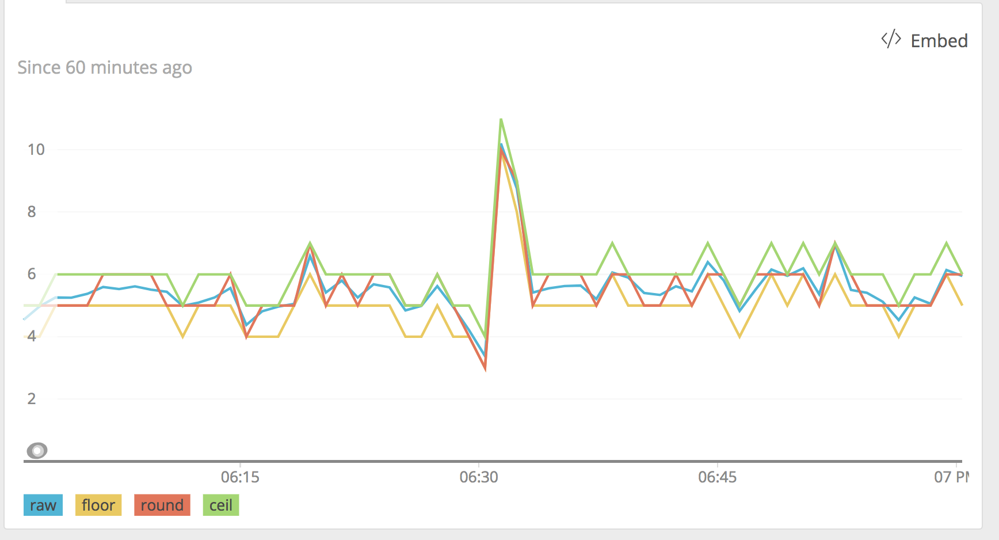

New Relic Query Language（NRQL）は、`SELECT`文で基本的な数学関数に対応しています。足し算、引き算、掛け算、割り算を個別の属性ならびに集約関数の結果にも適用できます。

## SELECTで数学演算子を利用する [#math]

NRQLで基本的な数学関数を利用するには、演算子を`SELECT`文内に含めます：

* 足し算：`+`
* 引き算：`-`
* 掛け算：`*`
* 割り算：`/`

以下にいくつか例を示します。

```
SELECT duration-databaseDuration FROM Transaction
```

```
SELECT count(*)/uniqueCount(session) FROM PageView
```

```
SELECT average(duration-databaseDuration) FROM Transaction
```

## STRINGまたはFLOATによる結果 [#strings]

数学関数に存在する文字列をNRQLがどのように処理するかを示しています。

例：

* `sum(1+STRING)` = 0
* `sum(1+MIXED)` = MIXEDが文字列の場合のレコードをスキップ
* `average(1+STRING)` = 0
* `average(1+MIXED)` = MIXEDが文字列の場合のレコードをスキップ

NULLと0は、いずれもダッシュボード上では0として表示されます。

別の数値を持った、NULL値をオーバーライドするには、次の構文を使用します：

```
SELECT average(purchasePrice OR 0)
```

これによって、NULL値を0もしくは他の指定値と置き換えます。

<Callout variant="tip">
  これは、何かがNULLもしくは0を返すかテストする際にも使用できます。`(zero) OR 1`は0を返します。`(NULL) OR 1`は1を返します。
</Callout>

## 高度な数学関数

NRQLに含まれる高度な数学関数は、複雑な計算のほか、UIでの効果的な表示を可能にするデータ処理に利用できます。

### `abs`

`abs(n)`は_n_の絶対値を返します。非負の_n_には_n_を、また負の_n_には正数-_n_をそれぞれ返します。たとえば、`abs(2) = 2`、また `abs(-4) = 4`となります。

### `round`、`floor`、`ceil`(ing)

これらの3つの関数は、隣接する整数の1つに小数を強制します。

* `floor(n)`は_n_未満もしくは同等の近似整数を返します。
* `ceil(n)`は_n_以上もしくは同等の近似整数を返します。
* `round(n)`は_n_の近似整数をどちらの方向にも返します。



<figcaption>
  floor、round、ceiling関数を適用した生データを示すサンプルグラフ。
</figcaption>

### `clamp_max`, `clamp_min`

クランプ関数は、値の上界もしくは下界を設定します。

たとえば、`clamp_max(duration, 10)`は持続時間を返しますが、これが10を超える場合は10を返します。

同様に、`clamp_min(duration, 1)`は1未満の値を一切返しません。以下のチャートは、最小値と最大値をクランプして、値を70～90の範囲内に留めた結果を示しています。


<figcaption>
  クランプ関数を適用した生データを示すサンプルグラフ。
</figcaption>

### `pow`

`pow(n, m)`_n_の_m_乗を演算。（すなわち、`n * n * ... * n、`_n_の_m_個分のコピー） ​

### `sqrt`

`sqrt(n)`_n_の平方根を返します。すなわち、次が成立する数字になります：`sqrt(n) * sqrt(n) = n。`

### `exp`

引数の自然指数関数を計算します：`exp(n) = pow(e, n)`。

### `ln、log2、log10、log`

こうした関数は、様々な基数向けに引数の対数を計算します。

* `ln(n)`は、自然対数：対数ベースeを計算します。
* `log2(n)`は、対数（基数 2）を計算します。
* `log10(n)`は、対数（基数 10）を計算します。
* `log(n, b)`では、対数を任意の基数bで計算できます。
* すべての対数は、`log(pow(b, n), b) = nのアイデンティティを満たします。`

すべての基数において、`log(0`)は未定義である点に注意してください。ゼロかもしれない何かの対数を取った場合、クエリは`値なし`を返す可能性がある点に注意してください。