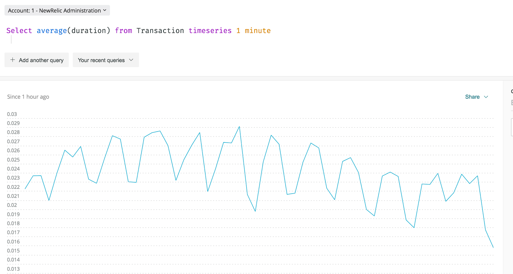

スライディングウィンドウとは、 `SLIDE BY` 句と `TIMESERIES` 句を組み合わせてチャートを生成する手法です。スライディングウィンドウでは、データはお互いに重なり合う時間"ウィンドウ" に集められます。

<Callout variant="tip">
  スライドウィンドウは、条件 [アドバンスドシグナル設定](/docs/alerts-applied-intelligence/new-relic-alerts/alert-conditions/create-nrql-alert-conditions/#advanced-signal) のUIからも利用可能です。
</Callout>

例えば、下の画像では、クエリが5分間のウィンドウでデータを収集しています。ウィンドウ"は" を1分ずつスライドさせています。各ウィンドウは、前のウィンドウと4分ずつ重なっています。


<figcaption>
  5 分間のウィンドウと 1 分間の"スライド"
</figcaption>

対照的に、"tumbling" や"cascading" のウィンドウでは、ウィンドウは重なりません。例えば、この `TIMESERIES 3 minutes` NRQL クエリでは、ウィンドウの長さは 3 分で、それぞれが他方の終了時に開始されます。測定間隔に重なりはありません。


<figcaption>
  オーバーラップしない3分間のウィンドウ"スライド".
</figcaption>

## スライドウィンドウを使用する場合 [#when-to-use]

スライディングウィンドウは、"スパイキーな" チャートを平滑化する必要がある場合に役立ちます。一般的な使用例としては、スライディングウィンドウを使用して、短い期間の変動が大きい折れ線グラフを平滑化することが挙げられます。これは、狭い期間の集合体よりもローリング集合体（例えばローリング平均）の方が重要な場合です。

下の例では、データが1分ごとに大きく変化しているため、1分足のタンブリングウィンドウチャートでは、高い山と低い谷が多く見られます。



<figcaption>
  SLIDE BY 句を含まない TIMESERIES クエリ
</figcaption>

しかし、この例では、5分幅の `TIMESERIES` ウィンドウが、1分間隔の `SLIDE BY` の助けを借りて平滑化されています。このクエリは同様のデータを返しますが、より滑らかなチャートを作成します。


<figcaption>
  SLIDE BY 句を含む TIMESERIES クエリ
</figcaption>

## `SLIDE BYの有効なNRQL構文` [#valid-syntax]

`SLIDE BY` 節の有効な NRQL 構文は以下のフォーマットに従います。

```
SELECT ... TIMESERIES integer1 units SLIDE BY integer2 units
```

`integer1` はスライディングウィンドウの幅を指定し、 `integer2` は `SLIDE BY` の間隔を指定します。 `units` は、 `秒` 、 `分` 、 `時間` 、または `日` のような時間単位を表します。NRQL の標準的な時間単位はすべて受け入れられます。

ここでは実際の例を紹介します。5分間の `TIMESERIES` ウィンドウを、1分間の `SLIDE BY` 間隔で表示しています。

```
SELECT average(duration) from Transaction TIMESERIES 5 minutes SLIDE BY 1 minute
```

## PromQLスタイルのクエリからの翻訳 [#translate-promql]

該当する場合、PromQL スタイルのクエリは NRQL スライディングウィンドウクエリに変換されます。

たとえば、PromQL スタイルのクエリが `rate(request_count[5m])` を過去 60 分間、1 分間のウィンドウのオーバーラップで使用している場合、NRQL の翻訳は以下のようなクエリになります。

```
SELECT rate(sum(request_count), 1 SECONDS) FROM Metric SINCE 3600 SECONDS AGO UNTIL NOW FACET dimensions() LIMIT 100 TIMESERIES 300000 SLIDE BY 60000
```

翻訳出力では、 `TIMESERIES` と `SLIDE BY` の句には、デフォルトの単位であるミリ秒が使用されています。 `TIMESERIES` の場合、300000 msは300秒、つまり5分で、ウィンドウサイズを5分と指定しています。 `SLIDE BY` の場合、60000msは60秒で、スライド間隔は1分を指定しています。

## `SLIDE BY` を `MAX` と `AUTO で使用する。` [#auto-max]

`SLIDE BY` に `MAX` と `AUTO` の引数を組み合わせることで、以下の例のように、クエリの結果をさらに調整することができます。

```
SELECT average(duration) FROM Transaction TIMESERIES 5 minutes SLIDE BY MAX
```

```
SELECT average(duration) FROM Transaction TIMESERIES 5 minutes SLIDE BY AUTO
```

<Callout variant="tip">
  `SLIDE BY` と組み合わせた場合、 `TIMESERIES` は、 `AUTO` または `MAX` をサポートしません。 `TIMESERIES` の値は、整数の時間単位の値でなければなりません。つまり、 `SLIDE BY AUTO` や `SLIDE BY MAX` は動作しますが、 `TIMESERIES AUTO` や `TIMESERIES MAX` に続いて、 `SLIDE BY` や `MAX` 、 `AUTO` 、または特定の整数の時間単位はサポートされていません。
</Callout>

<Callout variant="tip">
  `SLIDE BY` の値を `AUTO` または `MAX` で決定すると、ステップ間隔がウィンドウサイズを超えることがあり、ギャップや予期しない結果として表示されます。クエリの結果にこのような問題が発生した場合、ステップ間隔がウィンドウ・サイズを超えているSLIDE BYのインスタンスをチェックすることを検討してください。
</Callout>