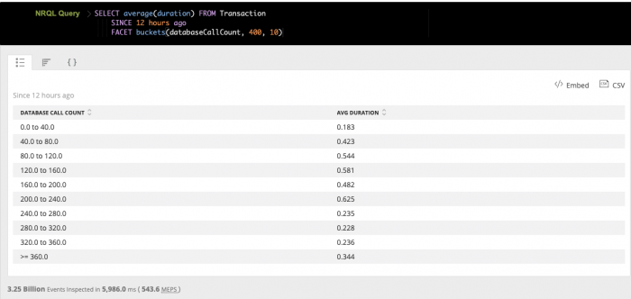

[NRQL](/docs/query-data/nrql-new-relic-query-language/getting-started/introduction-nrql) を使用すると、 [`バケット` 関数](/docs/insights/nrql-new-relic-query-language/nrql-reference/nrql-syntax-components-functions#func-buckets) を使用して、クエリ結果を特定の範囲をカバーするバケットに分割することができます。

## バケット化されたNRQLクエリの作成 [#segmentation]

バケット化された結果を返すには、NRQL クエリで `FACET buckets()` 句を使用します。バケット・クエリは次のような構造になっています。

```
SELECT <var>FUNCTION</var>(<var>ATTRIBUTE</var>) 
    FROM <var>DATA_TYPE</var> 
    FACET buckets(<var>ATTRIBUTE</var>, <var>CEILING_VALUE</var>, <var>NUMBER_OF_BUCKETS</var>)
```

バケッティングは、New Relic のデータベースに数値として保存されているあらゆる属性に使用することができます。

## バケットクエリの例 [#example]

データベースコールの範囲の平均継続時間を示すチャートを作成するには、次のようにします。

1. 属性に対して `SELECT` 文を持つNRQL文を作成します。例えば、 `SELECT average(duration)`.
2. 別の属性のバケットにファセットする `FACET` 節を追加します。例えば、 `buckets(databaseCallCount,400,10)`.

このクエリは、10個のバケットのそれぞれについて、上限を400とした場合の平均継続時間を計算します。上限の400を超えるすべての値は、最後のバケットである「>=360.0」にまとめられます。

```
SELECT average(duration) FROM Transaction 
    SINCE 12 hours ago 
    FACET buckets(databaseCallCount, 400, 10)
```

このクエリは以下の結果を返します。



<figcaption>
  ここでは、セグメントを 10 個のバケットに分けた NRQL クエリの例を示します。一番下のバケットには異常値が含まれているので、適宜調整するとよいでしょう。
</figcaption>