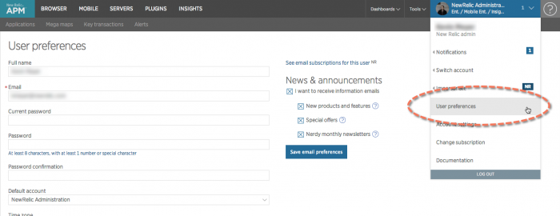

2014年4月7日、OpenSSLプロジェクトは、 [Heartbleed (CVE-2014-0160)](http://heartbleed.com) として知られる重要な脆弱性に対処するためのアップデートをリリースしました。この脆弱性は、インターネット上の複数のサイトに影響を与え、遠隔操作で機密情報を漏洩させる可能性があります。

## New Relicによるアクション [#nr-action]

New Relic は、当社のすべてのサイトおよびアプリケーションを調査した結果、 **[www.newrelic.com](http://www.newrelic.com)** , **rpm.newrelic.com**, **insights.newrelic.com** など、大部分のサイトにこの問題の脆弱性はないと判断しています。New Relic では、ドキュメントサイト(**docs.newrelic.com**)に脆弱性があることが判明しました。この問題にはパッチが適用されており、 [SSL証明書](/docs/accounts-partnerships/education/getting-started-new-relic/glossary#ssl-certificate) も交換されています。

## パスワードを変更する [#password]

New Relic では、お客様のデータ (ユーザー名やパスワードを含む) が流出したという証拠はありません。しかし、お客様のアカウントの保護について少しでも不安がある場合は、パスワードを変更してください。

この手順は、パートナーアカウントやSAML SSOが有効なアカウントを持たずに、APMに直接サインインするユーザーのためのものです。

1. **[rpm.newrelic.com](https://rpm.newrelic.com) > [（アカウントのドロップダウン）](/docs/accounts-partnerships/education/getting-started-new-relic/glossary#account-dropdown) > ユーザー設定**.
2. あなたの **現在のパスワード** を入力してください。
3. 新しい **パスワード** （ [最低限の条件を満たしていること](/docs/subscriptions/account-user-settings#requirements) ）を入力し、 **パスワード確認** に新しいパスワードを再入力します。
4. 選択 **ユーザー設定の保存**.
5. **Regenerate** your [API key](/docs/apis/rest-api-v2/requirements/api-keys#creating).

<figcaption>
  **[rpm.newrelic.com](https://rpm.newrelic.com) > [（アカウントのドロップダウン）](/docs/accounts-partnerships/education/getting-started-new-relic/glossary#account-dropdown) > ユーザー設定：** 誰でも自分のNew Relicのユーザー名、アカウントのEメール、パスワード、その他の設定を変更することができます。
</figcaption>