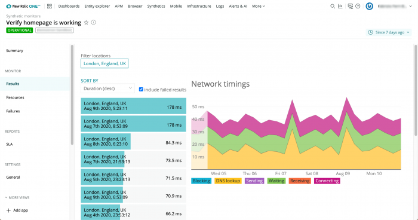

**Results** ページを使用して、個々のモニターの結果を表示します。 [リストをソートすることで、興味深い結果を見つけることができます。](#sort-list) 低速、高速、またはその他の異常な結果を識別します。また、 [場所でフィルタリング](#filter-location) して、モニターのパフォーマンスが地域によってどのように異なるかを理解することもできます。 **Page Load Time** グラフは、ページパフォーマンスの時間的変化のスナップショットを示します。

## 結果ページを見る [#viewing]

お使いのモニターの **Results** にアクセスするには : [**one.newrelic.com**](http://one.newrelic.com/) **> Synthetics> (select a monitor)> Results**.

<figcaption>
  [**one.newrelic.com**](http://one.newrelic.com/) **> Synthetics> (select a monitor)> Results**: **Results** ページを使って、トラブルシューティングのためにお使いのモニターの興味深い動作を探したり、お使いのモニターが最も時間を費やしている場所を確認したりすることができます。
</figcaption>

## ページ機能の利用 [#using]

**Results** ページでは、以下の機能をサポートしています。

<table>
  <thead>
    <tr>
      <th width={200}>
        **以下を行う場合...**
      </th>

      <th>
        **操作...**
      </th>
    </tr>
  </thead>

  <tbody>
    <tr id="sort-list">
      <td>
        結果リストのソート
      </td>

      <td>
        **Sort By** ドロップダウンから、オプションを選択します。

        * 最も速い結果と最も遅い結果を表示するには、 **Duration** でソートしてください（最も遅い結果を表示するにはdescending、最も速い結果を表示するにはascendingを選択）。
        * **Response Size** （必要に応じて降順または昇順を選択）でソートして、異常に大きいまたは小さいレスポンスパケットを見つけます。
        * **Newest** または **Oldest** を選択して、結果をタイムスタンプでソートします。
      </td>
    </tr>

    <tr id="filter-location">
      <td>
        場所で絞り込む
      </td>

      <td>
        場所のラベルを選択すると、その場所の結果が非表示になります。もう一度ロケーションラベルを選択すると、その結果の非表示が解除されます。1つの場所の結果だけを表示するには、他のすべての場所を非表示にします。
      </td>
    </tr>

    <tr id="hide-unhide">
      <td>
        チャート要素の表示・非表示
      </td>

      <td>
        チャートの要素を選択して、 **Page Load Time** チャートから非表示にしたり、非表示にしたりすることができます。

        
      </td>
    </tr>

    <tr id="quickly-switch">
      <td>
        別のモニターに素早くアクセス
      </td>

      <td>
        1. 画面上部の現在のモニターの名前をクリックすると、ドロップダウンメニューが表示されます。

        2. 最近のモニターのリストから選択するか、検索フィールドに名前を入力して特定のモニターを検索します。

           
      </td>
    </tr>

    <tr id="time-frame">
      <td>
        タイムフレームの変更
      </td>

      <td>
        [タイムピッカー](/docs/apm/new-relic-apm/ui-functions/time-picker-setting-time-periods-view-data) を使って、返される結果の数を調整します。
      </td>
    </tr>
  </tbody>
</table>