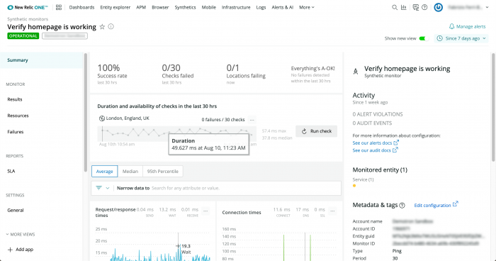

シンセティック・モニタリングの **Summary** ページでは、お客様のウェブサイトのパフォーマンスを一目で把握することができます。リクエスト／レスポンス時間、接続時間、エラーの傾向を見ることができます。フィルタを使用して、関心のある属性や値にデータを絞り込んだり、 [失敗したモニタを再確認したりすることができます](/docs/synthetics/synthetic-monitoring/using-monitors/recheck-failed-monitors) 。

## サマリーページの表示 [#viewing]

お使いのモニターの **Summary** ページにアクセスするには。 [**one.newrelic.com**](http://one.newrelic.com/) **> エクスプローラー> シンセティックモニター> (select a monitor)** からアクセスできます。また、 **[one.newrelic.com](https://one.newrelic.com) > Synthetics> (select a monitor)** からもアクセスできます。

<figcaption>
  **Summary** ページでは、ウェブサイトのパフォーマンスを高レベルで表示し、ロケーションチェック、アラート違反、モニターのメタデータへのショートカットが用意されています。
</figcaption>

## サマリーページの理解 [#understanding]

**Summary** ページを利用して、ウェブサイトのパフォーマンスを把握することができます。

<table>
  <thead>
    <tr>
      <th width={200}>
        合成樹脂 サマリーチャート
      </th>

      <th>
        **説明**
      </th>
    </tr>
  </thead>

  <tbody>
    <tr>
      <td id="success">
        成功率と失敗率
      </td>

      <td>
        これは、モニターの全体的な成功率と、指定された時間枠内で失敗したチェックの総数、失敗している [ロケーション](/docs/synthetics/new-relic-synthetics/using-monitors/adding-editing-monitors#setting-location) の数、最後に検出されたエラーのエラーメッセージを表示します。

        表示される時間枠は、モニターの周波数によって異なります。

        * 1分＝30分
        * 5分＝1.5時間
        * 15分＝7.5時間
        * 30分＝15時間
        * 1時間＝30時間
        * 6時間＝7.5日
        * 12時間＝15日
        * 24時間＝30日
      </td>
    </tr>

    <tr>
      <td id="load-time">
        ページの読み込み時間と可用性
      </td>

      <td>
        これは、各モニター [場所](/docs/synthetics/new-relic-synthetics/using-monitors/adding-editing-monitors#setting-location) について、ページのロード時間と可用性（成功したモニター実行の割合）を示しています。表示される時間枠は、モニターの頻度によって異なります。

        * 1分＝30分
        * 5分＝1.5時間
        * 15分＝7.5時間
        * 30分＝15時間
        * 1時間＝30時間
        * 6時間＝7.5日
        * 12時間＝15日
        * 24時間＝30日
      </td>
    </tr>

    <tr>
      <td id="request-response-times">
        リクエスト/レスポンスタイム
      </td>

      <td>
        これは、Pingモニターが応答を送信および受信するのにかかった時間を示しており、送信時間、待機時間、受信時間に分けられます。

        デュレーションは、平均値、中央値、または95パーセンタイルとして表示することができます。詳細については、 [Percentiles を参照してください。ランキングデータ](/docs/using-new-relic/user-interface-functions/view-your-data/percentiles-compare-ranked-data#options).

        これは、 **ping** のモニター結果に対してのみ有効です。
      </td>
    </tr>

    <tr>
      <td id="connection-times">
        接続時間
      </td>

      <td>
        このモニターで確立されるネットワーク接続の内訳が表示され、DNS、SSL、接続時間に分けられています。

        期間は、平均値、中央値、95パーセンタイルで表示できます。詳細については、 [Percentiles を参照してください。ランキングデータ](/docs/using-new-relic/user-interface-functions/view-your-data/percentiles-compare-ranked-data#options).

        これは、 **ping** のモニター結果に対してのみ有効です。
      </td>
    </tr>

    <tr>
      <td id="non-200-response-codes">
        200以外のレスポンスコード
      </td>

      <td>
        このモニターを実行した結果、受信した（200以外の）エラー応答コードが表示されます。

        これは、 **ping** のモニター結果に対してのみ有効です。
      </td>
    </tr>

    <tr>
      <td id="activity-panel">
        アクティビティパネル
      </td>

      <td>
        モニターに関連する最近のアクティビティが表示されます。

        * モニター名
        * 未解決の違反行為の数
        * 最近のオープン/クローズされた違反や監査イベントを含む、モニター上のアクティビティ。
        * メタデータと [タグ](/docs/new-relic-one/use-new-relic-one/core-concepts/tagging-use-tags-organize-group-what-you-monitor).
        * Monitored [entities](/docs/new-relic-one/use-new-relic-one/core-concepts/what-entity-new-relic): これは、このモニターの実行時に観測されるあらゆる New Relic エンティティで、エンティティのアラートステータスを含みます。エンティティステータスを選択すると、監視対象のエンティティサマリーページに移動します。
      </td>
    </tr>
  </tbody>
</table>

## ページ機能の利用 [#using]

**Summary** ページでは、以下の機能をサポートしています。

<table>
  <thead>
    <tr>
      <th width={200}>
        **以下を行う場合...**
      </th>

      <th>
        **操作...**
      </th>
    </tr>
  </thead>

  <tbody>
    <tr id="view-result">
      <td>
        結果を詳細に見る
      </td>

      <td>
        正確な指標を表示するには、チャートの上にマウスを置いてください。
      </td>
    </tr>

    <tr id="hide-location">
      <td>
        モニターチェックの再実行
      </td>

      <td>
        **実行チェックボタン** をクリックして、失敗したモニターを再チェックします。
      </td>
    </tr>

    <tr id="view-alert">
      <td>
        アラート違反の詳細を表示
      </td>

      <td>
        [アクティビティパネル](#activity-panel) で、表示されたアラートをクリックすると、 [アラートインシデント](/docs/alerts/new-relic-alerts/reviewing-alert-incidents/view-violation-event-details-incidents) のページに直接移動します。
      </td>
    </tr>

    <tr id="quickly-switch">
      <td>
        別のモニターに素早くアクセス
      </td>

      <td>
        1. 画面上部の現在のモニターの名前をクリックすると、ドロップダウンメニューが表示されます。

        2. 最近のモニターのリストから選択するか、検索フィールドに名前を入力して特定のモニターを検索します。

           
      </td>
    </tr>

    <tr id="time-frame">
      <td>
        タイムフレームの変更
      </td>

      <td>
        [タイムピッカー](/docs/apm/new-relic-apm/ui-functions/time-picker-setting-time-periods-view-data) を使用して、以下のチャートで返される結果の数を調整します。

        * リクエスト/レスポンスタイム

        * 接続時間

        * 200以外のレスポンスコード

          これは、 **ping** のモニター結果に対してのみ有効です。
      </td>
    </tr>
  </tbody>
</table>

## レガシーチャート [#more_help]

<Callout variant="important">
  以下の表は、合成モニターのサマリーページの旧表示方法に適用されます。 **Show new view** をクリックすると、新しいキュレーションサマリー体験にアクセスできます。
</Callout>

<table>
  <thead>
    <tr>
      <th width={200}>
        合成チャート
      </th>

      <th>
        **説明**
      </th>
    </tr>
  </thead>

  <tbody>
    <tr>
      <td id="load-time">
        ロードタイムチャート
      </td>

      <td>
        これは、各モニター [場所](/docs/synthetics/new-relic-synthetics/using-monitors/adding-editing-monitors#setting-location) のロードタイムを示しています。 [短い時間枠](/docs/apm/new-relic-apm/ui-functions/time-picker-setting-time-periods-view-data) (30分など)を選択すると、Syntheticsは、各場所からのモニターの各ランの正確なロードタイムを表示します。時間が長い場合は、解像度を調整して平均値を表示します。

        場所の表示を切り替えるには、そのラベルを選択します。
      </td>
    </tr>

    <tr>
      <td id="availability">
        入手方法
      </td>

      <td>
        これは、成功したモニター実行の割合を示しています。スクリプト化されたモニターの場合、実行が成功したとみなされるには、スクリプト全体が完了する必要があります。

        選択したモニターの **可用性** チャートの上には、省略記号 <Icon name="fe-more-horizontal"/>アイコンが表示されます。New Relic の [比較チャート機能](/docs/synthetics/new-relic-synthetics/administration/compare-page-load-performance-browser-synthetics) を使って、実際のユーザー ([ブラウザモニタリング](/docs/browser/new-relic-browser/getting-started/introduction-new-relic-browser)) のインタラクションと Synthetics のモニターとの間で、ページロード時間を直接比較することができます。
      </td>
    </tr>

    <tr>
      <td id="average-load-size">
        平均負荷サイズ
      </td>

      <td>
        このグラフは、モニターの各実行で消費されたデータ量（キロバイトまたはメガバイト）を示します。スクリプトを使用したモニターの場合、スクリプト全体が平均ロードサイズのグラフに含まれます。たとえば、3つのページをロードするモニターでは、3つのページすべてのアセットのサイズを測定します。

        お客様のサイトが静的なものであれば、平均ロードサイズは非常に安定しています。ニュースサイトのような動的なサイトでは、ページの内容が変わると平均ロードサイズも変化します。
      </td>
    </tr>

    <tr>
      <td id="slowest-results">
        最も遅い結果
      </td>

      <td>
        これは、選択した時間枠で最も遅い5つの結果を一覧表示するものです。 [パフォーマンスの内訳を表示するには](/docs/synthetics/new-relic-synthetics/using-monitors/viewing-monitor-results#understanding) 、結果を選択します。
      </td>
    </tr>

    <tr>
      <td id="monitor-downtimes">
        ダウンタイムの監視
      </td>

      <td>
        これは、最新のモニター・ダウンタイム・インシデントのリストです。 [追加の詳細を見るには](/docs/synthetics/new-relic-synthetics/using-monitors/viewing-monitor-results#understanding) 、ダウンタイム・インシデントを選択してください。
      </td>
    </tr>
  </tbody>
</table>