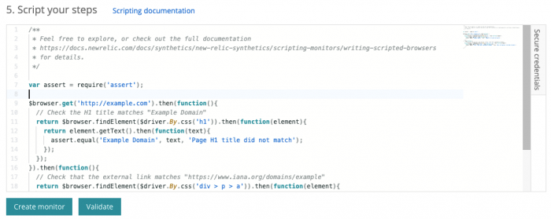

正しく機能することを確認するために、Syntheticsモニタリングの[APIテスト](/docs/synthetics/new-relic-synthetics/getting-started/types-synthetics-monitors)を使用してAPIエンドポイントを監視します。New Relicは、[http-request](https://github.com/request/request)モジュールを使用してエンドポイントへのHTTPコールを行い、結果を検証します。

ここには、リクエストを送信するために`$http`オブジェクトを使用する方法を示すサンプル関数が記載されています。このオブジェクトで使用できるオプションの詳細については、[http-request readme](https://github.com/request/request)を参照してください。

<Callout variant="tip">
  他のAPIテストの例を表示して共有するには、Explorers Hubの[Syntheticsスクリプト](https://discuss.newrelic.com/tags/c/support-products-agents/synthetics/synthetics-script)セクションを参照してください。
</Callout>

## API http-requestモジュールを使用する [#overview]

APIテストは、`$http`オブジェクトを通じて利用できる[http-request](https://github.com/request/request)モジュールによって作動します。New Relicは、各周波数間隔ごとに、選択した各位置からエンドポイントをクエリします。モニターの作成方法については、[モニターの追加](/docs/synthetics/new-relic-synthetics/using-monitors/adding-editing-monitors#adding-monitors)をご覧ください。

[リクエストのためのメタデータの定義方法](#request-options)、[GETリクエストの作成方法](#get)、[POSTリクエストの作成方法](#post)、および[結果の検証方法](#validating)をご確認ください。

<Callout variant="important">
  最大で3分間実行された後、New Relicはスクリプトを手動で停止します。
</Callout>



<figcaption>
  [**one.newrelic.com**](http://one.newrelic.com/) **> Synthetics > Create monitor**: スクリプトエディタは、[スクリプトコマンド （GitHubで利用可能）](https://github.com/request/request) を単純化するために関数、セレクタ、およびその他の要素を提案します。
</figcaption>

## リクエストオプションを設定する [#request-options]

スクリプトを開始するには：

* 変数（`options`など）を宣言して、[リクエストオプションオブジェクト](http://github.com/request/request#requestoptions-callback)を保存します。
* URLエンドポイントやカスタムヘッダーなどのリクエストオプションを定義します。
* SSLやエージェントオプションを設定する場合は、[SSLおよびagentOptionsの要件](#ssl-options)を参照してください。

<Callout variant="tip">
  サポートされているリクエストオプションの完全なリストについては、GitHubの`http-request`ドキュメントにある[request（options, callback）](https://github.com/request/request#requestoptions-callback)を参照してください。
</Callout>

オプションオブジェクト内のオプションメタデータの例：

<CollapserGroup>
  <Collapser
    id="metadata-1"
    title="オプションのメタデータの使用"
  >
    ```
    //Declare optional metadata
    var options = {
            //Specify the endpoint URL
            url: 'https://api-endpoint.example.com',
            //Specify optional headers
            headers: {
                    'Endpoint-Key': 'uqNTC57Phe72pnnB8JuJmwAr7b09nKSKSz',
                    'Additional-Header': 'Additional-Header-Data'
            }
    };
    ```
  </Collapser>
</CollapserGroup>

**SSLおよびagentOptionsの場合：** SSLSSLオプションを設定する場合や、[`agentOptions`](https://github.com/request/request#using-optionsagentoptions)オブジェクトを提供する場合は、リクエストの`options`オブジェクトの`agent`プロパティを`$globalAgents.https`または`$globalAgents.http`に設定して、インストゥルメントされたグローバルエージェントをHTTPリクエストが確実に使用するようにする必要があります。

SSLオプションまたは`agentOptions`の使用の例：

<CollapserGroup>
  <Collapser
    id="use-agentOptions"
    title="SSLオプションまたはagentOptionsの使用"
  >
    この例では、`agentOptions`を使用します。

    ```
    //Declare optional metadata
    var options = {
           //Specify the endpoint URL
           url: '<a href="https://api-endpoint.example.com/" rel="noopener noreferrer" target="_blank">https://api-endpoint.example.com</a>',
           //Specify optional headers
           headers: {
                   'Endpoint-Key': 'uqNTC57Phe72pnnB8JuJmwAr7b09nKSKSz',
                   'Additional-Header': 'Additional-Header-Data'
           }
           //Specify global agent as the http agent
           agent: $globalAgents.https, //Set SSL option strictSSL: true,
           //Specify http agent options
           agentOptions: {
             ​maxVersion: 'TLSv1.1'   
           }, };
    ```
  </Collapser>
</CollapserGroup>

## GETリクエストを送信する [#get]

GETリクエストを行うには、[`$http.get`](https://github.com/request/request#requestget)メソッドを使用してリクエストを送信します。[リクエストオプション](#request-options)を定義し、`$http.get`を使用してリクエストを行ってから、レスポンスを[検証](#validating)してエンドポイントが正しい結果を返していることを確認します。

<CollapserGroup>
  <Collapser
    id="get-insights-example"
    title="Insights GETの例"
  >
    この例では、GETを使用してInsights APIをクエリします。

    ```
    //Define your authentication credentials
    var myAccountID = '{YOUR_ACCOUNT_ID}';
    var myQueryKey = '{YOUR_QUERY_KEY}';
    var options = {
        //Define endpoint URI
        uri: 'https://insights-api.newrelic.com/v1/accounts/'+myAccountID+'/query?nrql=SELECT%20average(amount)%20FROM%20SyntheticsEvent',
        //Define query key and expected data type.
        headers: {
        'X-Query-Key': myQueryKey,
        'Accept': 'application/json'
    }
    };

    //Define expected results using callback function.
    function callback (err, response, body){
    //Log JSON results from endpoint to Synthetics console.
     console.log(JSON.parse(body)); 
     console.log('done with script');
    }

    //Make GET request, passing in options and callback.
    $http.get(<var>options,callback</var>);
    ```
  </Collapser>
</CollapserGroup>

## POSTリクエストを送信する [#post]

POSTリクエストを行うには、[`$http.post`](https://github.com/request/request#requestpost)メソッドを使用してリクエストを送信します。[リクエストオプション](#request-options)を定義し、`$http.post`を使用してリクエストを行ってから、レスポンスを[検証](#validating)してエンドポイントが正しい結果を返していることを確認します。

<CollapserGroup>
  <Collapser
    id="post-insights-example"
    title="Insights POSTの例"
  >
    次の例は、静的な整数を含んだ[カスタムInsightsイベント](/docs/insights/new-relic-insights/adding-querying-data/inserting-custom-events)をPOSTします。

    ```
    //Define your authentication credentials.
    var myAccountID = '{YOUR_ACCOUNT_ID}';
    var myInsertKey = '{INSERT_KEY}';
    //Import the <a href="https://nodejs.org/docs/latest/api/assert.html">'assert' module</a> to validate results.
    var assert = require('assert');

    var options = {
        //Define endpoint URL.
        url: "https://insights-collector.newrelic.com/v1/accounts/"+myAccountID+"/events",
        //Define body of POST request.
        body: '[{"eventType":"SyntheticsEvent","integer1":1000,"integer2":2000}]',
        //Define insert key and expected data type.
        headers: {
            'X-Insert-Key': myInsertKey,
            'Content-Type': 'application/json'
            }
    };

    //Define expected results using callback function.
    function callback(error, response, body) {
        //Log status code to Synthetics console.
        console.log(response.statusCode + " status code")
        //Verify endpoint returns 200 (OK) response code.
        assert.ok(response.statusCode == 200, 'Expected 200 OK response');
        //Parse JSON received from Insights into variable.
        var info = JSON.parse(body);
        //Verify that `info` contains element named `success` with a value of `true`.
        assert.ok(info.success == true, 'Expected True results in Response Body, result was ' + info.success);
        //Log end of script.
        console.log("End reached");
    }

    //Make POST request, passing in options and callback.
    $http.post(<var>options, callback</var>);
    ```
  </Collapser>
</CollapserGroup>

## 結果を検証する [#validating]

結果を検証するには、`assert`モジュールをインポートして、テストケースを定義します。`assert`メソッドを呼び出して、エンドポイントレスポンスを検証します。`assert`関数のいずれかが失敗する場合、モニター全体が失敗したチェックとみなされます。これにより、[アラート通知](/docs/synthetics/new-relic-synthetics/using-monitors/alerting-synthetics#alerts)がトリガされ、メトリックスに影響する場合があります。

<Callout variant="important">
  Syntheticモニタリングはスローされた例外を許可しません。例外がスローされると、スクリプトが失敗します。`assert`モジュールを使用して結果を検証し、`console.log()`を使用して[Syntheticsコンソールに結果をログ](/docs/synthetics/new-relic-synthetics/scripting-monitors/writing-scripted-browsers#logging)します。
</Callout>

<CollapserGroup>
  <Collapser
    id="validation-insights-example"
    title="インサイト検証の例"
  >
    この例は、Insight APIにPOSTを行った後で、レスポンスが`{"success":true}`であることを検証します。

    ```
    //Define your authentication credentials.
    var myAccountID = '{YOUR_ACCOUNT_ID}';
    var myInsertKey = '{INSERT_KEY}';
    //Import the `assert` module to validate results.
    var assert = require('assert');

    var options = {
        //Define endpoint URL.
        url: "https://insights-collector.newrelic.com/v1/accounts/"+myAccountID+"/events",
        //Define body of POST request.
        body: '[{"eventType":"SyntheticsEvent","integer1":1000,"integer2":2000}]',
        //Define insert key and expected data type.
        headers: {
            'X-Insert-Key': myInsertKey,
            'Content-Type': 'application/json'
            }
    };

    $http.post(options, function(error, response, body) {
        //Log status code to Synthetics console. The status code is logged before the `assert` function, 
        //because a failed assert function ends the script.
        console.log(response.statusCode + " status code")
        //Call `assert` method, expecting a `200` response code.
        //If assertion fails, log `Expected 200 OK response` as error message to Synthetics console.
        assert.ok(response.statusCode == 200, 'Expected 200 OK response');  
            var info = JSON.parse(body);
        //Call `assert` method, expecting body to return `{"success":true}`.
        //If assertion fails, log `Expected True results in Response Body,` plus results as error message to Synthetics console. 
        assert.ok(info.success == true, 'Expected True results in Response Body, result was ' + info.success);
    });
    ```
  </Collapser>
</CollapserGroup>

## その他のヘルプ [#more_help]

さらに支援が必要な場合は、これらのサポートと学習リソースを確認してください：

* [Explorers Hub](https://discuss.newrelic.com/)を参照して、コミュニティから支援を受け、ディスカッションに参加してください。
* [当社のサイトで回答を見つけ、サポートポータルの使用方法について学びます](/docs/using-new-relic/welcome-new-relic/get-started/find-help-use-support-portal)。
* Linux、Windows、およびmacOSのトラブルシューティングツールである[New Relic Diagnosticsを実行します](/docs/using-new-relic/cross-product-functions/troubleshooting/new-relic-diagnostics)。
* New Relicの[データセキュリティ](/docs/security)と[ライセンス](/docs/licenses)ドキュメントを見直してください。
