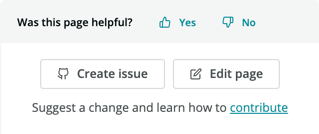

New Relicは、オンラインヘルプやトラブルシューティングツール、詳細な手順とトラブルシューティングのヒントのあるオープンソースドキュメント、サポート支援を含む、さまざまなサポートオプションを提供しています。

* [New Relicの Explorers Hubで質問を行う。](#nr-forum)
* [New Relic Diagnosticsツールを実行する。](#diagnostics)
* [New Relic DocsおよびNew Relic Universityで回答を検索する。](#find-answers)
* [当社の文書作成に協力する。](#docs-contribution)
* [必要なものが見つからない場合は、ドキュメント問題を提出する。](#file-doc-issue)
* [サポートポータルでチケットを提出する。](#file-ticket)
* [システムのステータスをチェックする。](#check-status)
* [ライセンスやデータセキュリティ、コンプライアンス情報について読む。](#licenses-policies)

## 無料のフォーラムであるNew RelicのExplorers Hubで質問を行う [#nr-forum]

[New RelicのExplorer Hub](https://discuss.newrelic.com/)は、すべてのユーザーが無料で利用できるフォーラムです。New Relicのユーザーと社員が毎日会話を行い、問題のトラブルシューティングと解決を行い、解決策を見つけ、新たな機能について議論します。

<figcaption>
  [**discuss.newrelic.com**](https://discuss.newrelic.com/)：Explorer Hubはパブリックフォーラムです。質問を行い回答を探すのに使用します。ユーザーのコミュニティに参加し、New Relicについて知り、着想を得ましょう。
</figcaption>

## New Relic Diagnosticsツールを実行 [#diagnostics]

[New Relic Diagnostics](/docs/using-new-relic/cross-product-functions/troubleshooting/new-relic-diagnostics)は、LinuxおよびWindows、Mac用の自動化された診断ツールです。エージェントで問題が検出されると、ソリューションを提案し、チケットに添付できるトラブルシューティングログを保存します。

## New Relic DocsおよびNew Relic Universityで回答を検索 [#find-answers]

New Relicの[Docsサイト](https://docs.newrelic.com/)には、有用なインストールや設定、トラブルシューティングのヒントが含まれます。[メインページ](http://docs.newrelic.com)で、[リリースノート](/docs/release-notes)のような頻繁に使用するカテゴリやトピックから選択します。または、[任意のページから検索します](http://docs.newrelic.com/search)。

New Relic機能の使用についての追加のビデオやウェビナー、その他の情報のライブラリについては、[New Relic University](https://learn.newrelic.com/)と[newrelic.com/resources](https://newrelic.com/resources/videos)をご覧ください。

## 当社の文書作成に協力する [#docs-contribution]

当社のドキュメントはオープンソースで、[GitHub](https://github.com/newrelic/docs-website)で入手可能です。ぜひご協力ください。当社は、当社の文書が有益で、完全で、正確であるよう徹底するべく細心の注意を払っています。ページを編集するには、任意のドキュメントの**Edit page**ボタンをクリックして、必要と思われる編集を行ってプルリクエストを作成してください。スタイルはお気になさらないでください。ファイルを編集いただければ、当社のチームのテクニカルライターがスタイル、文法、フォーマットについてレビューいたします。

<figcaption>
  [docs.newrelic.com](https://docs.newrelic.com):各ページの右側に、フィードバックウィジェットがあります。これを使用して、ページが有用であるかどうかを当社に伝える、問題を作成する、ページを編集することができます。
</figcaption>

## 必要なものが見つからない場合は、ドキュメント問題を提出する [#file-doc-issue]

ドキュメント内で答えが見つからない場合は、問題を提起して、当社に支援を求めることができます。ドキュメントを改善できる箇所が見つかったら、当社までご連絡ください。これを行うには、任意のドキュメントで**Create issue**ボタンをクリックします。これにより、当社で問題をお調べし、解決策をお探しします。

<figcaption>
  [docs.newrelic.com](https://docs.newrelic.com):各ページの右側に、フィードバックウィジェットがあります。これを使用して、ページが有用であるかどうかを当社に伝える、問題を作成する、ページを編集することができます。
</figcaption>

## サポートポータルでチケットを提出する [#file-ticket]

上記の方法がいずれもうまく行かない場合、[support.newrelic.com](https://support.newrelic.com/home)に移動します。Supportポータルを使用して、New Relicのすべてのヘルプリソースで一元化された検索にアクセスできます。お探しのものが見つからず、サブスクリプションレベルにテクニカルサポートが含まれる場合、[サポートチケットを提出](https://support.newrelic.com/tickets)できます。

<Callout variant="important">
  ベータリリースまたは限定リリースの機能のサポートはご利用いただけない場合があります。
</Callout>

新規チケットを提出するには：

1. **[support.newrelic.com](https://support.newrelic.com) > Login**の順に移動します。
2. Supportポータルで、ヘルプが必要なNew Relicの分野を選択します。
3. アカウントを選択します。
4. できる限り多くの詳細を記入します。該当するURLを含めるか、**ファイルを添付**を選択して、ログファイル、New Relic Diagnosticsファイル、スクリーンショット、またはその他の有用な添付ファイルを含めます。
5. **Submit（送信）**をクリックします。

## システムのステータスをチェックする [#check-status]

必ず[status.newrelic.com](https://status.newrelic.com/)をご覧いただき、システムのスタータスをチェックしてください。未解決のインシデントがある場合、詳細な情報を検索できます。

## ライセンスとセキュリティの情報 [#licenses-policies]

* New Relicの[ライセンス属性とその他の通知](/docs/licenses)を確認します。
* [データセキュリティ、プライバシー、コンプライアンス ポリシー](/docs/security)をお読みください。