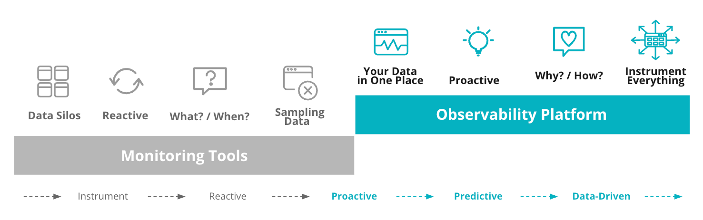

New Relicは、よりよいソフトウェアの構築に役立つオブザーバビリティプラットフォームです。あらゆるデジタルソースからデータを投入できるため、システムやシステムの改善方法を完全に理解できます。

New Relicを使用して、以下を実現できます。

* **[すべてのデータを集約する](#bring-your-data):** エージェントやインテグレーション、APIを使用してすべてをインストゥルメントし、テクノロジースタック全体でデータをインポートし、単一UIからアクセスします。
* [**データを分析する**](#analyze-your-data): 簡単にすべてのデータを入手できるようにして、問題の根本原因を見つけ、システムを最適化します。ダッシュボードとチャートを構築するか、または強力なクエリ言語を使用します。
* **[インシデントに迅速に対応する](#respond-faster)**: 機械学習ソリューションが異常をプロアクティブに検知施設を行い、問題となる前に警告します。
* [**New Relicアプリを開発する**](#develop): チームや会社のニーズに合った独自のNew Relic Oneアプリケーションを作成します。当社の豊富な開発リソースを使用して、開発時間を短縮します。

## すべての回答を1か所に

New Relicは、[Full-Stack Observability](/docs/introduction-full-stack-observability)を実現するよう構築されています。全体像を把握し、それにより、クラウドでマイクロサービスを実行しているコンテナやモバイルウェブサイトのショッピングカートのボタンなど、アプリケーションとデバイスで価値を生むよう、関連するすべてのデータを関連付けます。

<figcaption>
  モニタリングとオブザーバビリティの比較: New Relicは1か所で、重要な質問に対する回答を提供します。
</figcaption>

New Relicで何が可能か、その一例として自身がKubernetes管理者で、ソフトウェアコンテナの多くのクラスターやポッドを管理していると想像してください。どこからトラブルシューティングを開始しますか? この短いビデオには、問題のクラスタをどのように見つけ、トランザクショントレースから関連ログまで掘り下げる方法が示されています。

oEmbedVideo = Wistia.embed("hytv3kad74", &#x7B; videoFoam: "true" });

## すべてのデータを集約する [#bring-your-data]

データがどこから来ているかに関わらず、[テレメトリデータプラットフォーム](/docs/data-ingest-apis/get-data-new-relic/getting-started/get-started-telemetry-data-platform)でデータをキャプチャし、整理し、意味を持たせることができます。[エージェントとインテグレーション](/docs/integrations/intro-integrations/get-started/introduction-new-relic-integrations)を使用して、共通のフレームワークとツールから自動的にデータを収集、または御社のビジネスや技術に特化したデータについては[当社のAPI](/docs/apis/get-started/intro-apis/introduction-new-relic-apis)を使用します。

御社のテクノロジーやタスクがここに掲載されていない場合、[New Relic統合](https://newrelic.com/integrations)にあるより大きなリストをご覧ください。

<table>
  <thead>
    <tr>
      <th style={{ width: "200px" }}>
        以下を行う場合...
      </th>

      <th>
        New Relicを使用して以下を実行できます...
      </th>
    </tr>
  </thead>

  <tbody>
    <tr>
      <td>
        アプリケーションをインストゥルメントする
      </td>

      <td>
        * [コードをインストゥルメントする：](/docs/apm/new-relic-apm/getting-started/introduction-new-relic-apm) APMエージェントを使用して、CやGo、Java、.NET、Node.js、PHP、Python、Rubyでアプリケーションのインストゥルメントを自動的に行います。
        * [トランザクションを追跡する：](/docs/understand-dependencies/distributed-tracing/get-started/introduction-distributed-tracing) アプリとサービス間の境界を越えたトランザクションに応じて、ディストリビューティッド（分散）トレーシングの詳細を収集します。
      </td>
    </tr>

    <tr>
      <td>
        環境をインストゥルメントする
      </td>

      <td>
        * [インフラストラクチャをインストゥルメントする：](/docs/infrastructure/new-relic-infrastructure/get-started/introduction-new-relic-infrastructure) 環境全体を観察します（Linux、Windows、AWS、Azure、Google Cloud Platform、Kubernetes、Dockerなどを含む）。
        * [ログを収集し一元化する:](/docs/logs/new-relic-logs/get-started/introduction-new-relic-logs) その他のアプリケーションやインフラストラクチャデータを使用して、コンテキストでログデータを表示します。ツール間の切り替え時間を短縮し、解決策により迅速に到達します。
      </td>
    </tr>

    <tr>
      <td>
        デジタルエクスペリエンスをインストゥルメント
      </td>

      <td>
        * [ブラウザのパフォーマンスを向上させる:](/docs/browser/new-relic-browser/getting-started/introduction-new-relic-browser) ページロードタイムを減らし、エラーの順序を選別しエラーをなくします。
        * [モバイルアプリをモニターする:](/docs/mobile-monitoring/new-relic-mobile/getting-started/introduction-new-relic-mobile) クラッシュのトラブルシューティングを行い、AndroidおよびiOSアプリの健全性をモバイルエージェントでチェックします。
        * [ユーザーのアクティビティのシミュレーションを行う:](/docs/synthetics/new-relic-synthetics/getting-started/introduction-new-relic-synthetics) 自動化されたチェックを行い、主要なユーザーフローとユーザーエクスペリエンスをモニターして、顧客の期待に応えていることを確認します。
      </td>
    </tr>

    <tr>
      <td>
        APIを介してデータを送信するか、独自のソリューションを構築する
      </td>

      <td>
        * [エージェントなしでデータを収集する:](/docs/apis/get-started/intro-apis/introduction-new-relic-apis) OpenTelemetryまたはその他のエージェントを使用したい場合、直接APIを呼び出します。
        * 独自のインテグレーションを構築する：[Flexツール](/docs/integrations/host-integrations/host-integrations-list/flex-integration-tool-build-your-own-integration)、または言語特定の[SDK](/docs/data-ingest-apis/get-data-new-relic/new-relic-sdks/telemetry-sdks-send-custom-telemetry-data-new-relic)を使用して独自のエクスポーターを作成し、データをNew Relicに送信します。
      </td>
    </tr>
  </tbody>
</table>

[フルユーザー](/docs/users-roles#user-type)として、[New Relic One](/docs/new-relic-one/use-new-relic-one/get-started/introduction-new-relic-one)のオブザーバビリティツール全体にアクセスできます。

* [ブラウザをモニター](/docs/browser)
* [モバイルモニタリング](/docs/mobile-monitoring)
* [合成モニタリング](/docs/synthetics)
* [アプリケーションモニタリング](/docs/apm)
* [サーバーレスモニタリング](/docs/serverless-function-monitoring)
* [インフラストラクチャのモニタリング](/docs/infrastructure)
* [ログモニタリング](/docs/logs)

どこからでも開始できますが、迷うことはありません：full-stack observabilityでは、ユーザーは管理されています。

## データを分析する [#analyze-your-data]

New Relicでデータの[安全](/docs/security/new-relic-security/compliance/data-encryption)を確保することで、当社のプラットフォームは問題のアラートを行えるので、お客様はデータが[メトリックスやイベント、ログ、トレース](https://newrelic.com/platform/telemetry-data-101/ "新しいウィンドウにリンクが開きます。")かによらず、データをまとめ処理し、理解することができます:

* [データを視覚的に詳しく調べる](/docs/query-your-data/explore-query-data/data-explorer/introduction-data-explorer): クエリ言語の知識がなくても、データエクスプローラーに移動し、すべてのデータを扱い、[エンティティ](/docs/new-relic-one/use-new-relic-one/core-concepts/what-entity-new-relic)を関連付けることができます。
* [データのクエリと視覚化を行う：](/docs/chart-builder/use-chart-builder/get-started/introduction-chart-builder) キュレート済みダッシュボード可視化を使用するか、御社独自のものを作成します。[NRQL](/docs/query-data/nrql-new-relic-query-language/getting-started/introduction-nrql)（New Relicクエリ言語）を使用して、データを細分化し質問に掘り下げます。
* [データのクエリをプログラムに基づき行う:](/docs/apis/nerdgraph/get-started/introduction-new-relic-nerdgraph) 当社のNerdGraph GraphQL APIを通じて、データを評価します。GraphiQLエディタで、簡単にクエリのプロトタイプを作成します。

## インシデントに迅速に対応 [#respond-faster]

DevOpsやサイト信頼性、ネットワーク運用を担当するチームは、システムを常に効率的に実行するために、信頼性の高いリアルタイムのアラートと異常検知を必要としています。

* 当社のハイブリッド機械学習エンジンである[インテリジェンスの応用](/docs/new-relic-one/use-new-relic-one/new-relic-ai/introduction-new-relic-ai)を使用して、異常を自動的に検知し、アラートのノイズを減らし、インシデントへの対応を迅速化するようコンテキストによりインシデントの内容を深めることができます。
* [プロアクティブに検知](/docs/new-relic-one/use-new-relic-one/new-relic-ai/proactive-detection-new-relic-ai): アプリの異常な動作について通知を受け、Slackに送信された異常な動作の分析を入手します。Slackを使用していない場合Webhookのセットアップを行い、必要な際にメッセージを配信します。
* [通知を受ける:](/docs/alerts/new-relic-alerts/getting-started/introduction-new-relic-alerts) データソース全体でアラートを設定し、システムで注意が必要な際に通知を受けます。通知を受ける前にいくつの閾値違反があるかに注意し制御します。

## New Relicを使用して開発 [#develop]

New Relicを使用すると、投入したのと同じデータを使用して、独自のオブザーバビリティアプリケーションを構築し、独自のビジネスやIT、業務の質問に答えることができます。

New Relicにより、カスタムアプリケーションの構築が簡単になりました。[開発者ウェブサイト](http://developer.newrelic.com/)に移動し、アプリ作成を開始しましょう。[アプリを全世界と共有](https://developer.newrelic.com/build-apps/publish-deploy)することもできます。

oEmbedVideo = Wistia.embed("lzrwubc09a", &#x7B; videoFoam: "true" });

当社のエージェントとインテグレーションは[オープンソース](https://opensource.newrelic.com/)なので、改善を行ったり、自社のコードに基づき独自のNew Relicツールを作成することもできます。[GitHubにあるコードリポジトリ](https://github.com/newrelic)をご覧ください。

## New Relicを使い始める [#get-started-now]

データの捕捉と分析を迅速に開始する方法は次のとおりです：

* New Relicアカウントがない場合、[newrelic.com/signup](https://newrelic.com/signup)でサインアップしてください。
* どのようなテクノロジーをNew Relicがインストゥルメントできるかについては、[newrelic.com/integrations](http://newrelic.com/integrations)をご覧ください。
* エージェントを今すぐインストールするには、[エージェントをインストールする](/docs/agents/manage-apm-agents/installation/install-agent)をご覧ください。
* 当社のAPIを通じての直接のデータ送信については、[New Relic APIの概要](/docs/apis/get-started/intro-apis/introduction-new-relic-apis)をご覧ください。
* New Relicアプリケーションの開発を開始するには、[開発者ウェブサイト](http://developer.newrelic.com/)に移動します。

データをNew Relicに入力した後に、[New Relicユーザーインタフェース](/docs/new-relic-one/use-new-relic-one/get-started/introduction-new-relic-one)の詳細をご覧ください。

## その他のヘルプ [#more_help]

さらに支援が必要な場合は、これらのサポートと学習リソースを確認してください：

* [Explorers Hub](https://discuss.newrelic.com/)を参照して、コミュニティから支援を受け、ディスカッションに参加してください。
* [当社のサイトで回答を見つけ、サポートポータルの使用方法について学びます](/docs/using-new-relic/welcome-new-relic/get-started/find-help-use-support-portal)。
* Linux、Windows、およびmacOSのトラブルシューティングツールである[New Relic Diagnosticsを実行します](/docs/using-new-relic/cross-product-functions/troubleshooting/new-relic-diagnostics)。
* New Relicの[データセキュリティ](/docs/security)と[ライセンス](/docs/licenses)ドキュメントを見直してください。
